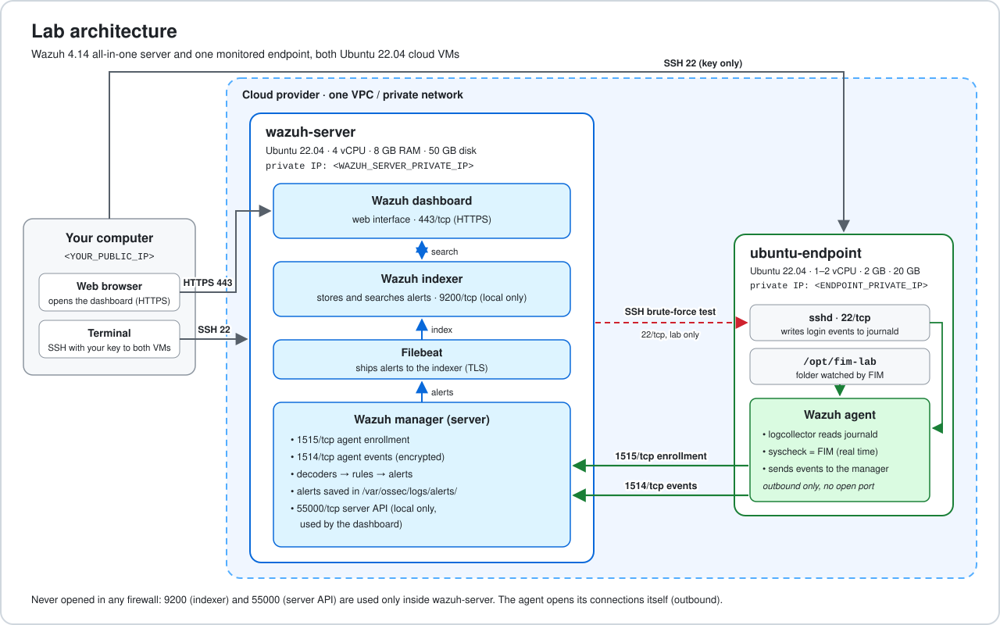
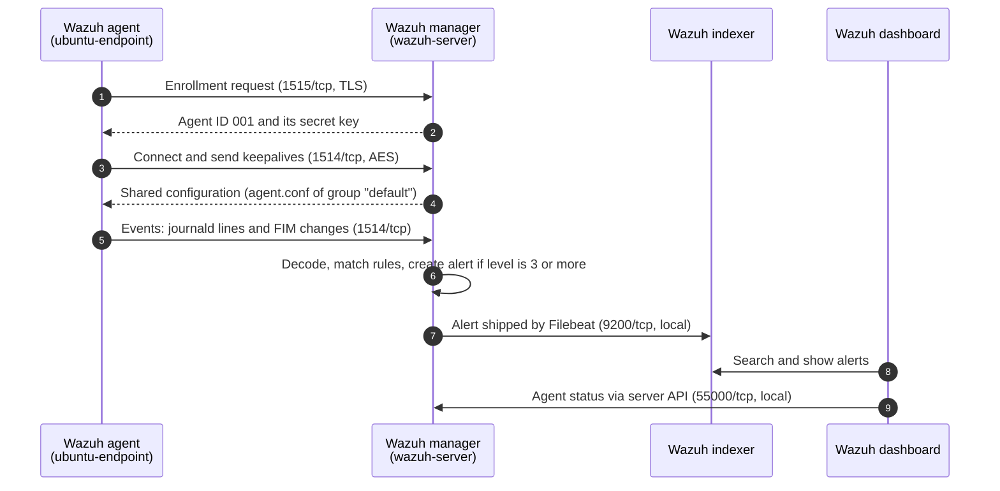
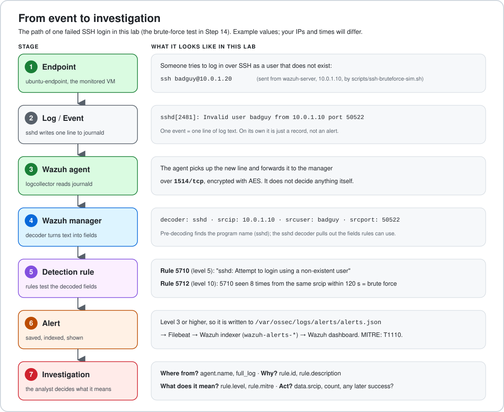
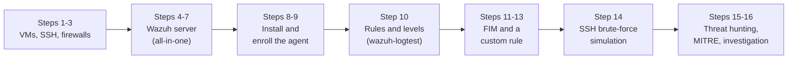
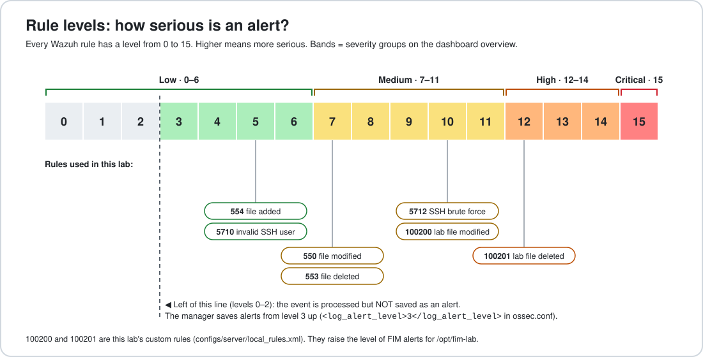
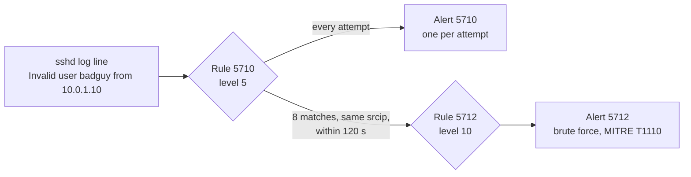
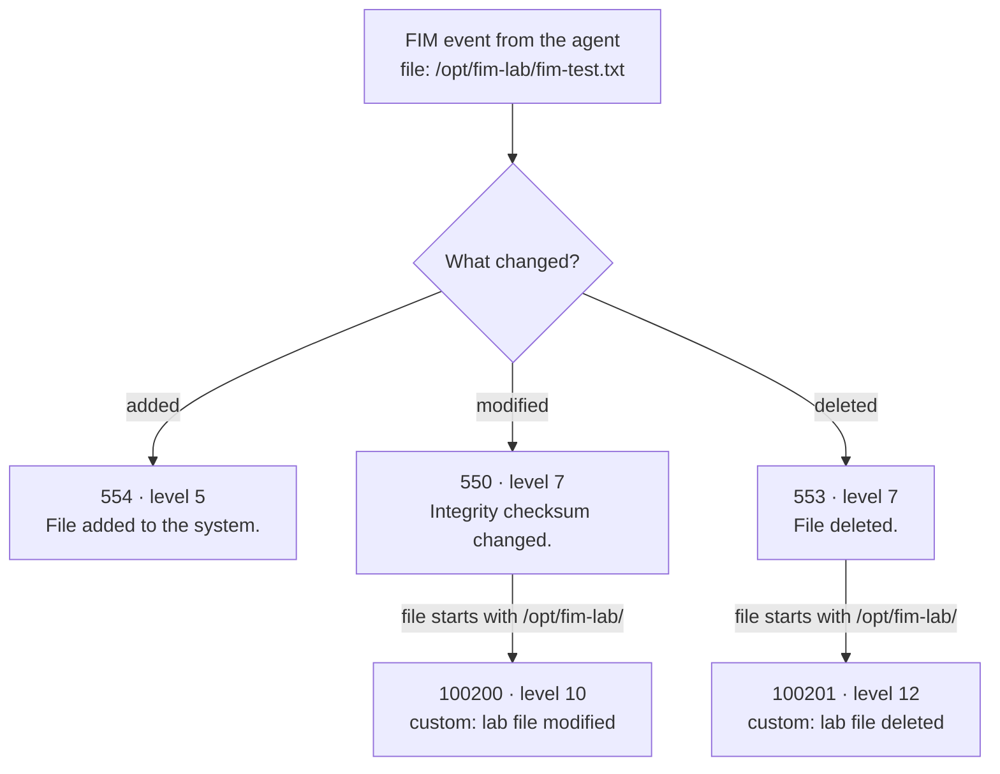
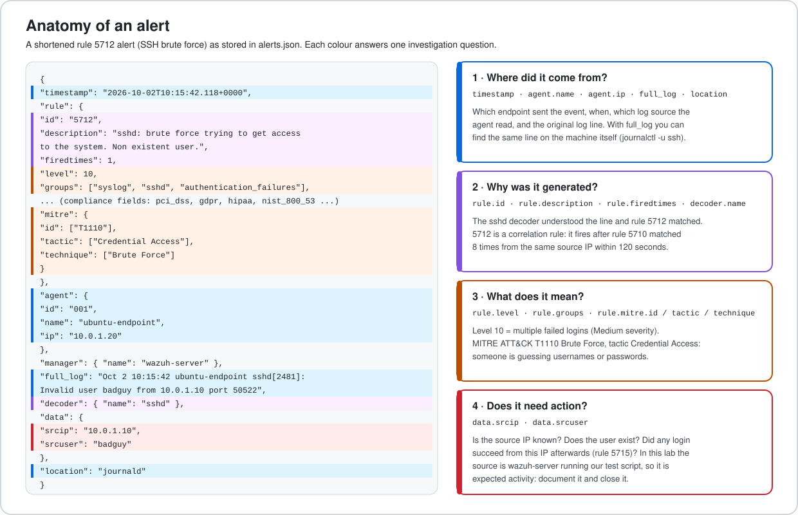

# Wazuh SOC Lab on Ubuntu 22.04 (Cloud): From Endpoint Event to Investigation

A complete, step-by-step guide to build a small Security Operations Center (SOC) lab with **Wazuh 4.14** on two **Ubuntu 22.04** cloud VMs. You install the Wazuh manager, indexer and dashboard, connect a monitored endpoint with the Wazuh agent, and then follow real events all the way to an investigation:

```text
Endpoint → Log/Event → Wazuh Agent → Wazuh Manager → Detection Rule → Alert → Investigation
```

The goal is not only to install Wazuh. The goal is to understand **where an alert came from, why it was generated, what it means, and whether it needs investigation**.

**What you will have at the end**

- A working Wazuh all-in-one server (manager, indexer, dashboard) in the cloud.
- One Ubuntu endpoint sending its logs and file changes to Wazuh.
- File Integrity Monitoring (FIM) alerts that you triggered yourself.
- An SSH brute-force alert that you triggered yourself, mapped to MITRE ATT&CK.
- Two custom rules that show how rule levels work.
- A method to investigate any alert, field by field.

**Time:** about 2 to 3 hours. **Cost:** two cloud VMs while the lab runs (delete them afterwards, see [Cleanup](#10-cleanup)).

## Topics covered

| Topic | Where in this guide |
|---|---|
| Wazuh manager | [Step 4](#step-4-install-the-wazuh-central-components), [Step 9](#step-9-confirm-the-agent-is-connected) |
| Wazuh indexer | [Step 4](#step-4-install-the-wazuh-central-components), [Step 5](#step-5-verify-the-wazuh-server) |
| Wazuh dashboard | [Step 6](#step-6-log-in-to-the-wazuh-dashboard) |
| Security agents | [Step 8](#step-8-install-the-wazuh-agent), [Step 9](#step-9-confirm-the-agent-is-connected) |
| Security alerts | [Step 12](#step-12-test-file-integrity-monitoring), [Step 14](#step-14-simulate-an-ssh-brute-force-attack) |
| Rule levels | [Step 10](#step-10-see-how-a-rule-turns-a-log-into-an-alert), [Step 13](#step-13-add-custom-rules-to-change-alert-levels) |
| Threat hunting | [Step 15](#step-15-threat-hunting-and-mitre-attck-in-the-dashboard) |
| File Integrity Monitoring | [Step 11](#step-11-configure-file-integrity-monitoring), [Step 12](#step-12-test-file-integrity-monitoring) |
| MITRE ATT&CK mapping | [Step 15](#step-15-threat-hunting-and-mitre-attck-in-the-dashboard) |
| Investigation | [Step 16](#step-16-investigate-an-alert) |

## Table of contents

1. [Overview](#wazuh-soc-lab-on-ubuntu-2204-cloud-from-endpoint-event-to-investigation)
2. [Architecture](#2-architecture)
3. [Prerequisites](#3-prerequisites)
4. [Variables and lab plan](#4-variables-and-lab-plan)
5. [Firewall rules](#5-firewall-rules)
6. [Step-by-step setup](#6-step-by-step-setup)
7. [End-to-end test](#7-end-to-end-test)
8. [Troubleshooting](#8-troubleshooting)
9. [Security notes](#9-security-notes)
10. [Cleanup](#10-cleanup)
11. [References](#11-references)

### Folder contents

```text
01-wazuh-soc-lab/
├── README.md                          this guide
├── LICENSE
├── .gitignore                         blocks passwords, keys and installer files from commits
├── configs/
│   ├── server/
│   │   ├── agent.conf                 → /var/ossec/etc/shared/default/agent.conf  (wazuh-server)
│   │   └── local_rules.xml            → /var/ossec/etc/rules/local_rules.xml      (wazuh-server)
│   └── firewall/
│       ├── cloud-firewall-rules.csv   rules to create in your cloud console
│       ├── ufw-wazuh-server.sh        ufw rules for wazuh-server
│       └── ufw-ubuntu-endpoint.sh     ufw rules for ubuntu-endpoint
├── scripts/
│   ├── fim-test.sh                    FIM test            (run on ubuntu-endpoint)
│   ├── ssh-bruteforce-sim.sh          brute-force test    (run on wazuh-server)
│   └── show-alerts.sh                 alerts by rule ID   (run on wazuh-server)
└── docs/images/                       diagrams used in this guide
```

Every command in this guide can be copied directly from the README. The scripts are optional shortcuts that do the same thing. To use them on a VM, clone the repository there (Ubuntu cloud images include `git`; copy the URL from the green **Code** button on GitHub), go into this lab's folder (for example `cd soc-documentation/01-wazuh-soc-lab`) and run them from there, for example `sudo bash scripts/fim-test.sh`.

---

## 2. Architecture



| Component | Runs on | What it does |
|---|---|---|
| **Wazuh agent** | ubuntu-endpoint | Reads logs (journald) and watches files (FIM). Sends events to the manager. Decides nothing itself. |
| **Wazuh manager** | wazuh-server | Receives events, decodes them, matches them against rules, creates alerts. Part of the "Wazuh server". |
| **Filebeat** | wazuh-server | Ships the manager's alerts to the indexer over TLS. |
| **Wazuh indexer** | wazuh-server | Stores and searches alerts (based on OpenSearch). |
| **Wazuh dashboard** | wazuh-server | Web interface to search alerts, hunt threats and manage agents. |

How the agent and the server talk to each other:



The path of a single event, which this lab follows twice (FIM and SSH brute force):



The order of the steps:



---

## 3. Prerequisites

### Hardware (cloud VMs)

| VM | vCPU | RAM | Disk | Source |
|---|---|---|---|---|
| wazuh-server | 4 | 8 GB | 50 GB | Official Wazuh quickstart recommendation for 1 to 25 agents and 90 days of alerts |
| ubuntu-endpoint | 1 | 2 GB | 20 GB | Assumption: the agent is lightweight, so a small VM is enough |

Both VMs: **Ubuntu Server 22.04 LTS, 64-bit** (x86_64/AMD64 or ARM64/AArch64). Ubuntu 22.04 is on Wazuh's list of recommended operating systems for the central components.

### Software (exact versions)

| Software | Version | Installed by |
|---|---|---|
| Ubuntu Server | 22.04 LTS | your cloud provider's image |
| Wazuh manager, indexer, dashboard, Filebeat | 4.14.x (4.14.8 was the latest patch when this was written) | `wazuh-install.sh` from `packages.wazuh.com/4.14/` |
| Wazuh agent | **the same 4.14.x version as the server** | APT repository `packages.wazuh.com/4.x/apt/` |
| jq | Ubuntu 22.04 package | `apt` (only for reading alerts in the terminal) |

> The agent version must be **equal to or lower than** the manager version. This guide pins the agent to the server's exact version so they always match.

### On your own computer

- A terminal with OpenSSH (`ssh`, `ssh-keygen`). Linux and macOS have it. Windows 10/11 has it in PowerShell.
- A modern web browser.

### Assumed knowledge

- Running commands in a Linux terminal, using `sudo`.
- Connecting to a server with SSH.
- Creating a VM and editing firewall rules in your cloud provider's web console.

### Assumptions made in this guide

The original LinkedIn post describes *what* was built but not the exact setup. Where a detail was missing, this guide uses the official recommendation or a simple choice, listed here:

| # | Assumption | Why |
|---|---|---|
| A1 | Two VMs: one Wazuh server, one monitored endpoint | Shows the full Endpoint → Agent → Manager path with a real agent |
| A2 | Server size 4 vCPU / 8 GB / 50 GB | Official quickstart hardware for 1 to 25 agents |
| A3 | Endpoint size 1 vCPU / 2 GB / 20 GB | Not an official number; enough for an agent and sshd |
| A4 | Wazuh 4.14, all-in-one install with the official installation assistant | Current release line; simplest supported method for a lab |
| A5 | Both VMs are in the same VPC / private network and region | The agent talks to the manager over private IPs. If your provider has no private network, use the public IPs in the same places and allow 1514/1515 only from the endpoint's public IP |
| A6 | Monitored folder `/opt/fim-lab`, fake user `badguy`, custom rule IDs `100200` and `100201` | Chosen for this lab so tests never touch real system files or users |
| A7 | The SSH brute-force test runs from wazuh-server against ubuntu-endpoint | Avoids a third VM. It never sends a password, so nothing can log in |
| A8 | Generic cloud provider | Menu names differ: AWS "Security groups", Azure "Network security groups", Google Cloud "VPC firewall rules", Oracle Cloud "Security lists", DigitalOcean "Cloud Firewalls" |

> **Note on older tutorials:** before Wazuh 4.3, Wazuh was installed with Elasticsearch and Kibana (Open Distro). Since 4.3 it uses its own **Wazuh indexer** and **Wazuh dashboard**. If you see Elasticsearch/Kibana steps elsewhere, they are for old versions and do not apply here.

---

## 4. Variables and lab plan

Every value in `<ANGLE_BRACKETS>` is a placeholder. **Replace the whole placeholder, including the `<` and `>`**, with your own value. Fill in this table first and keep it open while you work.

| Variable | What it is | Example | How to find it |
|---|---|---|---|
| `<YOUR_PUBLIC_IP>` | Public IP of your own computer / home network | `203.0.113.25` | On your computer: `curl -4 ifconfig.me`, or search "what is my IP" |
| `<WAZUH_SERVER_PUBLIC_IP>` | Public IP of wazuh-server | `198.51.100.10` | Cloud console, VM details |
| `<WAZUH_SERVER_PRIVATE_IP>` | Private IP of wazuh-server | `10.0.1.10` | Cloud console, or `hostname -I` on the VM (first address) |
| `<ENDPOINT_PUBLIC_IP>` | Public IP of ubuntu-endpoint | `198.51.100.20` | Cloud console, VM details |
| `<ENDPOINT_PRIVATE_IP>` | Private IP of ubuntu-endpoint | `10.0.1.20` | Cloud console, or `hostname -I` on the VM (first address) |
| `<VM_USER>` | Default sudo user of your cloud image | `ubuntu` | Provider docs. AWS, Oracle Cloud: `ubuntu`. Azure, Google Cloud: the name you chose. DigitalOcean: `root` |
| `<ADMIN_PASSWORD>` | Wazuh dashboard password for user `admin` | random, 32 characters | Printed at the end of [Step 4](#step-4-install-the-wazuh-central-components) |
| `<WAZUH_VERSION>` | Exact Wazuh version on the server, without the `v` | `4.14.8` | [Step 5](#step-5-verify-the-wazuh-server) |

The examples above are used in all sample outputs in this guide. Your values will be different.

### Lab plan

| Hostname | Role | OS | Private IP | vCPU | RAM | Disk |
|---|---|---|---|---|---|---|
| `wazuh-server` | Wazuh manager + indexer + dashboard + Filebeat (all-in-one) | Ubuntu 22.04 LTS | `<WAZUH_SERVER_PRIVATE_IP>` | 4 | 8 GB | 50 GB |
| `ubuntu-endpoint` | Monitored endpoint with the Wazuh agent | Ubuntu 22.04 LTS | `<ENDPOINT_PRIVATE_IP>` | 1 | 2 GB | 20 GB |

---

## 5. Firewall rules

There are **two firewall layers**, and both must allow the traffic:

1. **Cloud firewall** (security group / NSG / firewall rules) in your provider's web console. It controls what reaches the VM at all.
2. **ufw** on each Ubuntu VM. A second layer inside the VM.

### 5.1 Cloud firewall rules

Create these inbound rules. Outbound: keep the provider's default "allow all outbound".

| VM | Direction | Protocol | Port | Source | Purpose |
|---|---|---|---|---|---|
| wazuh-server | Inbound | TCP | 22 | `<YOUR_PUBLIC_IP>/32` | SSH from your computer |
| wazuh-server | Inbound | TCP | 443 | `<YOUR_PUBLIC_IP>/32` | Wazuh dashboard |
| wazuh-server | Inbound | TCP | 1514 | `<ENDPOINT_PRIVATE_IP>/32` | Agent events |
| wazuh-server | Inbound | TCP | 1515 | `<ENDPOINT_PRIVATE_IP>/32` | Agent enrollment |
| ubuntu-endpoint | Inbound | TCP | 22 | `<YOUR_PUBLIC_IP>/32` | SSH from your computer |
| ubuntu-endpoint | Inbound | TCP | 22 | `<WAZUH_SERVER_PRIVATE_IP>/32` | SSH brute-force test ([Step 14](#step-14-simulate-an-ssh-brute-force-attack)) |

The same table is in [`configs/firewall/cloud-firewall-rules.csv`](configs/firewall/cloud-firewall-rules.csv).

**Never open these ports in any firewall:** `9200` (Wazuh indexer API) and `55000` (Wazuh server API). In an all-in-one install they are only used inside wazuh-server.

The endpoint needs **no inbound port for Wazuh**. The agent opens the connections to the manager itself (outbound).

### 5.2 ufw rules

| VM | Port | From | Why |
|---|---|---|---|
| wazuh-server | 22/tcp | anywhere | SSH. Kept open in ufw so a change of your home IP never locks you out; the cloud firewall already limits it to your IP |
| wazuh-server | 443/tcp | `<YOUR_PUBLIC_IP>` | Dashboard |
| wazuh-server | 1514/tcp | `<ENDPOINT_PRIVATE_IP>` | Agent events |
| wazuh-server | 1515/tcp | `<ENDPOINT_PRIVATE_IP>` | Agent enrollment |
| ubuntu-endpoint | 22/tcp | anywhere | SSH (limited by the cloud firewall) |

The commands are in [Step 3](#step-3-prepare-both-vms). The same rules as scripts: [`configs/firewall/ufw-wazuh-server.sh`](configs/firewall/ufw-wazuh-server.sh) and [`configs/firewall/ufw-ubuntu-endpoint.sh`](configs/firewall/ufw-ubuntu-endpoint.sh).

---

## 6. Step-by-step setup

Each step says **where** to run it and **as which user**. Do the steps in order. Each step ends with a check; do not continue until the check passes.

### Step 1. Create an SSH key and the two VMs

**Run on:** your computer and the cloud console

**1.1 Create an SSH key pair** (skip if you already use one).

Linux / macOS:

```bash
ssh-keygen -t ed25519 -f ~/.ssh/wazuh-lab -C "wazuh-lab"
```

Windows PowerShell:

```powershell
ssh-keygen -t ed25519 -f $HOME\.ssh\wazuh-lab -C "wazuh-lab"
```

Press Enter to accept, and set a passphrase if you want one. This creates two files: `wazuh-lab` (private key, never share it) and `wazuh-lab.pub` (public key, safe to upload).

**1.2 Create the two VMs** in your cloud console with the values from the [lab plan](#lab-plan):

- Image: **Ubuntu Server 22.04 LTS**
- Names: `wazuh-server` and `ubuntu-endpoint`
- Size: 4 vCPU / 8 GB RAM / 50 GB disk for wazuh-server, 1 vCPU / 2 GB / 20 GB for ubuntu-endpoint
- Network: **the same VPC / virtual network and subnet** for both, with a public IP for each
- SSH key: paste the content of `wazuh-lab.pub`. Show it with `cat ~/.ssh/wazuh-lab.pub` (Windows: `Get-Content $HOME\.ssh\wazuh-lab.pub`)

**1.3 Write down the four IP addresses** (public and private of each VM) in the [variables table](#4-variables-and-lab-plan). Also find `<YOUR_PUBLIC_IP>` now: run `curl -4 ifconfig.me` on your computer.

**Check:** both VMs show as "Running" in the cloud console, and you have all IPs written down.

### Step 2. Apply the cloud firewall rules

**Run on:** the cloud console

Create the inbound rules from [Section 5.1](#51-cloud-firewall-rules). Many providers create a rule "SSH (22) from anywhere (0.0.0.0/0)" by default; change its source to `<YOUR_PUBLIC_IP>/32`.

**Check:** connect to both VMs from your computer. Type `yes` the first time to accept the host key.

```bash
ssh -i ~/.ssh/wazuh-lab <VM_USER>@<WAZUH_SERVER_PUBLIC_IP>
```

```bash
ssh -i ~/.ssh/wazuh-lab <VM_USER>@<ENDPOINT_PUBLIC_IP>
```

(Windows PowerShell: use `-i $HOME\.ssh\wazuh-lab`.) Inside each VM, confirm the version:

```bash
lsb_release -d
```

```text
Description:	Ubuntu 22.04.5 LTS
```

The last number (`.5`) can differ. It must start with `Ubuntu 22.04`.

On wazuh-server, also confirm the size:

```bash
nproc && free -h | grep Mem && df -h /
```

You should see `4`, a `Mem:` total of about `7.7Gi`, and a root disk of about `48G` or more.

### Step 3. Prepare both VMs

**Run on:** both VMs (3.1 to 3.3 on each), as `<VM_USER>`

**3.1 Update the system.**

```bash
sudo apt-get update
sudo apt-get -y upgrade
```

If a purple screen "Daemons using outdated libraries" appears, press **Enter** to accept the default. If the upgrade installed a new kernel, reboot and reconnect:

```bash
[ -f /var/run/reboot-required ] && sudo reboot
```

> If you get `Could not get lock /var/lib/dpkg/lock-frontend`, Ubuntu's automatic updates are still running after the first boot. Wait 2 to 5 minutes and try again.

**3.2 Set the hostname.** On **wazuh-server**:

```bash
sudo hostnamectl set-hostname wazuh-server
```

On **ubuntu-endpoint**:

```bash
sudo hostnamectl set-hostname ubuntu-endpoint
```

Check on each VM:

```bash
hostnamectl --static
```

```text
wazuh-server
```

(or `ubuntu-endpoint` on the endpoint). The prompt changes after you reconnect.

**3.3 Check the clock.** Alerts are sorted by time, so the clock must be synchronized:

```bash
timedatectl | grep "synchronized"
```

```text
System clock synchronized: yes
```

If it says `no`, run `sudo timedatectl set-ntp true` and check again after a minute.

**3.4 Enable ufw on wazuh-server.** Replace `<YOUR_PUBLIC_IP>` and `<ENDPOINT_PRIVATE_IP>` first.

```bash
sudo ufw default deny incoming
sudo ufw default allow outgoing
sudo ufw allow 22/tcp comment 'SSH'
sudo ufw allow from <YOUR_PUBLIC_IP> to any port 443 proto tcp comment 'Wazuh dashboard'
sudo ufw allow from <ENDPOINT_PRIVATE_IP> to any port 1514 proto tcp comment 'Wazuh agent events'
sudo ufw allow from <ENDPOINT_PRIVATE_IP> to any port 1515 proto tcp comment 'Wazuh agent enrollment'
sudo ufw --force enable
sudo ufw status numbered
```

Expected output (with the example IPs):

```text
Status: active

     To                         Action      From
     --                         ------      ----
[ 1] 22/tcp                     ALLOW IN    Anywhere                   # SSH
[ 2] 443/tcp                    ALLOW IN    203.0.113.25               # Wazuh dashboard
[ 3] 1514/tcp                   ALLOW IN    10.0.1.20                  # Wazuh agent events
[ 4] 1515/tcp                   ALLOW IN    10.0.1.20                  # Wazuh agent enrollment
[ 5] 22/tcp (v6)                ALLOW IN    Anywhere (v6)              # SSH
```

**3.5 Enable ufw on ubuntu-endpoint.**

```bash
sudo ufw default deny incoming
sudo ufw default allow outgoing
sudo ufw allow 22/tcp comment 'SSH'
sudo ufw --force enable
sudo ufw status numbered
```

```text
Status: active

     To                         Action      From
     --                         ------      ----
[ 1] 22/tcp                     ALLOW IN    Anywhere                   # SSH
[ 2] 22/tcp (v6)                ALLOW IN    Anywhere (v6)              # SSH
```

**Check:** open a **new** SSH session to each VM (keep the old one open). If the new session works, the firewall is correct.

### Step 4. Install the Wazuh central components

**Run on:** wazuh-server, as `<VM_USER>`

The official installation assistant installs and configures the Wazuh indexer, the Wazuh server (manager + Filebeat) and the Wazuh dashboard on this one VM, including TLS certificates and random passwords.

```bash
cd ~
curl -sO https://packages.wazuh.com/4.14/wazuh-install.sh
sudo bash ./wazuh-install.sh -a
```

`-a` means "all-in-one". The URL with `4.14` installs the latest 4.14.x patch. This takes about 10 to 20 minutes. At the end you see:

```text
INFO: --- Summary ---
INFO: You can access the web interface https://<WAZUH_DASHBOARD_IP_ADDRESS>
    User: admin
    Password: <ADMIN_PASSWORD>
INFO: Installation finished.
```

**Copy the password into a password manager now.** This is `<ADMIN_PASSWORD>`. The IP printed may be the private IP; from your computer you will use `<WAZUH_SERVER_PUBLIC_IP>`.

If you lose the password, print all generated passwords again (run in the same folder, `~`):

```bash
sudo tar -O -xvf wazuh-install-files.tar wazuh-install-files/wazuh-passwords.txt
```

> `wazuh-install-files.tar` contains every password and certificate of this installation. Keep it private and never upload it (the repository's `.gitignore` already blocks it).

**Check:** the last line is `INFO: Installation finished.` If the installer stops with an error, see [Troubleshooting](#8-troubleshooting).

### Step 5. Verify the Wazuh server

**Run on:** wazuh-server, as `<VM_USER>`

**5.1 All four services are running:**

```bash
sudo systemctl is-active wazuh-manager wazuh-indexer wazuh-dashboard filebeat
```

```text
active
active
active
active
```

**5.2 The ports are listening:**

```bash
sudo ss -tlnp | grep -E ':(443|1514|1515|9200|55000) '
```

You should see one `LISTEN` line for each of the ports 443, 1514, 1515, 9200 and 55000. They are blocked from outside by the firewalls from Step 2 and Step 3, except the ones you allowed.

**5.3 Filebeat can reach the indexer:**

```bash
sudo filebeat test output
```

The output ends with lines similar to:

```text
    TLS version: TLSv1.3
    dial up... OK
  talk to server... OK
  version: 7.10.2
```

`talk to server... OK` is the important line.

**5.4 The indexer is healthy.** Keep the single quotes; the password can contain characters like `*` or `?`.

```bash
curl -k -u 'admin:<ADMIN_PASSWORD>' 'https://localhost:9200/_cluster/health?pretty'
```

Look for this line:

```text
  "status" : "green",
```

`yellow` also works for a single-node lab. `red` means a problem (see [Troubleshooting](#8-troubleshooting)).

**5.5 Write down the exact version.**

```bash
sudo /var/ossec/bin/wazuh-control info -v
```

```text
v4.14.8
```

Write it **without** the `v` as `<WAZUH_VERSION>` (example: `4.14.8`). You need it in Step 8.

### Step 6. Log in to the Wazuh dashboard

**Run on:** your computer (web browser)

1. Open `https://<WAZUH_SERVER_PUBLIC_IP>`.
2. The browser warns that the certificate is not trusted. This is expected: the installer created a self-signed certificate. Chrome / Edge: **Advanced → Proceed to ... (unsafe)**. Firefox: **Advanced → Accept the Risk and Continue**.
3. Log in with user `admin` and `<ADMIN_PASSWORD>`.

**Check:** the Wazuh dashboard home page opens. Open the main menu (☰, top left); among others you see the sections **Endpoint security**, **Threat intelligence**, **Security operations**, **Cloud security**, **Agents management** and **Server management**. There are no agents yet.

### Step 7. Stop automatic Wazuh upgrades on the server

**Run on:** wazuh-server, as `<VM_USER>`

Wazuh recommends disabling its package repository after installation so that a normal `apt upgrade` never upgrades Wazuh by accident and breaks the setup. This guide also "holds" the packages as a second safety net.

```bash
if [ -f /etc/apt/sources.list.d/wazuh.list ]; then
  sudo sed -i "s/^deb /#deb /" /etc/apt/sources.list.d/wazuh.list
fi
sudo apt-mark hold wazuh-manager wazuh-indexer wazuh-dashboard filebeat
sudo apt-get update
```

**Check:**

```bash
apt-mark showhold
```

```text
filebeat
wazuh-dashboard
wazuh-indexer
wazuh-manager
```

Ubuntu security updates for the rest of the system keep working normally.

### Step 8. Install the Wazuh agent

**Run on:** ubuntu-endpoint, as `<VM_USER>`

**8.1 Add the Wazuh repository.**

```bash
sudo apt-get install -y gnupg apt-transport-https curl
curl -s https://packages.wazuh.com/key/GPG-KEY-WAZUH | sudo gpg --no-default-keyring --keyring gnupg-ring:/usr/share/keyrings/wazuh.gpg --import
sudo chmod 644 /usr/share/keyrings/wazuh.gpg
echo "deb [signed-by=/usr/share/keyrings/wazuh.gpg] https://packages.wazuh.com/4.x/apt/ stable main" | sudo tee /etc/apt/sources.list.d/wazuh.list
sudo apt-get update
```

The `gpg` command prints a line ending in `imported`. `apt-get update` must show a line with `packages.wazuh.com` and no errors.

**8.2 Check that your server's version is available:**

```bash
apt-cache madison wazuh-agent | grep "<WAZUH_VERSION>"
```

```text
wazuh-agent |   4.14.8-1 | https://packages.wazuh.com/4.x/apt stable/main amd64 Packages
```

(`arm64` instead of `amd64` on ARM VMs.)

**8.3 Install, enroll and start the agent.** Replace `<WAZUH_SERVER_PRIVATE_IP>` and `<WAZUH_VERSION>`:

```bash
sudo WAZUH_MANAGER="<WAZUH_SERVER_PRIVATE_IP>" WAZUH_AGENT_NAME="ubuntu-endpoint" apt-get install -y wazuh-agent=<WAZUH_VERSION>-1
sudo systemctl daemon-reload
sudo systemctl enable wazuh-agent
sudo systemctl start wazuh-agent
```

- `WAZUH_MANAGER` writes the manager's address into the agent's configuration.
- `WAZUH_AGENT_NAME` sets the name you will see in the dashboard.
- `=<WAZUH_VERSION>-1` installs exactly the server's version (example: `wazuh-agent=4.14.8-1`).

**8.4 Stop automatic agent upgrades** (an agent newer than the manager stops working):

```bash
sudo sed -i "s/^deb /#deb /" /etc/apt/sources.list.d/wazuh.list
sudo apt-mark hold wazuh-agent
sudo apt-get update
```

**Check:**

```bash
sudo systemctl is-active wazuh-agent
sudo grep -A1 "<server>" /var/ossec/etc/ossec.conf
sudo grep -E "Valid key received|Connected to the server" /var/ossec/logs/ossec.log
```

```text
active
    <server>
      <address>10.0.1.10</address>
2026/10/02 10:02:11 wazuh-agentd: INFO: Valid key received
2026/10/02 10:02:21 wazuh-agentd: INFO: (4102): Connected to the server ([10.0.1.10]:1514/tcp).
```

- `Valid key received` = enrollment on port 1515 worked.
- `Connected to the server` = the event channel on port 1514 works.

Also see which logs the agent collects:

```bash
sudo grep "<location>" /var/ossec/etc/ossec.conf
```

The list must include `<location>journald</location>`. On Ubuntu 22.04 the agent reads system and SSH logs from journald.

### Step 9. Confirm the agent is connected

**Run on:** wazuh-server, as `<VM_USER>`

```bash
sudo /var/ossec/bin/agent_control -l
```

```text
Wazuh agent_control. List of available agents:
   ID: 000, Name: wazuh-server (server), IP: 127.0.0.1, Active/Local
   ID: 001, Name: ubuntu-endpoint, IP: any, Active
```

`IP: any` is normal: by default the agent is registered without a fixed IP.

**In the dashboard:** ☰ → **Agents management** → **Summary**. `ubuntu-endpoint` is listed with status **active**.

**Your first alerts:** ☰ → **Threat intelligence** → **Threat Hunting** → **Events** tab. Set the time range (top right) to **Last 1 hour** and search:

```text
agent.name:ubuntu-endpoint
```

You see the first alerts from the endpoint, for example rule `503` "Wazuh agent started." The full path already works: agent → manager → indexer → dashboard.

### Step 10. See how a rule turns a log into an alert

**Run on:** wazuh-server, as `<VM_USER>`

The manager handles every event in three phases: **pre-decoding** (basic parts of the line), **decoding** (extract fields like `srcip`) and **rule matching** (decide if it is an alert and how serious). The tool `wazuh-logtest` shows these phases for any log line, without needing a real attack.

```bash
sudo /var/ossec/bin/wazuh-logtest
```

When it says `Type one log per line`, paste this line and press Enter:

```text
Oct  2 10:15:42 ubuntu-endpoint sshd[2481]: Invalid user badguy from 10.0.1.10 port 50522
```

Output (shortened; the formatting of some lines can differ slightly):

```text
**Phase 1: Completed pre-decoding.
	full event: 'Oct  2 10:15:42 ubuntu-endpoint sshd[2481]: Invalid user badguy from 10.0.1.10 port 50522'
	timestamp: 'Oct  2 10:15:42'
	hostname: 'ubuntu-endpoint'
	program_name: 'sshd'

**Phase 2: Completed decoding.
	name: 'sshd'
	parent: 'sshd'
	srcip: '10.0.1.10'
	srcport: '50522'
	srcuser: 'badguy'

**Phase 3: Completed filtering (rules).
	id: '5710'
	level: '5'
	description: 'sshd: Attempt to login using a non-existent user'
	...
**Alert to be generated.
```

Press **Ctrl+C** to exit. The same tool is in the dashboard: ☰ → **Server management** → **Ruleset Test**.

What each phase means:

| Phase | What happened |
|---|---|
| 1. Pre-decoding | Wazuh split the syslog line into time, host and program (`sshd`) |
| 2. Decoding | The `sshd` decoder extracted the fields `srcuser`, `srcip`, `srcport` |
| 3. Rules | Rule `5710` matched (level 5). Because the level is 3 or more, an alert is created |

**Rule levels.** Every rule has a level from 0 to 15. The manager saves an alert only when the level is 3 or higher (`<log_alert_level>3</log_alert_level>` in `/var/ossec/etc/ossec.conf`).



| Level | Official title | Example |
|---|---|---|
| 0 | Ignored | No action, used to avoid false positives |
| 2 | System low priority notification | Status messages, no security relevance |
| 3 | Successful/Authorized events | Successful login (rule 5715), firewall allow |
| 4 | System low priority error | Bad configuration, unused devices |
| 5 | User generated error | Wrong password, denied action (rule 5710) |
| 6 | Low relevance attack | Worm or virus with no effect on the system |
| 7 | "Bad word" matching | Words like "bad" or "error" (FIM rules 550 and 553 also use level 7) |
| 8 | First time seen | First login of a user, first IDS event |
| 9 | Error from invalid source | Login as unknown user from an invalid source |
| 10 | Multiple user generated errors | Many failed logins (rule 5712) |
| 11 | Integrity checking warning | Modified binaries, rootkits |
| 12 | High importance event | Error or warning messages from system or kernel |
| 13 | Unusual error (high importance) | Common attack pattern |
| 14 | High importance security event | Correlated attack |
| 15 | Severe attack | Immediate attention needed |

**Correlation rules.** One failed login is level 5. Many failed logins in a short time are more serious. Rule `5712` counts rule `5710`. See it yourself:

```bash
sudo grep -A9 'rule id="5712"' /var/ossec/ruleset/rules/0095-sshd_rules.xml
```

```xml
  <rule id="5712" level="10" frequency="8" timeframe="120" ignore="60">
    <if_matched_sid>5710</if_matched_sid>
    <same_source_ip />
    <description>sshd: brute force trying to get access to the system. Non existent user.</description>
    <mitre>
      <id>T1110</id>
    </mitre>
    <group>authentication_failures,gdpr_IV_35.7.d,...
  </rule>
```

Read it as: "if rule 5710 matched **8 times** within **120 seconds** from the **same source IP**, create a level 10 alert; then stay quiet for 60 seconds (`ignore`)". It also maps the alert to MITRE ATT&CK technique **T1110** (Brute Force). You will trigger exactly this in Step 14.

(The `<group>` line is shortened above. In practice Wazuh fires a `frequency="8"` rule at about the 10th matching event, which is why the test in Step 14 sends 15 attempts.)



**Check:** wazuh-logtest showed rule `5710`, level `5`, and `Alert to be generated`.

### Step 11. Configure File Integrity Monitoring

FIM (the `syscheck` module) records the state of files (size, owner, permissions, hashes) and alerts when a file is added, changed or deleted. By default it scans system folders like `/etc`, `/usr/bin` and `/usr/sbin` every 12 hours. In this step you add a lab folder that is watched in **real time**.

You will not edit the agent's own configuration file. Instead you use **centralized configuration**: the manager pushes `agent.conf` to every agent of the group `default`. This is how a SOC manages many agents at once.

**11.1 Create the folder to monitor.**
**Run on:** ubuntu-endpoint

```bash
sudo mkdir -p /opt/fim-lab
ls -ld /opt/fim-lab
```

```text
drwxr-xr-x 2 root root 4096 Oct  2 10:20 /opt/fim-lab
```

**11.2 Write the centralized configuration.**
**Run on:** wazuh-server

Write it to a temporary file first, so the manager never sends a half-written file to the agent. This is the full file (also in [`configs/server/agent.conf`](configs/server/agent.conf)):

```bash
sudo tee /var/ossec/etc/shared/default/agent.conf.tmp > /dev/null <<'EOF'
<agent_config>

  <!--
    File:     /var/ossec/etc/shared/default/agent.conf
    Machine:  wazuh-server (the Wazuh manager)
    Purpose:  Centralized configuration that the manager pushes to every agent
              in the "default" group (ubuntu-endpoint is in this group).

    Adds the folder /opt/fim-lab to File Integrity Monitoring (FIM):
      check_all="yes"       check size, permissions, owner, group, dates, inode and hashes
      report_changes="yes"  include the text difference (diff) in the alert
      realtime="yes"        alert within seconds instead of waiting for the 12-hour scan

    CHANGE THIS: nothing, unless you want to monitor a different folder.
    If you change the folder, also change it in local_rules.xml and create
    the folder on the endpoint.
  -->
  <syscheck>
    <directories check_all="yes" report_changes="yes" realtime="yes">/opt/fim-lab</directories>
  </syscheck>

</agent_config>
EOF
sudo chown wazuh:wazuh /var/ossec/etc/shared/default/agent.conf.tmp
sudo chmod 660 /var/ossec/etc/shared/default/agent.conf.tmp
```

The line to change if you want another folder is the `<directories ...>` line.

**11.3 Validate it, activate it, restart the manager.**
**Run on:** wazuh-server

```bash
sudo /var/ossec/bin/verify-agent-conf -f /var/ossec/etc/shared/default/agent.conf.tmp
```

```text
verify-agent-conf: OK
```

Only if you see `OK`:

```bash
sudo mv /var/ossec/etc/shared/default/agent.conf.tmp /var/ossec/etc/shared/default/agent.conf
sudo systemctl restart wazuh-manager
```

Wait about one minute, then check that the agent has the new configuration:

```bash
sudo /var/ossec/bin/agent_groups -S -i 001
```

```text
Agent '001' is synchronized.
```

If it says `is not synchronized`, wait another minute and run it again.

**11.4 Confirm on the agent.**
**Run on:** ubuntu-endpoint

```bash
sudo grep "fim-lab" /var/ossec/etc/shared/agent.conf
```

```text
    <directories check_all="yes" report_changes="yes" realtime="yes">/opt/fim-lab</directories>
```

The agent reloads shared configuration by itself. Restart it once anyway, so real-time monitoring of the new folder surely starts:

```bash
sudo systemctl restart wazuh-agent
sleep 20
sudo grep -E "Monitoring path: '/opt/fim-lab'|6012" /var/ossec/logs/ossec.log | tail -n 2
```

Similar to:

```text
2026/10/02 10:24:05 wazuh-syscheckd: INFO: (6003): Monitoring path: '/opt/fim-lab', with options 'size | permissions | owner | group | mtime | inode | hash_md5 | hash_sha1 | hash_sha256 | report_changes | realtime'.
2026/10/02 10:24:06 wazuh-syscheckd: INFO: (6012): Real-time file integrity monitoring started.
```

**Check:** the `Monitoring path` line lists `/opt/fim-lab` and contains `realtime`.

### Step 12. Test File Integrity Monitoring

**12.1 Create, change and delete a file.**
**Run on:** ubuntu-endpoint

```bash
echo "first line" | sudo tee /opt/fim-lab/fim-test.txt
sleep 10
echo "second line" | sudo tee -a /opt/fim-lab/fim-test.txt
sleep 10
sudo rm /opt/fim-lab/fim-test.txt
```

(Same as `sudo bash scripts/fim-test.sh` from this repository.)

**12.2 See the alerts in the dashboard.**
☰ → **Endpoint security** → **File Integrity Monitoring** → **Events** tab. Time range: **Last 15 minutes**. Search:

```text
agent.name:ubuntu-endpoint and rule.id:(550 or 553 or 554)
```

You see three alerts:

| Rule | Level | Description | Caused by |
|---|---|---|---|
| 554 | 5 | File added to the system. | `tee` created the file |
| 550 | 7 | Integrity checksum changed. | `tee -a` changed the file |
| 553 | 7 | File deleted. | `rm` deleted the file |

Open the **550** alert (click the icon at the left of the row to see all its fields). Because of `report_changes="yes"`, the field `syscheck.diff` shows what changed (the added `second line`). The fields `syscheck.md5_before` / `syscheck.md5_after` show that the file's fingerprint changed.

**12.3 The same check in the terminal.**
**Run on:** wazuh-server

```bash
sudo apt-get install -y jq
sudo tail -n 5000 /var/ossec/logs/alerts/alerts.json | jq -R -c 'fromjson? | select(.syscheck.path == "/opt/fim-lab/fim-test.txt") | {time: .timestamp, rule: .rule.id, level: .rule.level, desc: .rule.description}'
```

```text
{"time":"2026-10-02T10:30:01.512+0000","rule":"554","level":5,"desc":"File added to the system."}
{"time":"2026-10-02T10:30:11.620+0000","rule":"550","level":7,"desc":"Integrity checksum changed."}
{"time":"2026-10-02T10:30:21.733+0000","rule":"553","level":7,"desc":"File deleted."}
```

(Same as `sudo bash scripts/show-alerts.sh 550 553 554`.)

**Check:** you have one alert each for 554, 550 and 553 from `ubuntu-endpoint`.

### Step 13. Add custom rules to change alert levels

Built-in rule 550 gives every file change level 7. In a real SOC, a change to a sensitive folder is more serious than a change to a random file. A **child rule** can raise the level for specific files: when a child rule matches, it replaces its parent.



**Run on:** wazuh-server

**13.1 Back up the default file** (it only contains an example rule):

```bash
sudo cp /var/ossec/etc/rules/local_rules.xml ~/local_rules.xml.default
```

**13.2 Write the custom rules.** This is the full file (also in [`configs/server/local_rules.xml`](configs/server/local_rules.xml)). Custom rule IDs must be between 100000 and 120000.

```bash
sudo tee /var/ossec/etc/rules/local_rules.xml > /dev/null <<'EOF'
<!--
  File:     /var/ossec/etc/rules/local_rules.xml
  Machine:  wazuh-server (the Wazuh manager)
  Purpose:  Custom rules for this lab. Custom rule IDs must be between 100000 and 120000.

  How these rules work:
    Built-in rule 550 = "Integrity checksum changed." (level 7)
    Built-in rule 553 = "File deleted."               (level 7)
    The rules below are "children" of 550 and 553. When the changed or deleted
    file is inside /opt/fim-lab/, the child rule fires INSTEAD of the parent,
    with a higher level. This shows how rule levels decide how serious an alert is.

  CHANGE THIS: nothing, unless you monitor a different folder in agent.conf.

  Note: this file replaces the default local_rules.xml, which only contains an
  example rule (100001) for a fake IP address 1.1.1.1.
-->
<group name="local,syscheck,fim_lab,">

  <!-- A file inside /opt/fim-lab was modified: raise level 7 -> 10 -->
  <rule id="100200" level="10">
    <if_sid>550</if_sid>
    <field name="file">^/opt/fim-lab/</field>
    <description>FIM lab: monitored file modified: $(file)</description>
    <mitre>
      <id>T1565.001</id>
    </mitre>
  </rule>

  <!-- A file inside /opt/fim-lab was deleted: raise level 7 -> 12 -->
  <rule id="100201" level="12">
    <if_sid>553</if_sid>
    <field name="file">^/opt/fim-lab/</field>
    <description>FIM lab: monitored file deleted: $(file)</description>
    <mitre>
      <id>T1070.004</id>
    </mitre>
  </rule>

</group>
EOF
```

Lines to change only if you monitor another folder: the two `<field name="file">` lines.

**13.3 Test the configuration, then restart the manager:**

```bash
sudo /var/ossec/bin/wazuh-analysisd -t; echo "exit code: $?"
```

Any problem is printed as `ERROR` or `CRITICAL` with the file and line. The last line must be:

```text
exit code: 0
```

```bash
sudo systemctl restart wazuh-manager
sudo systemctl is-active wazuh-manager
```

```text
active
```

**13.4 Run the FIM test again** on ubuntu-endpoint (the same commands as [12.1](#step-12-test-file-integrity-monitoring)):

```bash
echo "first line" | sudo tee /opt/fim-lab/fim-test.txt
sleep 10
echo "second line" | sudo tee -a /opt/fim-lab/fim-test.txt
sleep 10
sudo rm /opt/fim-lab/fim-test.txt
```

**13.5 See the result.** Dashboard, File Integrity Monitoring → Events, search:

```text
agent.name:ubuntu-endpoint and rule.id:(554 or 100200 or 100201)
```

| Rule | Level | Description |
|---|---|---|
| 554 | 5 | File added to the system. (no custom rule for "added") |
| 100200 | 10 | FIM lab: monitored file modified: /opt/fim-lab/fim-test.txt |
| 100201 | 12 | FIM lab: monitored file deleted: /opt/fim-lab/fim-test.txt |

You can also find the rules under ☰ → **Server management** → **Rules** (search `100200`).

**Check:** the modify and delete alerts now show rules 100200 (level 10) and 100201 (level 12) instead of 550 and 553.

### Step 14. Simulate an SSH brute-force attack

This test sends 15 SSH login attempts with a user that does not exist (`badguy`). It never sends a password, so nothing can actually log in. **Only run it against your own lab VM.**

**14.1 Run the attempts.**
**Run on:** wazuh-server, as `<VM_USER>`. Replace `<ENDPOINT_PRIVATE_IP>`.

```bash
for i in $(seq 1 15); do
  ssh -o BatchMode=yes -o StrictHostKeyChecking=no -o UserKnownHostsFile=/dev/null \
      -o ConnectTimeout=5 -o LogLevel=ERROR badguy@<ENDPOINT_PRIVATE_IP> true
  sleep 1
done
```

(Same as `bash scripts/ssh-bruteforce-sim.sh <ENDPOINT_PRIVATE_IP>`.) Expected, 15 times:

```text
badguy@10.0.1.20: Permission denied (publickey).
```

If the endpoint also allows passwords, it says `(publickey,password)`; that is fine. If you see `Connection timed out`, the cloud firewall rule "22 from `<WAZUH_SERVER_PRIVATE_IP>`" on ubuntu-endpoint is missing ([Section 5.1](#51-cloud-firewall-rules)).

**14.2 Confirm the endpoint logged them.**
**Run on:** ubuntu-endpoint

```bash
sudo journalctl -u ssh --since "10 minutes ago" | grep "Invalid user badguy"
```

```text
Oct 02 10:40:01 ubuntu-endpoint sshd[2481]: Invalid user badguy from 10.0.1.10 port 50522
Oct 02 10:40:02 ubuntu-endpoint sshd[2485]: Invalid user badguy from 10.0.1.10 port 50530
...
```

These are the raw **events**. The agent forwards each one.

**14.3 See the alerts.** Dashboard: ☰ → **Threat intelligence** → **Threat Hunting** → **Events**. Time range: **Last 15 minutes**. Search:

```text
agent.name:ubuntu-endpoint and rule.id:(5710 or 5712)
```

| Rule | Level | Description | How many |
|---|---|---|---|
| 5710 | 5 | sshd: Attempt to login using a non-existent user | one or more per attempt |
| 5712 | 10 | sshd: brute force trying to get access to the system. Non existent user. | 1 |

You may see more than 15 alerts for rule 5710: sshd also writes a `Connection closed by invalid user badguy ...` line for each attempt, and it matches the same rule. That is normal.

In the terminal on wazuh-server:

```bash
sudo tail -n 5000 /var/ossec/logs/alerts/alerts.json | jq -R -c 'fromjson? | select(.rule.id == "5712") | {time: .timestamp, agent: .agent.name, rule: .rule.id, level: .rule.level, srcip: .data.srcip, mitre: .rule.mitre.id}'
```

```text
{"time":"2026-10-02T10:40:09.118+0000","agent":"ubuntu-endpoint","rule":"5712","level":10,"srcip":"10.0.1.10","mitre":["T1110"]}
```

**Check:** one rule 5712 alert, level 10, `srcip` = `<WAZUH_SERVER_PRIVATE_IP>`, MITRE `T1110`.

### Step 15. Threat hunting and MITRE ATT&CK in the dashboard

**Threat hunting** means searching your alerts with a question in mind, instead of waiting for one alert to look at. Use ☰ → **Threat intelligence** → **Threat Hunting**:

- The **Dashboard** tab shows charts: alerts over time, top rules, alert levels, top agents.
- The **Events** tab is the alert list with a search bar.

Useful searches (Events tab, time range **Last 24 hours**). Replace `10.0.1.10` with your `<WAZUH_SERVER_PRIVATE_IP>`:

| Question | Search |
|---|---|
| Everything from the endpoint | `agent.name:ubuntu-endpoint` |
| Only serious alerts | `rule.level >= 10` |
| Everything this IP did | `data.srcip:10.0.1.10` |
| All brute-force alerts | `rule.mitre.id:T1110` |
| All failed logins | `rule.groups:authentication_failed` |
| All FIM alerts from the endpoint | `agent.name:ubuntu-endpoint and rule.groups:syscheck` |
| Did anyone log in successfully? | `agent.name:ubuntu-endpoint and rule.id:5715` |

Tip: in an opened alert, use **Filter for value** next to a field (for example `data.srcip`) to jump to all alerts with that value. This is called pivoting.

**MITRE ATT&CK** is a public catalogue of attacker behaviour. Wazuh rules carry MITRE IDs, so every alert says *which attacker technique it may indicate*. Open ☰ → **Threat intelligence** → **MITRE ATT&CK**. The dashboard view shows top tactics and techniques; the framework (matrix) view shows which techniques have alerts.

The rules from this lab and their MITRE mapping:

| Rule | MITRE ID | Technique | Tactic |
|---|---|---|---|
| 5710 | T1110.001, T1021.004 | Password Guessing; Remote Services: SSH | Credential Access; Lateral Movement |
| 5712 | T1110 | Brute Force | Credential Access |
| 550, 100200 | T1565.001 | Stored Data Manipulation | Impact |
| 553 | T1070.004, T1485 | File Deletion; Data Destruction | Defense Evasion; Impact |
| 100201 | T1070.004 | File Deletion | Defense Evasion |

A MITRE tag is a hint, not proof. Rule 553 says "Data Destruction" for every deleted monitored file, including your own test file. The investigation decides.

**Check:** in the MITRE ATT&CK module you find technique **T1110** with alerts from `ubuntu-endpoint`.

### Step 16. Investigate an alert

A SIEM/XDR is more than a dashboard full of alerts. For each alert, answer four questions. Open the **5712** alert from Step 14 (Threat Hunting → Events → click the icon at the left of the row) and read its fields:



| Question | Fields | In this lab |
|---|---|---|
| 1. Where did it come from? | `agent.name`, `agent.ip`, `timestamp`, `full_log`, `location` | `ubuntu-endpoint`; the original sshd line from journald |
| 2. Why was it generated? | `rule.id`, `rule.description`, `rule.firedtimes`, `decoder.name` | The sshd decoder parsed the line; correlation rule 5712 fired after 8 × 5710 from one IP in 120 s |
| 3. What does it mean? | `rule.level`, `rule.groups`, `rule.mitre.*` | Level 10 (multiple failed logins); T1110 Brute Force, Credential Access |
| 4. Does it need action? | `data.srcip`, `data.srcuser`, related alerts | Source is wazuh-server (our test); user `badguy` does not exist; no successful login |

**Investigation checklist** (use it for any authentication alert):

1. **Who is the source?** Look up `data.srcip`. Internal or external? Known server, VPN, or unknown?
2. **Which accounts?** Does `data.srcuser` exist on the endpoint? Real accounts (like `root` or a staff name) are more serious than random names.
3. **How much and how long?** Search `data.srcip:<IP>` over 24 hours. One burst, or ongoing?
4. **Did it succeed?** Search for rule `5715` (authentication success) from the same IP *after* the failures. On the endpoint: `sudo journalctl -u ssh --since "1 hour ago" | grep Accepted`.
5. **What else did this IP or host do?** FIM changes, new users, sudo use around the same time.
6. **Decide and document:** false positive, expected activity, or incident (block the IP, reset passwords, escalate).

Example note for the lab alert:

```text
Alert:       5712 sshd brute force (level 10), agent ubuntu-endpoint (001)
Time:        2026-10-02 10:40 UTC
Source:      10.0.1.10 = wazuh-server, running the lab test script (Step 14)
Target user: badguy (does not exist on the endpoint)
Success?     No. No rule 5715 from 10.0.1.10; journalctl shows no "Accepted" from it
MITRE:       T1110 Brute Force (Credential Access)
Verdict:     Expected activity (lab test). No action needed. Closed.
```

**Check:** you can explain, for the 5712 alert, where it came from, why it was generated, what it means and whether it needs action.

---

## 7. End-to-end test

Run this after finishing all steps (or any time later) to prove the whole lab works. Each line must give the expected result.

| # | Run on | Command / action | Expected result |
|---|---|---|---|
| 1 | wazuh-server | `sudo systemctl is-active wazuh-manager wazuh-indexer wazuh-dashboard filebeat` | `active` four times |
| 2 | wazuh-server | `sudo filebeat test output` | `talk to server... OK` |
| 3 | wazuh-server | `sudo /var/ossec/bin/agent_control -l` | `ubuntu-endpoint, IP: any, Active` |
| 4 | your computer | Open `https://<WAZUH_SERVER_PUBLIC_IP>` and log in | Dashboard opens |
| 5 | ubuntu-endpoint | FIM test ([Step 12.1](#step-12-test-file-integrity-monitoring) commands or `sudo bash scripts/fim-test.sh`) | Command finishes without errors |
| 6 | dashboard | FIM → Events: `agent.name:ubuntu-endpoint and rule.id:(554 or 100200 or 100201)` | 3 new alerts (levels 5, 10, 12) |
| 7 | wazuh-server | Brute-force test ([Step 14.1](#step-14-simulate-an-ssh-brute-force-attack) loop or `bash scripts/ssh-bruteforce-sim.sh <ENDPOINT_PRIVATE_IP>`) | 15 × `Permission denied` |
| 8 | dashboard | Threat Hunting → Events: `rule.id:5712` | 1 new alert, level 10, `data.srcip` = `<WAZUH_SERVER_PRIVATE_IP>` |
| 9 | dashboard | MITRE ATT&CK module | T1110 has alerts |

Wait at least **2 minutes** between two runs of test 7. Rule 5712 stays quiet for 60 seconds after it fires (`ignore="60"`), and needs a fresh series of attempts within 120 seconds.

---

## 8. Troubleshooting

| Problem | Cause | Fix |
|---|---|---|
| `Could not get lock /var/lib/dpkg/lock-frontend` | Ubuntu's automatic updates run after the first boot | Wait 2 to 5 minutes, then retry. See what is running: `ps aux \| grep -i apt` |
| Installer stops with a hardware / system requirements error | The VM has less CPU or RAM than recommended | Resize wazuh-server to 4 vCPU / 8 GB and run the installer again. The installer has an option to ignore the check, but the indexer is unstable with too little RAM |
| Installer fails halfway (network error, wrong step) | Partial installation | Remove it and start again: `sudo bash ~/wazuh-install.sh -u`, then `sudo bash ~/wazuh-install.sh -a` |
| Browser cannot open the dashboard (timeout) | 443 blocked, or your home IP changed | On your computer run `curl -4 ifconfig.me`. Put that IP in the cloud firewall 443 rule and in ufw: `sudo ufw allow from <NEW_IP> to any port 443 proto tcp`. Check `sudo ufw status` |
| Dashboard says "Wazuh dashboard server is not ready yet" | Indexer or dashboard still starting (normal for 1 to 2 minutes after a boot) | Wait 2 minutes. If it stays: `sudo systemctl status wazuh-indexer wazuh-dashboard`, `free -h` (indexer needs RAM) |
| Dashboard login fails | Wrong password | Print the passwords again ([Step 4](#step-4-install-the-wazuh-central-components)). Copy without spaces |
| Agent log: `Unable to connect to enrollment service at '[<WAZUH_SERVER_PRIVATE_IP>]:1515'` | 1515 blocked, or wrong manager IP | From ubuntu-endpoint: `nc -zv <WAZUH_SERVER_PRIVATE_IP> 1515` and `nc -zv <WAZUH_SERVER_PRIVATE_IP> 1514` must say `succeeded`. If not, fix the cloud firewall and ufw rules on wazuh-server (source = `<ENDPOINT_PRIVATE_IP>`) |
| Agent is `Never connected` or `Disconnected` | Wrong address in the agent config | `sudo grep -A1 "<server>" /var/ossec/etc/ossec.conf` on the endpoint. If wrong: `sudo sed -i "s#<address>.*</address>#<address><WAZUH_SERVER_PRIVATE_IP></address>#" /var/ossec/etc/ossec.conf`, then `sudo systemctl restart wazuh-agent` |
| Manager log says the agent version is higher than the manager's | Agent installed without the version pin | On the endpoint: `sudo apt-mark unhold wazuh-agent`, re-enable the repo (`sudo sed -i "s/^#deb /deb /" /etc/apt/sources.list.d/wazuh.list && sudo apt-get update`), then `sudo apt-get install -y --allow-downgrades wazuh-agent=<WAZUH_VERSION>-1`, and repeat [Step 8.4](#step-8-install-the-wazuh-agent) |
| No FIM alerts | Folder missing, config not received, or real time not started | On the endpoint: `ls -ld /opt/fim-lab`, `sudo grep fim-lab /var/ossec/etc/shared/agent.conf`, `sudo grep "Monitoring path: '/opt/fim-lab'" /var/ossec/logs/ossec.log`. Restart the agent. In the dashboard, check the time range |
| `verify-agent-conf` shows an error | XML typo | Compare with [`configs/server/agent.conf`](configs/server/agent.conf); every `<tag>` needs its `</tag>` |
| `wazuh-analysisd -t` shows an error in `local_rules.xml` | XML typo or duplicate rule ID | Fix the line it names, or restore the default: `sudo cp ~/local_rules.xml.default /var/ossec/etc/rules/local_rules.xml` |
| Brute-force test: `Connection timed out` | Endpoint does not allow 22 from wazuh-server | Add the cloud firewall rule "ubuntu-endpoint, TCP 22, source `<WAZUH_SERVER_PRIVATE_IP>/32`" |
| 5710 alerts appear but no 5712 | Too few attempts within 120 s (about 10 are needed), or 5712 fired less than 60 s ago | Wait 2 minutes and run the loop again with 15 attempts |
| Alerts are in `alerts.json` but not in the dashboard | Filebeat cannot send to the indexer | `sudo filebeat test output`; `sudo systemctl restart filebeat`; check disk space with `df -h` |
| Indexer health is `red` or the indexer stopped | Disk almost full, or not enough RAM | `df -h /` (keep it under about 85%); `free -h`; `sudo journalctl -u wazuh-indexer --since "30 min ago"` |
| Locked out of SSH after enabling ufw | Rule for 22 missing | Use your provider's web / serial console to log in, then `sudo ufw allow 22/tcp` |
| Hostname changes back after a reboot | cloud-init resets it on some providers | In `/etc/cloud/cloud.cfg` set `preserve_hostname: true`, then set the hostname again |
| Ports still blocked although cloud firewall and ufw allow them | Some images (for example Oracle Cloud Ubuntu) ship extra iptables rules | Check `sudo iptables -L INPUT -n --line-numbers`; follow your provider's documentation to allow the port |

Useful log files:

| Machine | File | Contains |
|---|---|---|
| wazuh-server | `/var/ossec/logs/ossec.log` | Manager messages and errors |
| wazuh-server | `/var/ossec/logs/alerts/alerts.json` | Every alert (one JSON object per line) |
| wazuh-server | `sudo journalctl -u wazuh-indexer` / `-u wazuh-dashboard` / `-u filebeat` | Indexer, dashboard and Filebeat messages |
| ubuntu-endpoint | `/var/ossec/logs/ossec.log` | Agent messages (enrollment, connection, FIM) |

---

## 9. Security notes

**Passwords**

- The installer creates **random** passwords (there is no default `admin/admin`). Store `<ADMIN_PASSWORD>` in a password manager.
- `~/wazuh-install-files.tar` on wazuh-server holds every password and certificate. Keep it private, never commit it.
- Optional: change the `admin` password to your own. The password must be 8 to 64 characters with an uppercase letter, a lowercase letter, a number and one of the symbols `. * + ? -`:

  ```bash
  sudo bash /usr/share/wazuh-indexer/plugins/opensearch-security/tools/wazuh-passwords-tool.sh -u admin -p '<NEW_ADMIN_PASSWORD>'
  sudo systemctl restart filebeat wazuh-dashboard
  sudo filebeat test output
  ```

  In an all-in-one install the tool updates Filebeat and the dashboard for you. If `filebeat test output` then fails with an authentication error, store the new password in Filebeat and restart it:

  ```bash
  echo '<NEW_ADMIN_PASSWORD>' | sudo filebeat keystore add password --stdin --force
  sudo systemctl restart filebeat
  ```

**Network**

- Never expose `9200` (indexer) or `55000` (server API) to the internet.
- Allow `443` only from your own IP. Allow `1514` and `1515` only from your endpoints.
- Any machine that can reach port 1515 can enroll as an agent. In this lab the firewalls prevent that. For more protection, Wazuh supports an enrollment password (see [References](#11-references)).

**SSH**

- Use key-only login. Check on each VM:

  ```bash
  sudo sshd -T | grep -i "^passwordauthentication"
  ```

  It must print `passwordauthentication no`. If it prints `yes`:

  ```bash
  echo "PasswordAuthentication no" | sudo tee /etc/ssh/sshd_config.d/01-hardening.conf
  sudo systemctl restart ssh
  ```

  (Files in `sshd_config.d` are read in name order and the first value wins, so `01-` takes priority.)

**Operations**

- Wazuh packages are held (Steps 7 and 8.4). Upgrade Wazuh only on purpose, following the official upgrade guide: first the server, then the agents.
- Ubuntu security updates still install normally.
- Run the brute-force script only against machines you own.
- This is a lab. Stop or delete the VMs when you are not using them.

---

## 10. Cleanup

**Fastest:** delete both VMs in the cloud console, then delete the firewall rules / security groups and any separately billed public IPs or disks. That removes everything.

If you want to keep the VMs and only remove Wazuh:

**10.1 Remove the agent from the manager.** Run on: wazuh-server

```bash
sudo /var/ossec/bin/manage_agents -r 001
```

If asked to confirm, type `y`. Expected: `Agent '001' removed.`

**10.2 Uninstall the agent.** Run on: ubuntu-endpoint

```bash
sudo apt-mark unhold wazuh-agent
sudo apt-get remove --purge -y wazuh-agent
sudo systemctl daemon-reload
sudo rm -f /etc/apt/sources.list.d/wazuh.list /usr/share/keyrings/wazuh.gpg
sudo rm -rf /opt/fim-lab
sudo apt-get update
```

**10.3 Uninstall the Wazuh central components.** Run on: wazuh-server

```bash
sudo apt-mark unhold wazuh-manager wazuh-indexer wazuh-dashboard filebeat
cd ~
[ -f wazuh-install.sh ] || curl -sO https://packages.wazuh.com/4.14/wazuh-install.sh
sudo bash ./wazuh-install.sh -u
```

**10.4 Remove the ufw rules** (both VMs, optional):

```bash
sudo ufw --force reset
```

This disables ufw and deletes all its rules.

**10.5 Remove the SSH key** from your computer (optional): delete `~/.ssh/wazuh-lab` and `~/.ssh/wazuh-lab.pub`.

---

## 11. References

Official Wazuh documentation (pages for the current release, 4.14 when this was written; use the version selector on the site if "current" has moved to a newer release):

- [Quickstart (all-in-one install, requirements)](https://documentation.wazuh.com/current/quickstart.html)
- [Architecture and required ports](https://documentation.wazuh.com/current/getting-started/architecture.html)
- [Deploying Wazuh agents on Linux endpoints](https://documentation.wazuh.com/current/installation-guide/wazuh-agent/wazuh-agent-package-linux.html)
- [Centralized configuration (agent.conf)](https://documentation.wazuh.com/current/user-manual/reference/centralized-configuration.html)
- [File integrity monitoring: proof of concept](https://documentation.wazuh.com/current/proof-of-concept-guide/poc-file-integrity-monitoring.html)
- [Creating custom FIM rules](https://documentation.wazuh.com/current/user-manual/capabilities/file-integrity/creating-custom-fim-rules.html)
- [Detecting a brute-force attack: proof of concept](https://documentation.wazuh.com/current/proof-of-concept-guide/detect-brute-force-attack.html)
- [Rules classification (rule levels)](https://documentation.wazuh.com/current/user-manual/ruleset/rules/rules-classification.html)
- [Custom rules](https://documentation.wazuh.com/current/user-manual/ruleset/rules/custom.html)
- [wazuh-logtest](https://documentation.wazuh.com/current/user-manual/reference/tools/wazuh-logtest.html)
- [MITRE ATT&CK framework in Wazuh](https://documentation.wazuh.com/current/user-manual/ruleset/mitre.html)
- [Navigating the Wazuh dashboard](https://documentation.wazuh.com/current/user-manual/wazuh-dashboard/navigating-the-wazuh-dashboard.html)
- [Password management](https://documentation.wazuh.com/current/user-manual/user-administration/password-management.html)
- [Agent enrollment with a password](https://documentation.wazuh.com/current/user-manual/agent/agent-enrollment/security-options/using-password-authentication.html)
- [Removing agents using the CLI](https://documentation.wazuh.com/current/user-manual/agent/agent-management/remove-agents/remove.html)
- [Uninstalling the Wazuh agent](https://documentation.wazuh.com/current/installation-guide/uninstalling-wazuh/agent.html)
- [Uninstalling the Wazuh central components](https://documentation.wazuh.com/current/installation-guide/uninstalling-wazuh/central-components.html)
- [Upgrade guide](https://documentation.wazuh.com/current/upgrade-guide/index.html)
- [Wazuh SSH rules source (0095-sshd_rules.xml, v4.14.8)](https://github.com/wazuh/wazuh/blob/v4.14.8/ruleset/rules/0095-sshd_rules.xml)

Other:

- [MITRE ATT&CK T1110 Brute Force](https://attack.mitre.org/techniques/T1110/)
- [Ubuntu ufw manual (22.04)](https://manpages.ubuntu.com/manpages/jammy/man8/ufw.8.html)

---

*Written by Md Rakibul Hasan as part of a hands-on SOC learning journey. Licensed under the [MIT License](LICENSE).*
