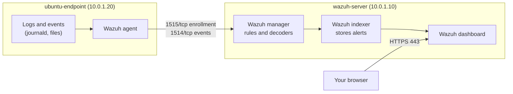

# Wazuh Server and First Ubuntu Agent

This guide installs the **Wazuh** central components (manager, indexer and dashboard) on one VM, then connects the first Ubuntu 24.04 endpoint with a **Wazuh agent**. At the end, events from the endpoint appear in the Wazuh dashboard.

- **Wazuh** is an open-source security platform (SIEM/XDR). It collects events from endpoints, checks them against rules and shows alerts.
- The **manager** analyses events, the **indexer** stores them, and the **dashboard** is the web interface. The **agent** runs on each monitored endpoint and sends its events to the manager.

What this lab installs:

| Part | What | Where |
|---|---|---|
| [A](#part-a-install-the-wazuh-central-components) | Wazuh manager, indexer and dashboard (all-in-one) | wazuh-server |
| [B](#part-b-install-the-wazuh-agent-on-ubuntu) | Wazuh agent, connected to the manager | ubuntu-endpoint |

## Table of contents

1. [Architecture](#1-architecture)
2. [What you need](#2-what-you-need)
3. [Installation steps](#3-installation-steps)
4. [Test](#4-test)
5. [Common problems](#5-common-problems)
6. [Next steps](#6-next-steps)

---

## 1. Architecture



The flow from the post: endpoint → log/event → agent → manager → detection rule → alert → dashboard.

---

## 2. What you need

No earlier lab is needed.

| VM | Role | Private IP | CPU / RAM / disk |
|---|---|---|---|
| wazuh-server | Wazuh manager, indexer, dashboard | 10.0.1.10 | 4 vCPU / 8 GB / 50 GB (Wazuh's recommendation for an all-in-one lab) |
| ubuntu-endpoint | Ubuntu 24.04 with the Wazuh agent | 10.0.1.20 | 1 vCPU / 2 GB / 20 GB (assumption) |

| Placeholder | What it is | Example | Where to find it |
|---|---|---|---|
| `<VM_USER>` | The sudo user on the VMs | `ubuntu` | The user you log in with |
| `<WAZUH_SERVER_IP>` | Private IP of wazuh-server | `10.0.1.10` | `hostname -I` on wazuh-server (first address) |
| `<WAZUH_VERSION>` | Exact Wazuh version on the server, without the `v` | `4.14.8` | [Step A3](#part-a-install-the-wazuh-central-components) |
| `<ADMIN_PASSWORD>` | Dashboard password of the user `admin` | random | [Step A2](#part-a-install-the-wazuh-central-components) |

Both VMs are on the same private network. The endpoint must reach the server on ports 1514 and 1515.

---

## 3. Installation steps

### Part A. Install the Wazuh central components

**Run on:** wazuh-server, as `<VM_USER>`

**A1. Run the Wazuh installation assistant** (assumption: the exact command was not recorded, but the file `wazuh-install-files.tar` on the server shows this assistant was used):

```bash
curl -sO https://packages.wazuh.com/4.14/wazuh-install.sh
sudo bash ./wazuh-install.sh -a
```

- `curl` downloads the official installation assistant.
- `-a` installs all components on this one VM (all-in-one). It takes 10 to 20 minutes.

**Check:** the last lines are similar to:

```text
INFO: --- Summary ---
INFO: You can access the web interface https://<WAZUH_SERVER_IP>:443
    User: admin
    Password: <ADMIN_PASSWORD>
INFO: Installation finished.
```

**A2. Save the passwords.** The assistant prints the `admin` password once. All generated passwords are also inside `wazuh-install-files.tar`:

```bash
sudo tar -O -xvf wazuh-install-files.tar wazuh-install-files/wazuh-passwords.txt
```

- `tar -O` prints the password file from the archive to the screen without unpacking it.

Save the `admin` password in a password manager. Never upload `wazuh-install-files.tar` or the password file to GitHub.

**A3. Find the exact Wazuh version** (the agent in Part B must not be newer):

```bash
sudo /var/ossec/bin/wazuh-control info | grep VERSION
```

**Check:** similar to `WAZUH_VERSION="v4.14.8"`. Write the number without the `v` as `<WAZUH_VERSION>`.

**A4. Stop automatic upgrades of the Wazuh packages:**

```bash
sudo apt-mark hold wazuh-manager wazuh-indexer wazuh-dashboard filebeat
```

- In this lab, an ordinary `apt upgrade` once left the dashboard half-configured and unreachable. `apt-mark hold` keeps these packages at their version until you upgrade them on purpose.

**Check:**

```bash
systemctl is-active wazuh-manager wazuh-indexer wazuh-dashboard filebeat
```

```text
active
active
active
active
```

Open `https://<WAZUH_SERVER_IP>` in your browser, accept the self-signed certificate warning and log in as `admin`.

### Part B. Install the Wazuh agent on Ubuntu

**Run on:** ubuntu-endpoint, as `<VM_USER>`

**B1. Download and install the agent package with the manager address:**

```bash
WAZUH_VERSION="4.14.8"          # CHANGE THIS: <WAZUH_VERSION> from A3
WAZUH_SERVER_IP="10.0.1.10"     # CHANGE THIS: <WAZUH_SERVER_IP>
wget https://packages.wazuh.com/4.x/apt/pool/main/w/wazuh-agent/wazuh-agent_${WAZUH_VERSION}-1_amd64.deb
sudo WAZUH_MANAGER="$WAZUH_SERVER_IP" WAZUH_AGENT_NAME="ubuntu-endpoint" dpkg -i ./wazuh-agent_${WAZUH_VERSION}-1_amd64.deb
```

- `wget` downloads the agent package of exactly the server's version.
- `WAZUH_MANAGER` and `WAZUH_AGENT_NAME` are written into the agent's config during the install: where the manager is, and the name shown in the dashboard.

**B2. Start the agent and keep its version fixed:**

```bash
sudo systemctl daemon-reload
sudo systemctl enable --now wazuh-agent
sudo apt-mark hold wazuh-agent
```

**Check** (on the endpoint):

```bash
systemctl is-active wazuh-agent
sudo grep -E "Connected to the server|Valid key received" /var/ossec/logs/ossec.log | tail -n 2
```

Similar to:

```text
active
2026/10/03 10:12:30 wazuh-agentd: INFO: Valid key received
2026/10/03 10:12:40 wazuh-agentd: INFO: (4102): Connected to the server ([10.0.1.10]:1514/tcp).
```

**Check** (on wazuh-server):

```bash
sudo /var/ossec/bin/agent_control -l
```

Similar to:

```text
Wazuh agent_control. List of available agents:
   ID: 000, Name: wazuh-server (server), IP: 127.0.0.1, Active/Local
   ID: 001, Name: ubuntu-endpoint, IP: any, Active
```

---

## 4. Test

**Run on:** ubuntu-endpoint, as `<VM_USER>`

```bash
sudo su -c "whoami"
```

- Running a command as root with `sudo` creates a log entry that Wazuh turns into an alert.

**See it in the dashboard:**

1. Open `https://<WAZUH_SERVER_IP>` and log in.
2. ☰ → **Agents management** → **Summary**: `ubuntu-endpoint` shows **active**.
3. ☰ → **Threat intelligence** → **Threat Hunting** → **Events** tab, time range **Last 15 minutes**, search:

```text
agent.name:ubuntu-endpoint and rule.id:5402
```

You see the alert **Successful sudo to ROOT executed.** (rule 5402, level 3). Open it to see the user, the command and the MITRE ATT&CK technique.

**The setup works when** the agent is active and its alerts appear in Threat Hunting.

---

## 5. Common problems

| Problem | Fix |
|---|---|
| Dashboard "refused to connect" after `apt upgrade` | The upgrade stopped half-way. `dpkg -l \| grep wazuh-dashboard` shows `iU`. Run `sudo dpkg --configure -a`, then `sudo systemctl restart wazuh-dashboard`. Prevent it with A4 |
| Lost the `admin` password | Print it again with the `tar` command in A2 |
| Agent never shows as active | 1) The endpoint can reach the server: `nc -zv <WAZUH_SERVER_IP> 1514` and `1515`. 2) `WAZUH_MANAGER` was correct: `sudo grep "<address>" /var/ossec/etc/ossec.conf` on the endpoint |
| Manager log: agent version is higher than the manager's | Install the agent package of exactly `<WAZUH_VERSION>` (B1) |
| After a reboot the dashboard shows errors for a few minutes | The indexer needs about 3 minutes to start. Wait, or restart in order: `wazuh-indexer`, `wazuh-manager`, `wazuh-dashboard` |

---

## 6. Next steps

- **Rule levels and how alerts are built**: [Rules classification](https://documentation.wazuh.com/current/user-manual/ruleset/rules/rules-classification.html)
- **Threat hunting in the dashboard**: [Threat hunting](https://documentation.wazuh.com/current/getting-started/use-cases/threat-hunting.html)
- **MITRE ATT&CK mapping**: [MITRE ATT&CK framework](https://documentation.wazuh.com/current/user-manual/ruleset/mitre.html)
- **File Integrity Monitoring**: [lab 02](../02-wazuh-fim-lab/)
