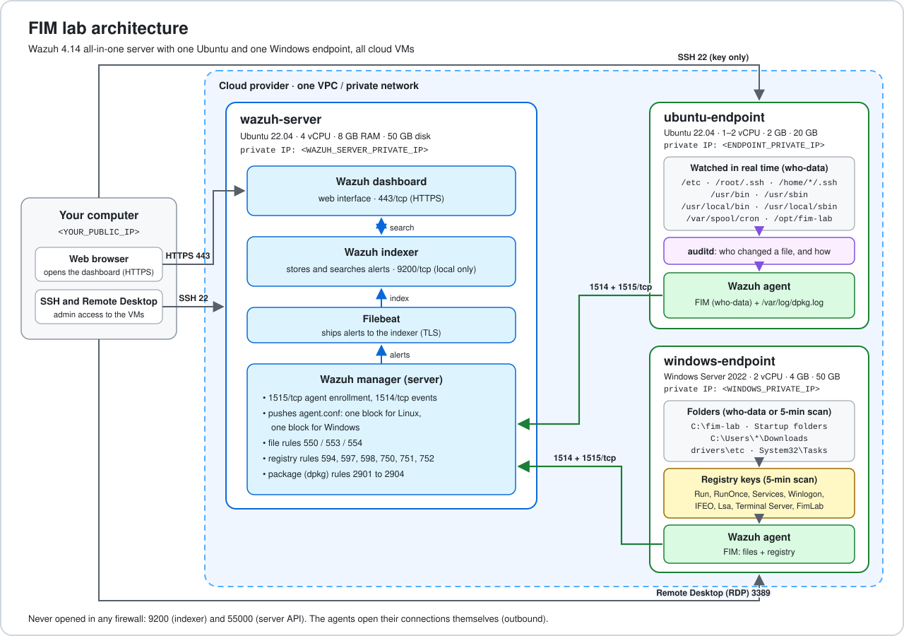
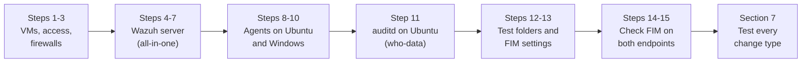
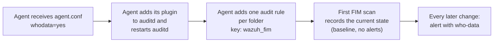

# Wazuh File Integrity Monitoring (FIM) Lab: Ubuntu and Windows (Cloud)

This guide installs a **Wazuh 4.14** server and two monitored endpoints, one **Ubuntu 22.04** and one **Windows Server 2022**, on cloud VMs. It then sets up **File Integrity Monitoring (FIM)** for the files, folders and Windows registry keys that matter most for security.

FIM raises an alert when a file is created, changed or deleted, or when its checksum, permissions or owner change. On both systems, **who-data** mode adds who made each change and with which program. On Windows, FIM also watches **registry keys** such as the autostart (Run) keys. On Ubuntu, package installs and removals are recorded from the dpkg log.

At the end, one test per endpoint proves that every part works.

> **Already built [`01-wazuh-soc-lab`](../01-wazuh-soc-lab/)?** You can reuse its server and Ubuntu VM. Create only the Windows VM ([Step 1](#step-1-create-an-ssh-key-and-the-three-vms)), add its firewall rules ([Step 2](#step-2-apply-the-cloud-firewall-rules) and [Step 3.4](#step-3-prepare-the-ubuntu-vms)), then continue at [Step 9](#step-9-install-the-wazuh-agent-on-windows). If you added the custom rules from that lab (100200 and 100201), the modify and delete alerts for `/opt/fim-lab` show those rule IDs instead of 550 and 553.

## Table of contents

1. [Overview](#wazuh-file-integrity-monitoring-fim-lab-ubuntu-and-windows-cloud)
2. [Architecture](#2-architecture)
3. [Prerequisites](#3-prerequisites)
4. [Variables and lab plan](#4-variables-and-lab-plan)
5. [Firewall rules](#5-firewall-rules)
6. [Installation and setup](#6-installation-and-setup)
7. [Verify the whole setup](#7-verify-the-whole-setup)
8. [Troubleshooting](#8-troubleshooting)
9. [After installation](#9-after-installation)
10. [Uninstall and cleanup](#10-uninstall-and-cleanup)
11. [Next steps](#11-next-steps)
12. [References](#12-references)

### Folder contents

```text
02-wazuh-fim-lab/
├── README.md                          this guide
├── .gitignore                         blocks passwords, keys and installer files from commits
├── configs/
│   ├── server/
│   │   └── agent.conf                 → /var/ossec/etc/shared/default/agent.conf  (wazuh-server)
│   └── firewall/
│       ├── cloud-firewall-rules.csv   rules to create in your cloud console
│       ├── ufw-wazuh-server.sh        ufw rules for wazuh-server
│       └── ufw-ubuntu-endpoint.sh     ufw rules for ubuntu-endpoint
├── scripts/
│   ├── fim-test.sh                    Ubuntu setup test     (run on ubuntu-endpoint)
│   ├── fim-test-windows.ps1           Windows setup test    (run on windows-endpoint)
│   └── show-fim-alerts.sh             FIM and dpkg alerts   (run on wazuh-server)
└── docs/images/
    └── architecture.svg
```

Every command in this guide can be copied directly from the README. The scripts are optional shortcuts that do the same thing. To use them on an Ubuntu VM, clone the repository there (Ubuntu cloud images include `git`; copy the URL from the green **Code** button on GitHub) and go into this lab's folder (for example `cd soc-documentation/02-wazuh-fim-lab`). On Windows, open the script on GitHub, click **Download raw file**, and run it as shown in [Section 7.5](#75-windows-test).

---

## 2. Architecture



| Component | Runs on | Role in this lab |
|---|---|---|
| **Wazuh agent** | ubuntu-endpoint | FIM module (`syscheck`) watches system folders in who-data mode; log collector reads `/var/log/dpkg.log` |
| **auditd** | ubuntu-endpoint | Linux audit daemon. Tells the agent which user and program changed a file (who-data) |
| **Wazuh agent** | windows-endpoint | FIM watches folders (who-data through Windows auditing) and scans registry keys every 5 minutes |
| **Wazuh manager** | wazuh-server | Receives events, matches them against rules, creates alerts. Pushes the FIM settings (`agent.conf`) to both agents: one block for Linux, one for Windows |
| **Filebeat** | wazuh-server | Ships alerts to the indexer |
| **Wazuh indexer** | wazuh-server | Stores and searches alerts |
| **Wazuh dashboard** | wazuh-server | Web interface where you see the FIM alerts |

Order of the setup:



---

## 3. Prerequisites

### Hardware (cloud VMs)

| VM | vCPU | RAM | Disk | Source |
|---|---|---|---|---|
| wazuh-server | 4 | 8 GB | 50 GB | Official Wazuh quickstart recommendation for 1 to 25 agents and 90 days of alerts |
| ubuntu-endpoint | 1 | 2 GB | 20 GB | Assumption: the agent and auditd are lightweight |
| windows-endpoint | 2 | 4 GB | 50 GB | Assumption: Microsoft's minimum for Windows Server 2022 with Desktop Experience is 2 GB RAM and 32 GB disk; 4 GB keeps it responsive |

Ubuntu VMs: **Ubuntu Server 22.04 LTS, 64-bit**. Ubuntu 22.04 is on Wazuh's list of recommended operating systems for the central components. Windows VM: **Windows Server 2022 Datacenter** (with Desktop Experience), which the Wazuh agent supports.

### Software (exact versions)

| Software | Version | Installed by |
|---|---|---|
| Ubuntu Server | 22.04 LTS | your cloud provider's image |
| Windows Server | 2022 Datacenter | your cloud provider's image |
| Wazuh manager, indexer, dashboard, Filebeat | 4.14.x (4.14.8 was the latest patch when this was written) | `wazuh-install.sh` from `packages.wazuh.com/4.14/` |
| Wazuh agent (Ubuntu and Windows) | **the same 4.14.x version as the server** | APT repository (Ubuntu), MSI installer (Windows) |
| auditd | 3.0.7 (Ubuntu 22.04 package) | `apt`, [Step 11](#step-11-install-auditd-for-who-data-on-ubuntu) |
| hello | 2.10 (Ubuntu 22.04 package) | installed and removed by the Ubuntu test in [Section 7](#7-verify-the-whole-setup) |
| jq | Ubuntu 22.04 package | `apt` (only for reading alerts in the terminal) |

> The agent version must be **equal to or lower than** the manager version. This guide installs both agents with the server's exact version.

### On your own computer

- A terminal with OpenSSH (`ssh`, `ssh-keygen`). Linux and macOS have it. Windows 10/11 has it in PowerShell.
- A Remote Desktop client. Windows: **Remote Desktop Connection** (`mstsc`), built in. macOS: Microsoft's **Windows App**.
- A modern web browser.

### Assumed knowledge

- Running commands in a Linux terminal with `sudo`, and in PowerShell on Windows.
- Connecting to a server with SSH and with Remote Desktop.
- Creating a VM and editing firewall rules in your cloud provider's web console.

### Assumptions made in this guide

The LinkedIn post describes what was tested, not the exact setup. Where a detail was missing, this guide uses the official recommendation or a simple choice:

| # | Assumption | Why |
|---|---|---|
| A1 | Three VMs: one Wazuh server, one Ubuntu endpoint, one Windows endpoint | FIM runs in the agent on each monitored machine; the registry exists only on Windows |
| A2 | Server size 4 vCPU / 8 GB / 50 GB | Official quickstart hardware for 1 to 25 agents |
| A3 | Endpoint sizes from the hardware table | Not official numbers; enough for the agents |
| A4 | Wazuh 4.14, all-in-one install with the official installation assistant | Current release line; simplest supported method for a lab |
| A5 | All VMs are in the same VPC / private network and region | The agents talk to the manager over private IPs. If your provider has no private network, use the public IPs in the same places and allow 1514/1515 only from the endpoints' public IPs |
| A6 | Windows Server 2022 instead of Windows 10/11 | Cloud providers offer Windows Server images by default |
| A7 | Monitored paths and registry keys from [Step 13](#step-13-push-the-fim-settings-from-the-server) | Common places attackers change: accounts, sudo, SSH keys, cron, services, programs, autostart folders and keys. Lab folder `/opt/fim-lab` and `C:\fim-lab`, lab key `HKLM\Software\FimLab` |
| A8 | Who-data in **audit** mode on Ubuntu (with auditd) | Wazuh's default who-data mode on Linux. An eBPF mode also exists ([Next steps](#11-next-steps)) |
| A9 | Windows FIM scan every 5 minutes (default 12 hours) | The registry is checked only by scheduled scans; 5 minutes makes the lab test practical |
| A10 | Generic cloud provider | Menu names differ: AWS "Security groups", Azure "Network security groups", Google Cloud "VPC firewall rules", Oracle Cloud "Security lists", DigitalOcean "Cloud Firewalls" |

> **Note on older tutorials:** before Wazuh 4.3, Wazuh was installed with Elasticsearch and Kibana (Open Distro). Since 4.3 it uses its own **Wazuh indexer** and **Wazuh dashboard**. Elasticsearch/Kibana steps from older guides do not apply here.

---

## 4. Variables and lab plan

Every value in `<ANGLE_BRACKETS>` is a placeholder. **Replace the whole placeholder, including the `<` and `>`**, with your own value. Fill in this table first and keep it open while you work.

| Variable | What it is | Example | How to find it |
|---|---|---|---|
| `<YOUR_PUBLIC_IP>` | Public IP of your own computer / home network | `203.0.113.25` | On your computer: `curl -4 ifconfig.me`, or search "what is my IP" |
| `<WAZUH_SERVER_PUBLIC_IP>` | Public IP of wazuh-server | `198.51.100.10` | Cloud console, VM details |
| `<WAZUH_SERVER_PRIVATE_IP>` | Private IP of wazuh-server | `10.0.1.10` | Cloud console, or `hostname -I` on the VM (first address) |
| `<ENDPOINT_PUBLIC_IP>` | Public IP of ubuntu-endpoint | `198.51.100.20` | Cloud console, VM details |
| `<ENDPOINT_PRIVATE_IP>` | Private IP of ubuntu-endpoint | `10.0.1.20` | Cloud console, or `hostname -I` on the VM (first address) |
| `<WINDOWS_PUBLIC_IP>` | Public IP of windows-endpoint | `198.51.100.30` | Cloud console, VM details |
| `<WINDOWS_PRIVATE_IP>` | Private IP of windows-endpoint | `10.0.1.30` | Cloud console, or `ipconfig` on the VM (IPv4 Address) |
| `<VM_USER>` | Default sudo user of your Ubuntu image | `ubuntu` | Provider docs. AWS, Oracle Cloud: `ubuntu`. Azure, Google Cloud: the name you chose. DigitalOcean: `root` |
| `<WINDOWS_ADMIN_USER>` | Administrator account of the Windows VM | `Administrator` | AWS: `Administrator`. Azure: the name you chose. Google Cloud: the name you set with "Set Windows password" |
| `<WINDOWS_ADMIN_PASSWORD>` | Its password | random | AWS: "Get Windows password" (decrypt with your key pair). Azure: set at creation. Google Cloud: "Set Windows password" |
| `<ADMIN_PASSWORD>` | Wazuh dashboard password for user `admin` | random, 32 characters | Printed at the end of [Step 4](#step-4-install-the-wazuh-central-components) |
| `<WAZUH_VERSION>` | Exact Wazuh version on the server, without the `v` | `4.14.8` | [Step 5](#step-5-verify-the-wazuh-server) |

The example values are used in all sample outputs in this guide. Your values will be different.

### Lab plan

| Hostname | Role | OS | Private IP | vCPU | RAM | Disk |
|---|---|---|---|---|---|---|
| `wazuh-server` | Wazuh manager + indexer + dashboard + Filebeat (all-in-one) | Ubuntu 22.04 LTS | `<WAZUH_SERVER_PRIVATE_IP>` | 4 | 8 GB | 50 GB |
| `ubuntu-endpoint` | Monitored endpoint: Wazuh agent + auditd | Ubuntu 22.04 LTS | `<ENDPOINT_PRIVATE_IP>` | 1 | 2 GB | 20 GB |
| `windows-endpoint` | Monitored endpoint: Wazuh agent (agent name; the Windows computer name can stay as the provider set it) | Windows Server 2022 | `<WINDOWS_PRIVATE_IP>` | 2 | 4 GB | 50 GB |

---

## 5. Firewall rules

There are **two firewall layers** on the Ubuntu VMs, and both must allow the traffic:

1. **Cloud firewall** (security group / NSG / firewall rules) in your provider's web console. It controls what reaches the VM at all.
2. **ufw** on each Ubuntu VM. A second layer inside the VM.

The Windows VM keeps **Windows Defender Firewall** as it is: the agent only makes outbound connections, which are allowed by default, and the cloud image already allows Remote Desktop.

### 5.1 Cloud firewall rules

Create these inbound rules. Outbound: keep the provider's default "allow all outbound".

| VM | Direction | Protocol | Port | Source | Purpose |
|---|---|---|---|---|---|
| wazuh-server | Inbound | TCP | 22 | `<YOUR_PUBLIC_IP>/32` | SSH from your computer |
| wazuh-server | Inbound | TCP | 443 | `<YOUR_PUBLIC_IP>/32` | Wazuh dashboard |
| wazuh-server | Inbound | TCP | 1514 | `<ENDPOINT_PRIVATE_IP>/32` | Agent events (Ubuntu) |
| wazuh-server | Inbound | TCP | 1515 | `<ENDPOINT_PRIVATE_IP>/32` | Agent enrollment (Ubuntu) |
| wazuh-server | Inbound | TCP | 1514 | `<WINDOWS_PRIVATE_IP>/32` | Agent events (Windows) |
| wazuh-server | Inbound | TCP | 1515 | `<WINDOWS_PRIVATE_IP>/32` | Agent enrollment (Windows) |
| ubuntu-endpoint | Inbound | TCP | 22 | `<YOUR_PUBLIC_IP>/32` | SSH from your computer |
| windows-endpoint | Inbound | TCP | 3389 | `<YOUR_PUBLIC_IP>/32` | Remote Desktop from your computer |

The same table is in [`configs/firewall/cloud-firewall-rules.csv`](configs/firewall/cloud-firewall-rules.csv).

**Never open these ports in any firewall:** `9200` (Wazuh indexer API) and `55000` (Wazuh server API). In an all-in-one install they are only used inside wazuh-server.

The endpoints need **no inbound port for Wazuh**. The agents open the connections to the manager themselves (outbound).

### 5.2 ufw rules

| VM | Port | From | Why |
|---|---|---|---|
| wazuh-server | 22/tcp | anywhere | SSH. Kept open in ufw so a change of your home IP never locks you out; the cloud firewall already limits it to your IP |
| wazuh-server | 443/tcp | `<YOUR_PUBLIC_IP>` | Dashboard |
| wazuh-server | 1514/tcp, 1515/tcp | `<ENDPOINT_PRIVATE_IP>` | Ubuntu agent |
| wazuh-server | 1514/tcp, 1515/tcp | `<WINDOWS_PRIVATE_IP>` | Windows agent |
| ubuntu-endpoint | 22/tcp | anywhere | SSH (limited by the cloud firewall) |

The commands are in [Step 3](#step-3-prepare-the-ubuntu-vms). The same rules as scripts: [`configs/firewall/ufw-wazuh-server.sh`](configs/firewall/ufw-wazuh-server.sh) and [`configs/firewall/ufw-ubuntu-endpoint.sh`](configs/firewall/ufw-ubuntu-endpoint.sh).

---

## 6. Installation and setup

Each step says **where** to run it and **as which user**. Do the steps in order. Each step ends with a check; do not continue until the check passes.

### Step 1. Create an SSH key and the three VMs

**Run on:** your computer and the cloud console

**1.1 Create an SSH key pair** for the Ubuntu VMs (skip if you already use one).

Linux / macOS:

```bash
ssh-keygen -t ed25519 -f ~/.ssh/wazuh-lab -C "wazuh-lab"
```

Windows PowerShell:

```powershell
ssh-keygen -t ed25519 -f $HOME\.ssh\wazuh-lab -C "wazuh-lab"
```

Press Enter to accept, and set a passphrase if you want one. This creates `wazuh-lab` (private key, never share it) and `wazuh-lab.pub` (public key, safe to upload).

**1.2 Create the two Ubuntu VMs** in your cloud console with the values from the [lab plan](#lab-plan):

- Image: **Ubuntu Server 22.04 LTS**
- Names: `wazuh-server` and `ubuntu-endpoint`
- Size: 4 vCPU / 8 GB RAM / 50 GB disk for wazuh-server, 1 vCPU / 2 GB / 20 GB for ubuntu-endpoint
- Network: **the same VPC / virtual network and subnet** for all VMs, with a public IP for each
- SSH key: paste the content of `wazuh-lab.pub`. Show it with `cat ~/.ssh/wazuh-lab.pub` (Windows: `Get-Content $HOME\.ssh\wazuh-lab.pub`)

**1.3 Create the Windows VM:**

- Image: **Windows Server 2022 Datacenter** (the version "with Desktop Experience", not "Core")
- Name: `windows-endpoint`
- Size: 2 vCPU / 4 GB RAM / 50 GB disk
- Network: the same VPC / subnet as the Ubuntu VMs, with a public IP
- Note how your provider gives you the administrator user and password (see `<WINDOWS_ADMIN_USER>` in the [variables table](#4-variables-and-lab-plan))

**1.4 Write down the six IP addresses** (public and private of each VM) in the [variables table](#4-variables-and-lab-plan), and find `<YOUR_PUBLIC_IP>` with `curl -4 ifconfig.me` on your computer.

**Check:** all three VMs show as "Running" in the cloud console, and you have all IPs written down.

### Step 2. Apply the cloud firewall rules

**Run on:** the cloud console, then your computer

Create the inbound rules from [Section 5.1](#51-cloud-firewall-rules). Many providers create a rule "SSH (22) from anywhere" or "RDP (3389) from anywhere" by default; change its source to `<YOUR_PUBLIC_IP>/32`.

**Check the Ubuntu VMs:** connect to both. Type `yes` the first time to accept the host key.

```bash
ssh -i ~/.ssh/wazuh-lab <VM_USER>@<WAZUH_SERVER_PUBLIC_IP>
```

```bash
ssh -i ~/.ssh/wazuh-lab <VM_USER>@<ENDPOINT_PUBLIC_IP>
```

(Windows PowerShell: use `-i $HOME\.ssh\wazuh-lab`.) Inside each VM, confirm the version:

```bash
lsb_release -d
```

```text
Description:	Ubuntu 22.04.5 LTS
```

The last number can differ. It must start with `Ubuntu 22.04`. On wazuh-server, also confirm the size:

```bash
nproc && free -h | grep Mem && df -h /
```

You should see `4`, a `Mem:` total of about `7.7Gi`, and a root disk of about `48G` or more.

**Check the Windows VM:** on your Windows computer press **Win + R**, type `mstsc`, press Enter, and connect to `<WINDOWS_PUBLIC_IP>` with `<WINDOWS_ADMIN_USER>` and `<WINDOWS_ADMIN_PASSWORD>`. Accept the certificate warning (the VM uses a self-signed certificate). In the VM, right-click **Start** → **Windows PowerShell (Admin)** (or **Terminal (Admin)**) and run:

```powershell
(Get-CimInstance Win32_OperatingSystem).Caption
```

```text
Microsoft Windows Server 2022 Datacenter
```

### Step 3. Prepare the Ubuntu VMs

**Run on:** wazuh-server and ubuntu-endpoint (3.1 to 3.3 on each), as `<VM_USER>`

**3.1 Update the system.**

```bash
sudo apt-get update
sudo apt-get -y upgrade
```

If a purple screen "Daemons using outdated libraries" appears, press **Enter** to accept the default. If the upgrade installed a new kernel, reboot and reconnect:

```bash
[ -f /var/run/reboot-required ] && sudo reboot
```

> If you get `Could not get lock /var/lib/dpkg/lock-frontend`, Ubuntu's automatic updates are still running after the first boot. Wait 2 to 5 minutes and try again.

**3.2 Set the hostname.** On **wazuh-server**:

```bash
sudo hostnamectl set-hostname wazuh-server
```

On **ubuntu-endpoint**:

```bash
sudo hostnamectl set-hostname ubuntu-endpoint
```

Check on each VM with `hostnamectl --static`. It prints `wazuh-server` or `ubuntu-endpoint`.

**3.3 Check the clock.** FIM alerts are sorted by time, so the clock must be synchronized:

```bash
timedatectl | grep "synchronized"
```

```text
System clock synchronized: yes
```

If it says `no`, run `sudo timedatectl set-ntp true` and check again after a minute. (Windows cloud VMs synchronize their clock automatically.)

**3.4 Enable ufw on wazuh-server.** Replace `<YOUR_PUBLIC_IP>`, `<ENDPOINT_PRIVATE_IP>` and `<WINDOWS_PRIVATE_IP>` first.

```bash
sudo ufw default deny incoming
sudo ufw default allow outgoing
sudo ufw allow 22/tcp comment 'SSH'
sudo ufw allow from <YOUR_PUBLIC_IP> to any port 443 proto tcp comment 'Wazuh dashboard'
sudo ufw allow from <ENDPOINT_PRIVATE_IP> to any port 1514 proto tcp comment 'Wazuh agent events'
sudo ufw allow from <ENDPOINT_PRIVATE_IP> to any port 1515 proto tcp comment 'Wazuh agent enrollment'
sudo ufw allow from <WINDOWS_PRIVATE_IP> to any port 1514 proto tcp comment 'Wazuh agent events'
sudo ufw allow from <WINDOWS_PRIVATE_IP> to any port 1515 proto tcp comment 'Wazuh agent enrollment'
sudo ufw --force enable
sudo ufw status numbered
```

Expected output (with the example IPs):

```text
Status: active

     To                         Action      From
     --                         ------      ----
[ 1] 22/tcp                     ALLOW IN    Anywhere                   # SSH
[ 2] 443/tcp                    ALLOW IN    203.0.113.25               # Wazuh dashboard
[ 3] 1514/tcp                   ALLOW IN    10.0.1.20                  # Wazuh agent events
[ 4] 1515/tcp                   ALLOW IN    10.0.1.20                  # Wazuh agent enrollment
[ 5] 1514/tcp                   ALLOW IN    10.0.1.30                  # Wazuh agent events
[ 6] 1515/tcp                   ALLOW IN    10.0.1.30                  # Wazuh agent enrollment
[ 7] 22/tcp (v6)                ALLOW IN    Anywhere (v6)              # SSH
```

**3.5 Enable ufw on ubuntu-endpoint.**

```bash
sudo ufw default deny incoming
sudo ufw default allow outgoing
sudo ufw allow 22/tcp comment 'SSH'
sudo ufw --force enable
sudo ufw status numbered
```

```text
Status: active

     To                         Action      From
     --                         ------      ----
[ 1] 22/tcp                     ALLOW IN    Anywhere                   # SSH
[ 2] 22/tcp (v6)                ALLOW IN    Anywhere (v6)              # SSH
```

**Check:** open a **new** SSH session to each Ubuntu VM (keep the old one open). If the new session works, the firewall is correct.

### Step 4. Install the Wazuh central components

**Run on:** wazuh-server, as `<VM_USER>`

The official installation assistant installs and configures the Wazuh indexer, the Wazuh server (manager + Filebeat) and the Wazuh dashboard on this one VM, including TLS certificates and random passwords.

```bash
cd ~
curl -sO https://packages.wazuh.com/4.14/wazuh-install.sh
sudo bash ./wazuh-install.sh -a
```

`-a` means "all-in-one". The URL with `4.14` installs the latest 4.14.x patch. This takes about 10 to 20 minutes. At the end you see:

```text
INFO: --- Summary ---
INFO: You can access the web interface https://<WAZUH_DASHBOARD_IP_ADDRESS>
    User: admin
    Password: <ADMIN_PASSWORD>
INFO: Installation finished.
```

**Copy the password into a password manager now.** This is `<ADMIN_PASSWORD>`. The IP printed may be the private IP; from your computer you will use `<WAZUH_SERVER_PUBLIC_IP>`.

If you lose the password, print all generated passwords again (run in the same folder, `~`):

```bash
sudo tar -O -xvf wazuh-install-files.tar wazuh-install-files/wazuh-passwords.txt
```

> `wazuh-install-files.tar` contains every password and certificate of this installation. Keep it private and never upload it (this folder's `.gitignore` already blocks it).

**Check:** the last line is `INFO: Installation finished.` If the installer stops with an error, see [Troubleshooting](#8-troubleshooting).

### Step 5. Verify the Wazuh server

**Run on:** wazuh-server, as `<VM_USER>`

**5.1 All four services are running:**

```bash
sudo systemctl is-active wazuh-manager wazuh-indexer wazuh-dashboard filebeat
```

```text
active
active
active
active
```

**5.2 The ports are listening:**

```bash
sudo ss -tlnp | grep -E ':(443|1514|1515|9200|55000) '
```

You should see one `LISTEN` line for each of the ports 443, 1514, 1515, 9200 and 55000.

**5.3 Filebeat can reach the indexer:**

```bash
sudo filebeat test output
```

The output ends with lines similar to:

```text
    TLS version: TLSv1.3
    dial up... OK
  talk to server... OK
  version: 7.10.2
```

`talk to server... OK` is the important line.

**5.4 The indexer is healthy.** Keep the single quotes; the password can contain characters like `*` or `?`.

```bash
curl -k -u 'admin:<ADMIN_PASSWORD>' 'https://localhost:9200/_cluster/health?pretty'
```

Look for `"status" : "green",`. `yellow` also works for a single-node lab. `red` means a problem (see [Troubleshooting](#8-troubleshooting)).

**5.5 Write down the exact version.**

```bash
sudo /var/ossec/bin/wazuh-control info -v
```

```text
v4.14.8
```

Write it **without** the `v` as `<WAZUH_VERSION>` (example: `4.14.8`). You need it in Steps 8 and 9.

### Step 6. Log in to the Wazuh dashboard

**Run on:** your computer (web browser)

1. Open `https://<WAZUH_SERVER_PUBLIC_IP>`.
2. The browser warns that the certificate is not trusted. This is expected: the installer created a self-signed certificate. Chrome / Edge: **Advanced → Proceed to ... (unsafe)**. Firefox: **Advanced → Accept the Risk and Continue**.
3. Log in with user `admin` and `<ADMIN_PASSWORD>`.

**Check:** the Wazuh dashboard home page opens. In the main menu (☰, top left) you see, among others, **Endpoint security**, **Threat intelligence** and **Agents management**.

### Step 7. Stop automatic Wazuh upgrades on the server

**Run on:** wazuh-server, as `<VM_USER>`

Wazuh recommends disabling its package repository after installation, so a normal `apt upgrade` never upgrades Wazuh by accident. This guide also "holds" the packages as a second safety net.

```bash
if [ -f /etc/apt/sources.list.d/wazuh.list ]; then
  sudo sed -i "s/^deb /#deb /" /etc/apt/sources.list.d/wazuh.list
fi
sudo apt-mark hold wazuh-manager wazuh-indexer wazuh-dashboard filebeat
sudo apt-get update
```

**Check:**

```bash
apt-mark showhold
```

```text
filebeat
wazuh-dashboard
wazuh-indexer
wazuh-manager
```

### Step 8. Install the Wazuh agent on Ubuntu

**Run on:** ubuntu-endpoint, as `<VM_USER>`

**8.1 Add the Wazuh repository.**

```bash
sudo apt-get install -y gnupg apt-transport-https curl
curl -s https://packages.wazuh.com/key/GPG-KEY-WAZUH | sudo gpg --no-default-keyring --keyring gnupg-ring:/usr/share/keyrings/wazuh.gpg --import
sudo chmod 644 /usr/share/keyrings/wazuh.gpg
echo "deb [signed-by=/usr/share/keyrings/wazuh.gpg] https://packages.wazuh.com/4.x/apt/ stable main" | sudo tee /etc/apt/sources.list.d/wazuh.list
sudo apt-get update
```

The `gpg` command prints a line ending in `imported`. `apt-get update` must show a line with `packages.wazuh.com` and no errors.

**8.2 Check that your server's version is available:**

```bash
apt-cache madison wazuh-agent | grep "<WAZUH_VERSION>"
```

```text
wazuh-agent |   4.14.8-1 | https://packages.wazuh.com/4.x/apt stable/main amd64 Packages
```

(`arm64` instead of `amd64` on ARM VMs.)

**8.3 Install, enroll and start the agent.** Replace `<WAZUH_SERVER_PRIVATE_IP>` and `<WAZUH_VERSION>`:

```bash
sudo WAZUH_MANAGER="<WAZUH_SERVER_PRIVATE_IP>" WAZUH_AGENT_NAME="ubuntu-endpoint" apt-get install -y wazuh-agent=<WAZUH_VERSION>-1
sudo systemctl daemon-reload
sudo systemctl enable wazuh-agent
sudo systemctl start wazuh-agent
```

- `WAZUH_MANAGER` writes the manager's address into the agent's configuration.
- `WAZUH_AGENT_NAME` sets the name you will see in the dashboard.
- `=<WAZUH_VERSION>-1` installs exactly the server's version (example: `wazuh-agent=4.14.8-1`).

**8.4 Stop automatic agent upgrades** (an agent newer than the manager stops working):

```bash
sudo sed -i "s/^deb /#deb /" /etc/apt/sources.list.d/wazuh.list
sudo apt-mark hold wazuh-agent
sudo apt-get update
```

**Check:**

```bash
sudo systemctl is-active wazuh-agent
sudo grep -A1 "<server>" /var/ossec/etc/ossec.conf
sudo grep -E "Valid key received|Connected to the server" /var/ossec/logs/ossec.log
```

```text
active
    <server>
      <address>10.0.1.10</address>
2026/10/02 10:02:11 wazuh-agentd: INFO: Valid key received
2026/10/02 10:02:21 wazuh-agentd: INFO: (4102): Connected to the server ([10.0.1.10]:1514/tcp).
```

- `Valid key received` = enrollment on port 1515 worked.
- `Connected to the server` = the event channel on port 1514 works.

The agent already reads the package log. Check it:

```bash
sudo grep "<location>" /var/ossec/etc/ossec.conf
```

The list must include `<location>/var/log/dpkg.log</location>` (package installs and removals) and `<location>journald</location>`.

### Step 9. Install the Wazuh agent on Windows

**Run on:** windows-endpoint, in **Windows PowerShell as administrator** (right-click **Start** → **Windows PowerShell (Admin)**)

Replace `<WAZUH_VERSION>` (example: `4.14.8`) and `<WAZUH_SERVER_PRIVATE_IP>`:

```powershell
$ProgressPreference = 'SilentlyContinue'
Invoke-WebRequest -UseBasicParsing -Uri "https://packages.wazuh.com/4.x/windows/wazuh-agent-<WAZUH_VERSION>-1.msi" -OutFile "$env:TEMP\wazuh-agent.msi"
msiexec.exe /i "$env:TEMP\wazuh-agent.msi" /q WAZUH_MANAGER="<WAZUH_SERVER_PRIVATE_IP>" WAZUH_AGENT_NAME="windows-endpoint" | Out-Null
Start-Service WazuhSvc
```

- The first line hides the download progress bar (it makes downloads very slow in Windows PowerShell).
- The file name contains the version, so the agent is exactly the server's version.
- `| Out-Null` makes PowerShell wait until the installer has finished.
- Keep `$env:TEMP\wazuh-agent.msi`: the uninstall step uses it.

**Check:**

```powershell
Get-Service WazuhSvc
Select-String -Path "C:\Program Files (x86)\ossec-agent\ossec.log" -Pattern "Valid key received|Connected to the server"
```

Similar to:

```text
Status   Name               DisplayName
------   ----               -----------
Running  WazuhSvc           Wazuh

C:\Program Files (x86)\ossec-agent\ossec.log:12:2026/10/02 10:12:30 wazuh-agent: INFO: Valid key received
C:\Program Files (x86)\ossec-agent\ossec.log:20:2026/10/02 10:12:40 wazuh-agent: INFO: (4102): Connected to the server ([10.0.1.10]:1514/tcp).
```

### Step 10. Confirm both agents are connected

**Run on:** wazuh-server, as `<VM_USER>`

```bash
sudo /var/ossec/bin/agent_control -l
```

```text
Wazuh agent_control. List of available agents:
   ID: 000, Name: wazuh-server (server), IP: 127.0.0.1, Active/Local
   ID: 001, Name: ubuntu-endpoint, IP: any, Active
   ID: 002, Name: windows-endpoint, IP: any, Active
```

`IP: any` is normal: by default agents are registered without a fixed IP. The IDs depend on the order you installed the agents; this guide assumes `001` = Ubuntu and `002` = Windows.

**In the dashboard:** ☰ → **Agents management** → **Summary**. Both endpoints are listed with status **active**.

### Step 11. Install auditd for who-data on Ubuntu

**Run on:** ubuntu-endpoint, as `<VM_USER>`

Who-data uses the Linux audit system to learn **which user and which program** changed a file. The agent needs the audit daemon, `auditd`, for that. (On Windows, who-data uses Windows' own auditing, which the agent configures by itself. Nothing to install there.)

```bash
sudo apt-get install -y auditd
sudo systemctl enable --now auditd
```

On Ubuntu 22.04 this installs audit 3.0.7, which already includes the plugin interface Wazuh uses. (The extra package `audispd-plugins` is only needed for audit 3.1.1 and later.)

**Check 1, auditd runs:**

```bash
sudo systemctl is-active auditd
sudo auditctl -s | grep enabled
```

```text
active
enabled 1
```

**Check 2, no rule blocks auditing.** Some systems ship a rule `-a never,task` that switches auditing off for every process, which stops who-data. Ubuntu's default rules do not contain it, but check:

```bash
sudo auditctl -l | grep -i "never,task" || echo "OK: no never,task rule"
```

```text
OK: no never,task rule
```

If the command prints `-a never,task` instead, remove that line from `/etc/audit/rules.d/audit.rules` and reload the rules:

```bash
sudo sed -i '/-a never,task/d' /etc/audit/rules.d/audit.rules
sudo augenrules --load
```

### Step 12. Create the test folders and registry key

The lab test folder and registry key must exist **before** the agents load the FIM settings. (A registry key created later is only picked up at a later scan.)

**12.1 On ubuntu-endpoint** (as `<VM_USER>`):

```bash
sudo mkdir -p /opt/fim-lab
ls -ld /opt/fim-lab
```

```text
drwxr-xr-x 2 root root 4096 Oct  2 10:20 /opt/fim-lab
```

**12.2 On windows-endpoint** (PowerShell as administrator):

```powershell
New-Item -ItemType Directory -Path C:\fim-lab -Force | Out-Null
New-Item -Path HKLM:\Software\FimLab -Force | Out-Null
Test-Path C:\fim-lab; Test-Path HKLM:\Software\FimLab
```

```text
True
True
```

### Step 13. Push the FIM settings from the server

**Run on:** wazuh-server, as `<VM_USER>`

You do not edit the agents' own configuration files. The manager sends `agent.conf` to every agent in the group `default`, so one file configures all agents. The file has two blocks: `<agent_config os="Linux">` is applied only by Linux agents, `<agent_config os="Windows">` only by Windows agents.

What it monitors, and why:

| OS | Path or registry key | How | Why it matters |
|---|---|---|---|
| Ubuntu | `/opt/fim-lab` | who-data + diff | Lab test folder |
| Ubuntu | `/etc` | who-data + diff | Users and groups (`passwd`, `shadow`, `group`), sudo rules (`sudoers`, `sudoers.d/`), SSH server (`ssh/`), cron jobs (`crontab`, `cron.d/`), services (`systemd/`), `hosts`, PAM, login scripts, library preload (`ld.so.preload`) |
| Ubuntu | `/usr/bin`, `/usr/sbin` | who-data | Programs from packages (shows package activity) |
| Ubuntu | `/usr/local/bin`, `/usr/local/sbin` | who-data | Programs installed by hand or by scripts |
| Ubuntu | `/root/.ssh`, `/home/*/.ssh` | who-data + diff | `authorized_keys`: a new key there is a new way to log in |
| Ubuntu | `/var/spool/cron` | who-data | Per-user cron jobs (`crontab -e`) |
| Ubuntu | `/bin`, `/sbin`, `/boot` | every 12 h | Agent default, unchanged (kernel and boot files) |
| Windows | `C:\fim-lab` | who-data + diff | Lab test folder |
| Windows | Startup folders (all users and every user) | who-data | Programs that start at logon |
| Windows | `C:\Users\*\Downloads` | who-data | New downloaded files |
| Windows | `drivers\etc` (contains `hosts`) | every 5 min + diff | `hosts` changes can redirect websites |
| Windows | `System32\Tasks` | every 5 min | Scheduled tasks |
| Windows | Selected programs in `C:\Windows` and `System32` (`cmd.exe`, `powershell.exe`, `net.exe`, `reg.exe`, ...) | every 5 min | Agent default |
| Windows | `HKLM\Software\FimLab` | registry, every 5 min + diff | Lab test key |
| Windows | `HKLM\...\CurrentVersion\Run`, `RunOnce` | registry + diff | Autostart for all users |
| Windows | `HKEY_USERS\*\...\CurrentVersion\Run`, `RunOnce` | registry + diff | Autostart per user (each loaded user profile) |
| Windows | `HKLM\...\Windows NT\CurrentVersion\Image File Execution Options` | registry | "Debugger" setting that hijacks a program |
| Windows | `HKLM\System\CurrentControlSet\Control\Lsa` | registry + diff | Credential protection and authentication packages |
| Windows | `HKLM\System\CurrentControlSet\Control\Terminal Server` | registry + diff | Remote Desktop on or off |
| Windows | `Services`, `Winlogon`, `Software\Policies`, `KnownDLLs`, `Security`, file-type handlers (`exefile`, `batfile`, ...) | registry | Agent default |

Notes:

- **who-data** = real time, plus who made the change and with which program. **diff** = the alert shows the changed text (text files only, and registry values of type `REG_SZ`, `REG_MULTI_SZ`, `REG_DWORD`).
- The registry is never watched in real time: Wazuh compares it at each scheduled scan. The Windows block sets the scan interval to 5 minutes (`<frequency>300</frequency>`) for this lab; the default is 12 hours.
- On Ubuntu, `<nodiff>` keeps the content of `/etc/shadow`, `/etc/gshadow` (password hashes) and `/etc/ssl/private` (private keys) out of alerts. Changes to them are still reported.
- The Windows agent is a 32-bit program, so it reaches the real `C:\Windows\System32` through the path `%WINDIR%\SysNative`.
- An entry for a path that the agent already monitors by default (for example `/usr/bin`, `drivers\etc`, the `Run` keys) replaces the default entry with these settings.

**13.1 Write the file.** Write it to a temporary file first, so the manager never sends a half-written file to the agents. This is the full file (also in [`configs/server/agent.conf`](configs/server/agent.conf)):

```bash
sudo tee /var/ossec/etc/shared/default/agent.conf.tmp > /dev/null <<'EOF'
<agent_config os="Linux">

  <!--
    File:     /var/ossec/etc/shared/default/agent.conf
    Machine:  wazuh-server (the Wazuh manager)
    Purpose:  FIM settings that the manager pushes to every agent in the
              "default" group. This first block applies only to Linux agents
              (ubuntu-endpoint); the second block applies only to Windows agents.

    whodata="yes"         real time, plus WHO made the change and with which
                          program (uses the Linux audit daemon, auditd)
    check_all="yes"       size, permissions, owner, group, modification time,
                          inode and MD5/SHA-1/SHA-256 checksums
    report_changes="yes"  add the text difference (diff) to the alert

    The agent's own defaults stay active: /etc, /usr/bin, /usr/sbin, /bin,
    /sbin and /boot are scanned every 12 hours. An entry below with the same
    path replaces the default entry for that path.

    CHANGE THIS: nothing, unless you want other folders.
  -->
  <syscheck>
    <!-- Lab test folder -->
    <directories check_all="yes" whodata="yes" report_changes="yes">/opt/fim-lab</directories>

    <!-- System configuration: users and groups (passwd, shadow, group), sudo
         rules (sudoers, sudoers.d), SSH server (ssh/), cron jobs (crontab,
         cron.d, cron.*), services (systemd/), hosts, PAM, login scripts,
         library preload (ld.so.preload) -->
    <directories check_all="yes" whodata="yes" report_changes="yes">/etc</directories>

    <!-- Programs: from packages (apt/dpkg) and installed by hand -->
    <directories check_all="yes" whodata="yes">/usr/bin,/usr/sbin</directories>
    <directories check_all="yes" whodata="yes">/usr/local/bin,/usr/local/sbin</directories>

    <!-- SSH keys of root and of every user (authorized_keys = login backdoor) -->
    <directories check_all="yes" whodata="yes" report_changes="yes">/root/.ssh</directories>
    <directories check_all="yes" whodata="yes" report_changes="yes">/home/*/.ssh</directories>

    <!-- Per-user cron jobs (crontab -e) -->
    <directories check_all="yes" whodata="yes">/var/spool/cron</directories>

    <!-- Never put the content of password hashes or private keys into alerts -->
    <nodiff type="sregex">^/etc/shadow|^/etc/gshadow|^/etc/ssl/private</nodiff>
  </syscheck>

</agent_config>

<agent_config os="Windows">

  <!--
    Windows agents (windows-endpoint). The agent's defaults stay active,
    including these registry keys: Run, RunOnce, Services, Winlogon,
    Software\Policies, Session Manager\KnownDLLs, Security, and the
    file-type handlers (exefile, batfile, cmdfile, ...).

    Files: who-data uses Windows auditing (Wazuh sets the audit policy and
    SACLs itself). Registry: scanned on a schedule only (no who-data).

    CHANGE THIS: <frequency> is 300 seconds (5 minutes) for the lab so
    registry tests show results quickly. The default is 43200 (12 hours).
    Remove the line, or set it back to 43200, outside the lab.
  -->
  <syscheck>
    <frequency>300</frequency>

    <!-- Lab test folder -->
    <directories check_all="yes" whodata="yes" report_changes="yes">C:\fim-lab</directories>

    <!-- Startup folders: programs that start at logon (persistence) -->
    <directories check_all="yes" whodata="yes">%PROGRAMDATA%\Microsoft\Windows\Start Menu\Programs\Startup</directories>
    <directories check_all="yes" whodata="yes">C:\Users\*\AppData\Roaming\Microsoft\Windows\Start Menu\Programs\Startup</directories>

    <!-- Downloads of every user -->
    <directories check_all="yes" whodata="yes">C:\Users\*\Downloads</directories>

    <!-- hosts file and other network files (the 32-bit agent reaches the
         real System32 through SysNative). Scheduled scan, with text diff. -->
    <directories check_all="yes" recursion_level="0" report_changes="yes">%WINDIR%\SysNative\drivers\etc</directories>

    <!-- Scheduled tasks (persistence). Scheduled scan. -->
    <directories check_all="yes">%WINDIR%\SysNative\Tasks</directories>

    <!-- Registry: lab test key (create it before the agent loads this file) -->
    <windows_registry arch="both" report_changes="yes">HKEY_LOCAL_MACHINE\Software\FimLab</windows_registry>

    <!-- Registry: autostart keys, now with the value data in the alert -->
    <windows_registry arch="both" report_changes="yes">HKEY_LOCAL_MACHINE\Software\Microsoft\Windows\CurrentVersion\Run</windows_registry>
    <windows_registry arch="both" report_changes="yes">HKEY_LOCAL_MACHINE\Software\Microsoft\Windows\CurrentVersion\RunOnce</windows_registry>

    <!-- Registry: autostart keys of every loaded user profile (HKCU\...\Run) -->
    <windows_registry arch="both" report_changes="yes">HKEY_USERS\*\Software\Microsoft\Windows\CurrentVersion\Run</windows_registry>
    <windows_registry arch="both" report_changes="yes">HKEY_USERS\*\Software\Microsoft\Windows\CurrentVersion\RunOnce</windows_registry>

    <!-- Registry: "debugger" hijack of programs (persistence) -->
    <windows_registry arch="both">HKEY_LOCAL_MACHINE\Software\Microsoft\Windows NT\CurrentVersion\Image File Execution Options</windows_registry>

    <!-- Registry: LSA settings (credential protection, authentication packages) -->
    <windows_registry report_changes="yes">HKEY_LOCAL_MACHINE\System\CurrentControlSet\Control\Lsa</windows_registry>

    <!-- Registry: Remote Desktop on/off and settings -->
    <windows_registry report_changes="yes">HKEY_LOCAL_MACHINE\System\CurrentControlSet\Control\Terminal Server</windows_registry>
  </syscheck>

</agent_config>
EOF
sudo chown wazuh:wazuh /var/ossec/etc/shared/default/agent.conf.tmp
sudo chmod 660 /var/ossec/etc/shared/default/agent.conf.tmp
```

Lines to change only if you want other paths: the `<directories ...>` and `<windows_registry ...>` lines. On Windows, change `<frequency>300</frequency>` back to `43200` outside the lab.

**13.2 Validate it:**

```bash
sudo /var/ossec/bin/verify-agent-conf -f /var/ossec/etc/shared/default/agent.conf.tmp
```

```text
verify-agent-conf: OK
```

**13.3 Only if you see `OK`, activate it and restart the manager:**

```bash
sudo mv /var/ossec/etc/shared/default/agent.conf.tmp /var/ossec/etc/shared/default/agent.conf
sudo systemctl restart wazuh-manager
```

**Check:** wait about one minute, then:

```bash
sudo /var/ossec/bin/agent_groups -S -i 001
sudo /var/ossec/bin/agent_groups -S -i 002
```

```text
Agent '001' is synchronized.
Agent '002' is synchronized.
```

If one says `is not synchronized`, wait another minute and run it again.

### Step 14. Check FIM on Ubuntu

**Run on:** ubuntu-endpoint, as `<VM_USER>`

What happens when the agent loads the new settings:



**14.1 Confirm the agent received the Linux settings:**

```bash
sudo grep -c "<directories.*whodata=\"yes\"" /var/ossec/etc/shared/agent.conf
```

```text
11
```

(The shared file holds both blocks: 7 who-data lines for Linux and 4 for Windows.)

**14.2 Restart the agent** so the who-data engine surely starts with the new folders, and wait for the first scan:

```bash
sudo systemctl restart wazuh-agent
sleep 90
```

**14.3 Check the agent log.**

```bash
sudo grep "Monitoring path" /var/ossec/logs/ossec.log | grep "whodata" | tail -n 9
sudo grep -E "Whodata engine started|\(6009\)" /var/ossec/logs/ossec.log | tail -n 2
```

Similar to (example user `ubuntu`):

```text
... (6003): Monitoring path: '/etc', with options 'size | permissions | owner | group | mtime | inode | hash_md5 | hash_sha1 | hash_sha256 | report_changes | whodata'.
... (6003): Monitoring path: '/home/ubuntu/.ssh', with options '... | report_changes | whodata'.
... (6003): Monitoring path: '/opt/fim-lab', with options '... | report_changes | whodata'.
... (6003): Monitoring path: '/root/.ssh', with options '... | report_changes | whodata'.
... (6003): Monitoring path: '/usr/bin', with options '... | whodata'.
... (6003): Monitoring path: '/usr/local/bin', with options '... | whodata'.
... (6003): Monitoring path: '/usr/local/sbin', with options '... | whodata'.
... (6003): Monitoring path: '/usr/sbin', with options '... | whodata'.
... (6003): Monitoring path: '/var/spool/cron', with options '... | whodata'.
2026/10/02 10:24:07 wazuh-syscheckd: INFO: (6019): File integrity monitoring real-time Whodata engine started.
2026/10/02 10:25:32 wazuh-syscheckd: INFO: (6009): File integrity monitoring scan ended.
```

- Nine `Monitoring path` lines ending in `whodata`. `/home/*/.ssh` appears with the real user name (one extra line for each extra user that has a `.ssh` folder).
- `Whodata engine started` = the agent is connected to auditd.
- `(6009) ... scan ended` = the baseline is ready. If this line is missing, wait another minute and run the command again. Changes made before the scan ends are not compared.

**14.4 Check the audit rules** the agent added:

```bash
sudo auditctl -l | grep wazuh_fim
```

Similar to:

```text
-w /etc -p wa -k wazuh_fim
-w /home/ubuntu/.ssh -p wa -k wazuh_fim
-w /opt/fim-lab -p wa -k wazuh_fim
-w /root/.ssh -p wa -k wazuh_fim
-w /usr/bin -p wa -k wazuh_fim
-w /usr/local/bin -p wa -k wazuh_fim
-w /usr/local/sbin -p wa -k wazuh_fim
-w /usr/sbin -p wa -k wazuh_fim
-w /var/spool/cron -p wa -k wazuh_fim
```

One line per who-data folder, each with the key `wazuh_fim`. (`-p wa` = watch writes and attribute changes such as permissions and owner.)

**Check:** nine `Monitoring path` lines ending in `whodata`, the `Whodata engine started` line, the `scan ended` line, and nine `wazuh_fim` audit rules.

### Step 15. Check FIM on Windows

**Run on:** windows-endpoint, PowerShell as administrator

**15.1 Confirm the agent received the Windows settings:**

```powershell
Select-String -Path "C:\Program Files (x86)\ossec-agent\shared\agent.conf" -Pattern "fim-lab|FimLab|frequency"
```

You see the lines with `<frequency>300</frequency>`, `C:\fim-lab` and `HKEY_LOCAL_MACHINE\Software\FimLab`.

**15.2 Restart the agent and wait for the first scan:**

```powershell
Restart-Service -Name WazuhSvc
Start-Sleep -Seconds 120
```

**15.3 Check the agent log:**

```powershell
Select-String -Path "C:\Program Files (x86)\ossec-agent\ossec.log" -Pattern "fim-lab|FimLab|Whodata engine started|\(6009\)" | Select-Object -Last 5
```

Similar to:

```text
... (6003): Monitoring path: 'c:\fim-lab', with options '... | report_changes | whodata'.
... (6002): Monitoring registry entry: 'HKEY_LOCAL_MACHINE\Software\FimLab [x64]', with options '...'
... (6002): Monitoring registry entry: 'HKEY_LOCAL_MACHINE\Software\FimLab', with options '...'
... (6019): File integrity monitoring real-time Whodata engine started.
... (6009): File integrity monitoring scan ended.
```

- The `C:\fim-lab` line ends in `whodata`.
- Two registry lines show `FimLab`: one ending in `[x64]` (64-bit registry view) and one with no suffix (32-bit view). Two lines because of `arch="both"`.
- `(6009) ... scan ended` = the baseline is ready. The first Windows scan can take a few minutes; run the command again if the line is missing.

**15.4 Check the audit policy** the agent set for who-data:

```powershell
auditpol /get /subcategory:"File System"
```

Similar to:

```text
System audit policy
Category/Subcategory                      Setting
Object Access
  File System                             Success
```

`Success` (or `Success and Failure`) means Windows reports file changes, so who-data works.

**Check:** the `C:\fim-lab` line with `whodata`, the `FimLab` registry lines, the `scan ended` line, and `File System` auditing set to `Success`.

---

## 7. Verify the whole setup

### 7.1 Health of server and agents

| # | Run on | Command | Expected |
|---|---|---|---|
| 1 | wazuh-server | `sudo systemctl is-active wazuh-manager wazuh-indexer wazuh-dashboard filebeat` | `active` four times |
| 2 | wazuh-server | `sudo filebeat test output` | `talk to server... OK` |
| 3 | wazuh-server | `sudo /var/ossec/bin/agent_control -l` | `ubuntu-endpoint` and `windows-endpoint`, both `Active` |
| 4 | ubuntu-endpoint | `sudo systemctl is-active wazuh-agent auditd` | `active` twice |
| 5 | ubuntu-endpoint | `sudo auditctl -l \| grep -c wazuh_fim` | `9` |
| 6 | windows-endpoint | `(Get-Service WazuhSvc).Status` | `Running` |
| 7 | your computer | Open `https://<WAZUH_SERVER_PUBLIC_IP>` and log in | Dashboard opens |

### 7.2 Ubuntu test

**Run on:** ubuntu-endpoint, as `<VM_USER>`. One test makes every kind of change the setup must detect: a file's creation, content (checksum), permissions, owner and deletion; a new and a deleted user account; a new and a deleted cron file; a package install and removal. It takes about two minutes.

```bash
echo "first line" | sudo tee /opt/fim-lab/fim-test.txt
sleep 10
echo "second line" | sudo tee -a /opt/fim-lab/fim-test.txt
sleep 10
sudo chmod 600 /opt/fim-lab/fim-test.txt
sleep 10
sudo chown nobody:nogroup /opt/fim-lab/fim-test.txt
sleep 10
sudo rm /opt/fim-lab/fim-test.txt
sleep 10
sudo useradd -M -s /usr/sbin/nologin fimtest
sleep 10
sudo userdel fimtest
sleep 10
echo "# FIM lab test file, safe to delete" | sudo tee /etc/cron.d/fim-lab-test
sleep 10
sudo rm /etc/cron.d/fim-lab-test
sleep 10
sudo apt-get install -y hello
sleep 10
sudo apt-get remove -y hello
```

(Same as `sudo bash scripts/fim-test.sh` from this folder.) The user `fimtest` has no home folder and cannot log in. The cron file only contains a comment, so it runs nothing. `hello` is a tiny demo program from Ubuntu's own repository; it adds the file `/usr/bin/hello`.

### 7.3 Ubuntu FIM alerts in the dashboard

☰ → **Endpoint security** → **File Integrity Monitoring** → **Events** tab. Set the time range (top right) to **Last 15 minutes** and search:

```text
agent.name:ubuntu-endpoint and rule.id:(550 or 553 or 554)
```

You see these alerts (oldest first here; the dashboard shows newest on top):

| Test action | Rule | Level | Description | `syscheck.path` | `syscheck.changed_attributes` |
|---|---|---|---|---|---|
| create | 554 | 5 | File added to the system. | `/opt/fim-lab/fim-test.txt` | |
| add a line | 550 | 7 | Integrity checksum changed. | `/opt/fim-lab/fim-test.txt` | size, mtime, md5, sha1, sha256 |
| `chmod 600` | 550 | 7 | Integrity checksum changed. | `/opt/fim-lab/fim-test.txt` | permission |
| `chown nobody:nogroup` | 550 | 7 | Integrity checksum changed. | `/opt/fim-lab/fim-test.txt` | uid, user_name, gid, group_name |
| delete | 553 | 7 | File deleted. | `/opt/fim-lab/fim-test.txt` | |
| `useradd fimtest` | 550 | 7 | Integrity checksum changed. | `/etc/passwd`, `/etc/shadow`, `/etc/group`, `/etc/gshadow` (and the backups ending in `-`) | size, mtime, inode, checksums |
| `userdel fimtest` | 550 | 7 | Integrity checksum changed. | the same files | size, mtime, inode, checksums |
| create cron file | 554 | 5 | File added to the system. | `/etc/cron.d/fim-lab-test` | |
| delete cron file | 553 | 7 | File deleted. | `/etc/cron.d/fim-lab-test` | |
| install `hello` | 554 | 5 | File added to the system. | `/usr/bin/hello` | |
| remove `hello` | 553 | 7 | File deleted. | `/usr/bin/hello` | |

Notes:

- Rule 550 is named "Integrity checksum changed." for **every** modification, including permission-only and owner-only changes. `syscheck.changed_attributes` shows what actually changed.
- The `/etc/passwd` and `/etc/group` alerts contain a `syscheck.diff` with the `fimtest` line. The `/etc/shadow` and `/etc/gshadow` alerts have no diff, because of `<nodiff>`.
- Extra alerts are normal: a 550 right after the first 554 (file created, then written), temporary files such as `/etc/passwd+` or `/usr/bin/hello.dpkg-new`, and `/etc/ld.so.cache` or `/etc/.pwd.lock` changing during the user and package steps.

Open the **add a line** alert (click the icon at the left of the row) and check these fields. They prove that who-data and `report_changes` work:

| Question | Field | Value |
|---|---|---|
| What changed? | `syscheck.event`, `syscheck.changed_attributes`, `syscheck.diff` | `modified`; size, mtime, md5, sha1, sha256; the diff shows `second line` was added |
| Where? | `agent.name`, `syscheck.path` | `ubuntu-endpoint`, `/opt/fim-lab/fim-test.txt` |
| Who? | `syscheck.audit.login_user.name`, `syscheck.audit.effective_user.name` | `<VM_USER>` (the person who logged in), `root` (because of `sudo`) |
| With which program? | `syscheck.audit.process.name` | `/usr/bin/tee` (`/usr/bin/bash` if you used the script) |
| When? | `timestamp` | the time of that step |
| How was it detected? | `syscheck.mode` | `whodata` |

For the `useradd` alerts, `syscheck.audit.process.name` is `/usr/sbin/useradd`. For `/usr/bin/hello`, it is `/usr/bin/dpkg`: the file came from the package manager.

### 7.4 Ubuntu package alerts in the dashboard

The dpkg log alerts are not FIM alerts, so they are in another module. ☰ → **Threat intelligence** → **Threat Hunting** → **Events**, time range **Last 15 minutes**:

```text
agent.name:ubuntu-endpoint and rule.id:(2901 or 2902 or 2903 or 2904)
```

| Test action | Rule | Level | Description | `data.package` |
|---|---|---|---|---|
| install `hello` | 2901 | 3 | New dpkg (Debian Package) requested to install. | `hello` |
| install `hello` | 2904 | 7 | Dpkg (Debian Package) half configured. | `hello` |
| install `hello` | 2902 | 7 | New dpkg (Debian Package) installed. | `hello` |
| remove `hello` | 2903 | 7 | Dpkg (Debian Package) removed. | `hello` |

You may also see 2904 / 2902 alerts for `man-db` and `install-info`. Ubuntu re-indexes manual pages and info files after every package change. That is normal.

### 7.5 Windows test

**Run on:** windows-endpoint, PowerShell as administrator. It takes about 18 minutes, because registry changes are only seen at the next scan (every 5 minutes in this lab).

**Part A, files** (who-data, results within seconds):

```powershell
Set-Content -Path C:\fim-lab\fim-test.txt -Value 'first line'; Start-Sleep 10
Add-Content -Path C:\fim-lab\fim-test.txt -Value 'second line'; Start-Sleep 10
icacls C:\fim-lab\fim-test.txt /grant 'Users:(R)'; Start-Sleep 10
icacls C:\fim-lab\fim-test.txt /setowner 'NT AUTHORITY\SYSTEM'; Start-Sleep 10
Remove-Item -Path C:\fim-lab\fim-test.txt -Force
```

Both `icacls` commands print `Successfully processed 1 files; Failed processing 0 files`.

**Part B, registry: add two values**, then wait for a scan:

```powershell
New-ItemProperty -Path HKLM:\Software\FimLab -Name LabValue -Value 'first' -PropertyType String -Force | Out-Null
New-ItemProperty -Path HKLM:\Software\Microsoft\Windows\CurrentVersion\Run -Name FimLabTest -Value 'C:\Windows\System32\notepad.exe' -PropertyType String -Force | Out-Null
Start-Sleep -Seconds 330
```

The second value is a harmless example of malware-style persistence: it would start Notepad at every logon. Part D removes it again; **do not skip Part D**.

**Part C, registry: change a value**, then wait for a scan:

```powershell
Set-ItemProperty -Path HKLM:\Software\FimLab -Name LabValue -Value 'second'
Start-Sleep -Seconds 330
```

**Part D, registry: delete both values**, then wait for a scan:

```powershell
Remove-ItemProperty -Path HKLM:\Software\FimLab -Name LabValue
Remove-ItemProperty -Path HKLM:\Software\Microsoft\Windows\CurrentVersion\Run -Name FimLabTest
Start-Sleep -Seconds 330
```

(All four parts are in [`scripts/fim-test-windows.ps1`](scripts/fim-test-windows.ps1). Run it with `powershell -ExecutionPolicy Bypass -File .\fim-test-windows.ps1` from the folder where you saved it.)

### 7.6 Windows FIM alerts in the dashboard

☰ → **Endpoint security** → **File Integrity Monitoring** → **Events** tab. Time range **Last 30 minutes**:

```text
agent.name:windows-endpoint and rule.id:(550 or 553 or 554 or 750 or 751 or 752)
```

| Test action | Rule | Level | Description | `syscheck.path` / `syscheck.value_name` | Detail |
|---|---|---|---|---|---|
| A: create | 554 | 5 | File added to the system. | `c:\fim-lab\fim-test.txt` | |
| A: add a line | 550 | 7 | Integrity checksum changed. | `c:\fim-lab\fim-test.txt` | `changed_attributes`: size, mtime, checksums; `syscheck.diff` shows `second line` |
| A: `icacls /grant` | 550 | 7 | Integrity checksum changed. | `c:\fim-lab\fim-test.txt` | `changed_attributes`: permission |
| A: `icacls /setowner` | 550 | 7 | Integrity checksum changed. | `c:\fim-lab\fim-test.txt` | `changed_attributes`: the owner fields (for example `user_name`) |
| A: delete | 553 | 7 | File deleted. | `c:\fim-lab\fim-test.txt` | |
| B: add values | 752 | 5 | Registry Value Entry Added to the System | `HKEY_LOCAL_MACHINE\Software\FimLab` / `LabValue`, and `...\CurrentVersion\Run` / `FimLabTest` | `syscheck.arch`: `[x64]` |
| C: change value | 750 | 5 | Registry Value Integrity Checksum Changed | `HKEY_LOCAL_MACHINE\Software\FimLab` / `LabValue` | `syscheck.diff` shows `first` → `second` |
| D: delete values | 751 | 5 | Registry Value Entry Deleted. | both values | |

Notes:

- Windows paths may appear in lower case (`c:\fim-lab\...`).
- Registry alerts have no who-data (the registry is compared at scans, not watched live).
- You may also see rule 594 "Registry Key Integrity Checksum Changed" for the two keys themselves (their last-write time changed), and alerts for files that Windows changes in `System32\Tasks` or `Downloads`. That is normal.

For the file alerts, who-data shows `syscheck.audit.user.name` = `<WINDOWS_ADMIN_USER>` and `syscheck.audit.process.name` = the program, for example `...\powershell.exe` for `Set-Content` or `...\icacls.exe`. `syscheck.mode` is `whodata`.

### 7.7 The same check in the terminal

**Run on:** wazuh-server, as `<VM_USER>`

```bash
sudo apt-get install -y jq
sudo tail -n 5000 /var/ossec/logs/alerts/alerts.json | jq -R -c 'fromjson? | select(.agent.name == "ubuntu-endpoint" and .syscheck.path != null) | {rule: .rule.id, path: .syscheck.path, changed: .syscheck.changed_attributes, who: .syscheck.audit.login_user.name, process: .syscheck.audit.process.name}'
```

Similar to (example user `ubuntu`, shortened):

```text
{"rule":"554","path":"/opt/fim-lab/fim-test.txt","changed":null,"who":"ubuntu","process":"/usr/bin/tee"}
{"rule":"550","path":"/opt/fim-lab/fim-test.txt","changed":["size","mtime","md5","sha1","sha256"],"who":"ubuntu","process":"/usr/bin/tee"}
{"rule":"550","path":"/opt/fim-lab/fim-test.txt","changed":["permission"],"who":"ubuntu","process":"/usr/bin/chmod"}
{"rule":"550","path":"/opt/fim-lab/fim-test.txt","changed":["uid","user_name","gid","group_name"],"who":"ubuntu","process":"/usr/bin/chown"}
{"rule":"553","path":"/opt/fim-lab/fim-test.txt","changed":null,"who":"ubuntu","process":"/usr/bin/rm"}
{"rule":"550","path":"/etc/passwd","changed":["size","mtime","inode","md5","sha1","sha256"],"who":"ubuntu","process":"/usr/sbin/useradd"}
...
{"rule":"554","path":"/usr/bin/hello","changed":null,"who":"ubuntu","process":"/usr/bin/dpkg"}
{"rule":"553","path":"/usr/bin/hello","changed":null,"who":"ubuntu","process":"/usr/bin/dpkg"}
```

For both endpoints, including registry values and dpkg alerts:

```bash
sudo bash scripts/show-fim-alerts.sh ubuntu-endpoint
sudo bash scripts/show-fim-alerts.sh windows-endpoint
```

**The setup works when:** all Ubuntu alerts from 7.3 and 7.4 and all Windows alerts from 7.6 appear, the file alerts have `syscheck.mode` = `whodata` with the user and program filled in, and the registry alerts show the `FimLab` and `Run` values.

---

## 8. Troubleshooting

### Installation

| Problem | Cause | Fix |
|---|---|---|
| `Could not get lock /var/lib/dpkg/lock-frontend` | Ubuntu's automatic updates run after the first boot | Wait 2 to 5 minutes, then retry. See what is running: `ps aux \| grep -i apt` |
| Installer stops with a hardware / system requirements error | The VM has less CPU or RAM than recommended | Resize wazuh-server to 4 vCPU / 8 GB and run the installer again. The installer has an option to ignore the check, but the indexer is unstable with too little RAM |
| Installer fails halfway (network error, wrong step) | Partial installation | Remove it and start again: `sudo bash ~/wazuh-install.sh -u`, then `sudo bash ~/wazuh-install.sh -a` |
| Browser cannot open the dashboard (timeout) | 443 blocked, or your home IP changed | On your computer run `curl -4 ifconfig.me`. Put that IP in the cloud firewall 443 rule and in ufw: `sudo ufw allow from <NEW_IP> to any port 443 proto tcp` |
| Dashboard says "Wazuh dashboard server is not ready yet" | Indexer or dashboard still starting (normal for 1 to 2 minutes after a boot) | Wait 2 minutes. If it stays: `sudo systemctl status wazuh-indexer wazuh-dashboard`, `free -h` |
| Dashboard login fails | Wrong password | Print the passwords again ([Step 4](#step-4-install-the-wazuh-central-components)). Copy without spaces |
| Remote Desktop cannot connect | 3389 blocked, or your home IP changed | Check the cloud firewall rule for windows-endpoint (TCP 3389 from `<YOUR_PUBLIC_IP>/32`) |
| Agent log: `(1208): Unable to connect to enrollment service at '[<WAZUH_SERVER_PRIVATE_IP>]:1515'` | 1515 blocked, or wrong manager IP | Ubuntu: `nc -zv <WAZUH_SERVER_PRIVATE_IP> 1515` and `... 1514` must say `succeeded`. Windows: `Test-NetConnection <WAZUH_SERVER_PRIVATE_IP> -Port 1515` must show `TcpTestSucceeded : True`. If not, fix the cloud firewall and ufw rules on wazuh-server (source = that endpoint's private IP) |
| Ubuntu agent is `Never connected` or `Disconnected` | Wrong address in the agent config | `sudo grep -A1 "<server>" /var/ossec/etc/ossec.conf` on the endpoint. If wrong: `sudo sed -i "s#<address>.*</address>#<address><WAZUH_SERVER_PRIVATE_IP></address>#" /var/ossec/etc/ossec.conf`, then `sudo systemctl restart wazuh-agent` |
| Windows: `Invoke-WebRequest` fails with 404 | Wrong version in the file name | Use the exact server version from [Step 5.5](#step-5-verify-the-wazuh-server) |
| Windows: `Start-Service WazuhSvc` says the service does not exist | The installer did not run, or not as administrator | Run the commands again in **PowerShell (Admin)** |
| Manager log says an agent version is higher than the manager's | Agent installed without the version pin | Ubuntu: `sudo apt-mark unhold wazuh-agent`, re-enable the repo (`sudo sed -i "s/^#deb /deb /" /etc/apt/sources.list.d/wazuh.list && sudo apt-get update`), then `sudo apt-get install -y --allow-downgrades wazuh-agent=<WAZUH_VERSION>-1`, and repeat [Step 8.4](#step-8-install-the-wazuh-agent-on-ubuntu). Windows: uninstall ([Section 10](#10-uninstall-and-cleanup)) and repeat [Step 9](#step-9-install-the-wazuh-agent-on-windows) |
| Locked out of SSH after enabling ufw | Rule for 22 missing | Use your provider's web / serial console to log in, then `sudo ufw allow 22/tcp` |
| Ports still blocked although cloud firewall and ufw allow them | Some images (for example Oracle Cloud Ubuntu) ship extra iptables rules | Check `sudo iptables -L INPUT -n --line-numbers`; follow your provider's documentation to allow the port |

### FIM and who-data

| Problem | Cause | Fix |
|---|---|---|
| `verify-agent-conf` shows an error | XML typo | Compare with [`configs/server/agent.conf`](configs/server/agent.conf); every `<tag>` needs its `</tag>` |
| `agent_groups -S` keeps saying `not synchronized` | Agent not connected, or the manager has not sent the file yet | Check [Step 10](#step-10-confirm-both-agents-are-connected); `sudo systemctl restart wazuh-manager` and wait 2 minutes |
| Ubuntu log: `(6923): Who-data engine cannot start because Auditd is not running.` | auditd stopped or not installed | `sudo apt-get install -y auditd`, `sudo systemctl enable --now auditd`, then `sudo systemctl restart wazuh-agent` |
| Ubuntu log: `(6913): Who-data engine could not start. Switching who-data to real-time.` | The agent could not connect to auditd. FIM still works, but without who-data (`syscheck.mode` is `realtime`, no `audit` fields) | `sudo systemctl restart auditd`, then `sudo systemctl restart wazuh-agent`. Check again with [Step 14.3](#step-14-check-fim-on-ubuntu) |
| `auditctl -l` shows fewer than nine `wazuh_fim` rules | Who-data did not start, a `-a never,task` rule exists, or a folder does not exist (for example `/root/.ssh` on some images) | See the two rows above and [Step 11](#step-11-install-auditd-for-who-data-on-ubuntu) Check 2. A missing folder is fine; it is watched once it exists |
| No FIM alerts at all | The first scan had not ended, test folder missing, or wrong time range | Wait for `(6009) ... scan ended` ([Step 14.3](#step-14-check-fim-on-ubuntu) / [Step 15.3](#step-15-check-fim-on-windows)), check the test folder exists, set the dashboard time range to **Last 1 hour**, then run the test again |
| Alerts appear but `syscheck.audit` fields are empty | FIM fell back to real-time mode | Ubuntu: look for `6913` in `/var/ossec/logs/ossec.log` and fix auditd. Windows: check `auditpol /get /subcategory:"File System"`; a group policy can turn auditing off, which makes Wazuh switch to real time. Restart the agent after fixing it |
| No registry alerts on Windows | The scan has not run yet, the key did not exist when the agent started, or the settings did not arrive | Wait at least 5 minutes after the change. Check [Step 12.2](#step-12-create-the-test-folders-and-registry-key) and [Step 15.1](#step-15-check-fim-on-windows). After creating a missing key, run `Restart-Service -Name WazuhSvc` |
| No `syscheck.diff` field | Diff works only for text files and some registry value types, and not on the "added" alert | Normal for binary files, for `/etc/shadow` (nodiff), and for the first version of a file. The diff appears on the "modified" alert |
| No dpkg alerts | `/var/log/dpkg.log` is not collected | `sudo grep dpkg.log /var/ossec/etc/ossec.conf` on the endpoint must show it ([Step 8](#step-8-install-the-wazuh-agent-on-ubuntu) check) |
| Many alerts for `/etc` and `/usr/bin` during `apt upgrade` or automatic updates, or for `System32\Tasks` and `Downloads` on Windows | Expected: updates and normal use change these files | Normal for this lab. In production, tune with `<ignore>` entries or custom rules ([Next steps](#11-next-steps)) |
| The `FimLabTest` value is still in the `Run` key | Part D of the Windows test was skipped | `Remove-ItemProperty -Path HKLM:\Software\Microsoft\Windows\CurrentVersion\Run -Name FimLabTest` |

Useful log files:

| Machine | File | Contains |
|---|---|---|
| wazuh-server | `/var/ossec/logs/ossec.log` | Manager messages and errors |
| wazuh-server | `/var/ossec/logs/alerts/alerts.json` | Every alert (one JSON object per line) |
| ubuntu-endpoint | `/var/ossec/logs/ossec.log` | Agent messages (enrollment, connection, FIM, who-data) |
| ubuntu-endpoint | `sudo journalctl -u auditd` | auditd messages |
| windows-endpoint | `C:\Program Files (x86)\ossec-agent\ossec.log` | Agent messages (enrollment, connection, FIM, registry) |

---

## 9. After installation

**Passwords**

- The installer creates **random** passwords (there is no default `admin/admin`). Store `<ADMIN_PASSWORD>` in a password manager.
- `~/wazuh-install-files.tar` on wazuh-server holds every password and certificate. Keep it private, never commit it.
- To set your own `admin` password (8 to 64 characters with an uppercase letter, a lowercase letter, a number and one of `. * + ? -`):

  ```bash
  sudo bash /usr/share/wazuh-indexer/plugins/opensearch-security/tools/wazuh-passwords-tool.sh -u admin -p '<NEW_ADMIN_PASSWORD>'
  sudo systemctl restart filebeat wazuh-dashboard
  sudo filebeat test output
  ```

  In an all-in-one install the tool updates Filebeat and the dashboard for you. `filebeat test output` must still end with `talk to server... OK`.

**Network**

- Never expose `9200` (indexer) or `55000` (server API) to the internet.
- Allow `443`, `22` and `3389` only from your own IP. Allow `1514` and `1515` only from your endpoints.

**Settings to change outside the lab**

- Windows: set `<frequency>300</frequency>` in `agent.conf` back to `43200` (or remove the line) to avoid a full scan every 5 minutes.
- Decide which noisy paths to keep in real time (`/usr/bin`, `Downloads`, `System32\Tasks`).

**Versions**

- Wazuh packages are held (Steps 7 and 8.4). Upgrade Wazuh only on purpose, following the official upgrade guide: first the server, then the agents.

**SSH**

- Use key-only login. Check on each Ubuntu VM: `sudo sshd -T | grep -i "^passwordauthentication"` must print `passwordauthentication no`.

---

## 10. Uninstall and cleanup

**Fastest:** delete the three VMs in the cloud console, then delete the firewall rules / security groups and any separately billed public IPs or disks.

To keep the VMs and remove only what this lab installed:

**10.1 Remove the FIM settings.** Run on: wazuh-server

```bash
echo "<agent_config>
</agent_config>" | sudo tee /var/ossec/etc/shared/default/agent.conf
sudo systemctl restart wazuh-manager
```

**10.2 Remove the agents from the manager.** Run on: wazuh-server

```bash
sudo /var/ossec/bin/manage_agents -r 001
sudo /var/ossec/bin/manage_agents -r 002
```

If asked to confirm, type `y`. Expected: `Agent '001' removed.` and `Agent '002' removed.`

**10.3 Uninstall the agent and auditd on Ubuntu.** Run on: ubuntu-endpoint

```bash
sudo apt-mark unhold wazuh-agent
sudo apt-get remove --purge -y wazuh-agent
sudo systemctl daemon-reload
sudo rm -f /etc/apt/sources.list.d/wazuh.list /usr/share/keyrings/wazuh.gpg
sudo rm -rf /opt/fim-lab
sudo apt-get remove --purge -y auditd
sudo apt-get update
```

**10.4 Uninstall the agent on Windows.** Run on: windows-endpoint, PowerShell as administrator

```powershell
Remove-ItemProperty -Path HKLM:\Software\Microsoft\Windows\CurrentVersion\Run -Name FimLabTest -ErrorAction SilentlyContinue
Remove-Item -Path HKLM:\Software\FimLab -Recurse -Force
Remove-Item -Path C:\fim-lab -Recurse -Force
msiexec.exe /x "$env:TEMP\wazuh-agent.msi" /qn | Out-Null
```

If `$env:TEMP\wazuh-agent.msi` was deleted, download it again with the `Invoke-WebRequest` line from [Step 9](#step-9-install-the-wazuh-agent-on-windows), or uninstall **Wazuh Agent** from **Settings** → **Apps**.

**10.5 Uninstall the Wazuh central components.** Run on: wazuh-server

```bash
sudo apt-mark unhold wazuh-manager wazuh-indexer wazuh-dashboard filebeat
cd ~
[ -f wazuh-install.sh ] || curl -sO https://packages.wazuh.com/4.14/wazuh-install.sh
sudo bash ./wazuh-install.sh -u
```

**10.6 Remove the ufw rules** (both Ubuntu VMs, optional): `sudo ufw --force reset`

---

## 11. Next steps

Features related to the post, with the official documentation:

- [Interpreting the FIM module analysis](https://documentation.wazuh.com/current/user-manual/capabilities/file-integrity/interpreting-fim-module-analysis.html): every field in a FIM alert.
- [Creating custom FIM rules](https://documentation.wazuh.com/current/user-manual/capabilities/file-integrity/creating-custom-fim-rules.html): raise the level of changes in sensitive folders, or alert on specific permission changes.
- [FIM use cases](https://documentation.wazuh.com/current/user-manual/capabilities/file-integrity/use-cases/index.html): account manipulation (`/etc/passwd`), configuration changes, monitoring at specific intervals.
- [Windows Registry monitoring](https://documentation.wazuh.com/current/user-manual/capabilities/file-integrity/windows-registry-monitoring.html): more registry options, exclusions, and the malware persistence use case.
- [Who-data in eBPF mode](https://documentation.wazuh.com/current/user-manual/capabilities/file-integrity/advanced-settings.html): who-data on Linux without auditd (needs kernel 5.8 or newer).
- [FIM with YARA](https://documentation.wazuh.com/current/user-manual/capabilities/malware-detection/fim-yara.html) and [VirusTotal integration](https://documentation.wazuh.com/current/user-manual/capabilities/malware-detection/virus-total-integration.html): scan new or changed files for malware.
- [System inventory](https://documentation.wazuh.com/current/user-manual/capabilities/system-inventory/index.html): the full list of installed packages and programs per agent.

---

## 12. References

Official Wazuh documentation (pages for the current release, 4.14 when this was written; use the version selector on the site if "current" has moved to a newer release):

- [Quickstart (all-in-one install, requirements)](https://documentation.wazuh.com/current/quickstart.html)
- [Architecture and required ports](https://documentation.wazuh.com/current/getting-started/architecture.html)
- [Deploying Wazuh agents on Linux endpoints](https://documentation.wazuh.com/current/installation-guide/wazuh-agent/wazuh-agent-package-linux.html)
- [Deploying Wazuh agents on Windows endpoints](https://documentation.wazuh.com/current/installation-guide/wazuh-agent/wazuh-agent-package-windows.html)
- [Deployment variables for Windows](https://documentation.wazuh.com/current/user-manual/agent/agent-enrollment/deployment-variables/deployment-variables-windows.html)
- [File integrity monitoring](https://documentation.wazuh.com/current/user-manual/capabilities/file-integrity/index.html)
- [FIM advanced settings: who-data on Linux and Windows](https://documentation.wazuh.com/current/user-manual/capabilities/file-integrity/advanced-settings.html)
- [Windows Registry monitoring](https://documentation.wazuh.com/current/user-manual/capabilities/file-integrity/windows-registry-monitoring.html)
- [syscheck reference (ossec.conf), including default settings](https://documentation.wazuh.com/current/user-manual/reference/ossec-conf/syscheck.html)
- [Centralized configuration (agent.conf)](https://documentation.wazuh.com/current/user-manual/reference/centralized-configuration.html)
- [File integrity monitoring: proof of concept](https://documentation.wazuh.com/current/proof-of-concept-guide/poc-file-integrity-monitoring.html)
- [Navigating the Wazuh dashboard](https://documentation.wazuh.com/current/user-manual/wazuh-dashboard/navigating-the-wazuh-dashboard.html)
- [Password management](https://documentation.wazuh.com/current/user-manual/user-administration/password-management.html)
- [Removing agents using the CLI](https://documentation.wazuh.com/current/user-manual/agent/agent-management/remove-agents/remove.html)
- [Uninstalling the Wazuh agent (Linux and Windows)](https://documentation.wazuh.com/current/installation-guide/uninstalling-wazuh/agent.html)
- [Uninstalling the Wazuh central components](https://documentation.wazuh.com/current/installation-guide/uninstalling-wazuh/central-components.html)
- [Wazuh FIM and registry rules source (0015-ossec_rules.xml, v4.14.8)](https://github.com/wazuh/wazuh/blob/v4.14.8/ruleset/rules/0015-ossec_rules.xml)
- [Wazuh dpkg rules source (0020-syslog_rules.xml, v4.14.8)](https://github.com/wazuh/wazuh/blob/v4.14.8/ruleset/rules/0020-syslog_rules.xml)
- [Default Windows agent configuration (ossec.conf, v4.14.8)](https://github.com/wazuh/wazuh/blob/v4.14.8/src/win32/ossec.conf)

Other:

- [auditctl manual (Ubuntu 22.04)](https://manpages.ubuntu.com/manpages/jammy/man8/auditctl.8.html)
- [Ubuntu ufw manual (22.04)](https://manpages.ubuntu.com/manpages/jammy/man8/ufw.8.html)
- [icacls (Microsoft Learn)](https://learn.microsoft.com/windows-server/administration/windows-commands/icacls)

---

*Written by Md Rakibul Hasan as part of a hands-on SOC learning journey.*
