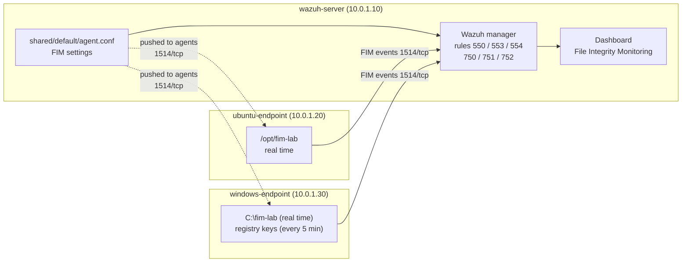

# Wazuh File Integrity Monitoring (Ubuntu and Windows)

This guide turns on real-time **File Integrity Monitoring (FIM)** for a lab folder on the Ubuntu endpoint, and for a folder and registry keys on a Windows endpoint. Wazuh then alerts when a file is created, changed or deleted, and when a watched registry value changes. The settings are pushed from the Wazuh server to both agents.

- **FIM** keeps a record (size, owner, permissions, hashes) of watched files and alerts on every difference.
- A **hash** is a fingerprint of a file's content. FIM stores MD5, SHA-1 and SHA-256 hashes, which later labs use for VirusTotal and MISP lookups.

What this lab sets up:

| Part | What | Where |
|---|---|---|
| [A](#part-a-install-the-wazuh-agent-on-windows) | Install the Wazuh agent on Windows | windows-endpoint |
| [B](#part-b-push-the-fim-settings-from-the-server) | FIM settings for Linux and Windows, pushed from the server | wazuh-server |

## Table of contents

1. [Architecture](#1-architecture)
2. [What you need](#2-what-you-need)
3. [Installation steps](#3-installation-steps)
4. [Test](#4-test)
5. [Common problems](#5-common-problems)
6. [Next steps](#6-next-steps)

Files in this folder:

| File | Copy to | Used in |
|---|---|---|
| [`configs/agent.conf`](configs/agent.conf) | wazuh-server: `/var/ossec/etc/shared/default/agent.conf` | [Step B1](#part-b-push-the-fim-settings-from-the-server) |

---

## 1. Architecture



- **agent.conf** is a central config file on the server. Every agent in the `default` group downloads it, so you set FIM in one place.
- Files are watched in **real time**. The registry cannot be watched live, so it is checked by a scheduled scan (here every 5 minutes).

---

## 2. What you need

| Already built | Used for |
|---|---|
| [01-wazuh-soc-lab](../01-wazuh-soc-lab/) | Wazuh server and the agent `ubuntu-endpoint` |

| VM | Role | Private IP | CPU / RAM / disk |
|---|---|---|---|
| wazuh-server | Wazuh manager | 10.0.1.10 | As in lab 01 |
| ubuntu-endpoint | Ubuntu agent | 10.0.1.20 | As in lab 01 |
| windows-endpoint | Windows Server 2019/2022 with the Wazuh agent | 10.0.1.30 | 2 vCPU / 4 GB / 40 GB (assumption) |

| Placeholder | What it is | Example | Where to find it |
|---|---|---|---|
| `<VM_USER>` | The sudo user on the Ubuntu VMs | `ubuntu` | The user you log in with |
| `<WAZUH_SERVER_IP>` | Private IP of wazuh-server | `10.0.1.10` | `hostname -I` on wazuh-server |
| `<WAZUH_VERSION>` | Wazuh version on the server | `4.14.8` | `sudo /var/ossec/bin/wazuh-control info` on wazuh-server |

---

## 3. Installation steps

### Part A. Install the Wazuh agent on Windows

**Run on:** windows-endpoint, in **PowerShell as administrator**

```powershell
$WazuhVersion = "4.14.8"       # CHANGE THIS: <WAZUH_VERSION>
$WazuhServer  = "10.0.1.10"    # CHANGE THIS: <WAZUH_SERVER_IP>
Invoke-WebRequest -Uri "https://packages.wazuh.com/4.x/windows/wazuh-agent-$WazuhVersion-1.msi" -OutFile "$env:TEMP\wazuh-agent.msi"
msiexec.exe /i "$env:TEMP\wazuh-agent.msi" /q WAZUH_MANAGER="$WazuhServer" WAZUH_AGENT_NAME="windows-endpoint" | Out-Null
Start-Service WazuhSvc
```

- `Invoke-WebRequest` downloads the agent installer of exactly the server's version (official MSI).
- `msiexec /q` installs it silently with the manager address and the agent name. `| Out-Null` waits until it finishes.

**Check:**

```powershell
Get-Service WazuhSvc
```

`Status` = `Running`. On wazuh-server, `sudo /var/ossec/bin/agent_control -l` lists `windows-endpoint` as `Active`.

### Part B. Push the FIM settings from the server

**Run on:** wazuh-server, as `<VM_USER>`

**B1. Write the central agent config:**

```bash
sudo tee /var/ossec/etc/shared/default/agent.conf > /dev/null <<'EOF'
<!-- Lab 02: FIM settings for every agent in the "default" group -->
<agent_config os="Linux">
  <syscheck>
    <!-- watch the lab folder in real time, keep a text diff of changes -->
    <directories check_all="yes" realtime="yes" report_changes="yes">/opt/fim-lab</directories>
  </syscheck>
</agent_config>

<agent_config os="Windows">
  <syscheck>
    <!-- registry is checked by scheduled scans; every 300 s for the lab -->
    <frequency>300</frequency>
    <directories check_all="yes" realtime="yes" report_changes="yes">C:\fim-lab</directories>
    <windows_registry arch="both">HKEY_LOCAL_MACHINE\Software\Microsoft\Windows\CurrentVersion\Run</windows_registry>
    <windows_registry arch="both">HKEY_LOCAL_MACHINE\Software\FimLab</windows_registry>
  </syscheck>
</agent_config>
EOF
sudo /var/ossec/bin/verify-agent-conf -f /var/ossec/etc/shared/default/agent.conf
```

- `os="Linux"` / `os="Windows"`: each agent only uses the block for its own system.
- `realtime="yes"`: changes are reported within seconds. `report_changes="yes"`: the alert shows what changed in a text file.
- `windows_registry`: watch these registry keys. The **Run** key starts programs at logon, a common place for malware. `FimLab` is a test key.
- `verify-agent-conf` checks the file before agents download it.

**Check:**

```text
verify-agent-conf: Verifying [/var/ossec/etc/shared/default/agent.conf]
verify-agent-conf: OK
```

**B2. Create the test folders and key, and restart the agents.**

On ubuntu-endpoint:

```bash
sudo mkdir -p /opt/fim-lab
sudo systemctl restart wazuh-agent
```

On windows-endpoint (PowerShell as administrator):

```powershell
New-Item -ItemType Directory -Path C:\fim-lab -Force | Out-Null
New-Item -Path HKLM:\Software\FimLab -Force | Out-Null
Restart-Service WazuhSvc
```

**Check** (on wazuh-server, about one minute later):

```bash
sudo /var/ossec/bin/agent_groups -S -i 001
```

```text
Agent '001' is synchronized.
```

On ubuntu-endpoint, `sudo grep "fim-lab" /var/ossec/logs/ossec.log | tail -n 1` shows similar to `(6003): Monitoring path: '/opt/fim-lab', with options '... | realtime'.`

---

## 4. Test

**4.1 Ubuntu.** Run on ubuntu-endpoint:

```bash
echo "first line" | sudo tee /opt/fim-lab/test.txt
sleep 5
echo "second line" | sudo tee -a /opt/fim-lab/test.txt
sleep 5
sudo rm /opt/fim-lab/test.txt
```

**4.2 Windows.** Run on windows-endpoint (PowerShell as administrator):

```powershell
Set-Content -Path C:\fim-lab\test.txt -Value 'first line'
New-ItemProperty -Path HKLM:\Software\FimLab -Name LabValue -Value 'first' -PropertyType String -Force | Out-Null
```

Wait 5 minutes (the next registry scan), then remove both: `Remove-Item C:\fim-lab\test.txt` and `Remove-ItemProperty HKLM:\Software\FimLab -Name LabValue`.

**See it in the dashboard:** ☰ → **Endpoint security** → **File Integrity Monitoring** → **Events** tab, time range **Last 15 minutes**.

| Action | Rule | Description |
|---|---|---|
| File created | 554 | File added to the system. |
| File changed | 550 | Integrity checksum changed. (the alert's `syscheck.diff` shows `second line`) |
| File deleted | 553 | File deleted. |
| Registry value created | 752 | Registry Value Entry Added to the System |
| Registry value deleted | 751 | Registry Value Entry Deleted. |

**The setup works when** all five events appear for the right agent.

---

## 5. Common problems

| Problem | Fix |
|---|---|
| `verify-agent-conf` reports an error | A typing mistake in the XML. Fix the line it names and run B1 again |
| No FIM event for `/opt/fim-lab` | The agent did not get the new config yet (B2 check), or the folder did not exist when the agent started. Create it and restart the agent |
| A file in a default folder (for example `/etc`) is changed but no alert comes | Default folders are only scanned every 12 hours (`frequency 43200`). Only folders with `realtime="yes"` are reported at once |
| No registry alert | Registry keys are not real time. Wait for the next scan (300 s here) |

---

## 6. Next steps

- **All FIM options** (who-data, ignore lists, scan times): [File Integrity Monitoring](https://documentation.wazuh.com/current/user-manual/capabilities/file-integrity/index.html)
- **Check file hashes with VirusTotal**: [lab 04](../04-wazuh-virustotal-lab/)
- **Linux command monitoring**: [lab 03](../03-wazuh-command-monitoring-lab/)
