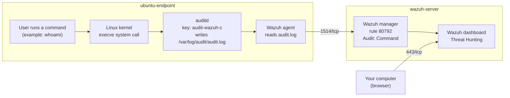

# Linux Command Monitoring with Wazuh and auditd

This guide sets up **command monitoring** on an Ubuntu endpoint that already has a Wazuh agent. When it is done, every command a logged-in user runs (for example `whoami`, `ps`, `sudo cat /etc/shadow`) shows up as an event in the Wazuh dashboard. You can see who ran it, with which arguments, and from which folder.

It uses **auditd**, the Linux audit service, which records what the Linux kernel does. Nothing new is installed on the Wazuh server.

## Table of contents

1. [Architecture](#1-architecture)
2. [What you need](#2-what-you-need)
3. [Firewall](#3-firewall)
4. [Setup steps](#4-setup-steps)
5. [Test](#5-test)
6. [Common problems](#6-common-problems)
7. [Next steps](#7-next-steps)

Files in this folder:

| File | What it is |
|---|---|
| `README.md` | This guide |
| [`configs/wazuh-commands.rules`](configs/wazuh-commands.rules) | The audit rules file used in [Step 2](#step-2-add-the-audit-rules) |
| `.gitignore` | Stops passwords and keys from being uploaded to GitHub |

---

## 1. Architecture



- **execve** is the system call (a request to the Linux kernel) that starts every program. Recording it records every command.
- **audit key** is a tag that auditd adds to each event. The Wazuh server already knows the key `audit-wazuh-c` means "a command was run".

---

## 2. What you need

| VM | Role | Already done |
|---|---|---|
| wazuh-server | Wazuh 4.14 manager, indexer and dashboard | Installed and working ([lab 01](../01-wazuh-soc-lab/)) |
| ubuntu-endpoint | Ubuntu 22.04 with the Wazuh agent | Agent installed and **Active** |

Assumptions:

1. The agent on ubuntu-endpoint is named `ubuntu-endpoint`. If yours has another name, use it in the dashboard searches.
2. You connect to ubuntu-endpoint as a normal user (UID 1000 or higher). If you log in as `root`, see [Common problems](#6-common-problems).
3. Any VM size that runs the Wazuh agent works. auditd needs no extra resources for a lab.

| Placeholder | What it is | Example | Where to find it |
|---|---|---|---|
| `<VM_USER>` | The user you log in with on ubuntu-endpoint | `ubuntu` | AWS and Oracle Cloud: `ubuntu`. Azure and Google Cloud: the name you chose |
| `<ENDPOINT_PUBLIC_IP>` | Public IP of ubuntu-endpoint | `198.51.100.20` | Cloud console, VM details |
| `<WAZUH_SERVER_PUBLIC_IP>` | Public IP of wazuh-server | `198.51.100.10` | Cloud console, VM details |

---

## 3. Firewall

No new ports. This setup uses the connections you already have:

| From | To | Port | Used for |
|---|---|---|---|
| ubuntu-endpoint | wazuh-server | 1514/tcp | Agent sends events |
| Your computer | wazuh-server | 443/tcp | Dashboard in the browser |

---

## 4. Setup steps

### Step 1. Install auditd

**Run on:** ubuntu-endpoint, as `<VM_USER>`

```bash
sudo apt-get update
sudo apt-get install -y auditd
sudo systemctl enable --now auditd
```

- Line 1 refreshes the package list.
- Line 2 installs auditd. If it is already installed (for example from lab 02), it says `auditd is already the newest version`.
- Line 3 starts auditd now and at every boot.

**Check:**

```bash
systemctl is-active auditd
```

```text
active
```

### Step 2. Add the audit rules

**Run on:** ubuntu-endpoint, as `<VM_USER>`

This creates the rules file. auditd loads every `.rules` file in `/etc/audit/rules.d/` at each start, so the rules also stay after a reboot.

```bash
sudo tee /etc/audit/rules.d/wazuh-commands.rules > /dev/null <<'EOF'
## File:    /etc/audit/rules.d/wazuh-commands.rules
## Machine: ubuntu-endpoint
## Purpose: record every program started (execve system call) by a logged-in
##          user, including commands run with sudo. Wazuh turns the key
##          "audit-wazuh-c" into the alert "Audit: Command" (rule 80792).
##
## -a always,exit       always write an event when the system call finishes
## -F arch=b64 / b32    64-bit and 32-bit programs (both are needed)
## -S execve            the system call Linux uses to start a program
## -F auid>=1000        only commands from logged-in human users (UID 1000 and up)
## -F auid!=-1          skip system services that have no login user
## -k audit-wazuh-c     tag (key) that Wazuh looks up in /var/ossec/etc/lists/audit-keys
##
## CHANGE THIS only if you log in as root: replace auid>=1000 with auid>=0
-a always,exit -F arch=b64 -S execve -F auid>=1000 -F auid!=-1 -k audit-wazuh-c
-a always,exit -F arch=b32 -S execve -F auid>=1000 -F auid!=-1 -k audit-wazuh-c
EOF
sudo augenrules --load
```

- `tee` writes the text between the two `EOF` lines into the file.
- `augenrules --load` loads all rules files into auditd now.
- **auid** (audit user ID) is the user who logged in. It stays the same after `sudo`, so `sudo` commands are still linked to the real person.

**Check:**

```bash
sudo auditctl -l | grep audit-wazuh-c
```

Similar to:

```text
-a always,exit -F arch=b64 -S execve -F auid>=1000 -F auid!=-1 -F key=audit-wazuh-c
-a always,exit -F arch=b32 -S execve -F auid>=1000 -F auid!=-1 -F key=audit-wazuh-c
```

Two lines = the rules are active.

### Step 3. Make the Wazuh agent read the audit log

**Run on:** ubuntu-endpoint, as `<VM_USER>`

**3.1 Check whether the agent already reads it.** If auditd was installed before the Wazuh agent, the agent added this setting itself.

```bash
sudo grep -c "/var/log/audit/audit.log" /var/ossec/etc/ossec.conf
```

- `1` (or more) = already set. **Skip 3.2** and go to 3.3.
- `0` = not set. Do 3.2.

**3.2 Add the setting** (only if 3.1 printed `0`):

```bash
sudo tee -a /var/ossec/etc/ossec.conf > /dev/null <<'EOF'

<ossec_config>
  <!-- Command monitoring: read auditd events (lab 03) -->
  <localfile>
    <log_format>audit</log_format>
    <location>/var/log/audit/audit.log</location>
  </localfile>
</ossec_config>
EOF
```

- `tee -a` adds the block to the **end** of the agent's config file. It does not change anything already in the file.
- Wazuh allows more than one `<ossec_config>` block in `ossec.conf`.
- `log_format audit` tells the agent to join the lines of one audit event into one event.

**3.3 Restart the agent:**

```bash
sudo systemctl restart wazuh-agent
```

**Check:**

```bash
sudo grep "audit.log" /var/ossec/logs/ossec.log | tail -n 1
```

Similar to:

```text
2026/10/02 15:40:12 wazuh-logcollector: INFO: (1950): Analyzing file: '/var/log/audit/audit.log'.
```

If you see `ERROR` instead, see [Common problems](#6-common-problems).

### Step 4. Confirm the server is ready (no changes)

**Run on:** wazuh-server, as `<VM_USER>`

The Wazuh server already has the rule (80792) and the key list. This step only confirms it.

```bash
sudo cat /var/ossec/etc/lists/audit-keys
sudo grep "audit-keys" /var/ossec/etc/ossec.conf
```

**Check:** similar to:

```text
audit-wazuh-w:write
audit-wazuh-r:read
audit-wazuh-a:attribute
audit-wazuh-x:execute
audit-wazuh-c:command
    <list>etc/lists/audit-keys</list>
```

- The line `audit-wazuh-c:command` maps our key to "command".
- `<list>etc/lists/audit-keys</list>` means the server loads this list.

---

## 5. Test

**5.1 Run some commands.** In an SSH session to ubuntu-endpoint (`ssh <VM_USER>@<ENDPOINT_PUBLIC_IP>`), run:

```bash
whoami
id
uname -a
ps aux > /dev/null
ss -tuln > /dev/null
last -n 3
sudo cat /etc/shadow > /dev/null
```

These are harmless, but they are the kind of commands an attacker runs after breaking in: user discovery (`whoami`, `id`), system and process discovery (`uname`, `ps`), network discovery (`ss`), login history (`last`) and reading password hashes with root rights (`sudo cat /etc/shadow`). `> /dev/null` hides the output.

**5.2 See them in the dashboard.**

1. Open `https://<WAZUH_SERVER_PUBLIC_IP>` and log in.
2. Go to ☰ → **Threat intelligence** → **Threat Hunting** → **Events** tab.
3. Set the time range (top right) to **Last 15 minutes**.
4. Search:

```text
agent.name:ubuntu-endpoint and rule.id:80792
```

Every command is one event with the description `Audit: Command: /usr/bin/whoami.` (the path changes per command). To find one command, search for example `data.audit.command:cat`.

Open an event (the expand icon at the start of the row) to see its fields:

| Field | Meaning | Example for `sudo cat /etc/shadow` |
|---|---|---|
| `data.audit.command` | Program name | `cat` |
| `data.audit.exe` | Full path of the program | `/usr/bin/cat` |
| `data.audit.execve.a0`, `a1`, ... | The command and each argument | `cat`, `/etc/shadow` |
| `data.audit.auid` | Who logged in (login user ID) | `1000` |
| `data.audit.euid` | Rights the command ran with (`0` = root) | `0` |
| `data.audit.cwd` | Folder the command ran in | `/home/ubuntu` |
| `data.audit.pid` / `data.audit.ppid` | Process ID / parent process ID | `2345` / `2344` |
| `data.audit.tty` | Terminal (`pts0` = SSH session) | `pts0` |

- `auid` 1000 with `euid` 0 means: user 1000 ran it with root rights (through `sudo`). You see one event for `sudo` and one for `cat`.
- To find the **parent process**, search `data.audit.pid:<the ppid value>`.
- You will also see commands you did not type, such as `sh`, `sed` or `sort`. They come from scripts that run when you log in (for example the login welcome message). A command in this list is not an attack by itself.

**5.3 Same check in the terminal (optional).**

**Run on:** wazuh-server, as `<VM_USER>`

```bash
sudo apt-get install -y jq
sudo tail -n 2000 /var/ossec/logs/alerts/alerts.json | jq -c 'select(.rule.id=="80792") | {command: .data.audit.command, args: .data.audit.execve, auid: .data.audit.auid, euid: .data.audit.euid}' | tail -n 5
```

- `jq` is a tool that reads JSON. This prints the last 5 command events, one per line.

Similar to:

```text
{"command":"ss","args":{"a0":"ss","a1":"-tuln"},"auid":"1000","euid":"1000"}
{"command":"last","args":{"a0":"last","a1":"-n","a2":"3"},"auid":"1000","euid":"1000"}
{"command":"sudo","args":{"a0":"sudo","a1":"cat","a2":"/etc/shadow"},"auid":"1000","euid":"0"}
{"command":"cat","args":{"a0":"cat","a1":"/etc/shadow"},"auid":"1000","euid":"0"}
```

**The setup works when** the commands from 5.1 appear with rule `80792` and the right arguments.

---

## 6. Common problems

| Problem | Fix |
|---|---|
| `auditctl -l` does not show the two rules | Check the file name ends in `.rules`: `ls /etc/audit/rules.d/`. Then run `sudo augenrules --load` again |
| Rules are gone after a reboot | They were added to `/etc/audit/audit.rules` instead of `/etc/audit/rules.d/`. auditd rebuilds `audit.rules` from `rules.d/` at each start. Redo [Step 2](#step-2-add-the-audit-rules) |
| No events in the dashboard | 1) Agent is **Active**: ☰ → **Agents management** → **Summary**. 2) Step 3 check shows `Analyzing file`. 3) The time range covers the time you ran the commands |
| No events and you log in as `root` | Root's login ID is 0, so `auid>=1000` skips it. In the rules file, change `auid>=1000` to `auid>=0`, then `sudo augenrules --load`. You will also see root's scheduled (cron) jobs |
| An argument shows as a long string like `2F746D702F612062` | auditd writes arguments that contain spaces or special characters in hex. Decode it: `echo 2F746D702F612062 \| xxd -r -p; echo` |
| Lab 02 who-data stopped after Step 2 | `augenrules --load` replaces all loaded rules, including Wazuh's FIM rules. Restart the agent (Step 3.3): it adds them back |

---

## 7. Next steps

- **Alert on dangerous programs** (for example `nc`, `tcpdump`) with a higher alert level, using a CDB list: [Monitoring execution of malicious commands](https://documentation.wazuh.com/current/proof-of-concept-guide/audit-commands-run-by-user.html)
- **Monitor commands run as root** (rule with `euid=0`): [Monitoring commands run as root](https://documentation.wazuh.com/current/user-manual/capabilities/system-calls-monitoring/use-cases/monitoring-commands-run-as-root.html)
- **Your own audit keys** (file access, other system calls): [Audit configuration](https://documentation.wazuh.com/current/user-manual/capabilities/system-calls-monitoring/audit-configuration.html)
- **Custom rules** for user creation, privilege escalation, reconnaissance, log tampering and persistence: [Custom rules](https://documentation.wazuh.com/current/user-manual/ruleset/rules/custom.html) and [CDB lists](https://documentation.wazuh.com/current/user-manual/ruleset/cdb-list.html)
