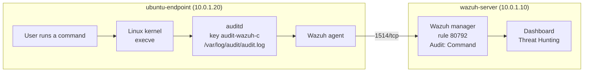

# Linux Command Monitoring with Wazuh and auditd

This guide makes every command a logged-in user runs on the Ubuntu endpoint visible in the Wazuh dashboard. It uses **auditd**, the Linux audit service, as described in the official Wazuh documentation. Nothing changes on the Wazuh server.

- **auditd** records what the Linux kernel does, for example every program that is started.
- **execve** is the system call (request to the kernel) that starts a program. Recording it records every command.
- An **audit key** is a tag added to each event. Wazuh already knows the key `audit-wazuh-c` means "a command was run".

What this lab sets up:

| Part | What | Where |
|---|---|---|
| [A](#part-a-install-auditd-and-add-the-command-rules) | Install auditd and add the command rules | ubuntu-endpoint |
| [B](#part-b-send-the-audit-log-to-wazuh) | Send the audit log to Wazuh | ubuntu-endpoint |

## Table of contents

1. [Architecture](#1-architecture)
2. [What you need](#2-what-you-need)
3. [Installation steps](#3-installation-steps)
4. [Test](#4-test)
5. [Common problems](#5-common-problems)
6. [Next steps](#6-next-steps)

---

## 1. Architecture



---

## 2. What you need

| Already built | Used for |
|---|---|
| [01-wazuh-soc-lab](../01-wazuh-soc-lab/) | Wazuh server and the agent `ubuntu-endpoint` |

| VM | Role | Private IP | CPU / RAM / disk |
|---|---|---|---|
| wazuh-server | Wazuh manager | 10.0.1.10 | As in lab 01 |
| ubuntu-endpoint | Ubuntu 24.04 agent with auditd | 10.0.1.20 | As in lab 01 |

| Placeholder | What it is | Example | Where to find it |
|---|---|---|---|
| `<VM_USER>` | The user you log in with | `ubuntu` | Your login user (UID 1000 on cloud images: `id -u`) |
| `<WAZUH_SERVER_IP>` | Private IP of wazuh-server | `10.0.1.10` | `hostname -I` on wazuh-server |

---

## 3. Installation steps

### Part A. Install auditd and add the command rules

**Run on:** ubuntu-endpoint, as `<VM_USER>`

**A1. Install auditd:**

```bash
sudo apt-get update
sudo apt-get install -y auditd
sudo systemctl enable --now auditd
```

**A2. Add the rules that record every command of logged-in users:**

```bash
sudo tee /etc/audit/rules.d/wazuh-commands.rules > /dev/null <<'EOF'
## Lab 03: record every program started by a logged-in user (UID 1000 and up)
-a always,exit -F arch=b64 -S execve -F auid>=1000 -F auid!=-1 -k audit-wazuh-c
-a always,exit -F arch=b32 -S execve -F auid>=1000 -F auid!=-1 -k audit-wazuh-c
EOF
sudo augenrules --load
```

- `-S execve` = record program starts. `arch=b64` and `b32` = 64-bit and 32-bit programs.
- `auid` (audit user ID) is the user who logged in. It stays the same after `sudo`, so commands run with sudo are still linked to the real person. `auid!=-1` skips system services.
- `-k audit-wazuh-c` = the key Wazuh looks for.
- The Wazuh docs add these rules to `/etc/audit/audit.rules`. On Ubuntu that file is rebuilt from `/etc/audit/rules.d/` every time auditd starts, so rules added there disappear after a reboot. This guide uses `rules.d/` and `augenrules --load` instead.

**Check:**

```bash
sudo auditctl -l | grep audit-wazuh-c
```

Similar to:

```text
-a always,exit -F arch=b64 -S execve -F auid>=1000 -F auid!=-1 -F key=audit-wazuh-c
-a always,exit -F arch=b32 -S execve -F auid>=1000 -F auid!=-1 -F key=audit-wazuh-c
```

### Part B. Send the audit log to Wazuh

**Run on:** ubuntu-endpoint, as `<VM_USER>`

**B1. Check whether the agent already reads the audit log** (it does if auditd was installed before the agent):

```bash
sudo grep -c "/var/log/audit/audit.log" /var/ossec/etc/ossec.conf
```

`1` or more = already set, skip B2. `0` = do B2.

**B2. Add the audit log to the agent config** (official block, added at the end of the file):

```bash
sudo tee -a /var/ossec/etc/ossec.conf > /dev/null <<'EOF'

<ossec_config>
  <localfile>
    <log_format>audit</log_format>
    <location>/var/log/audit/audit.log</location>
  </localfile>
</ossec_config>
EOF
```

- `tee -a` adds the block to the end of the file, without changing anything already in it. Wazuh allows more than one `<ossec_config>` block.

**B3. Restart the agent:**

```bash
sudo systemctl restart wazuh-agent
```

**Check:**

```bash
sudo grep "audit.log" /var/ossec/logs/ossec.log | tail -n 1
```

Similar to:

```text
2026/10/03 11:40:12 wazuh-logcollector: INFO: (1950): Analyzing file: '/var/log/audit/audit.log'.
```

The Wazuh server needs no change. Its default list `/var/ossec/etc/lists/audit-keys` already maps `audit-wazuh-c` to "command" (rule 80792).

---

## 4. Test

**Run on:** ubuntu-endpoint, as `<VM_USER>`

```bash
whoami
id
uname -a
sudo cat /etc/shadow > /dev/null
```

**See it in the dashboard:** ☰ → **Threat intelligence** → **Threat Hunting** → **Events** tab, time range **Last 15 minutes**, search:

```text
agent.name:ubuntu-endpoint and rule.id:80792
```

Each command is one alert, **Audit: Command: /usr/bin/whoami.** (the path changes per command). Open one:

| Field | Meaning | Example (`sudo cat /etc/shadow`) |
|---|---|---|
| `data.audit.command` | Program name | `cat` |
| `data.audit.execve.a0`, `a1`, ... | Command and arguments | `cat`, `/etc/shadow` |
| `data.audit.auid` | Who logged in | `1000` |
| `data.audit.euid` | Rights it ran with (`0` = root) | `0` |
| `data.audit.cwd` | Folder it ran in | `/home/ubuntu` |
| `data.audit.ppid` | Parent process ID | `2344` |

You also see commands you did not type (for example `sh`, `sed`), started by scripts that run at login. A command in this list is not an attack by itself.

**The setup works when** your test commands appear with rule 80792.

---

## 5. Common problems

| Problem | Fix |
|---|---|
| `auditctl -l` does not show the rules | The file name must end in `.rules`. Run `sudo augenrules --load` again |
| Rules gone after a reboot | They were added to `/etc/audit/audit.rules` instead of `/etc/audit/rules.d/`. Redo A2 |
| No events | The B3 check must show `Analyzing file`. If you log in as `root` (UID 0), change `auid>=1000` to `auid>=0` in the rules file and reload |
| Too many events | Every command of every user is recorded. Narrow the rules, for example with `-F dir=/usr/bin` |

---

## 6. Next steps

- **Alert on dangerous programs** (for example `nc`) with a CDB list: [Monitoring execution of malicious commands](https://documentation.wazuh.com/current/proof-of-concept-guide/audit-commands-run-by-user.html)
- **Commands run as root**: [Monitoring commands run as root](https://documentation.wazuh.com/current/user-manual/capabilities/system-calls-monitoring/use-cases/monitoring-commands-run-as-root.html)
- **Audit keys and system call monitoring**: [Audit configuration](https://documentation.wazuh.com/current/user-manual/capabilities/system-calls-monitoring/audit-configuration.html)
