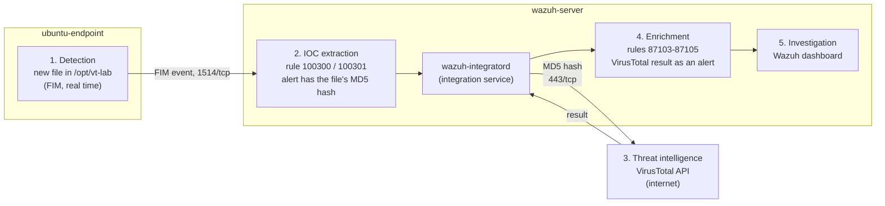

# VirusTotal Threat Intelligence with Wazuh

This guide connects **VirusTotal** to a Wazuh server that is already installed. When a new file appears in a watched folder on the Ubuntu endpoint, Wazuh sends the file's hash to VirusTotal and shows the answer as an alert. The answer says how many antivirus engines detect the file, or that VirusTotal has never seen it.

- **VirusTotal** is a free online service that checks files with about 70 antivirus engines and keeps the results.
- A **hash** (here MD5) is a short fingerprint of a file's content. The same content always gives the same hash. **Only the hash is sent, never the file.**
- An **IOC** (indicator of compromise) is a clue that something may be malicious, such as a known bad file hash.

## Table of contents

1. [Architecture](#1-architecture)
2. [What you need](#2-what-you-need)
3. [Firewall](#3-firewall)
4. [Setup steps](#4-setup-steps)
5. [Test](#5-test)
6. [Common problems](#6-common-problems)
7. [Next steps](#7-next-steps)

---

## 1. Architecture

The numbers follow the SOC workflow: detection → IOC extraction → threat intelligence → enrichment → investigation.



- **FIM** (File Integrity Monitoring) is the Wazuh agent feature that sees files being added, changed or deleted.
- **wazuh-integratord** is the part of the Wazuh server that talks to outside services such as VirusTotal.

---

## 2. What you need

| VM | Role | Already done |
|---|---|---|
| wazuh-server | Wazuh 4.14 manager, indexer and dashboard | Installed and working ([lab 01](../01-wazuh-soc-lab/)) |
| ubuntu-endpoint | Ubuntu 22.04 with the Wazuh agent | Agent installed and **Active** |

You also need a **free VirusTotal account** (sign up at [virustotal.com](https://www.virustotal.com/)).

Assumptions:

1. The agent is named `ubuntu-endpoint`.
2. The watched folder is `/opt/vt-lab`. It is a new, empty folder only for this lab, so VirusTotal is not asked about hundreds of system files.
3. The custom rules use IDs `100300` and `100301`. Lab 01 already uses `100200` and `100201`, the IDs in Wazuh's own example.

| Placeholder | What it is | Example | Where to find it |
|---|---|---|---|
| `<VM_USER>` | The user you log in with on the VMs | `ubuntu` | AWS and Oracle Cloud: `ubuntu`. Azure and Google Cloud: the name you chose |
| `<WAZUH_SERVER_PUBLIC_IP>` | Public IP of wazuh-server | `198.51.100.10` | Cloud console, VM details |
| `<ENDPOINT_PUBLIC_IP>` | Public IP of ubuntu-endpoint | `198.51.100.20` | Cloud console, VM details |
| `<VIRUSTOTAL_API_KEY>` | Your personal VirusTotal API key (64 characters) | `a1b2c3...` | Sign in to VirusTotal → your profile icon (top right) → **API key**, or open [virustotal.com/gui/my-apikey](https://www.virustotal.com/gui/my-apikey) |

**Keep the API key secret.** Save it in a password manager. Never put it in this repository, a screenshot or a LinkedIn post.

The free (public) API key allows **4 lookups per minute and 500 per day**, and may not be used for commercial work. A lab is fine.

---

## 3. Firewall

No new inbound ports. One outbound connection is new:

| From | To | Port | Used for |
|---|---|---|---|
| ubuntu-endpoint | wazuh-server | 1514/tcp | Agent sends FIM events (already open) |
| wazuh-server | www.virustotal.com (internet) | 443/tcp **outbound** | Hash lookups |
| Your computer | wazuh-server | 443/tcp | Dashboard (already open) |

Cloud providers and ufw allow outbound traffic by default. Change nothing unless your cloud firewall blocks outbound traffic. The check in Step 3 confirms it.

---

## 4. Setup steps

### Step 1. Watch the lab folder on the endpoint

**Run on:** ubuntu-endpoint, as `<VM_USER>`

**1.1 Create the folder:**

```bash
sudo mkdir -p /opt/vt-lab
```

**1.2 Tell the agent to watch it in real time:**

```bash
sudo tee -a /var/ossec/etc/ossec.conf > /dev/null <<'EOF'

<ossec_config>
  <!-- Lab 04: watch /opt/vt-lab in real time; new and changed files are checked with VirusTotal -->
  <syscheck>
    <directories check_all="yes" realtime="yes">/opt/vt-lab</directories>
  </syscheck>
</ossec_config>
EOF
sudo systemctl restart wazuh-agent
```

- `tee -a` adds the block to the **end** of the agent's config file. Nothing already in the file changes. Wazuh allows more than one `<ossec_config>` block.
- `realtime="yes"` reports a new file within seconds instead of at the next scheduled scan.
- `check_all="yes"` records size, owner, permissions and the hashes (MD5, SHA-1, SHA-256).

**Check** (wait about 2 minutes after the restart):

```bash
sudo grep "vt-lab" /var/ossec/logs/ossec.log | tail -n 1
sudo grep "(6009)" /var/ossec/logs/ossec.log | tail -n 1
```

Similar to:

```text
2026/10/02 16:05:10 wazuh-syscheckd: INFO: (6003): Monitoring path: '/opt/vt-lab', with options 'size | permissions | owner | group | mtime | inode | hash_md5 | hash_sha1 | hash_sha256 | realtime'.
2026/10/02 16:06:31 wazuh-syscheckd: INFO: (6009): File integrity monitoring scan ended.
```

- Line 1 ends in `realtime` = the folder is watched.
- Line 2 (`scan ended`) = the first scan is done. Changes are reported only after this line appears. If it is missing, wait a minute and run the command again.

### Step 2. Add the rules that pick which files go to VirusTotal

**Run on:** wazuh-server, as `<VM_USER>`

These two rules match FIM alerts for files **added** (base rule 554) or **changed** (base rule 550) inside `/opt/vt-lab`. Only alerts from these rules are sent to VirusTotal in Step 3.

```bash
sudo tee -a /var/ossec/etc/rules/local_rules.xml > /dev/null <<'EOF'

<!-- Lab 04: files added or changed in /opt/vt-lab are checked with VirusTotal -->
<group name="syscheck,virustotal_lab,">
  <rule id="100300" level="7">
    <if_sid>554</if_sid>
    <field name="file">^/opt/vt-lab/</field>
    <description>File added to /opt/vt-lab (sent to VirusTotal).</description>
  </rule>
  <rule id="100301" level="7">
    <if_sid>550</if_sid>
    <field name="file">^/opt/vt-lab/</field>
    <description>File changed in /opt/vt-lab (sent to VirusTotal).</description>
  </rule>
</group>
EOF
```

- `local_rules.xml` is the file for your own rules. `tee -a` adds the new rules after the ones already there (for example lab 01's).
- `if_sid` = "only when this base rule fired first". `field name="file"` = the file path must start with `/opt/vt-lab/`.

The check is in Step 3, after the manager restarts.

### Step 3. Add the VirusTotal integration

**Run on:** wazuh-server, as `<VM_USER>`. Run all of 3.1 to 3.3 in the **same** terminal.

**3.1 Type in the API key and test it:**

```bash
read -rsp "Paste your VirusTotal API key and press Enter: " VT_KEY; echo
curl -s -o /dev/null -w "%{http_code}\n" -H "x-apikey: ${VT_KEY}" https://www.virustotal.com/api/v3/files/44d88612fea8a8f36de82e1278abb02f
```

- `read -s` stores the key in the variable `VT_KEY` without showing it on screen or saving it in the command history.
- `curl` asks VirusTotal about one known hash (the EICAR test file) using your key. This uses 1 of your lookups.

**Check:** the output is `200`.

- `401` = the key is wrong. Run 3.1 again.
- Nothing, or `000` = the server cannot reach the internet on port 443. Check your cloud firewall's outbound rules.

**3.2 Add the integration to the server config:**

```bash
sudo tee -a /var/ossec/etc/ossec.conf > /dev/null <<EOF

<ossec_config>
  <!-- Lab 04: send alerts from rules 100300 and 100301 to VirusTotal -->
  <integration>
    <name>virustotal</name>
    <api_key>${VT_KEY}</api_key>
    <rule_id>100300,100301</rule_id>
    <alert_format>json</alert_format>
  </integration>
</ossec_config>
EOF
unset VT_KEY
```

- `${VT_KEY}` is replaced by your key from 3.1, so the key never appears in this guide or your history.
- `rule_id` = only alerts from these rules are sent. This keeps you under the free limit of 4 lookups per minute.
- `alert_format json` is required by the VirusTotal integration.
- `unset` removes the key from the terminal's memory.

**Check:** the key was written (the output must be `0`):

```bash
sudo grep -c "<api_key></api_key>" /var/ossec/etc/ossec.conf
```

`1` = the key was empty because 3.1 ran in another terminal. Fix it as in [Common problems](#6-common-problems) (row "Check credentials").

The key is now stored in `/var/ossec/etc/ossec.conf`. **Never upload that file to GitHub.**

**3.3 Restart the Wazuh manager:**

```bash
sudo systemctl restart wazuh-manager
```

**Check:**

```bash
sudo /var/ossec/bin/wazuh-control status | grep -E "analysisd|integratord"
```

Similar to:

```text
wazuh-integratord is running...
wazuh-analysisd is running...
```

- `wazuh-analysisd is running` = the new rules from Step 2 loaded without errors.
- `wazuh-integratord is running` = the VirusTotal integration is active.

---

## 5. Test

The test uses the **EICAR test file**: a harmless text file that every antivirus engine detects on purpose, so you can test without real malware.

**5.1 Put the test file in the watched folder.**

**Run on:** ubuntu-endpoint, as `<VM_USER>`

```bash
curl -sSLo /tmp/eicar.com https://secure.eicar.org/eicar.com
md5sum /tmp/eicar.com
sudo mv /tmp/eicar.com /opt/vt-lab/eicar.com
```

- `curl` downloads the file to `/tmp` first.
- `md5sum` prints its hash: `44d88612fea8a8f36de82e1278abb02f  /tmp/eicar.com`.
- `mv` then moves the complete file into the folder in one step. If you download straight into the folder, Wazuh may first see an empty file and send that hash too, which wastes a lookup.

**5.2 See the result in the dashboard** (wait about 1 minute):

1. Open `https://<WAZUH_SERVER_PUBLIC_IP>` and log in.
2. Go to ☰ → **Threat intelligence** → **Threat Hunting** → **Events** tab.
3. Set the time range (top right) to **Last 15 minutes**.
4. Search:

```text
rule.id:(100300 or 100301 or 87101 or 87102 or 87103 or 87104 or 87105)
```

You see two alerts:

| Rule | Level | Description | Meaning |
|---|---|---|---|
| 100300 | 7 | File added to /opt/vt-lab (sent to VirusTotal). | Detection: FIM saw the file |
| 87105 | 12 | VirusTotal: Alert - /opt/vt-lab/eicar.com - 66 engines detected this file | Enrichment: VirusTotal knows this hash as malicious (your number may differ) |

Open the 87105 alert (expand icon at the start of the row). Useful fields:

| Field | Meaning | Example |
|---|---|---|
| `data.virustotal.source.file` | File on the endpoint | `/opt/vt-lab/eicar.com` |
| `data.virustotal.source.md5` | Hash that was checked | `44d88612fea8a8f36de82e1278abb02f` |
| `data.virustotal.positives` / `total` | Engines that detect it / engines that checked it | `66` / `68` |
| `data.virustotal.malicious` | `1` = at least one engine detects it | `1` |
| `data.virustotal.permalink` | Link to the full VirusTotal report | `https://www.virustotal.com/gui/file/...` |

Other results you may see for other files:

| Rule | Description | Meaning |
|---|---|---|
| 87103 | VirusTotal: Alert - No records in VirusTotal database | VirusTotal has never seen this hash. Unknown is not the same as safe |
| 87104 | VirusTotal: Alert - ... - No positives found | Known file, no engine detects it |
| 87101 | VirusTotal: Error: Public API request rate limit reached | More than 4 lookups in a minute |
| 87102 | VirusTotal: Error: Check credentials | Wrong API key |

**5.3 Clean up** the test file:

```bash
sudo rm /opt/vt-lab/eicar.com
```

**The setup works when** rule 87105 appears for `/opt/vt-lab/eicar.com`.

---

## 6. Common problems

| Problem | Fix |
|---|---|
| Rule 87102 "Check credentials" | The key in `ossec.conf` is wrong. Open it with `sudo nano /var/ossec/etc/ossec.conf`, fix the value between `<api_key>` and `</api_key>`, save (Ctrl+O, Enter, Ctrl+X), then `sudo systemctl restart wazuh-manager` |
| Rule 87101 "rate limit reached" | The free key allows 4 lookups per minute and 500 per day. Wait one minute. Use this integration only for small folders: a folder like `/etc` would send hundreds of lookups |
| Only rule 554 appears, no 100300 | The rules were not loaded: run the Step 3.3 check. Or the file was added before the first scan ended: run the Step 1 check, wait, and repeat the test |
| Rule 100300 appears but no VirusTotal alert | `wazuh-integratord` is not running (Step 3.3 check), or the server cannot reach the internet (`curl -sI https://www.virustotal.com` must answer). Look for errors: `sudo tail -n 20 /var/ossec/logs/integrations.log` |
| `wazuh-manager` fails to start after Step 3 | A typing error in the XML. `sudo tail -n 20 /var/ossec/logs/ossec.log` shows the file and line. Fix it with `nano` and restart |

---

## 7. Next steps

- **Delete detected files automatically** with Wazuh active response: [Detecting and removing malware using VirusTotal integration](https://documentation.wazuh.com/current/proof-of-concept-guide/detect-remove-malware-virustotal.html) (also covers Windows endpoints)
- **How the VirusTotal integration works** and all its alerts: [VirusTotal integration](https://documentation.wazuh.com/current/user-manual/capabilities/malware-detection/virus-total-integration.html)
- **Other integrations and filters** (`level`, `group`, Slack, Maltiverse): [External API integration](https://documentation.wazuh.com/current/user-manual/manager/integration-with-external-apis.html)
- **Detect malware with your own signatures**: [YARA integration](https://documentation.wazuh.com/current/proof-of-concept-guide/detect-malware-yara-integration.html)
