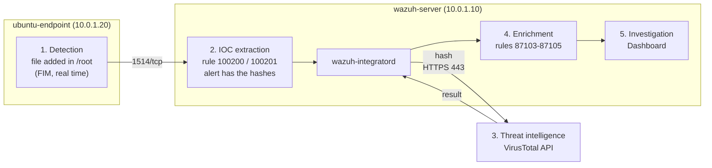

# VirusTotal Integration with Wazuh

This guide connects **VirusTotal** to Wazuh, following the official Wazuh proof of concept. When a file is added to or changed in `/root` on the Ubuntu endpoint, Wazuh sends the file's hash to VirusTotal. VirusTotal's answer appears as an alert: how many antivirus engines detect the file, or that it has never been seen.

- **VirusTotal** is a free online service that checks files with about 70 antivirus engines.
- A **hash** is a fingerprint of a file's content. **Only the hash is sent, never the file.**
- An **IOC** (indicator of compromise) is a clue that something may be malicious, such as a known bad hash.

What this lab sets up:

| Part | What | Where |
|---|---|---|
| [A](#part-a-watch-root-in-real-time) | Watch `/root` in real time | ubuntu-endpoint |
| [B](#part-b-add-the-rules-and-the-virustotal-integration) | Rules that pick the files, and the VirusTotal integration | wazuh-server |

## Table of contents

1. [Architecture](#1-architecture)
2. [What you need](#2-what-you-need)
3. [Installation steps](#3-installation-steps)
4. [Test](#4-test)
5. [Common problems](#5-common-problems)
6. [Next steps](#6-next-steps)

---

## 1. Architecture



The numbers follow the post's workflow: detection → IOC extraction → threat intelligence → enrichment → investigation. **wazuh-integratord** is the part of the Wazuh server that talks to outside services. The Wazuh server needs internet access on port 443.

---

## 2. What you need

| Already built | Used for |
|---|---|
| [01-wazuh-soc-lab](../01-wazuh-soc-lab/) | Wazuh server and the agent `ubuntu-endpoint` |

| VM | Role | Private IP | CPU / RAM / disk |
|---|---|---|---|
| wazuh-server | Wazuh manager, runs the integration | 10.0.1.10 | As in lab 01 |
| ubuntu-endpoint | Agent, watched folder `/root` | 10.0.1.20 | As in lab 01 |

You also need a free VirusTotal account ([virustotal.com](https://www.virustotal.com/)).

| Placeholder | What it is | Example | Where to find it |
|---|---|---|---|
| `<VM_USER>` | The user you log in with | `ubuntu` | Your login user |
| `<WAZUH_SERVER_IP>` | Private IP of wazuh-server | `10.0.1.10` | `hostname -I` on wazuh-server |
| `<VIRUSTOTAL_API_KEY>` | Your VirusTotal API key | 64 characters | VirusTotal → your profile icon → **API key** |

**Keep the API key secret** (password manager). The free key allows **4 lookups per minute and 500 per day**.

---

## 3. Installation steps

### Part A. Watch /root in real time

**Run on:** ubuntu-endpoint, as `<VM_USER>`

```bash
sudo tee -a /var/ossec/etc/ossec.conf > /dev/null <<'EOF'

<ossec_config>
  <syscheck>
    <directories realtime="yes">/root</directories>
  </syscheck>
</ossec_config>
EOF
sudo systemctl restart wazuh-agent
```

- `tee -a` adds the block to the end of the agent's config. Wazuh allows more than one `<ossec_config>` block.
- `realtime="yes"`: a new or changed file in `/root` is reported within seconds.

**Check** (wait about 2 minutes):

```bash
sudo grep "'/root'" /var/ossec/logs/ossec.log | tail -n 1
```

Similar to `(6003): Monitoring path: '/root', with options '... | realtime'.`

### Part B. Add the rules and the VirusTotal integration

**Run on:** wazuh-server, as `<VM_USER>`

**B1. Add the rules** (from the official proof of concept):

```bash
sudo tee -a /var/ossec/etc/rules/local_rules.xml > /dev/null <<'EOF'

<!-- Lab 04: FIM alerts for /root, sent to VirusTotal -->
<group name="syscheck,pci_dss_11.5,nist_800_53_SI.7,">
  <rule id="100200" level="7">
    <if_sid>550</if_sid>
    <field name="file">/root</field>
    <description>File modified in /root directory.</description>
  </rule>
  <rule id="100201" level="7">
    <if_sid>554</if_sid>
    <field name="file">/root</field>
    <description>File added to /root directory.</description>
  </rule>
</group>
EOF
```

- `if_sid` 550 / 554 = the built-in FIM rules for "file modified" and "file added". `field name="file"` = only files in `/root`.
- `tee -a` adds the rules after the ones already in the file.

**B2. Add the integration** (run all lines in the same terminal):

```bash
read -rsp "Paste your VirusTotal API key and press Enter: " VT_KEY; echo
sudo tee -a /var/ossec/etc/ossec.conf > /dev/null <<EOF

<ossec_config>
  <integration>
    <name>virustotal</name>
    <api_key>${VT_KEY}</api_key>
    <rule_id>100200,100201</rule_id>
    <alert_format>json</alert_format>
  </integration>
</ossec_config>
EOF
unset VT_KEY
sudo systemctl restart wazuh-manager
```

- `read -s` takes the key without showing it or saving it in the command history. `${VT_KEY}` is replaced by it.
- `rule_id` = only alerts from the two rules above go to VirusTotal. This keeps you under the free limit.

The key is now in `/var/ossec/etc/ossec.conf`. **Never upload that file to GitHub.**

**Check:**

```bash
sudo /var/ossec/bin/wazuh-control status | grep -E "analysisd|integratord"
```

```text
wazuh-integratord is running...
wazuh-analysisd is running...
```

---

## 4. Test

**Run on:** ubuntu-endpoint, as `<VM_USER>`

The **EICAR test file** is harmless, but every antivirus engine detects it on purpose.

```bash
sudo curl -Lo /root/eicar.com https://secure.eicar.org/eicar.com
sudo ls -lah /root/eicar.com
```

**See it in the dashboard:** ☰ → **Threat intelligence** → **Threat Hunting** → **Events** tab, time range **Last 15 minutes**, search:

```text
rule.id:(100200 or 100201 or 87103 or 87104 or 87105)
```

| Rule | Level | Description |
|---|---|---|
| 100201 | 7 | File added to /root directory. |
| 100200 | 7 | File modified in /root directory. |
| 87105 | 12 | VirusTotal: Alert - /root/eicar.com - 66 engines detected this file |

`curl` creates the file empty first, then writes it, so you see both 100201 and 100200. The empty file's lookup may give **87104 "No positives found"**; the full file gives **87105**. Open 87105: `data.virustotal.positives`, `data.virustotal.source.md5` and `data.virustotal.permalink` (link to the full report).

Clean up: `sudo rm /root/eicar.com`.

**The setup works when** rule 87105 appears for `/root/eicar.com`.

---

## 5. Common problems

| Problem | Fix |
|---|---|
| Rule 87102 "Check credentials" | Wrong API key. Fix it between `<api_key>` and `</api_key>` with `sudo nano /var/ossec/etc/ossec.conf`, restart the manager |
| Rule 87101 "Public API request rate limit reached" | More than 4 lookups per minute. Wait. Do not send whole folders like `/etc` to VirusTotal |
| Only rule 554, no 100201 | The rules were not loaded: `sudo /var/ossec/bin/wazuh-analysisd -t`, then restart the manager |
| 100201 appears but no VirusTotal alert | The server cannot reach the internet, or integratord is not running. Look at `sudo tail -n 20 /var/ossec/logs/integrations.log` |

---

## 6. Next steps

- **Delete detected files automatically** (active response `remove-threat.sh`, same proof of concept): [Detecting and removing malware using VirusTotal](https://documentation.wazuh.com/current/proof-of-concept-guide/detect-remove-malware-virustotal.html)
- **How the integration works**: [VirusTotal integration](https://documentation.wazuh.com/current/user-manual/capabilities/malware-detection/virus-total-integration.html)
