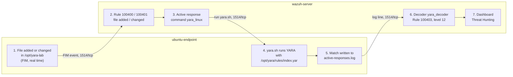

# YARA Malware Detection with Wazuh

This guide installs **YARA** on the Ubuntu endpoint and connects it to a Wazuh server that is already installed. When a file is added to or changed in a watched folder, Wazuh runs a YARA scan on that file. If a YARA rule matches, the match appears as a level 12 alert in the Wazuh dashboard.

- **YARA** is a pattern-matching tool. A **YARA rule** describes what to look for in a file: text strings, byte patterns, file properties, and conditions that combine them.
- **Active response** is the Wazuh feature that runs a script on the agent when a certain alert fires. Here that script runs the YARA scan.

What this lab installs and connects:

| Part | What | Where |
|---|---|---|
| [A](#part-a-install-yara) | Install YARA 4.5.5 (built from source) | ubuntu-endpoint |
| [B](#part-b-add-yara-rules) | Add YARA rules: a public rule set and one rule you write | ubuntu-endpoint |
| [C](#part-c-connect-yara-to-the-wazuh-agent) | Connect YARA to the Wazuh agent: scan script and watched folder | ubuntu-endpoint |
| [D](#part-d-connect-yara-to-the-wazuh-server) | Connect YARA to the Wazuh server: decoder, rules, active response | wazuh-server |

## Table of contents

1. [Architecture](#1-architecture)
2. [What you need](#2-what-you-need)
3. [Firewall](#3-firewall)
4. [Installation and integration steps](#4-installation-and-integration-steps)
5. [Test](#5-test)
6. [Common problems](#6-common-problems)
7. [Next steps](#7-next-steps)

Files in this folder:

| File | Copy to (on ubuntu-endpoint) | Used in |
|---|---|---|
| [`configs/endpoint/lab_rules.yar`](configs/endpoint/lab_rules.yar) | `/opt/yara/rules/lab_rules.yar` | [Step B2](#part-b-add-yara-rules) |
| [`configs/endpoint/index.yar`](configs/endpoint/index.yar) | `/opt/yara/rules/index.yar` | [Step B3](#part-b-add-yara-rules) |
| [`configs/endpoint/yara.sh`](configs/endpoint/yara.sh) | `/var/ossec/active-response/bin/yara.sh` | [Step C1](#part-c-connect-yara-to-the-wazuh-agent) |

You don't need to copy them by hand: each step writes the file with one command.

---

## 1. Architecture



- **FIM** (File Integrity Monitoring) is the Wazuh agent feature that sees files being added, changed or deleted.
- A **decoder** tells the Wazuh server how to split a log line into fields (here: rule name and file path).
- All traffic between agent and server uses the existing agent connection (1514/tcp).

---

## 2. What you need

| Already built | Used for |
|---|---|
| [01-wazuh-soc-lab](../01-wazuh-soc-lab/) | Wazuh 4.14 server and the agent `ubuntu-endpoint` (Active) |

| VM | Role | CPU / RAM / disk |
|---|---|---|
| wazuh-server | Wazuh manager, indexer and dashboard | As in lab 01 |
| ubuntu-endpoint | Ubuntu 22.04, Wazuh agent, YARA | 1 vCPU / 1 GB / 10 GB free (assumption: enough to build YARA) |

Assumptions:

1. YARA is built from source, as in the Wazuh documentation. Ubuntu's own `yara` package is an older version (4.1), which cannot read some newer rules.
2. The rules and the watched folder are in `/opt`, not in `/tmp` as in the Wazuh documentation. Ubuntu empties `/tmp` at every reboot, which would delete them.
3. The custom Wazuh rules use IDs `100400` to `100403`. Wazuh's own example uses `100300` and `100301`, which lab 04 already uses.

| Placeholder | What it is | Example | Where to find it |
|---|---|---|---|
| `<VM_USER>` | The user you log in with on the VMs | `ubuntu` | AWS and Oracle Cloud: `ubuntu`. Azure and Google Cloud: the name you chose |
| `<WAZUH_SERVER_PUBLIC_IP>` | Public IP of wazuh-server | `198.51.100.10` | Cloud console, VM details |
| `<ENDPOINT_PUBLIC_IP>` | Public IP of ubuntu-endpoint | `198.51.100.20` | Cloud console, VM details |

No passwords or API keys are needed. The rule download in Step B1 uses a public demo key from the Wazuh documentation.

---

## 3. Firewall

No new inbound ports.

| From | To | Port | Used for |
|---|---|---|---|
| ubuntu-endpoint | wazuh-server | 1514/tcp | Agent connection (already open) |
| ubuntu-endpoint | github.com, valhalla.nextron-systems.com (internet) | 443/tcp **outbound** | Download YARA source and rules (only during setup) |
| Your computer | wazuh-server | 443/tcp | Dashboard (already open) |

Cloud providers and ufw allow outbound traffic by default. Change nothing unless your cloud firewall blocks outbound traffic.

---

## 4. Installation and integration steps

### Part A. Install YARA

**Run on:** ubuntu-endpoint, as `<VM_USER>`

**A1. Install the build tools:**

```bash
sudo apt-get update
sudo apt-get install -y make gcc automake autoconf libtool libssl-dev pkg-config jq
```

- `make`, `gcc`, `automake`, `autoconf`, `libtool`, `pkg-config` turn YARA's source code into a program.
- `libssl-dev` lets YARA calculate file hashes in rules.
- `jq` reads JSON. The scan script in Part C needs it.

**A2. Download, build and install YARA 4.5.5:**

```bash
cd /tmp
curl -LO https://github.com/VirusTotal/yara/archive/v4.5.5.tar.gz
tar -xzf v4.5.5.tar.gz
cd yara-4.5.5
./bootstrap.sh
./configure
make
sudo make install
sudo ldconfig
cd ~ && rm -rf /tmp/yara-4.5.5 /tmp/v4.5.5.tar.gz
```

- `curl` downloads the source code; `tar` unpacks it.
- `bootstrap.sh` and `configure` prepare the build for this VM. `make` builds YARA (1 to 3 minutes).
- `make install` copies the program to `/usr/local/bin/yara`.
- `ldconfig` registers YARA's library (`libyara`) so the program can find it.
- The last line deletes the build files.

YARA built from source is not managed by `apt`, so it is never upgraded automatically. There is nothing to hold.

**Check:**

```bash
yara --version
which yara
```

```text
4.5.5
/usr/local/bin/yara
```

### Part B. Add YARA rules

**Run on:** ubuntu-endpoint, as `<VM_USER>`

**B1. Download a public rule set** (the free demo feed of Nextron's Valhalla, used in the Wazuh documentation):

```bash
sudo mkdir -p /opt/yara/rules
sudo curl -sS 'https://valhalla.nextron-systems.com/api/v1/get' \
  -H 'Accept: text/html,application/xhtml+xml,application/xml;q=0.9,*/*;q=0.8' \
  -H 'Accept-Language: en-US,en;q=0.5' \
  --compressed \
  -H 'Referer: https://valhalla.nextron-systems.com/' \
  -H 'Content-Type: application/x-www-form-urlencoded' \
  -H 'DNT: 1' -H 'Connection: keep-alive' -H 'Upgrade-Insecure-Requests: 1' \
  --data 'demo=demo&apikey=1111111111111111111111111111111111111111111111111111111111111111&format=text' \
  -o /opt/yara/rules/valhalla_rules.yar
```

- This downloads a few thousand ready-made rules for known malware into one file.
- The `apikey` of only `1`s is the public demo key, not a secret.

**Check:**

```bash
grep -c "^rule" /opt/yara/rules/valhalla_rules.yar
```

A number larger than `0` = the file contains rules. `0` means the download failed: run B1 again.

**B2. Write your own rule:**

```bash
sudo tee /opt/yara/rules/lab_rules.yar > /dev/null <<'EOF'
/*
  File:    /opt/yara/rules/lab_rules.yar
  Machine: ubuntu-endpoint
  Purpose: one harmless rule that proves YARA and the Wazuh integration work.
           Every YARA rule has the same three parts: meta, strings, condition.
*/
rule LAB_Test_Marker
{
    meta:
        description = "Harmless test file for the YARA lab"
        author      = "soc-documentation"

    strings:
        $text = "YARA-LAB-TEST-MARKER" ascii   // a specific text string
        $hex  = { 4C 41 42 2D 30 35 }           // a byte pattern (these bytes spell LAB-05)

    condition:
        $text and $hex and filesize < 1KB       // both patterns AND a file property
}
EOF
```

- `strings` = what to look for: `$text` is a text string, `$hex` is a byte pattern in hex.
- `condition` = when the rule matches: both patterns are in the file **and** the file is smaller than 1 KB.
- `meta` = information about the rule. It does not change the result.

**B3. Create one file that loads all rules:**

```bash
sudo tee /opt/yara/rules/index.yar > /dev/null <<'EOF'
// File:    /opt/yara/rules/index.yar
// Machine: ubuntu-endpoint
// Purpose: the one file Wazuh passes to YARA. It loads all rule files.
include "/opt/yara/rules/valhalla_rules.yar"
include "/opt/yara/rules/lab_rules.yar"
EOF
```

- `include` loads another rule file. Wazuh passes only this one file to YARA.
- To add more rule files later, add one `include` line per file.

**Check:** load every rule and scan a normal file:

```bash
yara -w /opt/yara/rules/index.yar /etc/hostname && echo "rules OK"
```

```text
rules OK
```

- `-w` hides warnings. If a rule has an error, YARA prints the file and line number instead of `rules OK`.

### Part C. Connect YARA to the Wazuh agent

**Run on:** ubuntu-endpoint, as `<VM_USER>`

**C1. Add the scan script:**

```bash
sudo tee /var/ossec/active-response/bin/yara.sh > /dev/null <<'EOF'
#!/bin/bash
# =============================================================================
# File:    /var/ossec/active-response/bin/yara.sh
# Machine: ubuntu-endpoint
# Purpose: Wazuh active response script. The Wazuh server runs it on the agent
#          when a file is added or changed in /opt/yara-lab. It scans that file
#          with YARA and writes every match to /var/ossec/logs/active-responses.log.
#          The agent sends that log back to the Wazuh server.
# Based on the Wazuh YARA proof-of-concept script (GPLv2, Copyright Wazuh Inc.)
# =============================================================================

# Wazuh sends the alert and the extra arguments as one JSON line
read -r INPUT_JSON
YARA_PATH=$(echo "$INPUT_JSON" | jq -r '.parameters.extra_args[1]')
YARA_RULES=$(echo "$INPUT_JSON" | jq -r '.parameters.extra_args[3]')
FILENAME=$(echo "$INPUT_JSON" | jq -r '.parameters.alert.syscheck.path')

# Path relative to /var/ossec (active response scripts run from there)
LOG_FILE="logs/active-responses.log"

# Wait until the file stops growing (it may still be downloading)
size=0
actual_size=$(stat -c %s "$FILENAME" 2>/dev/null || echo 0)
while [ "$size" -ne "$actual_size" ]; do
    sleep 1
    size=$actual_size
    actual_size=$(stat -c %s "$FILENAME" 2>/dev/null || echo 0)
done

if [[ -z $YARA_PATH || $YARA_PATH == "null" || -z $YARA_RULES || $YARA_RULES == "null" ]]; then
    echo "wazuh-yara: ERROR - Yara path and rules parameters are mandatory." >> "$LOG_FILE"
    exit 1
fi

# Scan the file. YARA prints one line per match: "<rule name> <file>"
yara_output="$("$YARA_PATH"/yara -w -r "$YARA_RULES" "$FILENAME")"

if [[ -n $yara_output ]]; then
    while read -r line; do
        echo "wazuh-yara: INFO - Scan result: $line" >> "$LOG_FILE"
    done <<< "$yara_output"
fi

exit 0
EOF
sudo chown root:wazuh /var/ossec/active-response/bin/yara.sh
sudo chmod 750 /var/ossec/active-response/bin/yara.sh
```

- `/var/ossec/active-response/bin/` is the only folder the agent runs active response scripts from.
- `chown` and `chmod 750` = owned by root, runnable by the Wazuh agent, not changeable by other users.

**Check:**

```bash
sudo ls -l /var/ossec/active-response/bin/yara.sh
```

Similar to:

```text
-rwxr-x--- 1 root wazuh 1824 Oct  2 18:20 /var/ossec/active-response/bin/yara.sh
```

**C2. Create the watched folder and tell the agent to watch it in real time:**

```bash
sudo mkdir -p /opt/yara-lab
sudo tee -a /var/ossec/etc/ossec.conf > /dev/null <<'EOF'

<ossec_config>
  <!-- Lab 05: watch /opt/yara-lab in real time; new and changed files are scanned with YARA -->
  <syscheck>
    <directories check_all="yes" realtime="yes">/opt/yara-lab</directories>
  </syscheck>
</ossec_config>
EOF
```

- `tee -a` adds the block to the **end** of the agent's config file. Nothing already in the file changes. Wazuh allows more than one `<ossec_config>` block.
- `realtime="yes"` reports a new file within seconds.

**C3. Confirm the agent sends the active response log to the server** (it does by default):

```bash
sudo grep -c "active-responses.log" /var/ossec/etc/ossec.conf
```

`1` (or more) = yes. `0` = see [Common problems](#6-common-problems).

**C4. Restart the agent:**

```bash
sudo systemctl restart wazuh-agent
```

**Check** (wait about 2 minutes after the restart):

```bash
sudo grep "yara-lab" /var/ossec/logs/ossec.log | tail -n 1
sudo grep "(6009)" /var/ossec/logs/ossec.log | tail -n 1
```

Similar to:

```text
2026/10/02 18:25:10 wazuh-syscheckd: INFO: (6003): Monitoring path: '/opt/yara-lab', with options 'size | permissions | owner | group | mtime | inode | hash_md5 | hash_sha1 | hash_sha256 | realtime'.
2026/10/02 18:26:31 wazuh-syscheckd: INFO: (6009): File integrity monitoring scan ended.
```

- Line 1 ends in `realtime` = the folder is watched.
- Line 2 (`scan ended`) = the first scan is done. Changes are reported only after this line appears.

### Part D. Connect YARA to the Wazuh server

**Run on:** wazuh-server, as `<VM_USER>`

**D1. Add the decoder** that reads YARA results:

```bash
sudo tee -a /var/ossec/etc/decoders/local_decoder.xml > /dev/null <<'EOF'

<!-- Lab 05: read YARA results written by yara.sh -->
<decoder name="yara_decoder">
  <prematch>wazuh-yara:</prematch>
</decoder>

<decoder name="yara_decoder1">
  <parent>yara_decoder</parent>
  <regex>wazuh-yara: (\S+) - Scan result: (\S+) (\S+)</regex>
  <order>log_type, yara_rule, yara_scanned_file</order>
</decoder>
EOF
```

- `prematch` = only lines that contain `wazuh-yara:` use this decoder.
- `regex` and `order` split the line `wazuh-yara: INFO - Scan result: <rule> <file>` into the fields `log_type`, `yara_rule` and `yara_scanned_file`.

**D2. Add the rules:**

```bash
sudo tee -a /var/ossec/etc/rules/local_rules.xml > /dev/null <<'EOF'

<!-- Lab 05: start a YARA scan for files added or changed in /opt/yara-lab -->
<group name="syscheck,yara_lab,">
  <rule id="100400" level="7">
    <if_sid>554</if_sid>
    <field name="file">^/opt/yara-lab/</field>
    <description>File added to /opt/yara-lab (YARA scan started).</description>
  </rule>
  <rule id="100401" level="7">
    <if_sid>550</if_sid>
    <field name="file">^/opt/yara-lab/</field>
    <description>File changed in /opt/yara-lab (YARA scan started).</description>
  </rule>
</group>

<!-- Lab 05: alert when YARA finds a match -->
<group name="yara,">
  <rule id="100402" level="0">
    <decoded_as>yara_decoder</decoded_as>
    <description>YARA grouping rule.</description>
  </rule>
  <rule id="100403" level="12">
    <if_sid>100402</if_sid>
    <match>wazuh-yara: INFO - Scan result: </match>
    <description>File "$(yara_scanned_file)" is a positive match. YARA rule: $(yara_rule)</description>
  </rule>
</group>
EOF
```

- `100400` / `100401` fire when FIM sees a file added (base rule 554) or changed (base rule 550) in `/opt/yara-lab`. They start the scan in D3.
- `100402` catches every YARA line without an alert (level 0). `100403` raises a level 12 alert for each match.

**D3. Add the active response** that runs `yara.sh`:

```bash
sudo tee -a /var/ossec/etc/ossec.conf > /dev/null <<'EOF'

<ossec_config>
  <!-- Lab 05: run yara.sh on the agent when rule 100400 or 100401 fires -->
  <command>
    <name>yara_linux</name>
    <executable>yara.sh</executable>
    <extra_args>-yara_path /usr/local/bin -yara_rules /opt/yara/rules/index.yar</extra_args>
    <timeout_allowed>no</timeout_allowed>
  </command>
  <active-response>
    <disabled>no</disabled>
    <command>yara_linux</command>
    <location>local</location>
    <rules_id>100400,100401</rules_id>
  </active-response>
</ossec_config>
EOF
```

- `command` = the script name and its arguments: where YARA is and which rule file to use.
- `active-response` = run that command when rule 100400 or 100401 fires. `location local` = on the agent that sent the alert.

**D4. Restart the Wazuh manager:**

```bash
sudo systemctl restart wazuh-manager
```

**Check 1:** the manager loaded everything:

```bash
sudo /var/ossec/bin/wazuh-control status | grep -E "analysisd|execd"
```

Similar to:

```text
wazuh-execd is running...
wazuh-analysisd is running...
```

**Check 2:** the decoder and rule work. This sends one sample line through the rules without creating a real alert:

```bash
echo 'wazuh-yara: INFO - Scan result: LAB_Test_Marker /opt/yara-lab/yara-test.txt' | sudo /var/ossec/bin/wazuh-logtest
```

Similar to (shortened):

```text
**Phase 2: Completed decoding.
        name: 'yara_decoder'
        log_type: 'INFO'
        yara_rule: 'LAB_Test_Marker'
        yara_scanned_file: '/opt/yara-lab/yara-test.txt'

**Phase 3: Completed filtering (rules).
        id: '100403'
        level: '12'
        description: 'File "/opt/yara-lab/yara-test.txt" is a positive match. YARA rule: LAB_Test_Marker'
**Alert to be generated.
```

---

## 5. Test

**5.1 Test YARA alone.**

**Run on:** ubuntu-endpoint, as `<VM_USER>`

```bash
echo "YARA-LAB-TEST-MARKER LAB-05" > /tmp/yara-test.txt
yara -w /opt/yara/rules/index.yar /tmp/yara-test.txt
```

- Line 1 creates a harmless text file that contains both patterns of your rule.
- Line 2 scans it with all rules.

**Check:**

```text
LAB_Test_Marker /tmp/yara-test.txt
```

**5.2 Test the Wazuh integration.**

**Run on:** ubuntu-endpoint, as `<VM_USER>`

```bash
sudo mv /tmp/yara-test.txt /opt/yara-lab/yara-test.txt
sleep 15
sudo tail -n 1 /var/ossec/logs/active-responses.log
```

- `mv` puts the complete file into the watched folder in one step.

**Check:**

```text
wazuh-yara: INFO - Scan result: LAB_Test_Marker /opt/yara-lab/yara-test.txt
```

**See it in the dashboard:**

1. Open `https://<WAZUH_SERVER_PUBLIC_IP>` and log in.
2. Go to ☰ → **Threat intelligence** → **Threat Hunting** → **Events** tab.
3. Set the time range (top right) to **Last 15 minutes**.
4. Search:

```text
rule.groups:yara or rule.id:(100400 or 100401)
```

| Rule | Level | Description |
|---|---|---|
| 100400 | 7 | File added to /opt/yara-lab (YARA scan started). |
| 100403 | 12 | File "/opt/yara-lab/yara-test.txt" is a positive match. YARA rule: LAB_Test_Marker |

Open the 100403 alert (expand icon at the start of the row). The fields `data.yara_rule` and `data.yara_scanned_file` show the rule name and the file.

**5.3 Clean up:**

```bash
sudo rm /opt/yara-lab/yara-test.txt
```

**The setup works when** rule 100403 appears with `LAB_Test_Marker` and the file path.

---

## 6. Common problems

| Problem | Fix |
|---|---|
| `./bootstrap.sh: aclocal: not found` or `autoreconf: not found` | Build tools are missing. Run Step A1 again, then A2 |
| `yara: error while loading shared libraries: libyara.so...` | The library is not registered. Run `sudo ldconfig`. If it still fails: `echo "/usr/local/lib" \| sudo tee -a /etc/ld.so.conf` then `sudo ldconfig` |
| The B3 check prints `error: rule ... in valhalla_rules.yar(...)` | The download is broken or contains a rule YARA can't read. Look at the first lines with `head /opt/yara/rules/valhalla_rules.yar`. Download it again (B1), or remove its `include` line from `index.yar` to continue with your own rule only |
| Rule 100400 appears but no line in `active-responses.log` | The script did not run. On the endpoint check: `sudo ls -l /var/ossec/active-response/bin/yara.sh` (owner `root wazuh`, `-rwxr-x---`), `which jq`, and `sudo grep -i "yara\|active" /var/ossec/logs/ossec.log \| tail` for errors |
| The line is in `active-responses.log` but no rule 100403 | C3 printed `0`: add `<localfile><log_format>syslog</log_format><location>/var/ossec/logs/active-responses.log</location></localfile>` inside a new `<ossec_config>` block at the end of the agent's `ossec.conf`, then restart the agent. Otherwise run Check 2 of D4 on the server |

---

## 7. Next steps

- **Write better rules** (strings, hex patterns with wildcards, conditions, modules like `pe` and `hash`): [Writing YARA rules](https://yara.readthedocs.io/en/stable/writingrules.html)
- **How the Wazuh and YARA integration works** (Linux and Windows details): [How to integrate Wazuh with YARA](https://documentation.wazuh.com/current/user-manual/capabilities/malware-detection/fim-yara.html)
- **YARA on Windows endpoints** and tests with real malware samples (in an isolated lab only): [Detecting malware using YARA integration](https://documentation.wazuh.com/current/proof-of-concept-guide/detect-malware-yara-integration.html)
- **YARA command-line options** (scan folders, processes, show matched strings with `-s`): [Running YARA from the command line](https://yara.readthedocs.io/en/stable/commandline.html)
