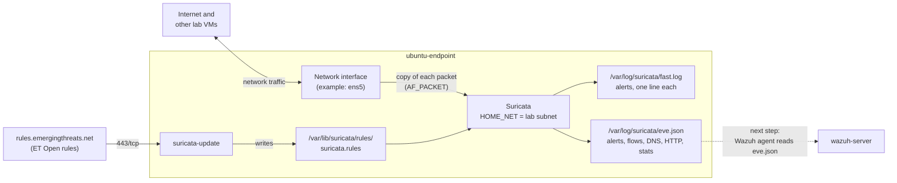

# Suricata Network Monitoring

This guide installs **Suricata** on the Ubuntu endpoint, sets the network interface it listens on, sets `HOME_NET` to the lab subnet, and downloads the latest rules with `suricata-update`. When it is done, Suricata writes network alerts and events (connections, IPs, ports, protocols, DNS, HTTP) to log files.

- **Suricata** is an open-source network threat detection engine. It reads copies of the network packets and compares them with **rules** (also called signatures). In **IDS** mode (intrusion detection system), it only watches and alerts. It never blocks.
- **HOME_NET** is the Suricata setting that says which IP addresses are "your" network. Many rules use it, for example "traffic from outside to HOME_NET".

What this lab installs and sets up:

| Part | What | Where |
|---|---|---|
| [A](#part-a-install-suricata) | Install Suricata (latest stable, OISF repository) | ubuntu-endpoint |
| [B](#part-b-set-the-monitoring-interface-and-home_net) | Set the monitoring interface and `HOME_NET` | ubuntu-endpoint |
| [C](#part-c-download-rules-with-suricata-update) | Download the ET Open rules with `suricata-update` and start Suricata | ubuntu-endpoint |

Connecting Suricata to Wazuh is a separate next step ([Next steps](#7-next-steps)).

## Table of contents

1. [Architecture](#1-architecture)
2. [What you need](#2-what-you-need)
3. [Firewall](#3-firewall)
4. [Installation steps](#4-installation-steps)
5. [Test](#5-test)
6. [Common problems](#6-common-problems)
7. [Next steps](#7-next-steps)

---

## 1. Architecture



- **AF_PACKET** is the Linux feature Suricata uses to get a copy of every packet on the interface. Traffic is not slowed or changed.
- **ET Open** is the free Emerging Threats rule set, the default source of `suricata-update`.
- **EVE JSON** (`eve.json`) is Suricata's main log: one JSON line per event.
- On a cloud VM, Suricata sees only traffic to and from **this VM**. Cloud networks do not copy other VMs' traffic to it.

---

## 2. What you need

| Already built | Used for |
|---|---|
| [01-wazuh-soc-lab](../01-wazuh-soc-lab/) | The VM `ubuntu-endpoint` (Ubuntu 22.04). The Wazuh agent on it is not used in this lab |

| VM | Role | CPU / RAM / disk |
|---|---|---|
| ubuntu-endpoint | Suricata (and the Wazuh agent from lab 01) | 1 vCPU / 2 GB / 20 GB (as in lab 01). Assumption: enough for a lab. If Suricata is stopped for lack of memory, see [Common problems](#6-common-problems) |

Assumptions:

1. Suricata runs on `ubuntu-endpoint`. The post says "one of my lab VMs".
2. Suricata version: the latest stable from the OISF repository (8.0.x when this guide was written).
3. Suricata runs in IDS mode (watch and alert only).

| Placeholder | What it is | Example | Where to find it |
|---|---|---|---|
| `<VM_USER>` | The user you log in with | `ubuntu` | AWS and Oracle Cloud: `ubuntu`. Azure and Google Cloud: the name you chose |
| `<ENDPOINT_PUBLIC_IP>` | Public IP of ubuntu-endpoint | `198.51.100.20` | Cloud console, VM details |
| `<ENDPOINT_PRIVATE_IP>` | Private IP of ubuntu-endpoint | `10.0.1.20` | [Step B1](#part-b-set-the-monitoring-interface-and-home_net) |
| `<INTERFACE>` | Name of the network interface | `ens5` (AWS), `eth0` (Azure), `ens4` (Google Cloud), `ens3` (Oracle Cloud) | [Step B1](#part-b-set-the-monitoring-interface-and-home_net) |
| `<LAB_SUBNET>` | Your lab's private network range (CIDR) | `10.0.1.0/24` | [Step B1](#part-b-set-the-monitoring-interface-and-home_net), or cloud console → VPC / virtual network → Subnets |

No passwords or API keys are needed.

---

## 3. Firewall

Suricata only listens to traffic. It opens **no ports**, so no new inbound rules are needed.

| From | To | Port | Used for |
|---|---|---|---|
| Your computer | ubuntu-endpoint | 22/tcp | SSH (already open) |
| ubuntu-endpoint | ppa.launchpadcontent.net, keyserver.ubuntu.com (internet) | 443/tcp **outbound** | Install Suricata (Part A) |
| ubuntu-endpoint | rules.emergingthreats.net (internet) | 443/tcp **outbound** | Download rules (Part C) |
| ubuntu-endpoint | testmynids.org (internet) | 80/tcp **outbound** | Test (section 5) |

Cloud providers and ufw allow outbound traffic by default. Change nothing unless your cloud firewall blocks outbound traffic.

---

## 4. Installation steps

### Part A. Install Suricata

**Run on:** ubuntu-endpoint, as `<VM_USER>`

**A1. Add the official Suricata repository and install:**

```bash
sudo apt-get update
sudo apt-get install -y software-properties-common
sudo add-apt-repository -y ppa:oisf/suricata-stable
sudo apt-get update
sudo apt-get install -y suricata jq
```

- `software-properties-common` gives the `add-apt-repository` command.
- `ppa:oisf/suricata-stable` is the repository of the Suricata developers (OISF). It always has the latest stable version. Ubuntu's own package is older.
- `jq` displays Suricata's JSON log in a readable way.

**Check:**

```bash
suricata -V
```

Similar to:

```text
This is Suricata version 8.0.7 RELEASE
```

The service may show `failed` right now (`systemctl status suricata`). That is normal: it still listens on `eth0` and has no rules. Parts B and C fix that.

Suricata from this repository is updated by `sudo apt-get upgrade`. No other tool depends on its version, so it is not pinned.

### Part B. Set the monitoring interface and HOME_NET

**Run on:** ubuntu-endpoint, as `<VM_USER>`

**B1. Find the interface name and the lab subnet:**

```bash
ip route show default
ip route show proto kernel scope link
```

Similar to:

```text
default via 10.0.1.1 dev ens5 proto dhcp src 10.0.1.20 metric 100
10.0.1.0/24 dev ens5 proto kernel scope link src 10.0.1.20 metric 100
```

- The word after `dev` is the interface: `ens5` = `<INTERFACE>`.
- The value after `src` is the VM's private IP: `10.0.1.20` = `<ENDPOINT_PRIVATE_IP>`.
- The first value of line 2 is the subnet: `10.0.1.0/24` = `<LAB_SUBNET>`. If there is no second line (Google Cloud gives VMs a `/32` address), use the subnet range shown in the cloud console (VPC network → Subnets).

**B2. Write both values into the Suricata config file:**

Replace the two values on the first lines, then run all lines:

```bash
IFACE="ens5"               # CHANGE THIS: your <INTERFACE> from B1
LAB_SUBNET="10.0.1.0/24"   # CHANGE THIS: your <LAB_SUBNET> from B1
sudo cp /etc/suricata/suricata.yaml /etc/suricata/suricata.yaml.bak
sudo sed -i "s|^    HOME_NET: \"\[192.168.0.0/16,10.0.0.0/8,172.16.0.0/12\]\"|    HOME_NET: \"[${LAB_SUBNET}]\"|" /etc/suricata/suricata.yaml
sudo sed -i "/^af-packet:/,/^  - interface:/ s|^  - interface: eth0|  - interface: ${IFACE}|" /etc/suricata/suricata.yaml
```

- Lines 1 and 2 store your values in two variables for the commands below.
- `cp` makes a backup: `/etc/suricata/suricata.yaml.bak`.
- The first `sed` (a find-and-replace tool) changes `HOME_NET` from all private ranges to your lab subnet.
- The second `sed` changes the first interface in the `af-packet:` section from `eth0` to your interface.

**Check:**

```bash
grep -n -E '^    HOME_NET:|^af-packet:|^  - interface:' /etc/suricata/suricata.yaml | head -n 4
```

Similar to:

```text
18:    HOME_NET: "[10.0.1.0/24]"
661:af-packet:
662:  - interface: ens5
742:  - interface: default
```

- `HOME_NET` shows your subnet.
- The line right after `af-packet:` shows your interface. (`interface: default` is a settings template, leave it.)

If a line did not change, the default file was different. Open it with `sudo nano /etc/suricata/suricata.yaml`, change the two lines by hand, and save (Ctrl+O, Enter, Ctrl+X).

### Part C. Download rules with suricata-update

**Run on:** ubuntu-endpoint, as `<VM_USER>`

**C1. Download the rules:**

```bash
sudo suricata-update
```

- `suricata-update` downloads the ET Open rule set and writes all enabled rules into one file: `/var/lib/suricata/rules/suricata.rules`. Suricata reads this file by default.
- It then tests the rules with Suricata (takes up to a minute).

**Check:** the last lines are similar to:

```text
Writing rules to /var/lib/suricata/rules/suricata.rules: total: 65000; enabled: 48000; added: 48000; removed 0; modified: 0
Testing with suricata -T.
Done.
```

The numbers change as the rule set changes.

**C2. Test the whole configuration:**

```bash
sudo suricata -T -c /etc/suricata/suricata.yaml
```

- `-T` = test mode: load the config and all rules, report errors, then exit.

**Check:** the last line is similar to:

```text
Notice: suricata: Configuration provided was successfully loaded. Exiting.
```

**C3. Start Suricata and start it at every boot:**

```bash
sudo systemctl enable suricata
sudo systemctl restart suricata
sleep 60
```

- Loading all rules takes about a minute on a small VM. `sleep 60` waits for that.

**Check 1:** Suricata started:

```bash
systemctl is-active suricata
sudo grep -i "engine started" /var/log/suricata/suricata.log | tail -n 1
```

Similar to:

```text
active
Notice: threads: Threads created -> W: 1 FM: 1 FR: 1   Engine started.
```

**Check 2:** Suricata receives packets (run it twice, a few seconds apart):

```bash
sudo tail -n 500 /var/log/suricata/eve.json | jq -c 'select(.event_type=="stats") | .stats.capture.kernel_packets' | tail -n 1
```

A number larger than `0` that grows between the two runs = Suricata sees traffic on the interface. (Stats are written every 8 seconds.)

---

## 5. Test

**Run on:** ubuntu-endpoint, as `<VM_USER>`

**5.1 Trigger a test rule.** `testmynids.org` returns a page that contains the text `uid=0(root)`, which is what an attacker sees after running `id` as root. ET Open rule `2100498` detects it. The test is harmless.

```bash
curl http://testmynids.org/uid/index.html
sleep 5
sudo tail -n 1 /var/log/suricata/fast.log
```

- The test uses `http://` (not `https://`) on purpose: Suricata cannot read encrypted traffic.

**Check:** similar to:

```text
10/02/2026-18:40:12.345678  [**] [1:2100498:7] GPL ATTACK_RESPONSE id check returned root [**] [Classification: Potentially Bad Traffic] [Priority: 2] {TCP} 203.0.113.80:80 -> 10.0.1.20:41618
```

- `1:2100498:7` = rule ID 2100498, revision 7.
- `{TCP} 203.0.113.80:80 -> 10.0.1.20:41618` = protocol, source IP and port (the web server), destination IP and port (your VM).

**5.2 See the network telemetry of the same test** (alert, DNS lookup, HTTP request) in `eve.json`:

```bash
sudo tail -n 500 /var/log/suricata/eve.json | jq -c 'select(.event_type=="alert" or .event_type=="dns" or .event_type=="http") | {type: .event_type, src: .src_ip, dst: .dest_ip, port: .dest_port, proto: .proto, signature: .alert.signature, host: .http.hostname, url: .http.url, dns: (.dns.rrname // .dns.queries[0].rrname)}' | grep -i testmynids
```

Similar to:

```text
{"type":"dns","src":"10.0.1.20","dst":"10.0.0.2","port":53,"proto":"UDP","signature":null,"host":null,"url":null,"dns":"testmynids.org"}
{"type":"http","src":"10.0.1.20","dst":"203.0.113.80","port":80,"proto":"TCP","signature":null,"host":"testmynids.org","url":"/uid/index.html","dns":null}
```

and the alert line:

```bash
sudo tail -n 500 /var/log/suricata/eve.json | jq -c 'select(.event_type=="alert") | {src: .src_ip, dst: .dest_ip, signature: .alert.signature, severity: .alert.severity}' | tail -n 1
```

```text
{"src":"203.0.113.80","dst":"10.0.1.20","signature":"GPL ATTACK_RESPONSE id check returned root","severity":2}
```

- The DNS server IP depends on your cloud (AWS: `.2` of the VPC range, Google Cloud: `169.254.169.254`). If the name was cached, the DNS line may be missing. Run the test again after a minute.

Suricata has no web interface. Showing these events in the Wazuh dashboard is the next step ([Next steps](#7-next-steps)).

**The setup works when** `fast.log` shows rule `2100498` for your VM's IP.

---

## 6. Common problems

| Problem | Fix |
|---|---|
| `systemctl status suricata` shows `failed`, and `suricata.log` says the interface (for example `eth0`) does not exist | The interface name is wrong. Redo [B1 and B2](#part-b-set-the-monitoring-interface-and-home_net), then `sudo systemctl restart suricata` |
| No alert in `fast.log` after the test | 1) Rules missing: `sudo grep -c "sid:2100498;" /var/lib/suricata/rules/suricata.rules` must print `1`, else run C1 again. 2) Suricata was not restarted after C1: run C3. 3) You used `https://`: use `http://` |
| `kernel_packets` stays `0` | Suricata listens on the wrong interface. Check the `af-packet` interface (B2 check) |
| Suricata stops after a while; `sudo dmesg \| grep -i "out of memory"` shows `suricata` | The VM has too little RAM for all rules. Add 2 GB of swap (`sudo fallocate -l 2G /swapfile && sudo chmod 600 /swapfile && sudo mkswap /swapfile && sudo swapon /swapfile`, and add `/swapfile none swap sw 0 0` to `/etc/fstab`) or resize the VM to 4 GB |
| You see no traffic from other lab VMs | Expected on cloud VMs: Suricata sees only this VM's own traffic. Install Suricata on each VM you want to watch, or use your cloud's traffic mirroring |

---

## 7. Next steps

- **Connect Suricata to Wazuh** (the Wazuh agent reads `eve.json` and alerts appear in the dashboard): [Network IDS integration](https://documentation.wazuh.com/current/proof-of-concept-guide/integrate-network-ids-suricata.html)
- **Keep rules updated and add rule sources** (`suricata-update list-sources`, `enable-source`, daily updates): [Rule management with suricata-update](https://docs.suricata.io/en/latest/rule-management/suricata-update.html)
- **Explore EVE event types** (flow, DNS, HTTP, TLS, file info): [EVE JSON output](https://docs.suricata.io/en/latest/output/eve/eve-json-output.html) and [EVE JSON format](https://docs.suricata.io/en/latest/output/eve/eve-json-format.html)
- **Write your own signatures**: [Rules introduction](https://docs.suricata.io/en/latest/rules/intro.html)
- **Block traffic instead of only alerting** (IPS mode): [Setting up IPS/inline for Linux](https://docs.suricata.io/en/latest/ips/setting-up-ipsinline-for-linux.html)
