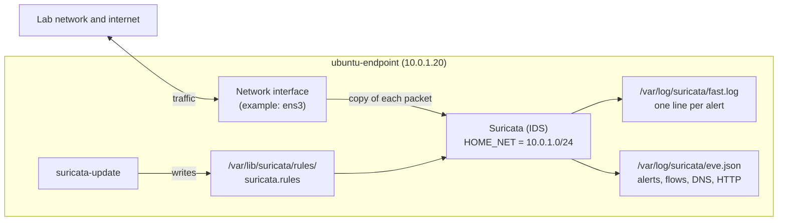

# Suricata Network Monitoring

This guide installs **Suricata** on the Ubuntu endpoint, sets the network interface it listens on, sets `HOME_NET` to the lab subnet, and downloads the latest rules with `suricata-update`. Suricata then writes network alerts and events (connections, IPs, ports, protocols, DNS, HTTP) to its log files.

- **Suricata** is an open-source network threat detection engine. It reads copies of the network packets and compares them with **rules** (signatures). In **IDS** mode (intrusion detection system) it only alerts. It never blocks.
- **HOME_NET** is the Suricata setting that says which addresses are "your" network. Many rules use it.

What this lab sets up:

| Part | What | Where |
|---|---|---|
| [A](#part-a-install-suricata) | Install Suricata from the official repository | ubuntu-endpoint |
| [B](#part-b-set-the-interface-and-home_net) | Set the monitoring interface and `HOME_NET` | ubuntu-endpoint |
| [C](#part-c-download-the-rules-and-start-suricata) | Download rules with `suricata-update` and start Suricata | ubuntu-endpoint |

## Table of contents

1. [Architecture](#1-architecture)
2. [What you need](#2-what-you-need)
3. [Installation steps](#3-installation-steps)
4. [Test](#4-test)
5. [Common problems](#5-common-problems)
6. [Next steps](#6-next-steps)

---

## 1. Architecture



- `fast.log` holds short alert lines. `eve.json` holds every event in JSON. Wazuh reads `eve.json` in [lab 07](../07-wazuh-suricata-lab/).
- Suricata sees the traffic of the VM it runs on.

---

## 2. What you need

| Already built | Used for |
|---|---|
| [01-wazuh-soc-lab](../01-wazuh-soc-lab/) | The VM `ubuntu-endpoint` (the agent is used in lab 07) |

| VM | Role | Private IP | CPU / RAM / disk |
|---|---|---|---|
| ubuntu-endpoint | Suricata and the Wazuh agent | 10.0.1.20 | 2 vCPU / 4 GB / 20 GB (assumption: Suricata loads about 50,000 rules) |

| Placeholder | What it is | Example | Where to find it |
|---|---|---|---|
| `<VM_USER>` | The user you log in with | `ubuntu` | Your login user |
| `<INTERFACE>` | Network interface of ubuntu-endpoint | `ens3` | [Step B1](#part-b-set-the-interface-and-home_net) |
| `<LAB_SUBNET>` | Private network of the lab (CIDR) | `10.0.1.0/24` | [Step B1](#part-b-set-the-interface-and-home_net) |

---

## 3. Installation steps

### Part A. Install Suricata

**Run on:** ubuntu-endpoint, as `<VM_USER>`

```bash
sudo apt-get install -y software-properties-common
sudo add-apt-repository -y ppa:oisf/suricata-stable
sudo apt-get update
sudo apt-get install -y suricata jq
```

- `ppa:oisf/suricata-stable` is the official repository of the Suricata developers. It has the latest stable version.
- `jq` displays the JSON log in a readable way.

**Check:**

```bash
suricata -V
```

Similar to `This is Suricata version 8.0.7 RELEASE`.

### Part B. Set the interface and HOME_NET

**Run on:** ubuntu-endpoint, as `<VM_USER>`

**B1. Find the interface name and the subnet:**

```bash
ip -br addr
```

Similar to:

```text
lo               UNKNOWN        127.0.0.1/8 ::1/128
ens3             UP             10.0.1.20/24 fe80::5054:ff:fe12:3456/64
```

- The interface with your private IP is `<INTERFACE>` (here `ens3`).
- `10.0.1.20/24` means the subnet `<LAB_SUBNET>` is `10.0.1.0/24`.

**B2. Edit the Suricata config:**

```bash
sudo cp /etc/suricata/suricata.yaml /etc/suricata/suricata.yaml.bak
sudo nano /etc/suricata/suricata.yaml
```

Change these two places (press **Ctrl+W** in nano to search for the text):

```yaml
vars:
  address-groups:
    HOME_NET: "[10.0.1.0/24]"      # CHANGE THIS: your <LAB_SUBNET>
```

```yaml
af-packet:
  - interface: ens3                # CHANGE THIS: your <INTERFACE> (the default is eth0)
```

Save with **Ctrl+O**, **Enter**, then exit with **Ctrl+X**.

- `HOME_NET`: the default lists all private ranges. Setting your lab subnet makes rules more accurate.
- `af-packet` is the capture method. Its first `interface` line must be your real interface.

**Check:**

```bash
grep -n -E '^    HOME_NET:|^  - interface:' /etc/suricata/suricata.yaml | head -n 2
```

Similar to:

```text
18:    HOME_NET: "[10.0.1.0/24]"
662:  - interface: ens3
```

### Part C. Download the rules and start Suricata

**Run on:** ubuntu-endpoint, as `<VM_USER>`

```bash
sudo suricata-update
sudo systemctl restart suricata
sleep 30
```

- `suricata-update` downloads the free **ET Open** rule set into `/var/lib/suricata/rules/suricata.rules`, the file Suricata reads by default.
- Loading about 50,000 rules takes up to half a minute.

**Check 1:** the config and rules load without errors:

```bash
sudo suricata -T -c /etc/suricata/suricata.yaml -v 2>&1 | tail -n 3
```

Similar to:

```text
Info: detect: 1 rule files processed. 52383 rules successfully loaded, 0 rules failed
Notice: suricata: Configuration provided was successfully loaded. Exiting.
```

**Check 2:** Suricata runs:

```bash
systemctl status suricata --no-pager | grep Active:
sudo tail -n 5 /var/log/suricata/suricata.log
```

`Active: active (running)`, and no `No such device` error in the log.

---

## 4. Test

**Run on:** ubuntu-endpoint, as `<VM_USER>`

```bash
curl http://testmynids.org/uid/index.html
sleep 5
sudo tail -n 3 /var/log/suricata/fast.log
```

- The page contains the text `uid=0(root)`. ET Open rule 2100498 detects it. The test is harmless.
- It uses `http://`, because Suricata cannot read encrypted HTTPS.

**Check:** similar to:

```text
10/03/2026-11:55:03.123456  [**] [1:2100498:7] GPL ATTACK_RESPONSE id check returned root [**] [Classification: Potentially Bad Traffic] [Priority: 2] {TCP} 203.0.113.80:80 -> 10.0.1.20:41618
```

See the same alert with all fields in `eve.json`:

```bash
sudo tail -n 500 /var/log/suricata/eve.json | jq -c 'select(.event_type=="alert") | {src: .src_ip, dst: .dest_ip, port: .dest_port, proto: .proto, signature: .alert.signature}' | tail -n 1
```

Suricata has no web interface. Showing these alerts in the Wazuh dashboard is [lab 07](../07-wazuh-suricata-lab/).

**The setup works when** `fast.log` shows rule 2100498 for your VM's IP.

---

## 5. Common problems

| Problem | Fix |
|---|---|
| After `apt upgrade`, Suricata keeps restarting and the log says `eth0: No such device` | The upgrade installed a new default `suricata.yaml` (interface `eth0`) and kept yours as `suricata.yaml.dpkg-old`. Test it: `sudo suricata -T -c /etc/suricata/suricata.yaml.dpkg-old -v`, then `sudo cp /etc/suricata/suricata.yaml.dpkg-old /etc/suricata/suricata.yaml` and `sudo systemctl restart suricata`. To avoid it: `sudo apt-mark hold suricata` |
| `curl: Could not resolve host: testmynids.org` | The VM has no working DNS or internet. Check `resolvectl status` and the default route |
| No alert in `fast.log` | Rules missing (run C again), Suricata not restarted after `suricata-update`, or `https://` used |
| Suricata sees no packets | Wrong interface in `af-packet`. `stats.log` shows `capture.kernel_packets` at 0. Fix B2 |

---

## 6. Next steps

- **Send Suricata alerts to Wazuh**: [lab 07](../07-wazuh-suricata-lab/)
- **Rule sources and daily updates**: [suricata-update](https://docs.suricata.io/en/latest/rule-management/suricata-update.html)
- **EVE JSON event types** (flow, DNS, HTTP, TLS): [EVE JSON output](https://docs.suricata.io/en/latest/output/eve/eve-json-output.html)
- **Writing signatures**: [Rules introduction](https://docs.suricata.io/en/latest/rules/intro.html)
