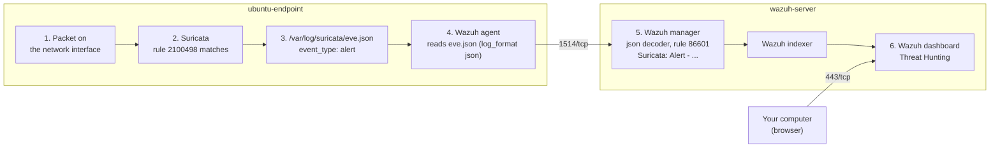

# Suricata to Wazuh Integration

This guide sends Suricata's network alerts to Wazuh, so they appear in the Wazuh dashboard next to the endpoint events. The Wazuh agent on the Ubuntu endpoint reads Suricata's `eve.json` log and forwards each event to the Wazuh server. The Wazuh server already has rules for Suricata. The test triggers a known Suricata test signature and follows it through every step: packet → Suricata alert in `eve.json` → Wazuh agent → Wazuh server → dashboard.

What this lab connects:

| Part | What | Where |
|---|---|---|
| [A](#part-a-send-evejson-to-the-wazuh-agent) | The Wazuh agent reads Suricata's `eve.json` | ubuntu-endpoint |
| [B](#part-b-confirm-the-wazuh-server-understands-suricata-events) | Confirm the Wazuh server decodes Suricata events (built-in, no changes) | wazuh-server |

## Table of contents

1. [Architecture](#1-architecture)
2. [What you need](#2-what-you-need)
3. [Firewall](#3-firewall)
4. [Integration steps](#4-integration-steps)
5. [Test: follow one alert end to end](#5-test-follow-one-alert-end-to-end)
6. [Common problems](#6-common-problems)
7. [Next steps](#7-next-steps)

---

## 1. Architecture



- **eve.json** is Suricata's main log. Each line is one event in **JSON** (a text format of `"name":"value"` pairs) with a field `event_type`: `alert`, `dns`, `http`, `flow`, and so on.
- The Wazuh server has built-in rules for Suricata (rule IDs 86600 to 86604). Only `event_type: alert` creates a visible alert (rule **86601**, level 3). DNS, HTTP and TLS events are received but stored without an alert (level 0).

---

## 2. What you need

| Already built | Used for |
|---|---|
| [01-wazuh-soc-lab](../01-wazuh-soc-lab/) | Wazuh 4.14 server, and the agent `ubuntu-endpoint` (Active) |
| [06-suricata-lab](../06-suricata-lab/) | Suricata on `ubuntu-endpoint`, writing `/var/log/suricata/eve.json` |

| VM | Role | CPU / RAM / disk |
|---|---|---|
| wazuh-server | Wazuh manager, indexer and dashboard | As in lab 01 |
| ubuntu-endpoint | Suricata and the Wazuh agent | As in lab 06 |

Assumption: lab 06 works. Its test (rule `2100498` in `fast.log`) passes before you start.

| Placeholder | What it is | Example | Where to find it |
|---|---|---|---|
| `<VM_USER>` | The user you log in with on the VMs | `ubuntu` | AWS and Oracle Cloud: `ubuntu`. Azure and Google Cloud: the name you chose |
| `<WAZUH_SERVER_PUBLIC_IP>` | Public IP of wazuh-server | `198.51.100.10` | Cloud console, VM details |
| `<ENDPOINT_PRIVATE_IP>` | Private IP of ubuntu-endpoint | `10.0.1.20` | `hostname -I` on ubuntu-endpoint (first address) |

No passwords or API keys are needed.

---

## 3. Firewall

No new ports. This setup uses the connections from labs 01 and 06:

| From | To | Port | Used for |
|---|---|---|---|
| ubuntu-endpoint | wazuh-server | 1514/tcp | Agent sends the Suricata events (already open) |
| Your computer | wazuh-server | 443/tcp | Dashboard (already open) |
| ubuntu-endpoint | testmynids.org (internet) | 80/tcp **outbound** | Test (section 5) |

---

## 4. Integration steps

### Part A. Send eve.json to the Wazuh agent

**Run on:** ubuntu-endpoint, as `<VM_USER>`

**A1. Check that the agent does not already read eve.json:**

```bash
sudo grep -c "/var/log/suricata/eve.json" /var/ossec/etc/ossec.conf
```

- `0` = not set yet. Do A2.
- `1` (or more) = already set. **Skip A2** and go to A3. Adding it twice would send every event twice.

**A2. Tell the agent to read eve.json:**

```bash
sudo tee -a /var/ossec/etc/ossec.conf > /dev/null <<'EOF'

<ossec_config>
  <!-- Lab 07: send Suricata events (eve.json) to the Wazuh server -->
  <localfile>
    <log_format>json</log_format>
    <location>/var/log/suricata/eve.json</location>
    <!-- Skip Suricata's statistics records: large, and not security events -->
    <ignore type="PCRE2">"event_type":"stats"</ignore>
  </localfile>
</ossec_config>
EOF
```

- `tee -a` adds the block to the **end** of the agent's config file. Nothing already in the file changes. Wazuh allows more than one `<ossec_config>` block.
- `log_format json` = each line is one JSON event. The Wazuh server then gets every field (IPs, ports, signature) separately.
- `ignore` drops the `stats` lines (Suricata's counters, written every 8 seconds). All other event types are sent.

**A3. Restart the agent:**

```bash
sudo systemctl restart wazuh-agent
```

**Check:**

```bash
sudo grep "eve.json" /var/ossec/logs/ossec.log | tail -n 1
```

Similar to:

```text
2026/10/02 18:50:12 wazuh-logcollector: INFO: (1950): Analyzing file: '/var/log/suricata/eve.json'.
```

`Analyzing file` = the agent reads eve.json and forwards new lines from now on. Older lines are not sent.

### Part B. Confirm the Wazuh server understands Suricata events

**Run on:** wazuh-server, as `<VM_USER>`

Nothing needs to change on the server. This step proves it with a sample Suricata alert. **wazuh-logtest** sends one log line through the Wazuh decoders and rules and shows the result, without creating a real alert.

```bash
echo '{"timestamp":"2026-10-02T18:40:12.345678+0000","flow_id":1234567890,"in_iface":"ens5","event_type":"alert","src_ip":"203.0.113.80","src_port":80,"dest_ip":"10.0.1.20","dest_port":41618,"proto":"TCP","alert":{"action":"allowed","gid":1,"signature_id":2100498,"rev":7,"signature":"GPL ATTACK_RESPONSE id check returned root","category":"Potentially Bad Traffic","severity":2}}' | sudo /var/ossec/bin/wazuh-logtest
```

**Check:** similar to (shortened):

```text
**Phase 2: Completed decoding.
        name: 'json'
        alert.signature: 'GPL ATTACK_RESPONSE id check returned root'
        alert.signature_id: '2100498'
        dest_ip: '10.0.1.20'
        event_type: 'alert'
        src_ip: '203.0.113.80'

**Phase 3: Completed filtering (rules).
        id: '86601'
        level: '3'
        description: 'Suricata: Alert - GPL ATTACK_RESPONSE id check returned root'
        groups: '['ids', 'suricata']'
**Alert to be generated.
```

- `name: 'json'` = the built-in JSON decoder split the line into fields.
- `id: '86601'` = the built-in Suricata alert rule matched.

---

## 5. Test: follow one alert end to end

A connected agent does not prove that alerts arrive. This test sends one known alert and checks every step of the chain.

**5.1 Trigger the alert.**

**Run on:** ubuntu-endpoint, as `<VM_USER>`

```bash
curl http://testmynids.org/uid/index.html
sleep 10
```

- The page contains the text `uid=0(root)`. ET Open rule `2100498` ("GPL ATTACK_RESPONSE id check returned root") detects it. Harmless.

**5.2 Step 1: Suricata created the alert.**

**Run on:** ubuntu-endpoint

```bash
sudo tail -n 1 /var/log/suricata/fast.log
```

Similar to:

```text
10/02/2026-18:55:03.123456  [**] [1:2100498:7] GPL ATTACK_RESPONSE id check returned root [**] [Classification: Potentially Bad Traffic] [Priority: 2] {TCP} 203.0.113.80:80 -> 10.0.1.20:41618
```

**5.3 Step 2: the alert is in eve.json** (the file the agent reads):

**Run on:** ubuntu-endpoint

```bash
sudo grep '"signature_id":2100498' /var/log/suricata/eve.json | tail -n 1 | jq -c '{event_type, src_ip, dest_ip, signature: .alert.signature}'
```

Similar to:

```text
{"event_type":"alert","src_ip":"203.0.113.80","dest_ip":"10.0.1.20","signature":"GPL ATTACK_RESPONSE id check returned root"}
```

**5.4 Step 3: the Wazuh server created the alert.**

**Run on:** wazuh-server, as `<VM_USER>`

```bash
sudo apt-get install -y jq
sudo tail -n 2000 /var/ossec/logs/alerts/alerts.json | jq -c 'select(.rule.id=="86601") | {agent: .agent.name, rule: .rule.id, signature: .data.alert.signature, src: .data.src_ip, dst: .data.dest_ip}' | tail -n 1
```

Similar to:

```text
{"agent":"ubuntu-endpoint","rule":"86601","signature":"GPL ATTACK_RESPONSE id check returned root","src":"203.0.113.80","dst":"10.0.1.20"}
```

**5.5 Step 4: the alert is in the dashboard.**

1. Open `https://<WAZUH_SERVER_PUBLIC_IP>` and log in.
2. Go to ☰ → **Threat intelligence** → **Threat Hunting** → **Events** tab.
3. Set the time range (top right) to **Last 15 minutes**.
4. Search:

```text
agent.name:ubuntu-endpoint and rule.groups:suricata
```

You see an alert with rule ID **86601**, level **3**, description `Suricata: Alert - GPL ATTACK_RESPONSE id check returned root`.

Open it (expand icon at the start of the row). The Suricata fields are under `data.`:

| Field | Meaning | Example |
|---|---|---|
| `data.alert.signature` | Name of the Suricata rule | `GPL ATTACK_RESPONSE id check returned root` |
| `data.alert.signature_id` | Suricata rule ID | `2100498` |
| `data.alert.severity` | Suricata severity (1 = high, 3 = low) | `2` |
| `data.alert.category` | Type of activity | `Potentially Bad Traffic` |
| `data.src_ip` / `data.src_port` | Where the traffic came from | `203.0.113.80` / `80` |
| `data.dest_ip` / `data.dest_port` | Where it went | `10.0.1.20` / `41618` |
| `data.proto` | Protocol | `TCP` |
| `data.flow_id` | ID of the connection. The same value in Suricata's `dns`, `http` and `flow` events links them | `1234567890` |

**The integration works when** all four steps show the same alert.

---

## 6. Common problems

| Problem | Fix |
|---|---|
| Step 1 fails (nothing in `fast.log`) | Suricata itself is not working. Go back to [lab 06](../06-suricata-lab/) and its Common problems |
| Steps 1 and 2 work, step 3 shows nothing | 1) Agent is **Active**: ☰ → **Agents management** → **Summary**. 2) The A3 check shows `Analyzing file`. 3) The alert happened **after** the agent restart (older lines are not sent): run 5.1 again |
| The agent stops after A3 | A typing error in `ossec.conf`. `sudo tail -n 20 /var/ossec/logs/ossec.log` shows the line. Fix it with `sudo nano /var/ossec/etc/ossec.conf` and restart |
| Every Suricata alert appears twice | `eve.json` is configured twice in the agent's `ossec.conf` (A1 printed `1` but A2 was run). Delete the Lab 07 block with `sudo nano /var/ossec/etc/ossec.conf` and restart the agent |
| All Suricata alerts are only level 3 | Expected: built-in rule 86601 gives every Suricata alert level 3. To raise the level by Suricata severity, see [Next steps](#7-next-steps) |

---

## 7. Next steps

- **Give high-severity Suricata alerts a higher Wazuh level** (a custom rule on `alert.severity`, child of rule 86601): [Custom rules](https://documentation.wazuh.com/current/user-manual/ruleset/rules/custom.html)
- **Wazuh's own Suricata example** (also shows a test from the Wazuh server): [Network IDS integration](https://documentation.wazuh.com/current/proof-of-concept-guide/integrate-network-ids-suricata.html)
- **Choose which Suricata event types go to eve.json** (alert, dns, http, tls, flow): [EVE JSON output](https://docs.suricata.io/en/latest/output/eve/eve-json-output.html)
