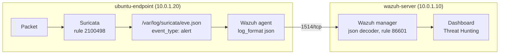

# Suricata to Wazuh Integration

This guide sends Suricata's network alerts to Wazuh, following the official Wazuh documentation. The Wazuh agent on the Ubuntu endpoint reads Suricata's `eve.json` and forwards every event to the Wazuh server, which already has rules for Suricata. The test follows one known alert through the whole chain: packet → Suricata alert in `eve.json` → Wazuh agent → Wazuh server → dashboard.

What this lab connects:

| Part | What | Where |
|---|---|---|
| [A](#part-a-send-evejson-to-the-wazuh-agent) | The Wazuh agent reads Suricata's `eve.json` | ubuntu-endpoint |

## Table of contents

1. [Architecture](#1-architecture)
2. [What you need](#2-what-you-need)
3. [Integration steps](#3-integration-steps)
4. [Test: follow one alert end to end](#4-test-follow-one-alert-end-to-end)
5. [Common problems](#5-common-problems)
6. [Next steps](#6-next-steps)

---

## 1. Architecture



- **eve.json** is Suricata's main log: one JSON event per line, with a field `event_type` (`alert`, `dns`, `http`, `flow`...).
- The Wazuh server's built-in Suricata rules (86600-86604) decode every event. Only `event_type: alert` creates a visible alert: **rule 86601**, level 3.

---

## 2. What you need

| Already built | Used for |
|---|---|
| [01-wazuh-soc-lab](../01-wazuh-soc-lab/) | Wazuh server and the agent `ubuntu-endpoint` |
| [06-suricata-lab](../06-suricata-lab/) | Suricata on `ubuntu-endpoint`, writing `/var/log/suricata/eve.json` |

| VM | Role | Private IP | CPU / RAM / disk |
|---|---|---|---|
| wazuh-server | Wazuh manager | 10.0.1.10 | As in lab 01 |
| ubuntu-endpoint | Suricata and the Wazuh agent | 10.0.1.20 | As in lab 06 |

| Placeholder | What it is | Example | Where to find it |
|---|---|---|---|
| `<VM_USER>` | The user you log in with | `ubuntu` | Your login user |
| `<WAZUH_SERVER_IP>` | Private IP of wazuh-server | `10.0.1.10` | `hostname -I` on wazuh-server |

---

## 3. Integration steps

### Part A. Send eve.json to the Wazuh agent

**Run on:** ubuntu-endpoint, as `<VM_USER>`

**A1. Check that the agent does not already read eve.json:**

```bash
sudo grep -c "/var/log/suricata/eve.json" /var/ossec/etc/ossec.conf
```

`0` = do A2. `1` or more = already set, skip A2 (adding it twice sends every event twice).

**A2. Add the official block to the agent config:**

```bash
sudo tee -a /var/ossec/etc/ossec.conf > /dev/null <<'EOF'

<ossec_config>
  <localfile>
    <log_format>json</log_format>
    <location>/var/log/suricata/eve.json</location>
  </localfile>
</ossec_config>
EOF
```

- `tee -a` adds the block to the end of the file. Wazuh allows more than one `<ossec_config>` block.
- `log_format json`: each line is one JSON event, so Wazuh gets every field (IPs, ports, signature) separately.

**A3. Restart the agent:**

```bash
sudo systemctl restart wazuh-agent
```

**Check:**

```bash
sudo grep "eve.json" /var/ossec/logs/ossec.log | tail -n 1
```

Similar to:

```text
2026/10/03 12:10:12 wazuh-logcollector: INFO: (1950): Analyzing file: '/var/log/suricata/eve.json'.
```

From now on, new lines are forwarded. Older lines are not sent.

---

## 4. Test: follow one alert end to end

A connected agent does not prove that alerts arrive. This test checks every step.

**4.1 Trigger the alert** (on ubuntu-endpoint):

```bash
curl http://testmynids.org/uid/index.html
sleep 10
```

**4.2 Step 1, Suricata** (on ubuntu-endpoint):

```bash
sudo tail -n 1 /var/log/suricata/fast.log
```

A line with `[1:2100498:7] GPL ATTACK_RESPONSE id check returned root`.

**4.3 Step 2, eve.json** (on ubuntu-endpoint):

```bash
sudo grep '"signature_id":2100498' /var/log/suricata/eve.json | tail -n 1 | jq -c '{event_type, src_ip, dest_ip, signature: .alert.signature}'
```

Similar to `{"event_type":"alert","src_ip":"203.0.113.80","dest_ip":"10.0.1.20","signature":"GPL ATTACK_RESPONSE id check returned root"}`.

**4.4 Step 3, Wazuh server** (on wazuh-server):

```bash
sudo grep '"86601"' /var/ossec/logs/alerts/alerts.json | tail -n 1 | cut -c1-300
```

The newest Suricata alert, with `"agent":{"id":"001","name":"ubuntu-endpoint"...` and the signature.

**4.5 Step 4, dashboard:** ☰ → **Threat intelligence** → **Threat Hunting** → **Events** tab, time range **Last 15 minutes**, search:

```text
agent.name:ubuntu-endpoint and rule.groups:suricata
```

Alert **Suricata: Alert - GPL ATTACK_RESPONSE id check returned root**, rule 86601, level 3. Open it:

| Field | Meaning |
|---|---|
| `data.alert.signature` / `signature_id` | Suricata rule name and ID |
| `data.alert.severity` | Suricata severity (1 = high, 3 = low) |
| `data.src_ip`, `data.src_port` | Where the traffic came from |
| `data.dest_ip`, `data.dest_port` | Where it went |
| `data.proto` | Protocol |

**The integration works when** all four steps show the same alert.

---

## 5. Common problems

| Problem | Fix |
|---|---|
| Step 1 fails | Suricata itself is not working. See [lab 06](../06-suricata-lab/) |
| Steps 1 and 2 work, step 3 shows nothing | The agent is not active (☰ → **Agents management** → **Summary**), the A3 check shows no `Analyzing file`, or the alert happened before the agent restart. Run 4.1 again |
| Every Suricata alert appears twice | `eve.json` is configured twice in the agent's `ossec.conf`. Remove one block and restart the agent |
| All Suricata alerts are level 3 | Expected: built-in rule 86601 gives every Suricata alert level 3 |

---

## 6. Next steps

- **Wazuh's Suricata example**: [Network IDS integration](https://documentation.wazuh.com/current/proof-of-concept-guide/integrate-network-ids-suricata.html)
- **Higher Wazuh levels for serious Suricata alerts** (child rule of 86601 on `alert.severity`): [Custom rules](https://documentation.wazuh.com/current/user-manual/ruleset/rules/custom.html)
