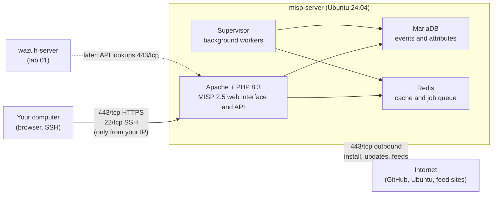

# MISP Threat Intelligence Platform

This guide installs **MISP 2.5** on its own Ubuntu 24.04 VM with the official install script. It then covers the first login and the settings to save. The test adds one indicator in the web interface and finds it again through the MISP API.

- **MISP** (Malware Information Sharing Platform) stores and shares threat intelligence. Information is grouped into **events** (for example "phishing campaign X"). Each event holds **attributes**: the indicators, such as IP addresses, domains, URLs and file hashes.
- An **IOC** (indicator of compromise) is a clue that something may be malicious, such as a known bad IP address or file hash.

What this lab installs and sets up:

| Part | What | Where |
|---|---|---|
| [A](#part-a-create-the-misp-vm-and-firewall) | Create the dedicated MISP VM (Ubuntu 24.04) and its firewall | misp-server |
| [B](#part-b-install-misp-25-with-the-official-script) | Install MISP 2.5 with the official script | misp-server |
| [C](#part-c-first-login-and-basic-settings) | First login, save the credentials, check the background workers | misp-server, your browser |

## Table of contents

1. [Architecture](#1-architecture)
2. [What you need](#2-what-you-need)
3. [Firewall](#3-firewall)
4. [Installation steps](#4-installation-steps)
5. [Test](#5-test)
6. [Common problems](#6-common-problems)
7. [Next steps](#7-next-steps)

---

## 1. Architecture



- **Apache** is the web server, **PHP** runs the MISP application, **MariaDB** is the database and **Redis** is a fast in-memory store for the cache and the job queue.
- **Supervisor** keeps MISP's **background workers** running. These programs do slow jobs such as fetching feeds and sending emails.
- The VM is standalone. It is not connected to Wazuh in this lab (dotted line = a later step).

---

## 2. What you need

No earlier lab is needed. MISP runs on a new, separate VM.

| VM | Role | CPU / RAM / disk |
|---|---|---|
| misp-server | MISP 2.5 (Apache, PHP, MariaDB, Redis, Supervisor) | 2 vCPU / 8 GB / 50 GB SSD |

Assumptions:

1. **Ubuntu 24.04**, not 22.04 like the other labs. The post uses 24.04, and the official MISP 2.5 script runs only on Ubuntu 24.04.
2. Size: the MISP documentation says "2+ cores and 8-16 GB of memory should be plenty". This lab uses the low end. The disk size is an assumption.
3. The VM has a **static public IP** (AWS: Elastic IP, Azure: static public IP, Google Cloud: static external IP). MISP stores its own address. If the IP changes, see [Common problems](#6-common-problems).
4. The VM uses the same SSH key as your other labs.

| Placeholder | What it is | Example | Where to find it |
|---|---|---|---|
| `<VM_USER>` | Default sudo user of the Ubuntu image | `ubuntu` | AWS and Oracle Cloud: `ubuntu`. Azure and Google Cloud: the name you chose |
| `<MISP_PUBLIC_IP>` | Public IP of misp-server | `198.51.100.40` | Cloud console, VM details |
| `<MISP_PRIVATE_IP>` | Private IP of misp-server | `10.0.1.40` | `hostname -I` on the VM (first address) |
| `<YOUR_PUBLIC_IP>` | Public IP of your own computer | `203.0.113.25` | On your computer: search "what is my IP" |
| `<MISP_ADMIN_PASSWORD>` | MISP admin password | random, 32 characters | Printed at the end of [Step B2](#part-b-install-misp-25-with-the-official-script) |
| `<MISP_API_KEY>` | MISP admin API key | 40 characters | `/root/misp_settings.txt` ([Step C1](#part-c-first-login-and-basic-settings)) |

**Never put the admin password or the API key in this repository, a screenshot or a post.** Save both in a password manager.

---

## 3. Firewall

MISP holds sensitive data. Open it **only to your own IP**, never to the whole internet.

**Cloud firewall (security group) for misp-server:**

| Direction | Protocol / port | Source / destination | Used for |
|---|---|---|---|
| Inbound | 22/tcp | `<YOUR_PUBLIC_IP>/32` | SSH |
| Inbound | 443/tcp | `<YOUR_PUBLIC_IP>/32` | MISP web interface and API (HTTPS) |
| Outbound | 443/tcp and 80/tcp | `0.0.0.0/0` (default "allow all outbound") | Install packages, download MISP, feeds |

Port 80 is **not** opened inbound: the install script redirects HTTP to HTTPS, so only 443 is needed.

The **ufw** commands are in [Step A3](#part-a-create-the-misp-vm-and-firewall).

---

## 4. Installation steps

### Part A. Create the MISP VM and firewall

**A1. Create the VM** in your cloud console:

| Setting | Value |
|---|---|
| Name | `misp-server` |
| Image | **Ubuntu Server 24.04 LTS** (64-bit, x86) |
| Size | 2 vCPU / 8 GB RAM |
| Disk | 50 GB SSD |
| SSH key | Your existing lab key |
| Public IP | Static (see assumptions) |
| Firewall / security group | The two inbound rules from [section 3](#3-firewall) |

**A2. Connect with SSH.**

**Run on:** your computer

```bash
ssh <VM_USER>@<MISP_PUBLIC_IP>
```

**Check:** on the VM, confirm the Ubuntu version:

```bash
lsb_release -d
```

Similar to:

```text
Description:    Ubuntu 24.04.3 LTS
```

**A3. Turn on ufw** (the firewall on the VM itself).

**Run on:** misp-server, as `<VM_USER>`

```bash
MY_IP="203.0.113.25"   # CHANGE THIS: <YOUR_PUBLIC_IP>
sudo ufw allow from "$MY_IP" to any port 22 proto tcp comment 'SSH'
sudo ufw allow from "$MY_IP" to any port 443 proto tcp comment 'MISP HTTPS'
sudo ufw --force enable
```

- Lines 2 and 3 allow SSH and HTTPS only from your IP. The SSH rule comes **before** `enable`, so your session stays open.
- `--force` skips the "are you sure" question.

**Check:**

```bash
sudo ufw status numbered
```

Similar to:

```text
Status: active

     To                         Action      From
     --                         ------      ----
[ 1] 22/tcp                     ALLOW IN    203.0.113.25               # SSH
[ 2] 443/tcp                    ALLOW IN    203.0.113.25               # MISP HTTPS
```

Open a **new** SSH session (keep the old one open). If it works, the firewall is correct.

### Part B. Install MISP 2.5 with the official script

**Run on:** misp-server, as `<VM_USER>`

**B1. Download the official install script** (from the MISP GitHub repository, branch `2.5`):

```bash
curl -fsSL -o /tmp/INSTALL.ubuntu2404.sh https://raw.githubusercontent.com/MISP/MISP/2.5/INSTALL/INSTALL.ubuntu2404.sh
head -n 2 /tmp/INSTALL.ubuntu2404.sh
```

**Check:**

```text
#!/bin/bash
# MISP 2.5 installation for Ubuntu 24.04 LTS
```

**B2. Run the script:**

```bash
MISP_IP="198.51.100.40"   # CHANGE THIS: <MISP_PUBLIC_IP>
sudo env MISP_DOMAIN="$MISP_IP" bash /tmp/INSTALL.ubuntu2404.sh
```

- `MISP_DOMAIN` is the address MISP uses for its links, redirects and HTTPS certificate. Without it the script uses `misp.local`, a name your browser cannot find. Here it is the VM's public IP.
- The script updates Ubuntu, then installs Apache, PHP 8.3, MariaDB, Redis and Supervisor. It downloads MISP into `/var/www/MISP`, creates the database, generates random passwords and a **self-signed HTTPS certificate** (made by the VM itself, not by a known authority, so browsers warn about it), and starts the background workers.
- It takes about 10 to 30 minutes. Lines start with `[STATUS]`, `[OK]` or `[ERROR]`. Everything is also written to `/var/log/misp_install.log`.

**Check:** the last lines are similar to:

```text
[NOTICE] You can now access your MISP instance at https://198.51.100.40
[NOTICE] The default admin credentials are:
[NOTICE] Username: admin@admin.test
[NOTICE] Password: <MISP_ADMIN_PASSWORD>
[NOTICE] MISP setup complete. Thank you, and have a very safe, and productive day.
```

**Save the password now** in your password manager. The script also stores all generated secrets (admin password, admin API key, database passwords, GPG passphrase) in `/root/misp_settings.txt`, readable only by root. Never copy that file or the install log into GitHub.

**B3. Check the services:**

```bash
systemctl is-active apache2 mariadb redis-server supervisor
sudo supervisorctl status
curl -sk -o /dev/null -w "%{http_code}\n" https://localhost/users/login
```

- `systemctl is-active` = the four services run.
- `supervisorctl status` = the background workers run.
- `curl -k` opens the login page (`-k` accepts the self-signed certificate).

Similar to:

```text
active
active
active
active
misp-workers:cache_00            RUNNING   pid 4101, uptime 0:05:12
misp-workers:default_00          RUNNING   pid 4102, uptime 0:05:12
misp-workers:email_00            RUNNING   pid 4103, uptime 0:05:12
misp-workers:prio_00             RUNNING   pid 4104, uptime 0:05:12
misp-workers:scheduler_00        RUNNING   pid 4105, uptime 0:05:12
misp-workers:update_00           RUNNING   pid 4106, uptime 0:05:12
200
```

Every worker `RUNNING` and `200` = MISP is installed and answering. (There may be more than one `default` or `prio` worker.)

### Part C. First login and basic settings

**C1. Get the API key** (needed for the test and for connecting other tools later):

**Run on:** misp-server, as `<VM_USER>`

```bash
sudo grep "Admin API key" /root/misp_settings.txt
```

Similar to:

```text
- Admin API key: <MISP_API_KEY>
```

Save the key in your password manager next to the admin password. Anyone with this key has full admin access to MISP through the API.

**C2. Log in.**

**Run on:** your computer (browser)

1. Open `https://<MISP_PUBLIC_IP>`.
2. The browser warns about the certificate (self-signed). Click **Advanced** → **Proceed** / **Accept the risk**.
3. Log in with `admin@admin.test` and `<MISP_ADMIN_PASSWORD>`.
4. If MISP asks you to set a new password, set a strong one and update your password manager.

**Check:** the MISP start page opens with a menu bar that includes `Event Actions`, `Sync Actions` and `Administration`.

**C3. Check MISP's own health page.** Go to **Administration** → **Server Settings & Maintenance**:

- **Diagnostics** tab: shows the MISP version (2.5.x) and checks for files, PHP, the database and Redis. Red items need attention.
- **Workers** tab: every worker type shows a green status.

**C4. Rename the default organisation** (optional, recommended): go to **Administration** → **List Organisations**. Edit the organisation `ORGNAME` and give it your lab's name. Every event you create is marked with this organisation.

---

## 5. Test

The test stores one indicator in the web interface, then finds it through the API. The API is how other tools (such as Wazuh later) query MISP.

**5.1 Create a test event in the web interface:**

1. Go to **Event Actions** → **Add Event**.
2. Fill in:
   - **Distribution**: `Your organisation only`
   - **Threat Level**: `Low`
   - **Analysis**: `Initial`
   - **Event Info**: `Lab 08 test event`
3. Click **Submit**. The event page opens.
4. Click **Add Attribute** (the `+` button above the attribute list). Fill in:
   - **Category**: `Network activity`
   - **Type**: `ip-dst` (a destination IP address)
   - **Value**: `203.0.113.50` (a documentation IP that no real host uses)
   - **For Intrusion Detection System**: checked (marks it as an IOC that tools should alert on)
5. Click **Submit**.

**Check in the web interface:** go to **Event Actions** → **Search Attributes**, type `203.0.113.50` in **Containing the following expressions**, and click **Search**. One result shows your event, category `Network activity` and type `ip-dst`.

**5.2 Find the same indicator through the API:**

**Run on:** misp-server, as `<VM_USER>`

```bash
sudo apt-get install -y jq
read -rsp "Paste the MISP API key and press Enter: " MISP_KEY; echo
curl -sk -X POST "https://localhost/attributes/restSearch" \
  -H "Authorization: ${MISP_KEY}" \
  -H "Accept: application/json" \
  -H "Content-Type: application/json" \
  -d '{"value":"203.0.113.50"}' | jq -c '.response.Attribute[] | {event_id, category, type, value, to_ids}'
unset MISP_KEY
```

- `read -s` stores the key without showing it or saving it in the command history.
- `attributes/restSearch` is the MISP API search for attributes. `jq` prints only the useful fields.

**Check:** similar to:

```text
{"event_id":"1","category":"Network activity","type":"ip-dst","value":"203.0.113.50","to_ids":true}
```

**The setup works when** the indicator is found both in the web interface and through the API.

---

## 6. Common problems

| Problem | Fix |
|---|---|
| The script stops with `This upgrade tool expects you to be running Ubuntu 24.04` | The VM runs another Ubuntu version. Create a new VM with **Ubuntu 24.04** (A1) |
| The script stops with `... failed. Please check /var/log/misp_install.log` | Read the end of the log: `sudo tail -n 40 /var/log/misp_install.log`. Common causes: no outbound internet, full disk (`df -h`), too little RAM. The script expects a fresh VM: fix the cause, then run it again on a new VM |
| The browser cannot open `https://<MISP_PUBLIC_IP>` | 1) Cloud firewall and ufw allow 443 from **your current** IP (home IPs can change: `sudo ufw status`). 2) `systemctl is-active apache2` prints `active` |
| Login works but links or redirects go to `misp.local` or an old IP | MISP's address setting is wrong. Run (with your IP): `sudo -u www-data /var/www/MISP/app/Console/cake Admin setSetting "MISP.baseurl" "https://<MISP_PUBLIC_IP>"` and the same for `"MISP.external_baseurl"` |
| Forgot the admin password | Set a new one: `sudo -u www-data /var/www/MISP/app/Console/cake User change_pw admin@admin.test '<NEW_PASSWORD>'` |

---

## 7. Next steps

- **Threat intelligence feeds**: load and enable the default feeds (**Sync Actions** → **Feeds**), then fetch their data: [Managing feeds](https://www.circl.lu/doc/misp/managing-feeds/)
- **Events, attributes and correlation** (MISP links events that share an indicator): [Using the system](https://www.circl.lu/doc/misp/using-the-system/) and [Quick start](https://www.circl.lu/doc/misp/quick-start/)
- **Context for an IOC** (what it is, source, related threat, confidence) with tags and taxonomies: [Taxonomies](https://www.circl.lu/doc/misp/taxonomy/)
- **Query MISP from scripts and other tools** (the API used in the test): [Automation API](https://www.circl.lu/doc/misp/automation/)
- **Official install guides and update steps**: [MISP install documentation](https://misp.github.io/MISP/)
