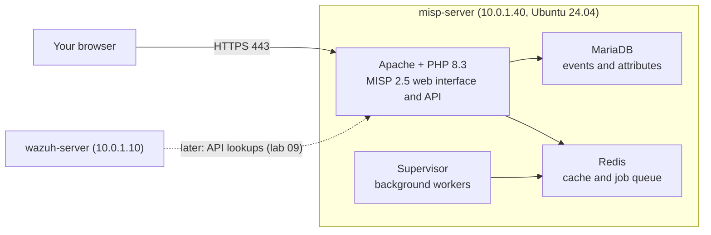

# MISP Threat Intelligence Platform

This guide installs **MISP 2.5** on its own Ubuntu 24.04 VM with the official install script, then covers the first login and the API key. The test adds one indicator in the web interface and finds it again through the MISP API.

- **MISP** (Malware Information Sharing Platform) stores and shares threat intelligence. It groups information into **events**. Each event holds **attributes**: indicators such as IP addresses, domains, URLs and file hashes.
- An **IOC** (indicator of compromise) is a clue that something may be malicious, such as a known bad IP or file hash.

What this lab installs:

| Part | What | Where |
|---|---|---|
| [A](#part-a-install-misp-25-with-the-official-script) | MISP 2.5 with the official script | misp-server |
| [B](#part-b-first-login-and-api-key) | First login, check the background workers, create an API key | misp-server, your browser |

## Table of contents

1. [Architecture](#1-architecture)
2. [What you need](#2-what-you-need)
3. [Installation steps](#3-installation-steps)
4. [Test](#4-test)
5. [Common problems](#5-common-problems)
6. [Next steps](#6-next-steps)

---

## 1. Architecture



- **Apache** is the web server, **PHP** runs MISP, **MariaDB** is the database, **Redis** is a fast in-memory store.
- **Supervisor** keeps MISP's **background workers** running (they fetch feeds and do other slow jobs).
- MISP runs on its own VM, separate from Wazuh. Lab 09 connects them.

---

## 2. What you need

No earlier lab is needed.

| VM | Role | Private IP | CPU / RAM / disk |
|---|---|---|---|
| misp-server | MISP 2.5 | 10.0.1.40 | 2 vCPU / 8 GB / 50 GB (MISP docs: "2+ cores and 8-16 GB"; disk is an assumption) |

**Ubuntu 24.04**, not 22.04 like the other labs: the official MISP 2.5 script runs only on Ubuntu 24.04.

| Placeholder | What it is | Example | Where to find it |
|---|---|---|---|
| `<VM_USER>` | The sudo user | `ubuntu` | Your login user |
| `<MISP_IP>` | Private IP of misp-server | `10.0.1.40` | `hostname -I` on misp-server |
| `<MISP_ADMIN_PASSWORD>` | MISP admin password | random | Printed at the end of [Step A2](#part-a-install-misp-25-with-the-official-script) |
| `<MISP_API_KEY>` | MISP API key (40 characters) | random | [Step B3](#part-b-first-login-and-api-key) |

**Never put the admin password or API key in this repository, a screenshot or a post.** Save both in a password manager.

---

## 3. Installation steps

### Part A. Install MISP 2.5 with the official script

**Run on:** misp-server, as `<VM_USER>`

**A1. Download the official script** (MISP GitHub repository, branch `2.5`):

```bash
curl -fsSL -o /tmp/INSTALL.ubuntu2404.sh https://raw.githubusercontent.com/MISP/MISP/2.5/INSTALL/INSTALL.ubuntu2404.sh
head -n 2 /tmp/INSTALL.ubuntu2404.sh
```

- Use the `raw.githubusercontent.com` address. A normal `github.com/.../blob/...` address downloads the HTML web page instead of the script.

**Check:**

```text
#!/bin/bash
# MISP 2.5 installation for Ubuntu 24.04 LTS
```

**A2. Run it:**

```bash
MISP_IP="10.0.1.40"   # CHANGE THIS: <MISP_IP>
sudo env MISP_DOMAIN="$MISP_IP" bash /tmp/INSTALL.ubuntu2404.sh
```

- The script installs Apache, PHP 8.3, MariaDB, Redis and Supervisor, downloads MISP into `/var/www/MISP`, creates the database, random passwords and a self-signed HTTPS certificate, and starts the workers. It takes 10 to 30 minutes.
- `MISP_DOMAIN` is the address MISP uses for its own links. Without it MISP uses `misp.local`, which your browser cannot find, and the login breaks (see [Common problems](#5-common-problems)).

**Check:** the last lines are similar to:

```text
[NOTICE] You can now access your MISP instance at https://10.0.1.40
[NOTICE] Username: admin@admin.test
[NOTICE] Password: <MISP_ADMIN_PASSWORD>
[NOTICE] MISP setup complete. Thank you, and have a very safe, and productive day.
```

Save the password now. The script also stores all generated secrets in `/root/misp_settings.txt` (root only).

**A3. Check the services:**

```bash
systemctl is-active apache2 mariadb redis-server supervisor
sudo supervisorctl status
```

Four times `active`, and every `misp-workers:...` line `RUNNING`.

### Part B. First login and API key

**B1. Log in.** Open `https://<MISP_IP>` in your browser, accept the self-signed certificate warning, and log in as `admin@admin.test` with `<MISP_ADMIN_PASSWORD>`. If MISP asks for a new password, set one and save it.

**B2. Check MISP's health page:** **Administration** → **Server Settings & Maintenance** → **Diagnostics** tab (no red items) and **Workers** tab (all green).

**B3. Create an API key:** **Administration** → **List Auth Keys** → **Add authentication key**. Choose the user, leave **Allowed IPs** empty for now, click **Submit**, and copy the key at once (it is shown only once). Save it as `<MISP_API_KEY>`.

---

## 4. Test

**4.1 Add an indicator in the web interface:**

1. **Event Actions** → **Add Event**: **Distribution** `Your organisation only`, **Threat Level** `Low`, **Analysis** `Initial`, **Event Info** `Lab 08 test event` → **Submit**.
2. **Add Attribute** (the `+` button): **Category** `Network activity`, **Type** `ip-dst`, **Value** `203.0.113.50` (a documentation IP), **For Intrusion Detection System** checked → **Submit**.
3. **Event Actions** → **Search Attributes**, enter `203.0.113.50` in **Containing the following expressions** → **Search**. One result shows your event.

**4.2 Find it through the API** (on misp-server):

```bash
sudo apt-get install -y jq
read -rsp "Paste the MISP API key: " MISP_KEY; echo
curl -sk -X POST "https://localhost/attributes/restSearch" \
  -H "Authorization: ${MISP_KEY}" -H "Accept: application/json" -H "Content-Type: application/json" \
  -d '{"value":"203.0.113.50"}' | jq -c '.response.Attribute[] | {event_id, type, value, to_ids}'
unset MISP_KEY
```

- `read -s` takes the key without showing it. `attributes/restSearch` is the MISP API search. `-k` accepts the self-signed certificate.

**Check:** similar to `{"event_id":"1","type":"ip-dst","value":"203.0.113.50","to_ids":true}`.

**The setup works when** the indicator is found in the web interface and through the API.

---

## 5. Common problems

| Problem | Fix |
|---|---|
| The script stops: `expects you to be running Ubuntu 24.04` | Use a VM with Ubuntu 24.04 |
| Login loops, or the browser console shows `CSRF token mismatch` / "black-holed" | MISP's own address (`MISP.baseurl`) does not match the address you browse. Set it: `sudo -u www-data /var/www/MISP/app/Console/cake Admin setSetting MISP.baseurl "https://<MISP_IP>"`, clear the browser cookies for MISP, log in again |
| "Add authentication key" says `the queried function returned an exception` | The MISP log shows `MySQL server has gone away`. Restart the services: `sudo systemctl restart mariadb redis-server apache2`. Or make a key on the command line: `sudo -u www-data /var/www/MISP/app/Console/cake User change_authkey admin@admin.test` |
| Database errors keep coming back | The VM may be short of memory: check `free -h` and `sudo dmesg -T \| tail`. Give the VM more RAM |

---

## 6. Next steps

- **Feeds and automatic fetching, and connecting MISP to Wazuh**: [lab 09](../09-wazuh-misp-lab/)
- **Events, attributes and correlation**: [Using the system](https://www.circl.lu/doc/misp/using-the-system/)
- **IOC context with tags and taxonomies** (source, threat, reliability): [Taxonomies](https://www.circl.lu/doc/misp/taxonomy/)
- **The MISP API**: [Automation API](https://www.circl.lu/doc/misp/automation/)
