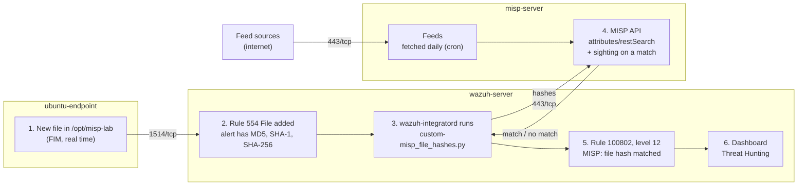

# Wazuh and MISP File Hash Integration

This guide connects Wazuh to MISP with the official **MISP/wazuh-integration** project. When a new file appears on an endpoint, Wazuh sends the file's hashes to MISP. If MISP knows one of the hashes as an indicator, Wazuh raises a level 12 alert. MISP also records a **sighting** (a "seen in our network" mark) on that indicator. It also turns on and schedules MISP's threat intelligence feeds, so MISP has indicators to match.

- A **hash** (MD5, SHA-1, SHA-256) is a fingerprint of a file's content. The same content always gives the same hash.
- An **IOC** (indicator of compromise) is a clue that something may be malicious, such as a known bad file hash. In MISP, IOCs are **attributes** inside **events**.

What this lab sets up:

| Part | What | Where |
|---|---|---|
| [A](#part-a-turn-on-and-schedule-misp-feeds) | Turn on MISP feeds and fetch them automatically every day | misp-server |
| [B](#part-b-create-a-misp-api-key-for-wazuh) | Create a MISP user and API key for Wazuh | misp-server |
| [C](#part-c-let-wazuh-reach-misp-securely) | Open MISP to the Wazuh server and give MISP a certificate Wazuh can check | misp-server, wazuh-server |
| [D](#part-d-watch-a-folder-on-the-endpoint) | Watch a folder on the endpoint (FIM) | ubuntu-endpoint |
| [E](#part-e-connect-wazuh-to-misp) | Install the integration script, rules and settings on the Wazuh server | wazuh-server |

## Table of contents

1. [Architecture](#1-architecture)
2. [What you need](#2-what-you-need)
3. [Firewall](#3-firewall)
4. [Installation and integration steps](#4-installation-and-integration-steps)
5. [Test](#5-test)
6. [Common problems](#6-common-problems)
7. [Next steps](#7-next-steps)

Files in this folder:

| File | Copy to | Used in |
|---|---|---|
| [`configs/server/misp_file_hashes.xml`](configs/server/misp_file_hashes.xml) | wazuh-server: `/var/ossec/etc/rules/misp_file_hashes.xml` | [Step E2](#part-e-connect-wazuh-to-misp) |

---

## 1. Architecture



- **wazuh-integratord** is the part of the Wazuh server that runs integrations. A **custom integration** is your own script in `/var/ossec/integrations/` whose name starts with `custom-`.
- The script sends only hashes to MISP, never the file.

---

## 2. What you need

| Already built | Used for |
|---|---|
| [01-wazuh-soc-lab](../01-wazuh-soc-lab/) | Wazuh 4.14 server and the agent `ubuntu-endpoint` (Active) |
| [08-misp-lab](../08-misp-lab/) | MISP 2.5 on `misp-server`, the admin login, HTTPS with a self-signed certificate |

| VM | Role | CPU / RAM / disk |
|---|---|---|
| wazuh-server | Wazuh manager, runs the integration | As in lab 01 |
| ubuntu-endpoint | Wazuh agent, watched folder | As in lab 01 |
| misp-server | MISP 2.5 (Ubuntu 24.04) | As in lab 08 |

Assumptions:

1. wazuh-server and misp-server are in the **same private network** (same VPC / virtual network). Wazuh reaches MISP on its private IP. If they are not, use the public IPs in Parts C and E, and allow wazuh-server's public IP instead.
2. The integration checks files added on **any** agent (rule 554). The new folder `/opt/misp-lab` is only for the test.
3. The official example also filters by MISP tags (`tlp:white`, `tlp:clear`, `malware`). This guide leaves that filter out, so every IOC flagged for detection counts, and the test needs no tags. See [Next steps](#7-next-steps).

| Placeholder | What it is | Example | Where to find it |
|---|---|---|---|
| `<VM_USER>` | The user you log in with on the VMs | `ubuntu` | AWS and Oracle Cloud: `ubuntu`. Azure and Google Cloud: the name you chose |
| `<WAZUH_SERVER_PUBLIC_IP>` | Public IP of wazuh-server | `198.51.100.10` | Cloud console |
| `<WAZUH_SERVER_PRIVATE_IP>` | Private IP of wazuh-server | `10.0.1.10` | `hostname -I` on wazuh-server (first address) |
| `<MISP_PUBLIC_IP>` | Public IP of misp-server | `198.51.100.40` | Cloud console |
| `<MISP_PRIVATE_IP>` | Private IP of misp-server | `10.0.1.40` | `hostname -I` on misp-server (first address) |
| `<WAZUH_MISP_API_KEY>` | API key of the MISP user `wazuh` (40 characters) | random | Printed in [Step B2](#part-b-create-a-misp-api-key-for-wazuh) |

**Keep the API key secret.** Save it in a password manager. Never put it in this repository, a screenshot or a post.

---

## 3. Firewall

| Direction | From | To | Port | Used for |
|---|---|---|---|---|
| Inbound **(new)** | wazuh-server (`<WAZUH_SERVER_PRIVATE_IP>/32`) | misp-server | 443/tcp | Hash lookups and sightings (MISP API) |
| Outbound | wazuh-server | misp-server | 443/tcp | Same connection (outbound is allowed by default) |
| Outbound | misp-server | feed sites (internet) | 443/tcp | Feed downloads (already allowed) |
| Inbound | ubuntu-endpoint | wazuh-server | 1514/tcp | Agent events (already open) |
| Outbound | ubuntu-endpoint | secure.eicar.org (internet) | 443/tcp | Test file download |

**Cloud firewall:** in misp-server's security group, add one inbound rule: TCP 443 from `<WAZUH_SERVER_PRIVATE_IP>/32`. The ufw rule is in [Step C1](#part-c-let-wazuh-reach-misp-securely).

---

## 4. Installation and integration steps

### Part A. Turn on and schedule MISP feeds

**A1. Turn on two default feeds.**

**Run on:** your browser, logged in to MISP (`https://<MISP_PUBLIC_IP>`) as admin

1. Go to **Sync Actions** → **Feeds**.
2. Click **Load default feed metadata**. A list of known public feeds appears. All are disabled.
3. Tick the boxes of **CIRCL OSINT Feed** and **The Botvrij.eu Data**.
4. Click **Enable selected**.
5. Click **Fetch and store all feed data**. MISP downloads the feeds as events in the background. The first run can take 10 to 30 minutes.

**Check:** go to **Administration** → **Jobs**. The `fetch_feeds` job shows progress and ends as completed. Then **Event Actions** → **List Events** shows many new events created by `CIRCL` and `Botvrij.eu`.

**A2. Fetch the feeds automatically every day.**

**Run on:** misp-server, as `<VM_USER>`

```bash
sudo tee /etc/cron.d/misp-fetch-feeds > /dev/null <<'EOF'
# Lab 09: fetch all enabled MISP feeds every day at 01:30 (server time)
30 1 * * * www-data /var/www/MISP/app/Console/cake Server fetchFeed 1 all > /dev/null 2>&1
EOF
```

- **cron** is the Linux task scheduler. Files in `/etc/cron.d/` run at the time they set.
- `cake Server fetchFeed 1 all` = fetch all enabled feeds as user ID 1 (the admin). It runs as `www-data`, the user that runs MISP.

**Check:**

```bash
cat /etc/cron.d/misp-fetch-feeds
```

The output shows the two lines above. The next fetch runs at 01:30 server time (`date` shows the server time).

### Part B. Create a MISP API key for Wazuh

**Run on:** misp-server, as `<VM_USER>`

Wazuh gets its own MISP user with the normal **User** role, not the admin key. If the key leaks, it cannot change MISP settings.

**B1. Create the user:**

```bash
sudo -u www-data /var/www/MISP/app/Console/cake User create wazuh@lab.local 3 1
```

- `wazuh@lab.local` = the new user (it never logs in to the web interface).
- `3` = role ID of the **User** role. It can search attributes and add sightings.
- `1` = ID of your organisation (the default organisation from lab 08). Wazuh can then see your organisation's events.

**Check:**

```text
User created.
```

**B2. Create the API key:**

```bash
sudo -u www-data /var/www/MISP/app/Console/cake User change_authkey wazuh@lab.local
```

**Check:** similar to:

```text
Old authentication keys disabled and new key created: <WAZUH_MISP_API_KEY>
```

The 40-character value at the end is `<WAZUH_MISP_API_KEY>`. **Save it in your password manager now.** You paste it in Step E3.

### Part C. Let Wazuh reach MISP securely

**C1. Allow the Wazuh server on the MISP firewall.**

**Run on:** misp-server, as `<VM_USER>`

```bash
WAZUH_PRIV="10.0.1.10"   # CHANGE THIS: <WAZUH_SERVER_PRIVATE_IP>
sudo ufw allow from "$WAZUH_PRIV" to any port 443 proto tcp comment 'Wazuh to MISP API'
sudo ufw status numbered
```

**Check:** a new line similar to `443/tcp  ALLOW IN  10.0.1.10  # Wazuh to MISP API`. Also add the cloud firewall rule from [section 3](#3-firewall).

**C2. Give MISP a certificate that names its IP addresses.**

**Run on:** misp-server, as `<VM_USER>`

The certificate from lab 08 has no **SAN** (Subject Alternative Name, the list of names and IPs a certificate is valid for). The integration script checks the certificate and rejects it without a matching SAN, and no alert arrives. This makes a new self-signed certificate that lists both IPs. It is saved over the old one, after a backup.

```bash
MISP_PRIV="10.0.1.40"       # CHANGE THIS: <MISP_PRIVATE_IP>
MISP_PUB="198.51.100.40"    # CHANGE THIS: <MISP_PUBLIC_IP>
sudo cp /etc/ssl/private/misp.local.crt /etc/ssl/private/misp.local.crt.bak
sudo cp /etc/ssl/private/misp.local.key /etc/ssl/private/misp.local.key.bak
sudo openssl req -newkey rsa:4096 -days 825 -nodes -x509 \
  -subj "/CN=${MISP_PUB}" \
  -addext "subjectAltName=IP:${MISP_PRIV},IP:${MISP_PUB}" \
  -keyout /etc/ssl/private/misp.local.key -out /etc/ssl/private/misp.local.crt
sudo systemctl restart apache2
```

- `/etc/ssl/private/misp.local.crt` and `.key` are the certificate files the MISP install script created and Apache uses.
- `-addext "subjectAltName=..."` puts both IPs into the certificate.

**Check:**

```bash
sudo openssl x509 -in /etc/ssl/private/misp.local.crt -noout -ext subjectAltName -fingerprint -sha256
```

Similar to:

```text
X509v3 Subject Alternative Name:
    IP Address:10.0.1.40, IP Address:198.51.100.40
sha256 Fingerprint=3A:5F:...:9C
```

Keep this window open: you compare the fingerprint in C3. Your browser shows a new certificate warning once. Accept it as in lab 08.

**C3. Store MISP's certificate on the Wazuh server.**

**Run on:** wazuh-server, as `<VM_USER>`

```bash
MISP_PRIV="10.0.1.40"   # CHANGE THIS: <MISP_PRIVATE_IP>
echo | openssl s_client -connect "${MISP_PRIV}:443" 2>/dev/null | openssl x509 | sudo tee /var/ossec/etc/misp-ca.pem > /dev/null
sudo chown root:wazuh /var/ossec/etc/misp-ca.pem
sudo chmod 640 /var/ossec/etc/misp-ca.pem
openssl x509 -in /var/ossec/etc/misp-ca.pem -noout -fingerprint -sha256
```

- `openssl s_client` connects to MISP and downloads its certificate. `openssl x509` keeps only the certificate part.
- The last line prints its fingerprint.

**Check 1:** the fingerprint is **exactly the same** as in C2. That proves you saved MISP's real certificate.

**Check 2:** Wazuh can reach MISP and trusts it:

```bash
curl -s --cacert /var/ossec/etc/misp-ca.pem -o /dev/null -w "%{http_code}\n" "https://${MISP_PRIV}/users/login"
```

```text
200
```

`000` = blocked by a firewall (C1 or the cloud rule). An SSL error = the certificate does not match (redo C2 and C3).

### Part D. Watch a folder on the endpoint

**Run on:** ubuntu-endpoint, as `<VM_USER>`

```bash
sudo mkdir -p /opt/misp-lab
sudo tee -a /var/ossec/etc/ossec.conf > /dev/null <<'EOF'

<ossec_config>
  <!-- Lab 09: watch /opt/misp-lab in real time; new files are checked against MISP -->
  <syscheck>
    <directories check_all="yes" realtime="yes">/opt/misp-lab</directories>
  </syscheck>
</ossec_config>
EOF
sudo systemctl restart wazuh-agent
```

- `tee -a` adds the block to the **end** of the agent's config file. Nothing already in the file changes.
- `check_all="yes"` includes the MD5, SHA-1 and SHA-256 hashes in every FIM alert. The integration needs them.

**Check** (wait about 2 minutes after the restart):

```bash
sudo grep "misp-lab" /var/ossec/logs/ossec.log | tail -n 1
sudo grep "(6009)" /var/ossec/logs/ossec.log | tail -n 1
```

Similar to:

```text
2026/10/02 20:40:10 wazuh-syscheckd: INFO: (6003): Monitoring path: '/opt/misp-lab', with options 'size | permissions | owner | group | mtime | inode | hash_md5 | hash_sha1 | hash_sha256 | realtime'.
2026/10/02 20:41:31 wazuh-syscheckd: INFO: (6009): File integrity monitoring scan ended.
```

### Part E. Connect Wazuh to MISP

**Run on:** wazuh-server, as `<VM_USER>`

**E1. Install the official integration script and allow a checked certificate:**

```bash
sudo curl -fsSL -o /var/ossec/integrations/custom-misp_file_hashes.py https://raw.githubusercontent.com/MISP/wazuh-integration/main/scripts/custom-misp_file_hashes.py
sudo sed -i 's/timeout=timeout,$/timeout=timeout, verify=json_options.get("ca_bundle", True),/' /var/ossec/integrations/custom-misp_file_hashes.py
sudo chown root:wazuh /var/ossec/integrations/custom-misp_file_hashes.py
sudo chmod 750 /var/ossec/integrations/custom-misp_file_hashes.py
```

- `curl` downloads the script from the official MISP project into the Wazuh integrations folder. The name must start with `custom-`, or Wazuh ignores it.
- `sed` adds one setting to the script's two connections to MISP. They now check MISP's certificate against the file from C3 (option `ca_bundle` in E3). The official script only trusts certificates from public authorities, so with lab 08's self-signed certificate every lookup fails and no alert appears.
- `chown` / `chmod 750` = Wazuh can run the script, other users cannot change it.

**Check:**

```bash
grep -c 'verify=json_options.get("ca_bundle", True),' /var/ossec/integrations/custom-misp_file_hashes.py
sudo ls -l /var/ossec/integrations/custom-misp_file_hashes.py
```

Similar to:

```text
2
-rwxr-x--- 1 root wazuh 13512 Oct  2 20:45 /var/ossec/integrations/custom-misp_file_hashes.py
```

`2` = both connections were changed. `0` = the official script changed. Open it with `sudo nano` and add `verify=json_options.get("ca_bundle", True),` after each `timeout=timeout,`.

**E2. Add the rules** (a new rules file, so `local_rules.xml` is not touched):

```bash
sudo tee /var/ossec/etc/rules/misp_file_hashes.xml > /dev/null <<'EOF'
<!--
  File:    /var/ossec/etc/rules/misp_file_hashes.xml
  Machine: wazuh-server
  Purpose: alerts for the MISP file hash integration (MISP/wazuh-integration).
           The official file uses rule ID 100803 twice; here the IDs are
           100800-100806 with no duplicates, plus one rule for any other error.
-->
<group name="misp,malware,">
  <rule id="100800" level="0">
    <decoded_as>json</decoded_as>
    <field name="integration">misp_file_hashes</field>
    <description>MISP: file hash check</description>
    <options>no_full_log</options>
  </rule>
  <rule id="100801" level="0">
    <if_sid>100800</if_sid>
    <field name="misp_file_hashes.found">^0$</field>
    <description>MISP: file hash not found</description>
  </rule>
  <rule id="100802" level="12">
    <if_sid>100800</if_sid>
    <field name="misp_file_hashes.found">^1$</field>
    <description>MISP: file hash matched - $(misp_file_hashes.source.file)</description>
  </rule>
  <rule id="100803" level="10">
    <if_sid>100800</if_sid>
    <field name="misp_file_hashes.error">^403$</field>
    <description>MISP ERROR: invalid API key or missing permissions (403)</description>
  </rule>
  <rule id="100804" level="10">
    <if_sid>100800</if_sid>
    <field name="misp_file_hashes.error">^429$</field>
    <description>MISP ERROR: rate limit exceeded, too many requests (429)</description>
  </rule>
  <rule id="100805" level="10">
    <if_sid>100800</if_sid>
    <field name="misp_file_hashes.error">^500$</field>
    <description>MISP ERROR: $(misp_file_hashes.description)</description>
  </rule>
  <rule id="100806" level="10">
    <if_sid>100800</if_sid>
    <field name="misp_file_hashes.error">\.+</field>
    <description>MISP ERROR: $(misp_file_hashes.description) ($(misp_file_hashes.error))</description>
  </rule>
</group>
EOF
sudo chown wazuh:wazuh /var/ossec/etc/rules/misp_file_hashes.xml
sudo chmod 660 /var/ossec/etc/rules/misp_file_hashes.xml
```

- The script sends its result back to Wazuh as JSON with the field `integration: misp_file_hashes`. Rule `100800` catches every result. `100802` raises a level 12 alert when `found` is `1` (match). `100801` (no match) is level 0, so no alert is shown. `100803` to `100806` alert on errors.

**E3. Add the integration** (run all lines in the same terminal):

```bash
MISP_PRIV="10.0.1.40"   # CHANGE THIS: <MISP_PRIVATE_IP>
read -rsp "Paste the MISP API key for Wazuh and press Enter: " MISP_KEY; echo
sudo tee -a /var/ossec/etc/ossec.conf > /dev/null <<EOF

<ossec_config>
  <!-- Lab 09: check the hashes of new files (rule 554) against MISP -->
  <integration>
    <name>custom-misp_file_hashes.py</name>
    <hook_url>https://${MISP_PRIV}</hook_url>
    <api_key>${MISP_KEY}</api_key>
    <group>syscheck</group>
    <rule_id>554</rule_id>
    <alert_format>json</alert_format>
    <options>{"timeout": 10, "retries": 3, "debug": false, "push_sightings": true, "sightings_source": "wazuh", "ca_bundle": "/var/ossec/etc/misp-ca.pem"}</options>
  </integration>
</ossec_config>
EOF
unset MISP_KEY
```

- `read -s` stores the key without showing it or saving it in the command history. `${MISP_KEY}` and `${MISP_PRIV}` are replaced by your values.
- `hook_url` = MISP's address. `api_key` = the key from B2.
- `group` and `rule_id` = only "file added" alerts (rule 554) are sent to the script.
- `options`: `push_sightings` adds a sighting in MISP for every match. `ca_bundle` = the MISP certificate from C3. `debug` = set to `true` when troubleshooting.

The key is now stored in `/var/ossec/etc/ossec.conf`. **Never upload that file to GitHub.**

**E4. Restart the Wazuh manager:**

```bash
sudo systemctl restart wazuh-manager
```

**Check 1:** the services run:

```bash
sudo /var/ossec/bin/wazuh-control status | grep -E "analysisd|integratord"
```

Similar to:

```text
wazuh-integratord is running...
wazuh-analysisd is running...
```

**Check 2:** the rules work. This sends one sample integration result through the rules without creating a real alert:

```bash
echo '{"misp_file_hashes": {"found": 1, "source": {"file": "/opt/misp-lab/eicar.com", "md5": "44d88612fea8a8f36de82e1278abb02f"}, "type": "md5", "value": "44d88612fea8a8f36de82e1278abb02f"}, "integration": "misp_file_hashes"}' | sudo /var/ossec/bin/wazuh-logtest
```

Similar to (shortened):

```text
**Phase 3: Completed filtering (rules).
        id: '100802'
        level: '12'
        description: 'MISP: file hash matched - /opt/misp-lab/eicar.com'
        groups: '['misp', 'malware']'
**Alert to be generated.
```

---

## 5. Test

The test puts the hash of the **EICAR test file** into MISP, then drops that file on the endpoint. EICAR is a harmless file that antivirus tools detect on purpose.

**5.1 Add the test IOC in MISP.**

**Run on:** your browser, logged in to MISP as admin

1. **Event Actions** → **Add Event**. Fill in **Distribution** `Your organisation only`, **Threat Level** `Low`, **Analysis** `Initial`, **Event Info** `Lab 09 EICAR test hash`. Click **Submit**.
2. Click **Add Attribute** (the `+` button). Fill in **Category** `Payload delivery`, **Type** `md5`, **Value** `44d88612fea8a8f36de82e1278abb02f`, and keep **For Intrusion Detection System** checked. Click **Submit**.

- The script only matches attributes with **For Intrusion Detection System** checked (`to_ids`), and only events the `wazuh` user's organisation can see.

**5.2 Drop the file on the endpoint.**

**Run on:** ubuntu-endpoint, as `<VM_USER>`

```bash
curl -sSLo /tmp/eicar.com https://secure.eicar.org/eicar.com
md5sum /tmp/eicar.com
sudo mv /tmp/eicar.com /opt/misp-lab/eicar.com
```

- `md5sum` prints `44d88612fea8a8f36de82e1278abb02f  /tmp/eicar.com`, the hash you added in MISP.
- `mv` puts the complete file into the watched folder in one step. A download straight into the folder can be seen while still empty, and an empty file's hash does not match.

**5.3 See the alert in the dashboard** (wait about 1 minute):

1. Open `https://<WAZUH_SERVER_PUBLIC_IP>` and log in.
2. Go to ☰ → **Threat intelligence** → **Threat Hunting** → **Events** tab.
3. Set the time range to **Last 15 minutes** and search:

```text
rule.id:(554 or 100802 or 100803 or 100804 or 100805 or 100806)
```

| Rule | Level | Description |
|---|---|---|
| 554 | 5 | File added to the system. |
| 100802 | 12 | MISP: file hash matched - /opt/misp-lab/eicar.com |

Open the 100802 alert (expand icon at the start of the row):

| Field | Meaning | Example |
|---|---|---|
| `data.misp_file_hashes.source.file` | File on the endpoint | `/opt/misp-lab/eicar.com` |
| `data.misp_file_hashes.type` / `value` | The MISP attribute that matched | `md5` / `44d88612fea8a8f36de82e1278abb02f` |
| `data.misp_file_hashes.event_uuid` | ID of the MISP event | `5f1c...` |
| `data.misp_file_hashes.permalink` | Link to the event in MISP | `https://10.0.1.40/events/view/...` |

The permalink uses the private IP. From your computer, open the same path with `https://<MISP_PUBLIC_IP>`.

**5.4 See the sighting in MISP:** open the event `Lab 09 EICAR test hash`. The md5 attribute now shows **1 sighting** (in the sightings column), with source `wazuh`. Wazuh reported back to MISP that the IOC was seen.

**5.5 Clean up:**

```bash
sudo rm /opt/misp-lab/eicar.com
```

**The integration works when** rule 100802 appears for `/opt/misp-lab/eicar.com` and MISP shows the sighting.

---

## 6. Common problems

| Problem | Fix |
|---|---|
| Rule 554 appears, but no 100802 | 1) In MISP, the attribute must have **For Intrusion Detection System** checked, in an event of your organisation. 2) Turn on the script log: set `"debug": true` in the `<options>` of E3 (`sudo nano /var/ossec/etc/ossec.conf`), restart the manager, repeat 5.2, then `sudo tail -n 30 /var/ossec/logs/integrations.log` |
| `integrations.log` shows `CERTIFICATE_VERIFY_FAILED` or `doesn't match` | Wazuh does not trust MISP's certificate. Redo C2 and C3. The fingerprints must match and C3 Check 2 must print `200` |
| `integrations.log` shows `timed out`, or C3 Check 2 prints `000` | A firewall blocks wazuh-server → misp-server on 443. Check ufw on misp-server (C1) and the cloud rule ([section 3](#3-firewall)) |
| Rule 100803 "invalid API key" | Make a new key (B2), put it between `<api_key>` and `</api_key>` with `sudo nano /var/ossec/etc/ossec.conf`, restart the manager |
| Files added in `/opt/vt-lab` (lab 04) or `/opt/yara-lab` (lab 05) are never checked | Files there raise rules 100300 / 100400, not 554. To check them too, change `<rule_id>554</rule_id>` to `<rule_id>554,100300,100400</rule_id>` and restart the manager |

---

## 7. Next steps

- **Act on a match automatically** (for example delete the file) with active response: [Active response](https://documentation.wazuh.com/current/user-manual/capabilities/active-response/index.html)
- **Only match IOCs with certain tags** (add `"tags": ["tlp:clear", "malware"]` to `<options>`, as in the official project): [MISP/wazuh-integration](https://github.com/MISP/wazuh-integration)
- **More feeds and feed settings**: [Managing feeds](https://www.circl.lu/doc/misp/managing-feeds/)
- **Sightings** (how MISP records where and when an IOC was seen): [Sightings](https://www.circl.lu/doc/misp/sightings/)
- **How Wazuh custom integrations work**: [Integration with external APIs](https://documentation.wazuh.com/current/user-manual/manager/integration-with-external-apis.html)
