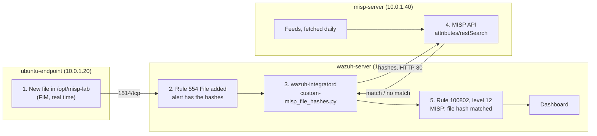

# Wazuh and MISP File Hash Integration

This guide connects Wazuh to MISP with the official **MISP/wazuh-integration** project. When a new file appears on an endpoint, Wazuh sends the file's hashes to MISP. If MISP knows one of the hashes as an indicator, Wazuh raises a level 12 alert. It also turns on MISP threat intelligence feeds and fetches them automatically every day.

- A **hash** (MD5, SHA-1, SHA-256) is a fingerprint of a file's content.
- An **IOC** (indicator of compromise) is a clue that something is malicious, such as a known bad hash. In MISP, IOCs are **attributes** inside **events**.
- A **feed** is a public list of IOCs that MISP downloads.

What this lab sets up:

| Part | What | Where |
|---|---|---|
| [A](#part-a-turn-on-and-schedule-misp-feeds) | Turn on MISP feeds and fetch them every day | misp-server |
| [B](#part-b-let-misp-answer-over-http) | Let MISP answer over plain HTTP on the private network | misp-server |
| [C](#part-c-watch-a-folder-on-the-endpoint) | Watch a folder on the endpoint (FIM) | ubuntu-endpoint |
| [D](#part-d-install-the-integration-on-the-wazuh-server) | Install the integration script, rules and settings | wazuh-server |

## Table of contents

1. [Architecture](#1-architecture)
2. [What you need](#2-what-you-need)
3. [Installation and integration steps](#3-installation-and-integration-steps)
4. [Test](#4-test)
5. [Common problems](#5-common-problems)
6. [Next steps](#6-next-steps)

Files in this folder:

| File | Copy to | Used in |
|---|---|---|
| [`configs/misp_file_hashes.xml`](configs/misp_file_hashes.xml) | wazuh-server: `/var/ossec/etc/rules/misp_file_hashes.xml` | [Step D2](#part-d-install-the-integration-on-the-wazuh-server) |

---

## 1. Architecture



- **wazuh-integratord** runs integrations on the Wazuh server. A **custom integration** is a script in `/var/ossec/integrations/` whose name starts with `custom-`.
- Only hashes are sent to MISP, never the file.

---

## 2. What you need

| Already built | Used for |
|---|---|
| [01-wazuh-soc-lab](../01-wazuh-soc-lab/) | Wazuh server and the agent `ubuntu-endpoint` |
| [08-misp-lab](../08-misp-lab/) | MISP 2.5 on `misp-server` and its admin login |

| VM | Role | Private IP | CPU / RAM / disk |
|---|---|---|---|
| wazuh-server | Wazuh manager, runs the integration | 10.0.1.10 | As in lab 01 |
| ubuntu-endpoint | Agent, watched folder | 10.0.1.20 | As in lab 01 |
| misp-server | MISP 2.5 | 10.0.1.40 | As in lab 08 |

| Placeholder | What it is | Example | Where to find it |
|---|---|---|---|
| `<VM_USER>` | The sudo user on the VMs | `ubuntu` | Your login user |
| `<MISP_IP>` | Private IP of misp-server | `10.0.1.40` | `hostname -I` on misp-server |
| `<MISP_API_KEY>` | MISP API key for Wazuh (40 characters) | random | [Step B3](#part-b-let-misp-answer-over-http) |

**Keep the API key secret.** Save it in a password manager.

---

## 3. Installation and integration steps

### Part A. Turn on and schedule MISP feeds

**A1. Turn on feeds.** In the MISP web interface (logged in as admin):

1. **Sync Actions** → **Feeds** → **Load default feed metadata**. A list of public feeds appears, all disabled.
2. Tick the feeds you want, for example **CIRCL OSINT Feed**, **The Botvrij.eu Data** and **Malware Bazaar** (file hashes), then click **Enable selected**.
3. Click **Fetch and store all feed data**. MISP downloads the feeds as events in the background. The first run can take 30 minutes or more.

**Check:** **Administration** → **Jobs** shows a `fetch_feeds` job that completes, and **Event Actions** → **List Events** shows the new feed events.

**A2. Fetch the feeds every day.**

**Run on:** misp-server, as `<VM_USER>`

```bash
sudo tee /etc/cron.d/misp-fetch-feeds > /dev/null <<'EOF'
# Lab 09: fetch all enabled MISP feeds every day at 01:30 (server time)
30 1 * * * www-data /var/www/MISP/app/Console/cake Server fetchFeed 1 all >> /var/www/MISP/app/tmp/logs/fetch-feeds.log 2>&1
EOF
```

- **cron** is the Linux task scheduler. `cake Server fetchFeed 1 all` is MISP's own command: fetch all enabled feeds as user 1 (the admin). The output goes to a log file in MISP's log folder.

**Check:** `cat /etc/cron.d/misp-fetch-feeds` shows the line. After the first night, `sudo tail /var/www/MISP/app/tmp/logs/fetch-feeds.log` shows the fetch.

### Part B. Let MISP answer over HTTP

The integration script only accepts certificates from public authorities. MISP's certificate is self-signed, so every lookup over HTTPS fails silently. In this lab MISP was therefore made to answer on plain HTTP, on the private network only. (Assumption: the exact commands were not recorded; these steps give the same result.)

**Run on:** misp-server, as `<VM_USER>`

**B1. Serve MISP on port 80 instead of redirecting to HTTPS:**

```bash
sudo cp /etc/apache2/sites-available/misp-ssl.conf /etc/apache2/sites-available/misp-ssl.conf.bak
sudo sed -i 's|^\(\s*\)Redirect permanent / https://.*$|\1DocumentRoot /var/www/MISP/app/webroot\n\1<Directory /var/www/MISP/app/webroot>\n\1    Options -Indexes\n\1    AllowOverride all\n\1    Require all granted\n\1</Directory>|' /etc/apache2/sites-available/misp-ssl.conf
sudo apache2ctl configtest && sudo systemctl restart apache2
```

- The install script's port 80 site only redirects to HTTPS. `sed` replaces that redirect with MISP's web folder, so port 80 serves MISP too.
- `apache2ctl configtest` checks the file before the restart.

**B2. Set MISP's own address to HTTP:**

```bash
MISP_IP="10.0.1.40"   # CHANGE THIS: <MISP_IP>
sudo -u www-data /var/www/MISP/app/Console/cake Admin setSetting MISP.baseurl "http://${MISP_IP}"
```

From now on, open MISP in your browser at `http://<MISP_IP>` (clear the browser cookies for MISP first).

**Check:**

```bash
curl -sI "http://${MISP_IP}/users/login" | head -n 1
```

`HTTP/1.1 200 OK` (not a redirect to `https://`).

**B3. Create the API key for Wazuh:** **Administration** → **List Auth Keys** → **Add authentication key**, comment `wazuh`, **Submit**, copy the key at once (shown only once) and save it as `<MISP_API_KEY>`.

### Part C. Watch a folder on the endpoint

**Run on:** ubuntu-endpoint, as `<VM_USER>` (official step: monitor a directory)

```bash
sudo mkdir -p /opt/misp-lab
sudo tee -a /var/ossec/etc/ossec.conf > /dev/null <<'EOF'

<ossec_config>
  <syscheck>
    <disabled>no</disabled>
    <directories check_all="yes" realtime="yes">/opt/misp-lab</directories>
  </syscheck>
</ossec_config>
EOF
sudo systemctl restart wazuh-agent
```

- `check_all="yes"` puts the MD5, SHA-1 and SHA-256 hashes in every FIM alert. The integration needs them.

**Check** (after about 2 minutes): `sudo grep "misp-lab" /var/ossec/logs/ossec.log | tail -n 1` shows similar to `(6003): Monitoring path: '/opt/misp-lab', with options '... | realtime'.`

### Part D. Install the integration on the Wazuh server

**Run on:** wazuh-server, as `<VM_USER>`

**D1. Download the official script from its raw URL:**

```bash
sudo curl -fsSL -o /var/ossec/integrations/custom-misp_file_hashes.py https://raw.githubusercontent.com/MISP/wazuh-integration/main/scripts/custom-misp_file_hashes.py
head -n 1 /var/ossec/integrations/custom-misp_file_hashes.py
sudo chmod 750 /var/ossec/integrations/custom-misp_file_hashes.py
sudo chown root:wazuh /var/ossec/integrations/custom-misp_file_hashes.py
```

- The name must start with `custom-`, or Wazuh ignores it.
- The README's download link opens the GitHub page. Saving that page gives an HTML file, not the script. `raw.githubusercontent.com` gives the real file.
- The official `chmod`/`chown` lines name the file `misp_file_hashes.py`. The real name is `custom-misp_file_hashes.py`.

**Check:** `head -n 1` prints `#!/var/ossec/framework/python/bin/python3`. If it prints `<!DOCTYPE html>`, you saved the web page; download again with the raw URL.

**D2. Add the rules file:**

```bash
sudo tee /var/ossec/etc/rules/misp_file_hashes.xml > /dev/null <<'EOF'
<!--
  File:    /var/ossec/etc/rules/misp_file_hashes.xml
  Machine: wazuh-server
  Purpose: rules for the official MISP/wazuh-integration file hash lookups.
           Same rules as the official file; the official file uses ID 100803
           twice, so the last two rules are 100804 and 100805 here.
-->
<group name="misp,malware,">
    <rule id="100800" level="0">
        <decoded_as>json</decoded_as>
        <description>MISP: file hash check</description>
        <field name="integration">misp_file_hashes</field>
        <options>no_full_log</options>
    </rule>
    <rule id="100801" level="0">
        <if_sid>100800</if_sid>
        <field name="misp_file_hashes.found">0</field>
        <description>MISP: file hash not found</description>
    </rule>
    <rule id="100802" level="12">
        <if_sid>100800</if_sid>
        <field name="misp_file_hashes.found">1</field>
        <description>MISP: file hash matched</description>
    </rule>
    <rule id="100803" level="10">
        <if_sid>100800</if_sid>
        <field name="misp_file_hashes.error">403</field>
        <description>MISP ERROR: Invalid MISP credentials, check that the api_key in the MISP integration is a valid MISP AuthKey</description>
    </rule>
    <rule id="100804" level="10">
        <if_sid>100800</if_sid>
        <field name="misp_file_hashes.error">429</field>
        <description>MISP ERROR: Rate limit exceeded, too many requests</description>
    </rule>
    <rule id="100805" level="10">
        <if_sid>100800</if_sid>
        <field name="misp_file_hashes.error">500</field>
        <description>MISP ERROR: $(misp_file_hashes.description)</description>
    </rule>
</group>
EOF
sudo chown wazuh:wazuh /var/ossec/etc/rules/misp_file_hashes.xml
sudo chmod 660 /var/ossec/etc/rules/misp_file_hashes.xml
```

- Without this file the script still runs, but no alert ever appears.
- `100802` (level 12) = a hash matched. `100801` (level 0, no alert) = not found. `100803`-`100805` = errors.

**D3. Add the integration** (run all lines in the same terminal):

```bash
MISP_IP="10.0.1.40"   # CHANGE THIS: <MISP_IP>
read -rsp "Paste the MISP API key: " MISP_KEY; echo
sudo tee -a /var/ossec/etc/ossec.conf > /dev/null <<EOF

<ossec_config>
  <integration>
    <name>custom-misp_file_hashes.py</name>
    <hook_url>http://${MISP_IP}</hook_url>
    <api_key>${MISP_KEY}</api_key>
    <group>syscheck</group>
    <rule_id>554</rule_id>
    <alert_format>json</alert_format>
    <options>{"timeout": 10, "retries": 3, "debug": false, "push_sightings": true, "sightings_source": "wazuh"}</options>
  </integration>
</ossec_config>
EOF
unset MISP_KEY
sudo /var/ossec/bin/wazuh-analysisd -t && sudo systemctl restart wazuh-manager
```

- `hook_url` = MISP's address, plain HTTP, no path (the script adds `/attributes/restSearch`).
- `group` + `rule_id` = only "file added" alerts (rule 554) go to the script.
- `options`: the official example also has `"tags": ["tlp:white", "tlp:clear", "malware"]`. With it, only IOCs carrying one of those tags match, and most feed and test events have none. It is left out here. `push_sightings` adds a "seen" mark in MISP for every match.
- `wazuh-analysisd -t` checks all rules before the restart.

The key is now in `/var/ossec/etc/ossec.conf`. **Never upload that file to GitHub.**

**Check:** `sudo grep "custom-misp_file_hashes" /var/ossec/logs/ossec.log | tail -n 1` shows similar to `wazuh-integratord: INFO: Enabling integration for: 'custom-misp_file_hashes.py'.`

---

## 4. Test

**4.1 Add the test IOC in MISP:** **Event Actions** → **Add Event** (**Event Info** `Lab 09 EICAR test hash`, **Distribution** `Your organisation only`) → **Add Attribute**: **Category** `Payload delivery`, **Type** `md5`, **Value** `44d88612fea8a8f36de82e1278abb02f`, **For Intrusion Detection System** checked → **Submit**.

- The script only matches attributes with **For Intrusion Detection System** checked (`to_ids`). `44d886...` is the MD5 of the harmless EICAR test file.

**4.2 Drop the file on the endpoint:**

```bash
curl -sSLo /tmp/eicar.com https://secure.eicar.org/eicar.com
sudo mv /tmp/eicar.com /opt/misp-lab/eicar.com
```

- `mv` puts the complete file into the folder in one step. A download straight into the folder is first seen as an empty file, whose hash does not match.

**4.3 See the alert:** ☰ → **Threat intelligence** → **Threat Hunting** → **Events** tab, time range **Last 15 minutes**, search:

```text
rule.id:(554 or 100802 or 100803 or 100804 or 100805)
```

| Rule | Level | Description |
|---|---|---|
| 554 | 5 | File added to the system. |
| 100802 | 12 | MISP: file hash matched |

Open 100802: `data.misp_file_hashes.source.file` = the file, `data.misp_file_hashes.value` = the matched hash, `data.misp_file_hashes.permalink` = link to the MISP event. In MISP, the md5 attribute now shows a sighting from `wazuh`.

Clean up: `sudo rm /opt/misp-lab/eicar.com`.

**The integration works when** rule 100802 appears for `/opt/misp-lab/eicar.com`.

---

## 5. Common problems

These all happened in this lab. None of them shows an obvious error.

| Problem | Fix |
|---|---|
| Nothing happens at all | The script is an HTML page (`head -n 1` shows `<!DOCTYPE html>`). Download it again with the raw URL (D1) |
| Script runs (see below) but no alert | The rules file is missing. Do D2 and restart the manager |
| `integrations.log` shows a certificate or SSL error, or a redirect loop | MISP is still reached over HTTPS or redirects to it. Do Part B and use `http://` in `hook_url` |
| Everything runs, MISP has the hash, but rule 100801 (not found) | The attribute does not have **For Intrusion Detection System** checked, the event is in another organisation, or the `tags` option is still in D3 |
| Rule 100803 | Wrong API key. Make a new one (B3), fix it in `/var/ossec/etc/ossec.conf`, restart the manager |

To see what the script does: set `"debug": true` in the `<options>`, restart the manager, repeat 4.2, then `sudo tail -n 30 /var/ossec/logs/integrations.log`.

---

## 6. Next steps

- **The official project and its options**: [MISP/wazuh-integration](https://github.com/MISP/wazuh-integration)
- **Delete a matched file automatically**: [Active response](https://documentation.wazuh.com/current/user-manual/capabilities/active-response/index.html)
- **More feeds and feed settings**: [Managing feeds](https://www.circl.lu/doc/misp/managing-feeds/)
- **Sightings**: [Sightings](https://www.circl.lu/doc/misp/sightings/)
