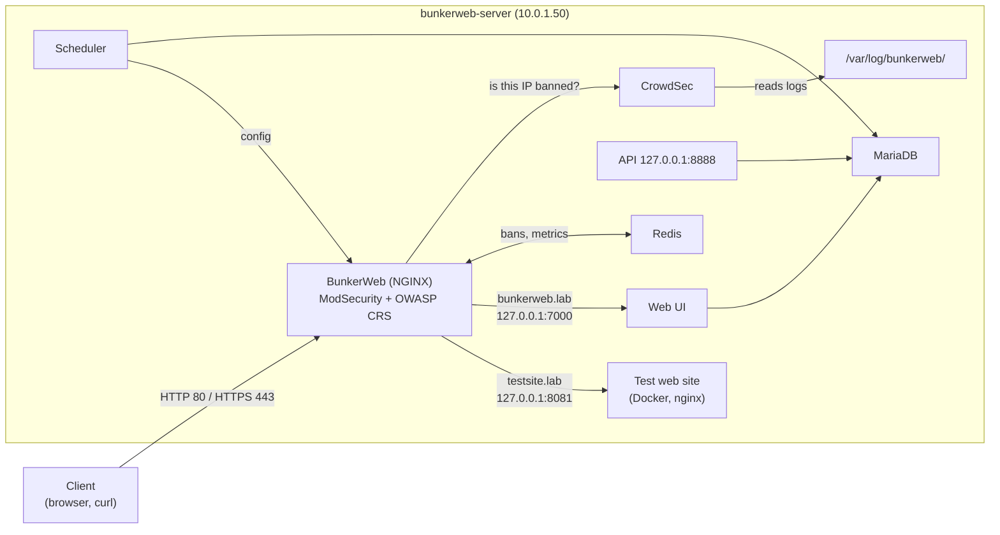

# BunkerWeb WAF Full Stack

This guide replaces a standalone nginx web server with **BunkerWeb 1.6.13**, installed directly on Linux with the official install script. It installs the full stack (BunkerWeb, Scheduler, Web UI and API) together with **CrowdSec**, **Redis** and **MariaDB**. A test web site then runs behind BunkerWeb: **Client → WAF / reverse proxy → web application**. The test shows BunkerWeb blocking a SQL injection and CrowdSec blocking an IP.

- A **WAF** (web application firewall) checks every HTTP request and blocks attacks before they reach the application.
- A **reverse proxy** receives the client's request and fetches the answer from the real application in the background.
- **BunkerWeb** is an open-source WAF built on NGINX, with **ModSecurity** and the **OWASP CRS** (Core Rule Set, free attack-detection rules).

What this lab installs and sets up:

| Part | What | Where |
|---|---|---|
| [A](#part-a-retire-the-old-nginx) | Back up and remove the old standalone nginx | bunkerweb-server |
| [B](#part-b-install-the-bunkerweb-full-stack) | BunkerWeb 1.6.13 full stack + CrowdSec + Redis + MariaDB + API | bunkerweb-server |
| [C](#part-c-finish-the-setup-wizard) | Setup wizard: Web UI admin and address | your browser |
| [D](#part-d-turn-on-api-authentication) | API login | bunkerweb-server |
| [E](#part-e-put-a-web-site-behind-bunkerweb) | A test web site behind BunkerWeb | bunkerweb-server, Web UI |

## Table of contents

1. [Architecture](#1-architecture)
2. [What you need](#2-what-you-need)
3. [Installation steps](#3-installation-steps)
4. [Test](#4-test)
5. [Common problems](#5-common-problems)
6. [Next steps](#6-next-steps)

Files in this folder:

| File | Copy to (on bunkerweb-server) | Used in |
|---|---|---|
| [`configs/docker-compose.yml`](configs/docker-compose.yml) | `~/testsite/docker-compose.yml` | [Step E1](#part-e-put-a-web-site-behind-bunkerweb) |
| [`configs/index.html`](configs/index.html) | `~/testsite/html/index.html` | [Step E1](#part-e-put-a-web-site-behind-bunkerweb) |

---

## 1. Architecture



| Component | Job |
|---|---|
| BunkerWeb | The WAF and reverse proxy. The only part clients talk to (ports 80/443) |
| Scheduler | Reads all settings, runs jobs, pushes the config to BunkerWeb |
| Web UI | Web interface for services, settings, bans and reports. It runs behind BunkerWeb |
| API | REST API for scripts (local only) |
| MariaDB | Stores all settings |
| Redis | Stores bans and metrics |
| CrowdSec | Reads BunkerWeb's logs and knows bad IPs. BunkerWeb asks it about every client IP (the **bouncer**) |

---

## 2. What you need

No earlier lab is needed. BunkerWeb runs on its own VM: the one that ran the old nginx.

| VM | Role | Private IP | CPU / RAM / disk |
|---|---|---|---|
| bunkerweb-server | BunkerWeb full stack, CrowdSec, Redis, MariaDB, test site | 10.0.1.50 | 4 vCPU / 8 GB / 25 GB (BunkerWeb's minimum for testing is 2 vCPU / 8 GB) |

Assumptions:

1. The exact install command was not recorded. This guide uses the official easy-install script with the components from the post.
2. Ubuntu 22.04 or 24.04 (both supported by BunkerWeb 1.6.13).
3. No public DNS name: the Web UI and the test site are reached by names in your computer's `hosts` file, over HTTP. HTTPS with a free certificate on a private IP needs Let's Encrypt **DNS-01**, a later step.

| Placeholder | What it is | Example | Where to find it |
|---|---|---|---|
| `<VM_USER>` | The sudo user | `ubuntu` | Your login user |
| `<BUNKERWEB_IP>` | Private IP of bunkerweb-server | `10.0.1.50` | `hostname -I` on bunkerweb-server |
| `<UI_ADMIN_PASSWORD>` | Web UI admin password | you choose it | [Step C1](#part-c-finish-the-setup-wizard) |
| `<API_PASSWORD>` | API password | random | [Step D1](#part-d-turn-on-api-authentication) |

Save the UI password, the API password and the database password (printed in B3) in a password manager. Never put them in this repository.

---

## 3. Installation steps

### Part A. Retire the old nginx

**Run on:** bunkerweb-server, as `<VM_USER>`

BunkerWeb installs its own NGINX version. Ubuntu's nginx must be removed first: the two packages cannot be installed together, and only one program can use ports 80/443.

```bash
sudo systemctl stop nginx
sudo tar -czf ~/nginx-backup-$(date +%F).tar.gz /etc/nginx /var/www/html
sudo apt-get purge -y nginx nginx-common nginx-core
sudo apt-get autoremove -y
```

- `tar` saves the old config and site into one file in your home folder.
- `apt-get purge` removes Ubuntu's nginx packages.

**Check:**

```bash
dpkg -l | grep -i nginx || echo "no nginx packages left"
sudo ss -tlnp | grep -E ':80 |:443 ' || echo "ports 80 and 443 are free"
```

### Part B. Install the BunkerWeb full stack

**Run on:** bunkerweb-server, as `<VM_USER>`

**B1. Download the official script and check it:**

```bash
cd ~
curl -fsSL -O https://github.com/bunkerity/bunkerweb/releases/download/v1.6.13/install-bunkerweb.sh
curl -fsSL -O https://github.com/bunkerity/bunkerweb/releases/download/v1.6.13/install-bunkerweb.sh.sha256
sha256sum -c install-bunkerweb.sh.sha256
```

**Check:** `install-bunkerweb.sh: OK`. Do not run the script if it says `FAILED`.

**B2. Run it with all components:**

```bash
BW_IP="10.0.1.50"   # CHANGE THIS: <BUNKERWEB_IP>
chmod +x install-bunkerweb.sh
sudo ./install-bunkerweb.sh --yes --version 1.6.13 --full --api --crowdsec --redis --database mariadb --server-ip "$BW_IP"
```

| Option | Meaning |
|---|---|
| `--yes` | Default answer for every question |
| `--full` | BunkerWeb + Scheduler + Web UI, with the setup wizard |
| `--api` | Also install and enable the API service |
| `--crowdsec` | Install CrowdSec, make it read BunkerWeb's logs, connect BunkerWeb to it |
| `--redis` | Install Redis locally and connect BunkerWeb to it |
| `--database mariadb` | Install MariaDB locally instead of the default SQLite file |
| `--server-ip` | IP shown in the links at the end |

The script installs NGINX and BunkerWeb from their official repositories and locks both versions (`apt-mark hold`). It takes 5 to 15 minutes.

**B3. Save the database password** from the block the script prints at the end (`💾 Database (auto-installed)` ... `Password: ...`). It is also stored in `/etc/bunkerweb/variables.env`.

**Check:**

```bash
systemctl is-active bunkerweb bunkerweb-scheduler bunkerweb-ui crowdsec mariadb redis-server
redis-cli ping
sudo cscli bouncers list
```

Six times `active`, `PONG` from Redis, and a bouncer line similar to `crowdsec-bunkerweb-bouncer/v1.6   127.0.0.1   ✔️`.

### Part C. Finish the setup wizard

**C1. Add the lab names to your computer's hosts file.** On Windows, open Notepad as administrator, open `C:\Windows\System32\drivers\etc\hosts` and add:

```text
10.0.1.50   bunkerweb.lab testsite.lab
```

(Use your `<BUNKERWEB_IP>`.) On Linux or macOS the file is `/etc/hosts`.

**C2. Run the wizard.** Open `https://<BUNKERWEB_IP>/setup` and accept the certificate warning (temporary self-signed certificate).

1. Enter the **administrator username, email and password** (`<UI_ADMIN_PASSWORD>`: at least 8 characters with lowercase, uppercase, a digit and a special character) → **Next**.
2. **Server name**: `bunkerweb.lab`. Turn **Let's Encrypt** off (it cannot check a private name).
3. On the overview page, click **Setup**.

**Check:** `http://bunkerweb.lab/` opens the BunkerWeb login. Log in. The **Instances** page shows the local instance up, and **Plugins** lists **CrowdSec** and **Redis**.

### Part D. Turn on API authentication

**Run on:** bunkerweb-server, as `<VM_USER>`

The API only starts when it has a login method.

```bash
API_PASS="$(openssl rand -base64 24 | tr -d '/+=')Aa1!"
echo "API password (save it now): $API_PASS"
printf 'API_USERNAME=apiadmin\nAPI_PASSWORD=%s\n' "$API_PASS" | sudo tee -a /etc/bunkerweb/api.env > /dev/null
unset API_PASS
sudo systemctl restart bunkerweb-api
```

- Line 1 makes a random password; `Aa1!` adds every character type the API requires. Save it as `<API_PASSWORD>`.
- The API listens only on `127.0.0.1:8888`.

**Check:**

```bash
systemctl is-active bunkerweb-api
curl -s http://127.0.0.1:8888/ping
```

```text
active
{"status":"ok","message":"pong"}
```

### Part E. Put a web site behind BunkerWeb

**E1. Start the test web site in Docker.**

**Run on:** bunkerweb-server, as `<VM_USER>`

```bash
sudo apt-get install -y docker.io docker-compose-v2
sudo systemctl enable --now docker
mkdir -p ~/testsite/html
cat > ~/testsite/html/index.html <<'EOF'
<!DOCTYPE html>
<html>
<head><meta charset="UTF-8"><title>BunkerWeb Test Site</title></head>
<body style="font-family:sans-serif;text-align:center;margin-top:15%">
  <h1>Test site is working</h1>
  <p>You reached this page through BunkerWeb.</p>
</body>
</html>
EOF
cat > ~/testsite/docker-compose.yml <<'EOF'
# File:    ~/testsite/docker-compose.yml
# Machine: bunkerweb-server
# Purpose: a small test web site (the "web application") that BunkerWeb protects.
#          It listens only on 127.0.0.1:8081, so the only way in is through BunkerWeb.
services:
  testsite:
    image: nginx:alpine          # a small web server
    container_name: testsite
    ports:
      - "127.0.0.1:8081:80"      # only reachable from this VM itself
    volumes:
      - ./html:/usr/share/nginx/html:ro   # serve your page, read-only
    restart: unless-stopped
EOF
cd ~/testsite && sudo docker compose up -d
```

- The site is a small nginx container that only listens on `127.0.0.1:8081`. Only BunkerWeb on the same VM can reach it.

**Check** (if the first try says `Connection reset by peer`, wait a few seconds and repeat):

```bash
curl -s http://127.0.0.1:8081 | grep h1
```

```text
  <h1>Test site is working</h1>
```

**E2. Add the service in the Web UI:** **Services** → **Create new service** → **Raw** mode. Enter:

```text
SERVER_NAME=testsite.lab
USE_REVERSE_PROXY=yes
REVERSE_PROXY_HOST=http://127.0.0.1:8081
REVERSE_PROXY_URL=/
```

Click **Save**. `testsite.lab` appears in the services list.

**Check:** `http://testsite.lab/` in your browser shows "Test site is working".

---

## 4. Test

Run the tests from another VM on the lab network (for example wazuh-server) or from your computer. Do each test once or twice only: BunkerWeb bans an IP that causes many blocked requests.

**4.1 WAF: an attack is blocked.**

```bash
VM=10.0.1.50   # CHANGE THIS: <BUNKERWEB_IP>
curl -s -o /dev/null -w "%{http_code}\n" -H "Host: testsite.lab" "http://$VM/"
curl -s -o /dev/null -w "%{http_code}\n" -H "Host: testsite.lab" "http://$VM/?id=1%27%20OR%20%271%27=%271"
```

- `-H "Host: testsite.lab"` tells BunkerWeb which service you want, without needing the hosts file.
- The second request is a SQL injection (`?id=1' OR '1'='1`).

**Check:**

```text
200
403
```

In the Web UI, **Reports** lists the blocked request with your IP and the reason **modsecurity**.

**4.2 CrowdSec: a banned IP is blocked.** On bunkerweb-server, ban the IP you test from for 2 minutes:

```bash
TEST_IP="10.0.1.10"   # CHANGE THIS: the IP of the machine you run curl from
sudo cscli decisions add --ip "$TEST_IP" --duration 2m --reason "lab 10 test"
```

Repeat the first `curl` from 4.1: it now returns `403`. Remove the ban:

```bash
sudo cscli decisions delete --ip "$TEST_IP"
```

**The setup works when** the normal request returns 200, the attack returns 403 and appears in **Reports**, and the CrowdSec ban blocks the site until it is removed.

---

## 5. Common problems

| Problem | Fix |
|---|---|
| The script stops because nginx is installed or ports 80/443 are in use | Part A was not finished. Run its check |
| Every request suddenly returns 403 | You were banned (bad behavior or CrowdSec). Check `sudo bwcli bans` and `sudo cscli decisions list`. Unban with `sudo bwcli unban <IP>` or `sudo cscli decisions delete --ip <IP>` |
| `testsite.lab` returns 502 | BunkerWeb cannot reach the site: `sudo docker ps` must show `testsite` running, and `curl http://127.0.0.1:8081` must work |
| `bunkerweb-api` is not active | `/etc/bunkerweb/api.env` needs `API_USERNAME` and `API_PASSWORD` (Part D). Errors: `sudo journalctl -u bunkerweb-api -n 30` |
| Changes in the UI do not seem to apply | Wait for the Scheduler (about a minute). Logs: `sudo tail -n 50 /var/log/bunkerweb/scheduler.log` |

---

## 6. Next steps

- **GeoIP restrictions** (allow or block countries): [Country](https://docs.bunkerweb.io/latest/features/#country)
- **Rate limiting**: [Limit](https://docs.bunkerweb.io/latest/features/#limit)
- **Bot protection**: [Antibot](https://docs.bunkerweb.io/latest/features/#antibot)
- **ModSecurity and the OWASP CRS** (paranoia level, false positives): [ModSecurity](https://docs.bunkerweb.io/latest/features/#modsecurity)
- **Free HTTPS on a private IP** (Let's Encrypt DNS-01): [Let's Encrypt](https://docs.bunkerweb.io/latest/features/#lets-encrypt)
- **CrowdSec options**: [CrowdSec](https://docs.bunkerweb.io/latest/features/#crowdsec)
