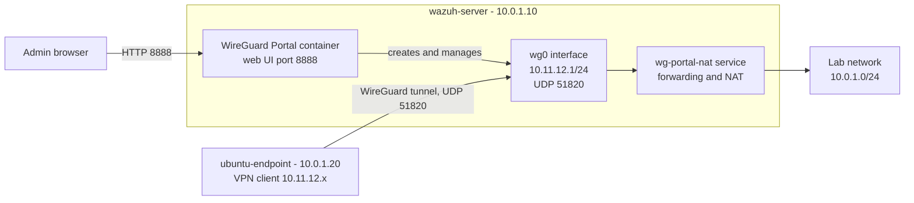

# Lab 11: WireGuard Portal VPN on the Wazuh Server

This lab adds a VPN (a private, encrypted tunnel into the lab network) to the Wazuh server. It uses **WireGuard**, a fast VPN built into the Linux kernel, and **WireGuard Portal**, a web page that creates WireGuard interfaces and users for you. Everything runs on private IPs.

What this lab installs:

- [Part A: Install Docker](#part-a-install-docker)
- [Part B: Install WireGuard Portal](#part-b-install-wireguard-portal)

---

## Architecture



---

## What you need

### Existing labs used

| Lab | What it gives this lab |
|-----|------------------------|
| [01-wazuh-soc-lab](../01-wazuh-soc-lab/) | `wazuh-server` (runs WireGuard Portal) and `ubuntu-endpoint` (test VPN client) |

### VMs

| Name | Role | Private IP | CPU | RAM | Disk |
|------|------|------------|-----|-----|------|
| wazuh-server | Wazuh server from lab 01, now also runs Docker and WireGuard Portal | 10.0.1.10 | Same as lab 01 | Same as lab 01 | Same as lab 01 |
| ubuntu-endpoint | Test VPN client | 10.0.1.20 | Same as lab 01 | Same as lab 01 | Same as lab 01 |

Both VMs run Ubuntu 22.04. WireGuard Portal adds very little load (assumption).

### Placeholders

Replace these everywhere you see them.

| Placeholder | Example | Where to find it |
|-------------|---------|------------------|
| `<WAZUH_SERVER_IP>` | `10.0.1.10` | Run `hostname -I` on wazuh-server. Use the first address. |
| `<UBUNTU_ENDPOINT_IP>` | `10.0.1.20` | Run `hostname -I` on ubuntu-endpoint. |
| `<VM_USER>` | `ubuntu` | The user you log in to the VMs with. |
| `<NIC_MTU>` | `1450` | Printed in [Step B1](#step-b1-check-the-network-card-and-ports). |
| `<WG_MTU>` | `1370` | `<NIC_MTU>` minus 80. |
| `<WG_PORTAL_ADMIN_PASSWORD>` | random, 24 characters | Printed in [Step B3](#step-b3-write-the-wireguard-portal-settings). |
| `<SESSION_SECRET>`, `<CSRF_SECRET>` | random, 64 characters | Created for you in Step B3. You never type them. |

The VPN network is always `10.11.12.0/24`, and the server's VPN address is always `10.11.12.1`.

### Files in this folder

| File | Goes to (on wazuh-server) | Used in |
|------|---------------------------|---------|
| [configs/networkd-wg-portal.conf](configs/networkd-wg-portal.conf) | `/etc/systemd/networkd.conf.d/wg-portal.conf` | Step B2 |
| [configs/config.yaml](configs/config.yaml) | `/opt/wg-portal/config/config.yaml` | Step B3 |
| [configs/docker-compose.yml](configs/docker-compose.yml) | `/opt/wg-portal/docker-compose.yml` | Step B4 |
| [configs/wg-portal-nat.sh](configs/wg-portal-nat.sh) | `/usr/local/sbin/wg-portal-nat.sh` | Step B5 |
| [configs/wg-portal-nat.service](configs/wg-portal-nat.service) | `/etc/systemd/system/wg-portal-nat.service` | Step B5 |

---

## Part A: Install Docker

**Docker** runs programs in **containers**: small, isolated packages that hold a program and everything it needs. This part follows the official Docker guide for Ubuntu.

### Step A1: Check if Docker is already installed

Run on: **wazuh-server**

```bash
docker compose version    # prints the Docker Compose version if Docker is installed
```

If this prints a version, Docker is already installed. Skip to [Part B](#part-b-install-wireguard-portal).

### Step A2: Add the Docker repository

Run on: **wazuh-server**

```bash
sudo apt update                                         # refresh the package list
sudo apt install -y ca-certificates curl                # tools to download over HTTPS
sudo install -m 0755 -d /etc/apt/keyrings               # make the folder for signing keys
sudo curl -fsSL https://download.docker.com/linux/ubuntu/gpg -o /etc/apt/keyrings/docker.asc   # download Docker's signing key
sudo chmod a+r /etc/apt/keyrings/docker.asc             # let apt read the key

# tell apt where Docker's packages are
sudo tee /etc/apt/sources.list.d/docker.sources <<EOF
Types: deb
URIs: https://download.docker.com/linux/ubuntu
Suites: $(. /etc/os-release && echo "${UBUNTU_CODENAME:-$VERSION_CODENAME}")
Components: stable
Architectures: $(dpkg --print-architecture)
Signed-By: /etc/apt/keyrings/docker.asc
EOF

sudo apt update                                         # load the new repository
```

### Step A3: Install Docker

Run on: **wazuh-server**

```bash
sudo apt install -y docker-ce docker-ce-cli containerd.io docker-buildx-plugin docker-compose-plugin   # install Docker and Compose
```

**Check:**

```bash
sudo docker run hello-world    # runs a tiny test container
```

Expected output contains:

```
Hello from Docker!
```

---

## Part B: Install WireGuard Portal

WireGuard Portal runs in a container that uses the VM's own network (**host network mode**). The WireGuard interface it creates, `wg0`, lives on the VM itself.

### Step B1: Check the network card and ports

Run on: **wazuh-server**

```bash
ip -4 route show default    # shows the main network card name after "dev"
ip link show $(ip -4 route show default | awk '{print $5; exit}') | grep -o 'mtu [0-9]*'   # shows that card's MTU
sudo ss -tulpn | grep -E ':(8888|8787|51820)\b'    # checks that ports 8888, 8787 and 51820 are free
ip link show type wireguard                         # checks that no WireGuard interface exists yet
```

**MTU** is the biggest packet a network card sends in one piece. Write down the number as `<NIC_MTU>`. Your WireGuard MTU is `<NIC_MTU>` minus 80, because WireGuard adds up to 80 bytes to each packet. Write that down as `<WG_MTU>`.

**Check:** the second command prints something similar to `mtu 1450`. The last two commands print nothing.

### Step B2: Prepare the VM for WireGuard

Run on: **wazuh-server**

```bash
sudo apt update && sudo apt install -y wireguard-tools    # installs the "wg" command for checking tunnels
sudo modprobe wireguard                                   # loads the WireGuard kernel module now
echo wireguard | sudo tee /etc/modules-load.d/wireguard.conf    # loads it again after every reboot
echo 'net.ipv4.ip_forward=1' | sudo tee /etc/sysctl.d/99-wg-portal.conf   # lets the VM pass packets between networks
sudo sysctl --system | grep ip_forward                    # applies that setting now
```

Then stop **systemd-networkd** (the Ubuntu service that manages network cards) from deleting routes that WireGuard Portal creates. This file is [configs/networkd-wg-portal.conf](configs/networkd-wg-portal.conf).

```bash
sudo mkdir -p /etc/systemd/networkd.conf.d      # make the settings folder
sudo tee /etc/systemd/networkd.conf.d/wg-portal.conf >/dev/null <<'EOF'
[Network]
ManageForeignRoutingPolicyRules=no
ManageForeignRoutes=no
EOF
```

You do not need to restart systemd-networkd. It reads this file the next time it starts.

**Check:**

```bash
lsmod | grep wireguard       # the module is loaded
sysctl net.ipv4.ip_forward   # forwarding is on
```

Expected output similar to:

```
wireguard             114688  0
net.ipv4.ip_forward = 1
```

### Step B3: Write the WireGuard Portal settings

Run on: **wazuh-server**

This creates the folders, makes random secrets, and writes the settings file. The full file is [configs/config.yaml](configs/config.yaml).

```bash
sudo mkdir -p /opt/wg-portal/{config,data} /etc/wireguard   # folders for settings, data and WireGuard files
SERVER_IP=<WAZUH_SERVER_IP>                 # CHANGE THIS
ADMIN_PASS=$(openssl rand -base64 18)       # random admin password, 24 characters
SESSION_SECRET=$(openssl rand -hex 32)      # random secret for login sessions
CSRF_SECRET=$(openssl rand -hex 32)         # random secret that protects web forms
echo "Admin password: $ADMIN_PASS"          # shows the admin password once

# write the settings file using the values above
sudo tee /opt/wg-portal/config/config.yaml >/dev/null <<EOF
core:
  admin_user: admin@wgportal.local
  admin_password: "$ADMIN_PASS"
  import_existing: true
  restore_state: true

advanced:
  start_listen_port: 51820
  start_cidr_v4: 10.11.12.0/24
  use_ip_v6: false
  config_storage_path: /etc/wireguard

statistics:
  listening_address: "127.0.0.1:8787"

web:
  listening_address: ":8888"
  external_url: http://$SERVER_IP:8888
  session_secret: "$SESSION_SECRET"
  csrf_secret: "$CSRF_SECRET"
  request_logging: true
EOF

sudo chmod 600 /opt/wg-portal/config/config.yaml    # only root can read the file
```

What the important settings mean:

- `admin_password`: must be at least 16 characters, or WireGuard Portal refuses it.
- `start_cidr_v4`: the VPN network. Clients get addresses from `10.11.12.0/24`.
- `external_url`: the exact address you open in the browser. If it doesn't match, login fails.
- `config_storage_path`: WireGuard Portal also saves a copy of `wg0.conf` here. Don't start it with `wg-quick`.
- `127.0.0.1:8787`: the statistics page only listens on the VM itself.

Save the admin password in your password manager. Never put it in the repo.

**Check:**

```bash
sudo grep external_url /opt/wg-portal/config/config.yaml    # shows the address you set
```

Expected output similar to:

```
  external_url: http://10.0.1.10:8888
```

### Step B4: Start WireGuard Portal

Run on: **wazuh-server**

This file is [configs/docker-compose.yml](configs/docker-compose.yml).

```bash
# describe the container
sudo tee /opt/wg-portal/docker-compose.yml >/dev/null <<'EOF'
services:
  wg-portal:
    image: wgportal/wg-portal:v2
    container_name: wg-portal
    restart: unless-stopped
    logging:
      options:
        max-size: "10m"
        max-file: "3"
    cap_add:
      - NET_ADMIN
    network_mode: "host"
    volumes:
      - /etc/wireguard:/etc/wireguard
      - ./data:/app/data
      - ./config:/app/config
EOF

cd /opt/wg-portal && sudo docker compose up -d    # download the image and start the container
sudo docker logs -f wg-portal                     # watch it start; press Ctrl+C when it is done
```

- `NET_ADMIN` lets the container create network interfaces.
- `network_mode: "host"` puts `wg0` on the VM, not inside the container.

**Check:** the log ends with lines similar to:

```
level=INFO msg="admin user created" identifier=admin@wgportal.local
level=INFO msg="Application startup complete"
level=INFO msg="started web service" address=:8888
level=INFO msg="started metrics service" address=127.0.0.1:8787
```

### Step B5: Turn on forwarding and NAT for VPN clients

Run on: **wazuh-server**

**NAT** (network address translation) makes VPN clients' traffic look like it comes from wazuh-server, so other lab VMs know where to send replies. Docker sets the VM's forwarding policy to DROP, so this step also adds rules to Docker's `DOCKER-USER` chain (a list of iptables rules Docker leaves for you). It also limits TCP packet size so large packets fit in the tunnel.

A small **systemd service** (a program Ubuntu starts at boot) adds the rules again after every reboot. The files are [configs/wg-portal-nat.sh](configs/wg-portal-nat.sh) and [configs/wg-portal-nat.service](configs/wg-portal-nat.service).

```bash
# write the script that adds the rules
sudo tee /usr/local/sbin/wg-portal-nat.sh >/dev/null <<'EOF'
#!/bin/bash
set -e
VPN_NET="10.11.12.0/24"; WG_IF="wg0"
WAN_IF="$(ip -4 route show default | awk '{print $5; exit}')"
CHAIN=DOCKER-USER; iptables -nL DOCKER-USER >/dev/null 2>&1 || CHAIN=FORWARD
rule() { local t=$1 c=$2; shift 2
  iptables -t "$t" -C "$c" "$@" 2>/dev/null || iptables -t "$t" -I "$c" 1 "$@"; }
rule filter "$CHAIN" -i "$WG_IF" -o "$WAN_IF" -j ACCEPT
rule filter "$CHAIN" -i "$WAN_IF" -o "$WG_IF" -m conntrack --ctstate RELATED,ESTABLISHED -j ACCEPT
rule nat POSTROUTING -s "$VPN_NET" -o "$WAN_IF" -j MASQUERADE
rule mangle FORWARD -i "$WG_IF" -p tcp --tcp-flags SYN,RST SYN -j TCPMSS --clamp-mss-to-pmtu
rule mangle FORWARD -o "$WG_IF" -p tcp --tcp-flags SYN,RST SYN -j TCPMSS --clamp-mss-to-pmtu
echo "WG NAT applied (WAN=$WAN_IF, chain=$CHAIN)"
EOF
sudo chmod +x /usr/local/sbin/wg-portal-nat.sh    # make the script runnable

# write the service that runs the script at boot
sudo tee /etc/systemd/system/wg-portal-nat.service >/dev/null <<'EOF'
[Unit]
Description=NAT and forwarding for wg-portal VPN
After=network-online.target docker.service
Wants=network-online.target docker.service

[Service]
Type=oneshot
ExecStart=/usr/local/sbin/wg-portal-nat.sh
RemainAfterExit=yes

[Install]
WantedBy=multi-user.target
EOF

sudo systemctl daemon-reload && sudo systemctl enable --now wg-portal-nat    # load, enable and run the service
```

The script finds the network card name by itself and never adds the same rule twice.

**Check:**

```bash
sudo systemctl status wg-portal-nat --no-pager -l    # shows the service result
```

Expected output similar to:

```
Active: active (exited)
wg-portal-nat.sh[...]: WG NAT applied (WAN=ens3, chain=DOCKER-USER)
```

Your network card name may differ from `ens3`.

### Step B6: Create the wg0 interface

Open on: **your browser**, at `http://<WAZUH_SERVER_IP>:8888`

1. Log in with `admin@wgportal.local` and `<WG_PORTAL_ADMIN_PASSWORD>`.
2. Click **Interfaces** in the top menu. The page is called **Interface Administration**.
3. Click the **+** button next to the interface list.
4. Fill in the fields. Names may differ slightly between versions.

   | Field | Value |
   |-------|-------|
   | Identifier | `wg0` |
   | Mode | Server |
   | IP address | `10.11.12.1/24` |
   | Listen port | `51820` |
   | MTU | `<WG_MTU>` |

5. Open the **peer defaults** tab and fill in:

   | Field | Value |
   |-------|-------|
   | Endpoint | `<WAZUH_SERVER_IP>:51820` |
   | Allowed IPs | `10.11.12.0/24` |
   | MTU | `<WG_MTU>` |
   | Keepalive | leave the default |

6. Click **Save**.

A **peer** is one VPN client. Peer defaults are copied into every new peer.

- The **Endpoint** is the address clients connect to.
- **Allowed IPs** decide which networks a client sends through the tunnel. Never add `10.0.1.0/24` here. wazuh-server's own address is inside it, so the client would try to send its tunnel traffic through the tunnel.

**Check:** run on **wazuh-server**:

```bash
sudo wg show wg0           # shows the WireGuard interface
ip -4 addr show wg0        # shows its address and MTU
```

Expected output similar to:

```
interface: wg0
  public key: <a long key>
  private key: (hidden)
  listening port: 51820

wg0: <POINTOPOINT,NOARP,UP,LOWER_UP> mtu 1370 ...
    inet 10.11.12.1/24 scope global wg0
```

---

## Tests

### Test 1: Docker runs WireGuard Portal

Run on: **wazuh-server**

```bash
sudo docker ps --filter name=wg-portal    # lists the WireGuard Portal container
```

Expected: one line with `wg-portal` and a status that starts with `Up`.

### Test 2: A client connects through the VPN

1. Open `http://<WAZUH_SERVER_IP>:8888` and click **Interfaces**. Make sure `wg0` is selected.
2. Under **Current VPN Peers**, click the **+** button with one person on it.
3. Set the display name to `ubuntu-endpoint` and click **Save**.
4. On the new peer's row, click the download icon. You get a file similar to `ubuntu-endpoint.conf`. It holds the peer's private key, so never upload it to the repo.

Run on: **ubuntu-endpoint**

```bash
sudo apt update && sudo apt install -y wireguard-tools    # installs wg and wg-quick
sudo nano /etc/wireguard/wg-lab.conf                      # paste the whole downloaded file here, then save
```

If the file has a line that starts with `DNS =`, delete it. `wg-quick` needs an extra package for DNS, and this test doesn't need it.

```bash
sudo chmod 600 /etc/wireguard/wg-lab.conf    # only root can read the key
sudo wg-quick up wg-lab                      # start the tunnel
ping -c 3 10.11.12.1                         # reach wazuh-server through the tunnel
sudo wg show wg-lab                          # shows the handshake
```

**Check:** the ping gets 3 replies. `wg show` shows a line similar to:

```
latest handshake: 5 seconds ago
```

In the web UI, the `ubuntu-endpoint` peer now shows a recent handshake.

When you are done:

```bash
sudo wg-quick down wg-lab    # stop the tunnel
```

---

## Common problems

| Problem | Cause | Fix |
|---------|-------|-----|
| The login page reloads and you can't log in | `external_url` doesn't match the address in your browser | Set `external_url: http://<WAZUH_SERVER_IP>:8888` in `/opt/wg-portal/config/config.yaml`, then run `cd /opt/wg-portal && sudo docker compose restart` |
| `wg show` on the client has no "latest handshake" | The client can't reach UDP 51820, or the peer's Endpoint is wrong | On wazuh-server, run `sudo tcpdump -ni any udp port 51820` while the client connects. Check the `Endpoint =` line in the client file |
| Handshake works, but nothing past 10.11.12.1 answers | The forwarding and NAT rules are missing | Run `sudo systemctl restart wg-portal-nat`, then `sudo iptables -L DOCKER-USER -nv` and look for `wg0` |
| Web pages half-load or SSH freezes inside the tunnel | The MTU is too big | Set the interface and peer MTU to `<WG_MTU>`, then download the peer file again |
| The container keeps restarting | Port 8888 or 8787 is already used, or the admin password is shorter than 16 characters | Run `sudo docker logs wg-portal` and `sudo ss -tulpn \| grep -E ':(8888\|8787)'` |

---

## Next steps

- Reach the VPN from the internet: forward UDP 51820 from a public address to wazuh-server, then use that address as the Endpoint. [OPNsense NAT and port forwarding](https://docs.opnsense.org/manual/nat.html)
- See every WireGuard Portal setting. [WireGuard Portal configuration](https://wgportal.org/latest/documentation/configuration/overview/)
