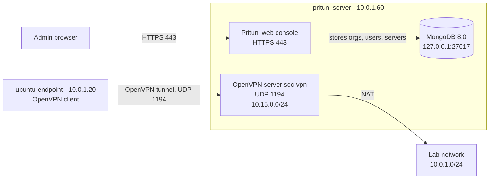

# Lab 12: Pritunl VPN Server

This lab installs **Pritunl**, a VPN server with a web console where access is managed through organizations and users. Pritunl runs on **OpenVPN** (a widely used VPN protocol) and stores its settings in **MongoDB** (a database). It gets its own VM and works on a private IP only.

What this lab installs:

- [Part A: Install Pritunl](#part-a-install-pritunl)

---

## Architecture



---

## What you need

### Existing labs used

| Lab | What it gives this lab |
|-----|------------------------|
| [01-wazuh-soc-lab](../01-wazuh-soc-lab/) | `ubuntu-endpoint`, used as the test VPN client |

### VMs

| Name | Role | Private IP | CPU | RAM | Disk |
|------|------|------------|-----|-----|------|
| pritunl-server | New VM: Pritunl, OpenVPN and MongoDB | 10.0.1.60 | 2 vCPU (assumption) | 2 GB (assumption) | 20 GB (assumption) |
| ubuntu-endpoint | Test VPN client from lab 01 | 10.0.1.20 | Same as lab 01 | Same as lab 01 | Same as lab 01 |

pritunl-server runs **Ubuntu 24.04**, the version Pritunl's official Ubuntu instructions are written for. Its CPU must support **AVX** (a set of CPU instructions), because MongoDB 5.0 and newer won't start without it.

### Placeholders

Replace these everywhere you see them.

| Placeholder | Example | Where to find it |
|-------------|---------|------------------|
| `<PRITUNL_SERVER_IP>` | `10.0.1.60` | Run `hostname -I` on pritunl-server. Use the first address. |
| `<UBUNTU_ENDPOINT_IP>` | `10.0.1.20` | Run `hostname -I` on ubuntu-endpoint. |
| `<VM_USER>` | `ubuntu` | The user you log in to the VMs with. |
| `<PRITUNL_ADMIN_USER>` | `admin` | You choose it in [Step A7](#step-a7-first-login-and-public-address). |
| `<PRITUNL_ADMIN_PASSWORD>` | a long password | You choose it in Step A7. |
| `<PROFILE_FILE>` | `soc-lab_lab-user_soc-vpn` | Printed by `ls ~/*.ovpn` in [Test 2](#test-2-a-client-connects-through-the-vpn). |

The VPN network is always `10.15.0.0/24`, the organization is `soc-lab`, the user is `lab-user`, and the VPN server is `soc-vpn`.

---

## Part A: Install Pritunl

These steps follow Pritunl's official Ubuntu 24.04 install guide.

### Step A1: Check the VM

Run on: **pritunl-server**

```bash
lsb_release -ds                                                      # shows the Ubuntu version
grep -qw avx /proc/cpuinfo && echo "AVX OK" || echo "NO AVX - stop"   # checks the CPU supports AVX
hostname -I                                                          # shows the private IP
```

**Check:** output similar to:

```
Ubuntu 24.04.3 LTS
AVX OK
10.0.1.60
```

If you see `NO AVX - stop`, MongoDB will not run on this VM. Use a VM type whose CPU supports AVX.

### Step A2: Add the MongoDB, OpenVPN and Pritunl repositories

Run on: **pritunl-server**

A **repository** is a place apt downloads packages from. Pritunl's guide adds three: MongoDB 8.0, OpenVPN's own (newer than Ubuntu's) and Pritunl's.

```bash
# MongoDB 8.0 repository
sudo tee /etc/apt/sources.list.d/mongodb-org.list << EOF
deb [ signed-by=/usr/share/keyrings/mongodb-server-8.0.gpg ] https://repo.mongodb.org/apt/ubuntu noble/mongodb-org/8.0 multiverse
EOF

# OpenVPN repository
sudo tee /etc/apt/sources.list.d/openvpn.list << EOF
deb [ signed-by=/usr/share/keyrings/openvpn-repo.gpg ] https://build.openvpn.net/debian/openvpn/stable noble main
EOF

# Pritunl repository
sudo tee /etc/apt/sources.list.d/pritunl.list << EOF
deb [ signed-by=/usr/share/keyrings/pritunl.gpg ] https://repo.pritunl.com/stable/apt noble main
EOF

sudo apt --assume-yes install gnupg    # tool that converts signing keys

# download the signing key for each repository
curl -fsSL https://www.mongodb.org/static/pgp/server-8.0.asc | sudo gpg -o /usr/share/keyrings/mongodb-server-8.0.gpg --dearmor --yes
curl -fsSL https://swupdate.openvpn.net/repos/repo-public.gpg | sudo gpg -o /usr/share/keyrings/openvpn-repo.gpg --dearmor --yes
curl -fsSL https://raw.githubusercontent.com/pritunl/pgp/master/pritunl_repo_pub.asc | sudo gpg -o /usr/share/keyrings/pritunl.gpg --dearmor --yes
```

**Check:**

```bash
ls /usr/share/keyrings/ | grep -E 'mongodb|openvpn|pritunl'    # lists the three keys
```

Expected output:

```
mongodb-server-8.0.gpg
openvpn-repo.gpg
pritunl.gpg
```

### Step A3: Install the packages

Run on: **pritunl-server**

```bash
sudo apt update    # load the new repositories
sudo apt --assume-yes install pritunl openvpn mongodb-org wireguard wireguard-tools    # install Pritunl, OpenVPN, MongoDB and WireGuard tools
```

**Check:**

```bash
dpkg -l pritunl mongodb-org openvpn | grep ^ii    # lists the installed packages
```

Expected: three lines that start with `ii`.

### Step A4: Start the services

Run on: **pritunl-server**

```bash
sudo systemctl start pritunl mongod     # start Pritunl and MongoDB now
sudo systemctl enable pritunl mongod    # start them at every boot
```

**Check:**

```bash
systemctl status mongod pritunl --no-pager | grep Active    # both services are running
sudo ss -tlnp | grep 27017                                  # MongoDB listens only on the VM itself
```

Expected output similar to:

```
     Active: active (running) since ...
     Active: active (running) since ...
LISTEN 0  4096  127.0.0.1:27017  0.0.0.0:*  users:(("mongod",...))
```

### Step A5: Turn on IP forwarding

Run on: **pritunl-server**

**IP forwarding** lets the VM pass packets from VPN clients to the lab network. Pritunl adds its own NAT rules, so you only need to switch forwarding on and keep it on after reboots.

```bash
echo 'net.ipv4.ip_forward=1' | sudo tee /etc/sysctl.d/99-pritunl.conf    # keep forwarding on after reboots
sudo sysctl --system | grep ip_forward                                    # apply it now
```

**Check:** the last command prints:

```
net.ipv4.ip_forward = 1
```

### Step A6: Connect Pritunl to MongoDB

Run on: **pritunl-server**

```bash
sudo pritunl setup-key    # prints a one-time setup key
```

Open on: **your browser**, at `https://<PRITUNL_SERVER_IP>`

1. Your browser warns about the certificate. This is expected, because Pritunl uses a **self-signed certificate** (one it made itself). Continue to the site.
2. Paste the setup key into **Setup Key**.
3. Leave **MongoDB URI** as `mongodb://localhost:27017/pritunl`.
4. Click **Save**.

**Check:** after a few seconds, the Pritunl login page appears.

### Step A7: First login and public address

Run on: **pritunl-server**

```bash
sudo pritunl default-password    # prints the first username and password
```

Open on: **your browser**, at `https://<PRITUNL_SERVER_IP>`

1. Log in with the username and password from the command.
2. An **Initial Setup** box opens. Fill it in:

   | Field | Value |
   |-------|-------|
   | Username | `<PRITUNL_ADMIN_USER>` |
   | New Password | `<PRITUNL_ADMIN_PASSWORD>` |
   | Public Address | `<PRITUNL_SERVER_IP>` |
   | Lets Encrypt Domain | leave empty |
   | Web Console Port | leave `443` |

3. Click **Save**.

The **Public Address** is the address written into every client profile. Pritunl fills it in by itself with the IP it sees when it reaches the internet. On a private network, nothing can connect back to that address, so set it to the VM's private IP before you create any users. Leave Let's Encrypt empty: a public certificate authority won't issue a certificate for a private IP.

Save the admin password in your password manager. Never put it in the repo.

**Check:** click **Settings** at the top. **Public Address** shows `<PRITUNL_SERVER_IP>`.

### Step A8: Create an organization and a user

Open on: **your browser**, at `https://<PRITUNL_SERVER_IP>`

An **organization** is a group of users. VPN servers give access to whole organizations.

1. Click **Users**.
2. Click **Add Organization**. Name it `soc-lab`. Click **Add**.
3. Click **Add User**. Set **Name** to `lab-user` and **Organization** to `soc-lab`. Leave **PIN** empty. Click **Add**.

**Check:** `lab-user` appears under `soc-lab`.

### Step A9: Create and start the VPN server

Open on: **your browser**, at `https://<PRITUNL_SERVER_IP>`

1. Click **Servers**, then **Add Server**.
2. Fill in the fields. Leave everything else as it is.

   | Field | Value |
   |-------|-------|
   | Name | `soc-vpn` |
   | Port | `1194` |
   | Protocol | `udp` |
   | DNS Server | `8.8.8.8` |
   | Virtual Network | `10.15.0.0/24` |

3. Click **Add**.
4. Click **Attach Organization**, choose `soc-vpn` and `soc-lab`, then click **Attach**.
5. Click **Start Server**.

The **virtual network** is the address range VPN clients get. It must not overlap any network in your lab, or clients send traffic to the wrong place. The server keeps its default route `0.0.0.0/0` with NAT on, so connected clients send all their internet traffic through the VPN.

**Check:** the server shows **Online**. Then run on **pritunl-server**:

```bash
sudo ss -ulpn | grep 1194    # OpenVPN listens on UDP 1194
```

Expected output similar to:

```
UNCONN 0  0  0.0.0.0:1194  0.0.0.0:*  users:(("openvpn",...))
```

---

## Tests

### Test 1: The VPN server is online

Open `https://<PRITUNL_SERVER_IP>`, log in, and click **Servers**.

Expected: `soc-vpn` shows **Online**, with `soc-lab` attached.

### Test 2: A client connects through the VPN

1. Open `https://<PRITUNL_SERVER_IP>` and click **Users**.
2. On the `lab-user` row, click the download icon. You get a file similar to `soc-lab_lab-user.tar`. It holds the user's keys, so never upload it to the repo.
3. Copy it to ubuntu-endpoint. From Windows PowerShell, in the folder with the file:

   ```powershell
   scp .\soc-lab_lab-user.tar <VM_USER>@<UBUNTU_ENDPOINT_IP>:~/    # copy the profile to ubuntu-endpoint
   ```

Run on: **ubuntu-endpoint**

```bash
sudo apt update && sudo apt install -y openvpn    # install the OpenVPN client
tar -xf ~/soc-lab_lab-user.tar -C ~/              # unpack the profile
ls ~/*.ovpn                                       # shows the profile file name
sudo openvpn --config ~/<PROFILE_FILE>.ovpn       # connect; use the file name from the last command
```

**Check:** the output ends with a line similar to:

```
Initialization Sequence Completed
```

Leave it running. Open a **second** SSH session to ubuntu-endpoint and run:

```bash
ping -c 3 10.15.0.1    # reach the VPN server through the tunnel
```

Expected: 3 replies. In the web console, **Users** shows `lab-user` as online.

When you are done, press **Ctrl+C** in the first session to disconnect.

---

## Common problems

| Problem | Cause | Fix |
|---------|-------|-----|
| The client times out and never connects | **Public Address** isn't the VM's private IP, so the profile points somewhere else | **Settings** → set **Public Address** to `<PRITUNL_SERVER_IP>`, then download the profile again |
| `mongod` won't start and `journalctl -u mongod` shows "Illegal instruction" | The CPU has no AVX | Use a VM type whose CPU supports AVX. Check with Step A1 |
| The web console shows errors or the database setup page again | MongoDB isn't running | Run `sudo systemctl status mongod`, then `sudo systemctl restart mongod pritunl` |
| The client connects but can't reach anything past the tunnel | IP forwarding is off | Run `sysctl net.ipv4.ip_forward`. If it shows `0`, repeat Step A5 |
| The browser warns about the certificate every time | Pritunl uses a self-signed certificate | This is expected on a private IP. Continue to the site |

---

## Next steps

- Run the VPN server in WireGuard mode as well as OpenVPN. [Pritunl WireGuard](https://docs.pritunl.com/docs/wireguard)
- Give VPN users access to specific lab networks instead of all traffic. [Pritunl: accessing a private network](https://docs.pritunl.com/docs/accessing-a-private-network)
