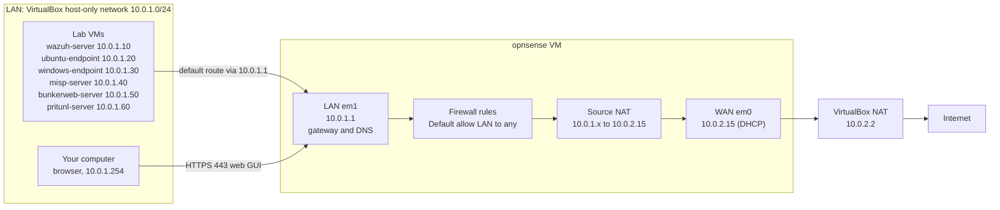

# OPNsense Firewall as the Lab Gateway

This guide installs **OPNsense 26.7** in a VirtualBox VM with two network cards: **WAN** (to the internet through VirtualBox NAT) and **LAN** (the lab network `10.0.1.0/24`). Then every lab VM uses OPNsense as its gateway, so outgoing traffic flows **VM → gateway → firewall → destination**. The test follows one ping through the firewall rules and NAT, then blocks it with a firewall rule.

- **OPNsense** is an open-source firewall and router based on FreeBSD. You manage it in a web interface (the web GUI).
- **WAN** is the outside side (towards the internet). **LAN** is the inside network with your lab VMs.
- A **gateway** is the router a VM sends traffic to when the destination is not on its own network.
- **NAT** (network address translation): on the way out, OPNsense replaces the VM's private address with its own WAN address.
- A **firewall rule** passes or blocks traffic. OPNsense checks the rules of the interface where the traffic comes in.

What this lab installs and sets up:

| Part | What | Where |
|---|---|---|
| [A](#part-a-prepare-virtualbox) | LAN network and the OPNsense VM (WAN and LAN cards) | your computer (VirtualBox) |
| [B](#part-b-install-opnsense-and-set-wan-and-lan) | Install OPNsense 26.7, assign WAN and LAN, set the LAN address | opnsense console |
| [C](#part-c-finish-the-setup-in-the-web-gui) | Setup wizard, update, DHCP range, check the default rules and NAT | your browser |
| [D](#part-d-route-the-lab-vms-through-opnsense) | Gateway configuration: every lab VM sends its traffic to OPNsense | each lab VM |

## Table of contents

1. [Architecture](#1-architecture)
2. [What you need](#2-what-you-need)
3. [Installation steps](#3-installation-steps)
4. [Test](#4-test)
5. [Common problems](#5-common-problems)
6. [Next steps](#6-next-steps)

Files in this folder:

| File | Copy to (on each Ubuntu lab VM) | Used in |
|---|---|---|
| [`configs/99-soc-lan.yaml`](configs/99-soc-lan.yaml) | `/etc/netplan/99-soc-lan.yaml` | [Step D2](#part-d-route-the-lab-vms-through-opnsense) |

---

## 1. Architecture



- Traffic between two lab VMs (for example agent → wazuh-server) stays inside `10.0.1.0/24` and does not pass OPNsense. Only traffic that leaves the lab network goes through the gateway.
- VirtualBox NAT adds a second NAT step after OPNsense: `10.0.2.15` → your computer's own address.

---

## 2. What you need

| Already built | VM moved behind OPNsense in Part D |
|---|---|
| [01-wazuh-soc-lab](../01-wazuh-soc-lab/) | wazuh-server, ubuntu-endpoint |
| [02-wazuh-fim-lab](../02-wazuh-fim-lab/) | windows-endpoint |
| [08-misp-lab](../08-misp-lab/) | misp-server |
| [10-bunkerweb-lab](../10-bunkerweb-lab/) | bunkerweb-server |
| [12-pritunl-lab](../12-pritunl-lab/) | pritunl-server |

You can start with only ubuntu-endpoint. Every VM you add later gets the same Part D.

**Where this runs:** VirtualBox 7 on one computer, like your OPNsense setup. The lab VMs must run in the same VirtualBox: a cloud VM cannot join a VirtualBox network.

| VM | Role | Private IP | CPU / RAM / disk |
|---|---|---|---|
| opnsense | Firewall and router (new) | LAN `10.0.1.1`, WAN `10.0.2.15` (given by VirtualBox NAT) | 2 vCPU / 3 GB / 8 GB (OPNsense docs minimum for a VM) |
| Your computer | VirtualBox host, browser | `10.0.1.254` (host-only adapter) | - |
| wazuh-server | Wazuh server | `10.0.1.10` | as in lab 01 |
| ubuntu-endpoint | Ubuntu agent | `10.0.1.20` | as in lab 01 |
| windows-endpoint | Windows agent | `10.0.1.30` | as in lab 02 |
| misp-server | MISP | `10.0.1.40` | as in lab 08 |
| bunkerweb-server | BunkerWeb | `10.0.1.50` | as in lab 10 |
| pritunl-server | Pritunl VPN | `10.0.1.60` | as in lab 12 |

| Placeholder | What it is | Example | Where to find it |
|---|---|---|---|
| `<ROOT_PASSWORD>` | OPNsense `root` password (console and web GUI) | random | You choose it in [Step B2](#part-b-install-opnsense-and-set-wan-and-lan) |
| `<VM_USER>` | The sudo user on the Ubuntu VMs | `ubuntu` | Your login user |
| `<VM_INTERFACE>` | Network interface of an Ubuntu VM | `enp0s3` | `ip -br link` ([Step D2](#part-d-route-the-lab-vms-through-opnsense)) |
| `<VM_IP>` | A lab VM's fixed private IP | `10.0.1.20` | VM table above |

Save `<ROOT_PASSWORD>` in a password manager. Never put it, or an OPNsense backup file (`config-*.xml`), in this repository.

---

## 3. Installation steps

### Part A. Prepare VirtualBox

**Run on:** your computer, in VirtualBox Manager. Set **File** → **Preferences** → **Expert**, so every setting is shown.

**A1. Create the LAN network** (a **host-only network** connects VMs and your computer):

1. **File** → **Tools** → **Network Manager** → **Host-only Networks** tab → **Create**.
2. Select the new network (on Windows named like `VirtualBox Host-Only Ethernet Adapter #2`) → **Properties**.
3. **Adapter** tab: **Configure Adapter Manually**, **IPv4 Address** `10.0.1.254`, **IPv4 Network Mask** `255.255.255.0` → **Apply**.
4. **DHCP Server** tab: untick **Enable Server** → **Apply**.

- `10.0.1.254` is your computer's address on the LAN, so your browser can open the web GUI at `10.0.1.1`.
- VirtualBox's own DHCP server is turned off: OPNsense hands out addresses on this network.
- On Linux and macOS hosts, VirtualBox allows only `192.168.56.0/21` for host-only networks. First create `/etc/vbox/networks.conf` with the line `* 10.0.0.0/8`.

**Check** (Windows PowerShell on your computer):

```powershell
ipconfig
```

Similar to:

```text
Ethernet adapter VirtualBox Host-Only Network #2:
   IPv4 Address. . . . . . . . . . . : 10.0.1.254
   Subnet Mask . . . . . . . . . . . : 255.255.255.0
   Default Gateway . . . . . . . . . :
```

**A2. Download and check the OPNsense image:**

1. Open [opnsense.org/download](https://opnsense.org/download/): image type **dvd**, architecture **amd64**, a mirror near you → download `OPNsense-26.7-dvd-amd64.iso.bz2`.
2. Check the file in PowerShell, in the download folder:

```powershell
Get-FileHash .\OPNsense-26.7-dvd-amd64.iso.bz2 -Algorithm SHA256
```

**Check:** the `Hash` is exactly the value from the official 26.7 release notes. A different value means a broken or changed download: download it again.

```text
95CAFEDDA6D5B22CE832E249DC2309110FBEE19F813AD78CF28BB3D387186BFB
```

3. Unpack it with [7-Zip](https://www.7-zip.org/): right-click → **7-Zip** → **Extract Here**. You get `OPNsense-26.7-dvd-amd64.iso`.

- The **dvd** image is an ISO that starts a live OPNsense with the installer.
- OPNsense makes new images only for major versions (January and July). [Step C3](#part-c-finish-the-setup-in-the-web-gui) updates to the newest 26.7.x.

**A3. Create the OPNsense VM:** **Machine** → **New**:

1. **Name** `opnsense`, **ISO Image** the `.iso` from A2. Untick **Install OS Using Unattended Installation** (or tick **Skip Unattended Installation**).
2. **OS** `BSD`, **OS Distribution** `FreeBSD`, **OS Version** `FreeBSD (64-bit)`.
3. **Base Memory** `3072` MB, **Processors** `2`, **Disk Size** `8` GB → **Finish**.

Then select the VM → **Settings**:

4. **System** → **Motherboard** → **Boot Order**: move **Hard Disk** to the top. After the install, the VM then starts from the disk, not from the ISO.
5. **Network** → **Adapter 1**: **Attached to** `NAT`. This card is the **WAN**.
6. **Network** → **Adapter 2**: tick **Enable Network Adapter**, **Attached to** `Host-only Adapter`, **Name** the network from A1. This card is the **LAN**.
7. Open **Adapter 1** → **Advanced** and write down the **MAC Address**. You need it in B3 → **OK**.

**Check:** the VM's **Details** pane shows similar to:

```text
Network
  Adapter 1: Intel PRO/1000 MT Desktop (NAT)
  Adapter 2: Intel PRO/1000 MT Desktop (Host-only Adapter, 'VirtualBox Host-Only Ethernet Adapter #2')
```

### Part B. Install OPNsense and set WAN and LAN

**Run on:** the opnsense VM console (the VirtualBox window of the VM)

**B1. Start the live system.** Start the VM. Do not press a key while it boots: it continues by itself to a `login:` prompt. Log in as `installer` with the password `opnsense`.

**B2. Install to the virtual disk** (the official installer steps):

1. **Keymap**: keep the default (or choose yours) → continue.
2. **Install (ZFS)**. ZFS is the file system the OPNsense docs recommend.
3. **stripe** (one disk) → **OK**.
4. Press **Space** to mark `ada0` (the 8 GB virtual disk) → **Enter**.
5. **Last Chance!** → **YES**. This erases only the VM's virtual disk.
6. **Root Password** → type and confirm `<ROOT_PASSWORD>`. Save it in your password manager.
7. **Complete Install**. The VM reboots and starts from the disk.

**Check:** after the reboot, the console shows a `login:` prompt and no installer.

**B3. Assign WAN and LAN.** Log in as `root` with `<ROOT_PASSWORD>`. In the menu, type `1` (**Assign interfaces**) and answer:

```text
Do you want to configure LAGGs now? [y/N]: n
Do you want to configure VLANs now? [y/N]: n

Valid interfaces are:
em0              08:00:27:aa:aa:aa ...
em1              08:00:27:bb:bb:bb ...

Enter the WAN interface name or 'a' for auto-detection: em0

Enter the LAN interface name or 'a' for auto-detection
NOTE: this enables full Firewalling/NAT mode.
(or nothing if finished): em1

Enter the Optional interface 1 name or 'a' for auto-detection
(or nothing if finished):                      <- press Enter

The interfaces will be assigned as follows:

WAN  -> em0
LAN  -> em1

Do you want to proceed? [y/N]: y
```

- `em0` is VirtualBox Adapter 1 (NAT), `em1` is Adapter 2 (host-only). The MAC address of `em0` must match the one you wrote down in A3 (VirtualBox shows it without colons).
- Without this step, OPNsense makes the **first** card LAN and the second WAN: the reverse of this lab (the WAN/LAN mismatch).

**B4. Set the LAN address.** In the menu, type `2` (**Set interface IP address**) and answer:

```text
Enter the number of the interface to configure: <number in front of LAN>

Configure IPv4 address LAN interface via DHCP? [y/N] n

Enter the new LAN IPv4 address. Press <ENTER> for none:
> 10.0.1.1

Enter the new LAN IPv4 subnet bit count (1 to 32):
> 24

For a WAN, enter the new LAN IPv4 upstream gateway address.
For a LAN, press <ENTER> for none:
>                                                <- press Enter

Configure IPv6 address LAN interface via WAN tracking? [Y/n]   <- press Enter
Do you want to enable the DHCP server on LAN? [y/N]            <- press Enter (the wizard sets DHCP in C2)
Do you want to change the web GUI protocol from HTTPS to HTTP? [y/N]   <- press Enter
Do you want to generate a new self-signed web GUI certificate? [y/N]   <- press Enter
Restore web GUI access defaults? [y/N]                                  <- press Enter
```

- `10.0.1.1/24` puts the LAN card in the lab network. This address becomes the gateway of every lab VM.
- A LAN has no upstream gateway. The WAN gets its address, gateway and DNS by DHCP from VirtualBox NAT.

**Check:** the last lines are:

```text
You can now access the web GUI by opening
the following URL in your web browser:

    https://10.0.1.1
```

Back in the menu, the console shows similar to:

```text
 LAN (em1)       -> v4: 10.0.1.1/24
 WAN (em0)       -> v4/DHCP4: 10.0.2.15/24
```

**B5. Check the internet from OPNsense.** In the menu, type `7` (**Ping host**) and enter `1.1.1.1`.

**Check:** `3 packets transmitted, 3 packets received, 0.0% packet loss`. Press **Enter** to go back.

### Part C. Finish the setup in the web GUI

**Run on:** your computer, in the browser

**C1. Log in.** Open `https://10.0.1.1`, accept the self-signed certificate warning, and log in as `root` with `<ROOT_PASSWORD>`. The setup wizard opens. (Later you find it at **System** → **Configuration** → **Wizard**.)

**C2. Run the wizard:**

1. **Welcome** → **Next**.
2. **General Information**: keep the defaults (hostname `OPNsense`, domain `internal`, **Enable Resolver** ticked) → **Next**.
3. **Network [WAN]**: **Type** `DHCP`. Untick **Block RFC1918 Private Networks** → **Next**.
4. **Network [LAN]**: **IP Address** `10.0.1.1/24`, **Configure DHCP server** ticked → **Next**.
5. **Deployment type**: keep the defaults → **Next**.
6. **Set initial password**: leave empty (keeps the password from B2) → **Next**.
7. **Finish** → **Apply**.

- The WAN address `10.0.2.15` from VirtualBox NAT is itself a private address. The help text of **Block RFC1918 Private Networks** says to set it only on a WAN with a public address.
- The resolver (**Unbound DNS**) lets OPNsense answer DNS questions from the lab VMs.

**Check:** **Interfaces** → **Overview**: **WAN** has `10.0.2.15`, **LAN** has `10.0.1.1`, both **up**.

**C3. Update to the newest 26.7.x:** **System** → **Firmware** → **Status** → **Check for updates** → **Update**, confirm, and wait for the reboot if one is needed.

**Check:** **System** → **Firmware** → **Status** shows a version similar to `OPNsense 26.7.5`.

**C4. Move the DHCP range away from the fixed lab IPs.** The wizard hands out `10.0.1.41`–`10.0.1.245`, which includes `10.0.1.50` and `10.0.1.60`.

1. **Services** → **Dnsmasq DNS & DHCP** → **DHCP ranges**.
2. Click the pencil on the **LAN** IPv4 row: **Start address** `10.0.1.100`, **End address** `10.0.1.199` → **Save** → **Apply**.

- **DHCP** gives new devices an address, gateway and DNS server automatically. The lab VMs keep fixed IPs ([Part D](#part-d-route-the-lab-vms-through-opnsense)); a new test VM gets `10.0.1.100`–`10.0.1.199`.

**Check:** the LAN row shows `10.0.1.100` and `10.0.1.199`.

**C5. Check the defaults that do the routing** (nothing to change):

| Where | You see | What it does |
|---|---|---|
| **System** → **Gateways** → **Configuration** | `WAN_DHCP` with gateway `10.0.2.2` | OPNsense's own gateway to the internet (VirtualBox NAT), learned by DHCP |
| **Firewall** → **Rules**, choose **LAN** in the interface list | **Default allow LAN to any rule**, enabled | Passes all traffic that comes from the LAN network |
| **Firewall** → **NAT** → **Source NAT** | **Automatically generated rules** for WAN | Replaces the LAN addresses with the WAN address on the way out |
| **Interfaces** → **Settings** | **Disable hardware checksum offload**, **... TCP segmentation offload**, **... large receive offload** ticked | The OPNsense docs' setting for VMs (default). Tick and **Save** if one is not ticked |

### Part D. Route the lab VMs through OPNsense

**D1. Connect each lab VM to the LAN.** **Run on:** your computer, in VirtualBox Manager.

For each lab VM: **Settings** → **Network** → **Adapter 1**: **Attached to** `Host-only Adapter`, **Name** the network from A1 → **OK**. If the VM has more adapters attached to `NAT` or `Bridged Adapter`, untick **Enable Network Adapter** on them: OPNsense must be the only way out.

**D2. Set the gateway on each Ubuntu VM** (wazuh-server, ubuntu-endpoint, misp-server, bunkerweb-server, pritunl-server).

**Run on:** each Ubuntu VM, as `<VM_USER>`. Use the VM console (or SSH from your computer, if the VM already has its `10.0.1.x` address).

1. Find the interface name:

```bash
ip -br link
```

Similar to `enp0s3  UP  08:00:27:cc:cc:cc ...`. This is `<VM_INTERFACE>`.

2. Move the old network files to a backup folder:

```bash
ls /etc/netplan/
sudo mkdir -p /root/netplan-backup
sudo mv /etc/netplan/*.yaml /root/netplan-backup/
```

- **Netplan** is Ubuntu's network configuration. It merges all files in `/etc/netplan/`, so an old file with another gateway would clash with the new one.

3. Create the new file (same as [`configs/99-soc-lan.yaml`](configs/99-soc-lan.yaml)):

```bash
sudo nano /etc/netplan/99-soc-lan.yaml
```

```yaml
network:
  version: 2
  ethernets:
    enp0s3:                        # CHANGE THIS: <VM_INTERFACE> from step 1
      dhcp4: false
      addresses:
        - 10.0.1.20/24             # CHANGE THIS: this VM's <VM_IP> (VM table in section 2)
      routes:
        - to: default
          via: 10.0.1.1            # OPNsense LAN address = the gateway
      nameservers:
        addresses:
          - 10.0.1.1               # OPNsense answers DNS (Unbound)
```

Save with **Ctrl+O**, **Enter**, then exit with **Ctrl+X**.

- `routes: to: default via 10.0.1.1` is the **default route**: everything outside `10.0.1.0/24` goes to OPNsense.

4. Apply it safely:

```bash
sudo chmod 600 /etc/netplan/99-soc-lan.yaml
sudo netplan try
```

- `chmod 600` lets only root read the file (netplan warns otherwise).
- `netplan try` applies the file and waits. Press **Enter** to keep it. If you lose the connection and cannot press Enter, it goes back to the old settings after 120 seconds.

**Check:**

```bash
ip route show default
resolvectl dns
```

Similar to:

```text
default via 10.0.1.1 dev enp0s3 proto static
Global:
Link 2 (enp0s3): 10.0.1.1
```

**D3. Set the gateway on windows-endpoint.** **Run on:** windows-endpoint, as an administrator.

1. Press **Win+R**, type `ncpa.cpl` → **OK**.
2. Right-click **Ethernet** → **Properties** → **Internet Protocol Version 4 (TCP/IPv4)** → **Properties**.
3. **Use the following IP address**: **IP address** `10.0.1.30`, **Subnet mask** `255.255.255.0`, **Default gateway** `10.0.1.1`.
4. **Use the following DNS server addresses**: **Preferred DNS server** `10.0.1.1` → **OK** → **Close**.

**Check** (PowerShell):

```powershell
ipconfig
```

Similar to `IPv4 Address . . . : 10.0.1.30` and `Default Gateway . . . : 10.0.1.1`.

**D4. Check that the lab still works:** open `https://10.0.1.10` → ☰ → **Agents management** → **Summary**. The agents you moved are **active**. (Agent traffic stays inside `10.0.1.0/24`.)

---

## 4. Test

**4.1 Follow the path from a VM** (on ubuntu-endpoint). Test it in this order: gateway, then internet by IP, then names.

```bash
ip route get 1.1.1.1
ping -c 3 10.0.1.1
ping -c 3 1.1.1.1
getent hosts opnsense.org
```

- `ip route get` shows which gateway the VM uses for an address.
- Ping `10.0.1.1` checks the LAN link, ping `1.1.1.1` checks routing and NAT, `getent hosts` checks DNS through OPNsense.

**Check:** similar to:

```text
1.1.1.1 via 10.0.1.1 dev enp0s3 src 10.0.1.20 uid 1000
3 packets transmitted, 3 received, 0% packet loss
3 packets transmitted, 3 received, 0% packet loss
<an IP address>   opnsense.org
```

**4.2 See the traffic in OPNsense.** On ubuntu-endpoint, start a longer ping:

```bash
ping -c 60 1.1.1.1
```

While it runs, in the web GUI: **Firewall** → **Diagnostics** → **States**, search `10.0.1.20`. You see two lines, similar to:

| Int | Dir | Proto | Source | Nat | Destination | Rule |
|---|---|---|---|---|---|---|
| LAN | in | icmp | 10.0.1.20 | | 1.1.1.1 | Default allow LAN to any rule |
| WAN | out | icmp | 10.0.1.20 | 10.0.2.15 | 1.1.1.1 | ... |

- The LAN line is **VM → gateway → firewall rule**. The WAN line is the same ping after NAT: its source became the WAN address `10.0.2.15`.

**4.3 Block it with a firewall rule** (proves the VM's traffic really passes OPNsense):

1. **Firewall** → **Rules**, choose **LAN**. On **Default allow LAN to any rule**, click the check mark in the **Enabled** column to disable it → **Apply**.
2. On ubuntu-endpoint:

```bash
ping -c 3 9.9.9.9
```

**Check:** `3 packets transmitted, 0 received, 100% packet loss`.

3. **Firewall** → **Log Files** → **Live View**, type `10.0.1.20` in the search box. You see block lines from `10.0.1.20` to `9.9.9.9` with the label **Default deny / state violation rule**.
4. Enable **Default allow LAN to any rule** again → **Apply**. Run the ping again: 3 replies.

- With no pass rule, OPNsense's default rule blocks the traffic and logs it.
- The web GUI stays reachable during this test: the automatic **anti-lockout rule** always lets the LAN reach the web GUI.

**The setup works when** the VM's route points to `10.0.1.1`, its ping shows up in the States list with the NAT address, and disabling the LAN rule blocks it.

---

## 5. Common problems

| Problem | Fix |
|---|---|
| Console shows `LAN (em0)` with `10.0.2.x` or `192.168.1.1`, and `WAN (em1)` | WAN and LAN are swapped (the WAN/LAN mismatch). Menu `1`: WAN `em0` (Adapter 1, NAT), LAN `em1` (Adapter 2). Compare the MAC addresses ([B3](#part-b-install-opnsense-and-set-wan-and-lan)) |
| Browser cannot open `https://10.0.1.1` | 1) Your computer has `10.0.1.254/24` on the host-only network (A1 check). 2) Adapter 2 of opnsense is on that same network (A3). 3) The console shows `LAN (em1) -> v4: 10.0.1.1/24` (B4) |
| A VM gets a `192.168.56.x` address, or two VMs clash | VirtualBox's own DHCP server is still on. Untick **Enable Server** ([A1](#part-a-prepare-virtualbox)) |
| VM pings `10.0.1.1` but not `1.1.1.1` | 1) **Default allow LAN to any rule** is disabled or deleted (**Firewall** → **Rules** → **LAN**). 2) WAN has no address (**Interfaces** → **Overview**): Adapter 1 must be `NAT`. 3) The VM's gateway is not `10.0.1.1` (`ip route show default`) |
| Ping by IP works, names do not resolve | The VM's DNS is not `10.0.1.1` (`resolvectl dns`, fix D2), or **Services** → **Unbound DNS** → **General** → **Enable Unbound** is unticked |

---

## 6. Next steps

- **Network segmentation** (a second internal network as OPT1, with rules between segments): [Interface configuration](https://docs.opnsense.org/manual/interfaces.html)
- **Firewall rules** (aliases, logging, rule order): [Rules](https://docs.opnsense.org/manual/firewall.html)
- **NAT** (port forwards to a lab VM, source NAT modes): [Network Address Translation](https://docs.opnsense.org/manual/nat.html)
- **Gateways and routing** (for example a static route to a VPN network): [Gateways](https://docs.opnsense.org/manual/gateways.html) and [Routes](https://docs.opnsense.org/manual/routes.html)
- **Send OPNsense logs to Wazuh**: [Wazuh Agent plugin](https://docs.opnsense.org/manual/wazuh-agent.html)
