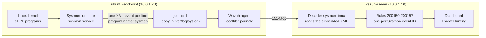

# Sysmon for Linux to Wazuh

This guide installs **Sysmon for Linux** on the Ubuntu endpoint and turns its events into Wazuh alerts. Sysmon writes each event to syslog as one line of XML, which Wazuh's built-in decoders do not read. So the lab adds an existing community ruleset (SOCFortress) for Sysmon for Linux, with two small fixes. The test runs a command, opens a network connection and creates a file, then finds each one as an alert that also shows the **parent process**.

- **Sysmon for Linux** (System Monitor) is a free Microsoft Sysinternals tool. It uses **eBPF** (a Linux kernel feature that runs small, safe programs on kernel events) to log process creations, network connections and file creations and deletions.
- Each Sysmon event has an **event ID**: a number for the type of activity (1 = process creation, 3 = network connection, 11 = file created...).
- **syslog** and **journald** are the system logs of Linux. journald is systemd's log store. The Wazuh agent on Ubuntu reads journald by default.
- A **decoder** reads a raw log line and pulls out named fields. A **rule** checks those fields and creates an alert with a level.

What this lab installs and sets up:

| Part | What | Where |
|---|---|---|
| [A](#part-a-install-sysmon-for-linux) | Sysmon for Linux with Wazuh's Sysmon configuration, and a check that it produces events | ubuntu-endpoint |
| [B](#part-b-send-sysmon-events-to-wazuh) | The Wazuh agent forwards the Sysmon events | ubuntu-endpoint |
| [C](#part-c-add-the-sysmon-decoders-and-rules) | Community decoders and rules for Sysmon for Linux (rules 200150-200157), adapted | wazuh-server |

## Table of contents

1. [Architecture](#1-architecture)
2. [What you need](#2-what-you-need)
3. [Installation and integration steps](#3-installation-and-integration-steps)
4. [Test](#4-test)
5. [Common problems](#5-common-problems)
6. [Next steps](#6-next-steps)

---

## 1. Architecture



Which Sysmon event becomes which Wazuh rule (all level 3):

| Sysmon event ID | Activity | Wazuh rule |
|---|---|---|
| 1 | Process creation | 200151 |
| 3 | Network connection | 200152 |
| 5 | Process terminated | 200153 |
| 9 | Raw disk read | 200154 |
| 11 | File created | 200155 |
| 16 | Sysmon configuration changed | 200156 |
| 23 | File deleted | 200157 |
| any other | Other Sysmon event | 200150 |

Rules 200200-200202 lower the Wazuh agent's own network and file activity to level 1, so it creates no alert. Rule 200203 does the same for a second connection to the same IP within 60 seconds.

---

## 2. What you need

| Already built | Used for |
|---|---|
| [01-wazuh-soc-lab](../01-wazuh-soc-lab/) | Wazuh server and the agent `ubuntu-endpoint` |

[Lab 03](../03-wazuh-command-monitoring-lab/) (auditd) is not needed. Both labs can run on the same endpoint.

| VM | Role | Private IP | CPU / RAM / disk |
|---|---|---|---|
| wazuh-server | Wazuh manager: decoders and rules | 10.0.1.10 | As in lab 01 |
| ubuntu-endpoint | Sysmon for Linux and the Wazuh agent | 10.0.1.20 | As in lab 01 (Sysmon has no published minimum) |

| Placeholder | What it is | Example | Where to find it |
|---|---|---|---|
| `<VM_USER>` | The sudo user on the VMs | `ubuntu` | Your login user |
| `<WAZUH_SERVER_IP>` | Private IP of wazuh-server | `10.0.1.10` | `hostname -I` on wazuh-server |

This lab uses no passwords or API keys.

---

## 3. Installation and integration steps

### Part A. Install Sysmon for Linux

**Run on:** ubuntu-endpoint, as `<VM_USER>`

**A1. Add Microsoft's package repository** (official Sysmon for Linux install steps):

```bash
wget -q https://packages.microsoft.com/config/ubuntu/$(lsb_release -rs)/packages-microsoft-prod.deb -O packages-microsoft-prod.deb
sudo dpkg -i packages-microsoft-prod.deb
```

- `lsb_release -rs` prints your Ubuntu version, so the matching repository is added.

**A2. Install the package:**

```bash
sudo apt-get update
sudo apt-get install -y sysmonforlinux
```

- This also installs `sysinternalsebpf`, the eBPF library Sysmon needs.

**Check:**

```bash
dpkg -l sysmonforlinux | tail -n 1
```

Similar to `ii  sysmonforlinux  1.5.3  amd64  A system monitor based on eBPF, ported from Windows, that outputs events to Syslog`.

**A3. Download the Sysmon configuration and start Sysmon** (assumption: the post does not name a configuration; this is the one Wazuh's own Sysmon for Linux guides use):

```bash
cd ~
wget -O sysmonforlinux-config.xml https://wazuh.com/resources/blog/detecting-sysjoker-backdoor-malware-with-wazuh/sysmonforlinux-config.xml
grep -o 'schemaversion="[0-9.]*"' sysmonforlinux-config.xml
sudo sysmon -accepteula -i sysmonforlinux-config.xml
sudo systemctl enable --now sysmon
```

- The configuration logs all event types and leaves out a few noisy ones (shell start-up helpers and the time sync service).
- `-accepteula` accepts the Sysinternals license. `-i` installs the Sysmon service with this configuration.

**Check:** the `grep` prints `schemaversion="4.70"`, and:

```bash
systemctl is-active sysmon
```

```text
active
```

**A4. Confirm Sysmon produces events.** Run a command, then read it back with Sysmon's own viewer:

```bash
whoami
sleep 2
sudo grep -c "Linux-Sysmon" /var/log/syslog
sudo tail -n 300 /var/log/syslog | sudo /opt/sysmon/sysmonLogView -e 1 | grep -A 22 "Image: /usr/bin/whoami"
```

- `grep -c` counts Sysmon events in syslog. `sysmonLogView -e 1` shows only process creations (event 1) in readable form.

**Check:** a number above 0, then similar to:

```text
	Image: /usr/bin/whoami
	...
	CommandLine: whoami
	CurrentDirectory: /home/ubuntu
	User: ubuntu
	...
	ParentImage: /usr/bin/bash
	ParentCommandLine: -bash
	ParentUser: ubuntu
```

The raw line in syslog is one long XML line, similar to `<date> ubuntu-endpoint sysmon: <Event><System><Provider Name="Linux-Sysmon" ...><EventID>1</EventID>...</Event>`. This embedded XML is what the decoders in Part C read.

### Part B. Send Sysmon events to Wazuh

**Run on:** ubuntu-endpoint, as `<VM_USER>`

**B1. Check what the agent already reads:**

```bash
sudo grep -c -E "<location>(journald|/var/log/syslog)</location>" /var/ossec/etc/ossec.conf
```

- `1` or more: nothing to do, go to Part C. The Wazuh agent on Ubuntu reads journald by default, and Sysmon's syslog messages are in journald too.
- `0`: do B2.

Do not add `/var/log/syslog` when the agent already reads journald: every event would be sent twice.

**B2. Only if B1 printed `0`:** add the syslog file to the agent and restart it:

```bash
sudo tee -a /var/ossec/etc/ossec.conf > /dev/null <<'EOF'

<ossec_config>
  <localfile>
    <log_format>syslog</log_format>
    <location>/var/log/syslog</location>
  </localfile>
</ossec_config>
EOF
sudo systemctl restart wazuh-agent
```

- `tee -a` adds the block to the end of the file. Wazuh allows more than one `<ossec_config>` block.

**Check:** run B1 again. It prints `1`.

### Part C. Add the Sysmon decoders and rules

**Run on:** wazuh-server, as `<VM_USER>`

**C1. Download the community decoders and rules** (SOCFortress Wazuh-Rules, folder `Sysmon Linux`, pinned to the version this guide was checked with):

```bash
COMMIT="66b70d6a380b2cffb625801da0b0ccb1933ed95d"
BASE="https://raw.githubusercontent.com/socfortress/Wazuh-Rules/${COMMIT}/Sysmon%20Linux"
sudo curl -fsSL -o /var/ossec/etc/decoders/sysmonforlinux_decoders.xml "${BASE}/decoder-linux-sysmon.xml"
sudo curl -fsSL -o /var/ossec/etc/rules/sysmonforlinux_rules.xml "${BASE}/200150-sysmon_for_linux_rules.xml"
```

- New files in `etc/decoders` and `etc/rules`: no existing Wazuh file is changed.
- Use the `raw.githubusercontent.com` address. A normal `github.com` address downloads an HTML page instead of the XML file.

**Check:** the files are exactly the expected ones:

```bash
sudo sha256sum /var/ossec/etc/decoders/sysmonforlinux_decoders.xml /var/ossec/etc/rules/sysmonforlinux_rules.xml
```

```text
308415bf7864a49d1d186918109e27837ae4c4b0fa2c45a691fea3a142bd6d51  /var/ossec/etc/decoders/sysmonforlinux_decoders.xml
3b0a80409697727305971431d5a6251efb1eb475cc1efc2ce6a0e0a6ce10110f  /var/ossec/etc/rules/sysmonforlinux_rules.xml
```

**C2. Adapt two lines** to how Sysmon for Linux really writes its events:

```bash
sudo sed -i 's#\\d+-\\d+-\\d+T\\d+:\\d+:\\d+\.\\d+\\w)\\p/Data#\\.+)\\p/Data#' /var/ossec/etc/decoders/sysmonforlinux_decoders.xml
sudo sed -i 's/\$(Event\.EventData\.Data\.Configuration)/$(eventdata.configuration)/' /var/ossec/etc/rules/sysmonforlinux_rules.xml
```

- First command: the community decoder expects times like `2026-10-09T10:15:42.118Z`, but Sysmon writes `UtcTime` and `CreationUtcTime` as `2026-10-09 10:15:42.118` (with a space). Without the fix, these two fields are never filled.
- Second command: rule 200156 named a field that does not exist, so its description stayed empty.

**Check:**

```bash
sudo grep -n 'UtcTime"' /var/ossec/etc/decoders/sysmonforlinux_decoders.xml
sudo grep -n 'eventdata.configuration)' /var/ossec/etc/rules/sysmonforlinux_rules.xml
```

```text
178:  <regex offset="after_parent">\pData Name="UtcTime"\p(\.+)\p/Data\p</regex>
379:  <regex offset="after_parent">\pData Name="CreationUtcTime"\p(\.+)\p/Data\p</regex>
76:        <description>Sysmon - Event 16: Sysmon config state changed $(eventdata.configuration)</description>
```

**C3. Set the owner and permissions** (as the Wazuh docs do for custom decoder and rule files):

```bash
sudo chown wazuh:wazuh /var/ossec/etc/decoders/sysmonforlinux_decoders.xml /var/ossec/etc/rules/sysmonforlinux_rules.xml
sudo chmod 660 /var/ossec/etc/decoders/sysmonforlinux_decoders.xml /var/ossec/etc/rules/sysmonforlinux_rules.xml
```

**C4. Test the ruleset, then restart the manager:**

```bash
sudo /var/ossec/bin/wazuh-analysisd -t && echo "Ruleset OK"
sudo systemctl restart wazuh-manager
```

- `wazuh-analysisd -t` loads all decoders and rules and stops. It prints an error instead of `Ruleset OK` if a file is broken.
- The rules use the decoder `sysmon-linux`. Without the decoder file, the manager does not start.

**Check:**

```bash
systemctl is-active wazuh-manager
```

```text
active
```

**C5. Test the decoder and a rule with wazuh-logtest:**

```bash
sudo /var/ossec/bin/wazuh-logtest
```

Paste this sample process-creation event as one line and press **Enter** (press **Ctrl+C** to quit afterwards):

```text
Oct  9 10:15:42 ubuntu-endpoint sysmon[812]: <Event><System><Provider Name="Linux-Sysmon" Guid="{ff032593-a8d3-4f13-b0d6-01fc615a0f97}"/><EventID>1</EventID><Version>5</Version><Level>4</Level><Task>1</Task><Opcode>0</Opcode><Keywords>0x8000000000000000</Keywords><TimeCreated SystemTime="2026-10-09T10:15:42.123456000Z"/><EventRecordID>4821</EventRecordID><Correlation/><Execution ProcessID="812" ThreadID="812"/><Channel>Linux-Sysmon/Operational</Channel><Computer>ubuntu-endpoint</Computer><Security UserId="0"/></System><EventData><Data Name="RuleName">-</Data><Data Name="UtcTime">2026-10-09 10:15:42.118</Data><Data Name="ProcessGuid">{6f0a2c1e-7a3e-6706-c5e1-5b3f00000000}</Data><Data Name="ProcessId">24518</Data><Data Name="Image">/usr/bin/whoami</Data><Data Name="FileVersion">-</Data><Data Name="Description">-</Data><Data Name="Product">-</Data><Data Name="Company">-</Data><Data Name="OriginalFileName">-</Data><Data Name="CommandLine">whoami</Data><Data Name="CurrentDirectory">/home/ubuntu</Data><Data Name="User">ubuntu</Data><Data Name="LogonGuid">{6f0a2c1e-0000-0000-e803-000000000000}</Data><Data Name="LogonId">1000</Data><Data Name="TerminalSessionId">3</Data><Data Name="IntegrityLevel">no level</Data><Data Name="Hashes">-</Data><Data Name="ParentProcessGuid">{6f0a2c1e-79f0-6706-15d7-ef4a8c550000}</Data><Data Name="ParentProcessId">24410</Data><Data Name="ParentImage">/usr/bin/bash</Data><Data Name="ParentCommandLine">-bash</Data><Data Name="ParentUser">ubuntu</Data></EventData></Event>
```

- This is the same format the agent sends from journald: `date host sysmon[pid]: <Event>...</Event>`.

**Check:** similar to:

```text
**Phase 2: Completed decoding.
	name: 'sysmon-linux'
	eventdata.commandLine: 'whoami'
	eventdata.image: '/usr/bin/whoami'
	eventdata.parentCommandLine: '-bash'
	eventdata.parentImage: '/usr/bin/bash'
	eventdata.user: 'ubuntu'
	...
	system.eventID: '1'

**Phase 3: Completed filtering (rules).
	id: '200151'
	level: '3'
	description: 'Sysmon - Event 1: Process creation /usr/bin/whoami'
	groups: '["linux","sysmon","sysmon_event1"]'
	...
**Alert to be generated.
```

---

## 4. Test

**4.1 Create one event of each kind** (on ubuntu-endpoint):

```bash
whoami
curl -sk -o /dev/null https://10.0.1.10        # CHANGE THIS: <WAZUH_SERVER_IP>
touch /tmp/sysmon-lab-test.txt
rm /tmp/sysmon-lab-test.txt
```

- `whoami` creates a process (event 1). `curl` opens a network connection to the Wazuh dashboard (event 3). `touch` and `rm` create and delete a file (events 11 and 23).

**4.2 Find the alerts in the dashboard:**

1. Open `https://10.0.1.10` and log in.
2. ☰ → **Threat intelligence** → **Threat Hunting** → **Events** tab, time range **Last 15 minutes**.
3. Search each line below, one at a time:

```text
agent.name:ubuntu-endpoint and rule.id:200151 and data.eventdata.image:"/usr/bin/whoami"
agent.name:ubuntu-endpoint and rule.id:200152 and data.eventdata.image:"/usr/bin/curl"
agent.name:ubuntu-endpoint and rule.id:(200155 or 200157) and data.eventdata.targetFilename:"/tmp/sysmon-lab-test.txt"
```

**Check:** each search finds at least one alert: **Sysmon - Event 1: Process creation /usr/bin/whoami**, **Sysmon - Event 3: Network connection by /usr/bin/curl**, **Sysmon - Event 11: FileCreate by /usr/bin/touch** and **Sysmon - Event 23: FileDelete ... by /usr/bin/rm**.

Open the `whoami` alert. These fields tie the command to its parent process:

| Field | Example | Meaning |
|---|---|---|
| `data.eventdata.commandLine` | `whoami` | The command that ran |
| `data.eventdata.image` | `/usr/bin/whoami` | The program file |
| `data.eventdata.user` | `ubuntu` | Who ran it |
| `data.eventdata.parentImage` | `/usr/bin/bash` | The program that started it |
| `data.eventdata.parentCommandLine` | `-bash` | The parent's full command |
| `data.eventdata.processGuid`, `parentProcessGuid` | `{6f0a2c1e-...}` | Unique IDs that link a process to its parent and its other events |

In the `curl` alert, `data.eventdata.DestinationIp` is `10.0.1.10` and `data.eventdata.destinationPort` is `443`.

**The integration works when** all three searches find alerts and the process alert shows its parent.

---

## 5. Common problems

| Problem | Fix |
|---|---|
| `apt-get install sysmonforlinux`: `Unable to locate package` | The Microsoft repository is missing. Run A1 again, then `sudo apt-get update` |
| `wazuh-analysisd -t` or the manager log shows `Invalid decoder name 'sysmon-linux'` | The decoder file is missing or is not XML. Check C1 with `sha256sum`, then C3 and C4 |
| Sysmon events are in `/var/log/syslog`, but no alerts | 1) B1 prints `0` and B2 was not done. 2) The agent is not active (☰ → **Agents management** → **Summary**). 3) C5 does not show rule 200151 |
| Every Sysmon alert appears twice | The agent reads both journald and `/var/log/syslog`. Remove the B2 block from `/var/ossec/etc/ossec.conf` and restart the agent |
| Too many Sysmon alerts | The configuration logs almost everything. Add `exclude` rules to `sysmonforlinux-config.xml` and apply them with `sudo sysmon -c sysmonforlinux-config.xml` |

---

## 6. Next steps

- **Sysmon configuration rules** (include and exclude filters per event type): [Sysmon](https://learn.microsoft.com/en-us/sysinternals/downloads/sysmon) and Microsoft's [Linux configurations](https://github.com/microsoft/MSTIC-Sysmon/tree/main/linux)
- **Detection rules on Sysmon fields** (for example a web server starting a shell): [Custom rules](https://documentation.wazuh.com/current/user-manual/ruleset/rules/custom.html), and Wazuh's Sysmon for Linux example: [Detecting Koske malware with Wazuh](https://wazuh.com/blog/detecting-koske-malware-with-wazuh/)
- **Testing decoders and rules**: [Testing decoders and rules](https://documentation.wazuh.com/current/user-manual/ruleset/testing.html)
- **journald collection and filters**: [Journald log collection](https://documentation.wazuh.com/current/user-manual/capabilities/log-data-collection/journald.html)
