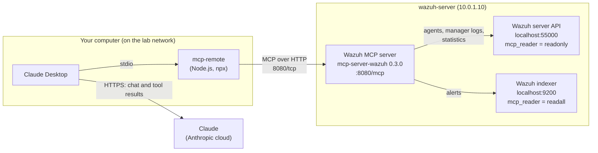

# Claude to Wazuh with MCP

This guide connects the Claude Desktop app to the Wazuh server, so Claude can query live Wazuh data: agent status, alerts, manager logs (for example integration errors) and log collector statistics. A small **MCP server** runs on wazuh-server and talks to the Wazuh API and indexer with **read-only** accounts. On your computer, `mcp-remote` connects Claude Desktop to it over the private network.

- **MCP** (Model Context Protocol) is an open standard that lets an AI app use **tools** offered by another program. Each tool is one action, for example "list Wazuh agents".
- An **MCP server** offers the tools. Here it is `mcp-server-wazuh` (community project). The **MCP client** is Claude Desktop.
- **Streamable HTTP** is the MCP transport over the network: one URL, here `http://10.0.1.10:8080/mcp`.
- **mcp-remote** is a small Node.js program on your computer. Claude Desktop starts it, and it forwards Claude's tool calls to the MCP server on wazuh-server.
- **RBAC** (role-based access control) decides what an account may do. The built-in `readonly` role can read everything and change nothing.

What this lab installs and sets up:

| Part | What | Where |
|---|---|---|
| [A](#part-a-create-read-only-accounts-for-the-mcp-server) | Read-only Wazuh API user and read-only indexer user `mcp_reader` | wazuh-server, Wazuh dashboard |
| [B](#part-b-install-the-wazuh-mcp-server) | Wazuh MCP server 0.3.0 (built with HTTP support) as a service on port 8080 | wazuh-server |
| [C](#part-c-connect-claude-desktop-to-the-mcp-server) | Claude Desktop connects to the MCP server through `mcp-remote` | your computer |

## Table of contents

1. [Architecture](#1-architecture)
2. [What you need](#2-what-you-need)
3. [Installation and integration steps](#3-installation-and-integration-steps)
4. [Test](#4-test)
5. [Common problems](#5-common-problems)
6. [Next steps](#6-next-steps)

Files in this folder:

| File | Copy to | Used in |
|---|---|---|
| [`configs/wazuh-mcp.env.example`](configs/wazuh-mcp.env.example) | wazuh-server: `/etc/mcp-server-wazuh/wazuh-mcp.env` | [Step B3](#part-b-install-the-wazuh-mcp-server) |
| [`configs/mcp-server-wazuh.service`](configs/mcp-server-wazuh.service) | wazuh-server: `/etc/systemd/system/mcp-server-wazuh.service` | [Step B4](#part-b-install-the-wazuh-mcp-server) |
| [`configs/claude_desktop_config.json`](configs/claude_desktop_config.json) | your computer: Claude Desktop's config file | [Step C2](#part-c-connect-claude-desktop-to-the-mcp-server) |

---

## 1. Architecture



- The Wazuh passwords stay on wazuh-server. Claude Desktop only knows the MCP URL.
- Claude Desktop's **custom connectors** connect from Anthropic's cloud and need a public address. A **local** MCP server in `claude_desktop_config.json` uses your own network, so `mcp-remote` can reach the private IP `10.0.1.10`.
- What a tool returns (agent names, IPs, alerts) becomes part of your chat with Claude.

---

## 2. What you need

| Already built | Used for |
|---|---|
| [01-wazuh-soc-lab](../01-wazuh-soc-lab/) | Wazuh server (API and indexer), the dashboard `admin` login, and agents to query |
| [04-wazuh-virustotal-lab](../04-wazuh-virustotal-lab/), [09-wazuh-misp-lab](../09-wazuh-misp-lab/) | Optional: integrations whose logs the test checks |

| Machine | Role | Private IP | CPU / RAM / disk |
|---|---|---|---|
| wazuh-server | Wazuh and the Wazuh MCP server | 10.0.1.10 | As in lab 01, plus about 2 GB free disk for the build (assumption) |
| Your computer | Claude Desktop, Node.js 18 or newer, `mcp-remote` | Any address that reaches 10.0.1.10 | - |

Your computer must reach `10.0.1.10` on the private network, for example as the VirtualBox host in [lab 13](../13-opnsense-lab/) (`10.0.1.254`) or through the VPN from [lab 11](../11-wireguard-portal-lab/) or [lab 12](../12-pritunl-lab/). Claude Desktop is available for Windows and macOS. Your setup used the Linux beta on an Ubuntu VM: the configuration is the same.

| Placeholder | What it is | Example | Where to find it |
|---|---|---|---|
| `<VM_USER>` | The sudo user on wazuh-server | `ubuntu` | Your login user |
| `<WAZUH_SERVER_IP>` | Private IP of wazuh-server | `10.0.1.10` | `hostname -I` on wazuh-server |
| `<WAZUH_API_ADMIN_PASSWORD>` | Password of the Wazuh API user `wazuh` | random | Lab 01, Step A2 (`wazuh-passwords.txt`, entry `api_username: 'wazuh'`) |
| `<ADMIN_PASSWORD>` | Dashboard password of the user `admin` | random | Lab 01, Step A2 |
| `<MCP_API_PASSWORD>` | Password of the new API user `mcp_reader` | you choose | [Step A1](#part-a-create-read-only-accounts-for-the-mcp-server) |
| `<MCP_INDEXER_PASSWORD>` | Password of the new indexer user `mcp_reader` | you choose | [Step A2](#part-a-create-read-only-accounts-for-the-mcp-server) |

Save the two new passwords in a password manager. They live on wazuh-server only, in a file readable by root. Never put them in this repository or in `claude_desktop_config.json`.

---

## 3. Installation and integration steps

### Part A. Create read-only accounts for the MCP server

The MCP server needs two logins: one for the **Wazuh server API** (agents, logs, statistics) and one for the **Wazuh indexer** (alerts). Both get read-only rights, so Claude can look but not change anything.

**A1. Create the read-only API user.** **Run on:** wazuh-server, as `<VM_USER>`

1. Log in to the API as the admin user `wazuh` and keep the token:

```bash
sudo apt-get install -y jq
read -rsp "Password of the Wazuh API user 'wazuh': " ADMIN_PW; echo
TOKEN=$(curl -sk -u "wazuh:${ADMIN_PW}" -X POST "https://localhost:55000/security/user/authenticate?raw=true")
unset ADMIN_PW
echo "${TOKEN:0:10}..."
```

- `read -s` takes the password without showing it. The API answers with a **token** (a temporary login key).

**Check:** the last line starts with `eyJ`.

2. Create the user `mcp_reader`. Choose `<MCP_API_PASSWORD>`: 8 to 64 characters with an upper-case letter, a lower-case letter, a number and a symbol. Do not use `"`, `\`, `#` or spaces (they break the commands and the env file in B3).

```bash
read -rsp "New password for mcp_reader: " MCP_PW; echo
curl -sk -X POST "https://localhost:55000/security/users" \
  -H "Authorization: Bearer $TOKEN" -H "Content-Type: application/json" \
  -d "{\"username\":\"mcp_reader\",\"password\":\"${MCP_PW}\"}" | jq -r '.message'
```

**Check:** `User was successfully created`.

3. Give it the built-in `readonly` role (role ID 2):

```bash
curl -sk -H "Authorization: Bearer $TOKEN" "https://localhost:55000/security/roles?role_ids=2" | jq -r '.data.affected_items[0].name'
USER_ID=$(curl -sk -H "Authorization: Bearer $TOKEN" "https://localhost:55000/security/users" | jq -r '.data.affected_items[] | select(.username=="mcp_reader") | .id')
curl -sk -X POST "https://localhost:55000/security/users/${USER_ID}/roles?role_ids=2" -H "Authorization: Bearer $TOKEN" | jq -r '.message'
```

**Check:** `readonly`, then `All roles were linked to user mcp_reader`.

4. Log in as `mcp_reader` and show its roles:

```bash
T2=$(curl -sk -u "mcp_reader:${MCP_PW}" -X POST "https://localhost:55000/security/user/authenticate?raw=true")
curl -sk -H "Authorization: Bearer $T2" "https://localhost:55000/security/users/me" | jq -c '.data.affected_items[0] | {username, roles}'
unset MCP_PW TOKEN T2 USER_ID
```

**Check:**

```text
{"username":"mcp_reader","roles":[2]}
```

**A2. Create the read-only indexer user.** **Run on:** your browser

1. Open `https://10.0.1.10` and log in as `admin` with `<ADMIN_PASSWORD>`.
2. ☰ → **Indexer management** → **Security** → **Internal users** → **Create internal user**: **Username** `mcp_reader`, **Password** `<MCP_INDEXER_PASSWORD>` (same rules as A1) twice → **Create**.
3. ☰ → **Indexer management** → **Security** → **Roles** → **readall** → **Mapped users** tab → **Manage mapping** → **Users**: `mcp_reader` → **Map**.

- `readall` is a built-in indexer role that can read and search all indexes, including the alerts index `wazuh-alerts-*`.
- The API user (A1) and the indexer user (A2) are two different accounts in two different systems. They only share the name.

**Check** (on wazuh-server):

```bash
read -rsp "Indexer password of mcp_reader: " IDX_PW; echo
curl -sk -u "mcp_reader:${IDX_PW}" "https://localhost:9200/wazuh-alerts-*/_count" | jq -c '{count}'
unset IDX_PW
```

Similar to `{"count":2841}` (any number). `{"count":null}` means the indexer refused the request: the password is wrong or the role mapping in step 3 is missing.

### Part B. Install the Wazuh MCP server

**Run on:** wazuh-server, as `<VM_USER>`

**B1. Install the build tools and Rust** (official `rustup` installer):

```bash
sudo apt-get update
sudo apt-get install -y build-essential pkg-config libssl-dev perl make git curl
curl --proto '=https' --tlsv1.2 -sSf https://sh.rustup.rs | sh -s -- -y
source "$HOME/.cargo/env"
```

- The MCP server is written in **Rust**. `rustup` installs the Rust compiler and `cargo`, its build tool, in your home folder. `-y` accepts the default installation.

**Check:**

```bash
cargo --version
```

Similar to `cargo 1.97.0 (c980f4866 2026-06-30)`.

**B2. Build the server with HTTP support:**

```bash
cd ~
git clone --branch v0.3.0 --depth 1 https://github.com/gbrigandi/mcp-server-wazuh.git
cd mcp-server-wazuh
cargo build --release --features http
sudo install -m 0755 target/release/mcp-server-wazuh /usr/local/bin/mcp-server-wazuh
```

- `--features http` adds the network (Streamable HTTP) transport. The pre-built release files and the Docker image of this project are built **without** it and only work when the app starts them on the same machine (stdio).
- The build takes 5 to 10 minutes. `install` copies the program to `/usr/local/bin`.

**Check:**

```bash
mcp-server-wazuh --help | grep -E "transport|host|port"
```

```text
      --transport <TRANSPORT>  Transport mode: stdio or http [default: stdio]
      --host <HOST>            HTTP server bind address (only for http transport) [default: 127.0.0.1]
      --port <PORT>            HTTP server port (only for http transport) [default: 8080]
```

**B3. Store the Wazuh logins in an env file:**

```bash
sudo mkdir -p /etc/mcp-server-wazuh
sudo nano /etc/mcp-server-wazuh/wazuh-mcp.env
```

Paste this (same as [`configs/wazuh-mcp.env.example`](configs/wazuh-mcp.env.example)) and replace the two passwords:

```bash
# Wazuh server API (runs on the same VM)
WAZUH_API_HOST=localhost
WAZUH_API_PORT=55000
WAZUH_API_USERNAME=mcp_reader
# CHANGE THIS: replace <MCP_API_PASSWORD> (Step A1)
WAZUH_API_PASSWORD=<MCP_API_PASSWORD>

# Wazuh indexer (stores the alerts)
WAZUH_INDEXER_HOST=localhost
WAZUH_INDEXER_PORT=9200
WAZUH_INDEXER_USERNAME=mcp_reader
# CHANGE THIS: replace <MCP_INDEXER_PASSWORD> (Step A2)
WAZUH_INDEXER_PASSWORD=<MCP_INDEXER_PASSWORD>

# The lab uses Wazuh's self-signed certificates
WAZUH_VERIFY_SSL=false
WAZUH_TEST_PROTOCOL=https
RUST_LOG=info
```

Save with **Ctrl+O**, **Enter**, then exit with **Ctrl+X**. Then let only root read it:

```bash
sudo chown root:root /etc/mcp-server-wazuh/wazuh-mcp.env
sudo chmod 600 /etc/mcp-server-wazuh/wazuh-mcp.env
```

- The API and indexer both run on wazuh-server, so the server reaches them on `localhost`.
- Keep comments on their own lines: the service reads everything after `=` as the value.

**Check:**

```bash
sudo ls -l /etc/mcp-server-wazuh/wazuh-mcp.env
```

Similar to `-rw------- 1 root root 512 Oct 10 12:00 /etc/mcp-server-wazuh/wazuh-mcp.env`.

**B4. Run it as a service on the private IP** (assumption: the post does not say how the server was kept running; a systemd service starts it at boot):

```bash
sudo nano /etc/systemd/system/mcp-server-wazuh.service
```

Paste this (same as [`configs/mcp-server-wazuh.service`](configs/mcp-server-wazuh.service)):

```ini
[Unit]
Description=Wazuh MCP server (Streamable HTTP on /mcp)
Wants=network-online.target
After=network-online.target wazuh-manager.service wazuh-indexer.service

[Service]
EnvironmentFile=/etc/mcp-server-wazuh/wazuh-mcp.env
# CHANGE THIS: replace 10.0.1.10 with <WAZUH_SERVER_IP>, the private IP of wazuh-server
ExecStart=/usr/local/bin/mcp-server-wazuh --transport http --host 10.0.1.10 --port 8080
DynamicUser=yes
Restart=on-failure
RestartSec=5

[Install]
WantedBy=multi-user.target
```

```bash
sudo systemctl daemon-reload
sudo systemctl enable --now mcp-server-wazuh
```

- `--host 10.0.1.10` makes the server listen only on the private IP (its default is `127.0.0.1`, which your computer cannot reach). `8080` is its default port.
- `DynamicUser=yes` runs it as a temporary user without rights on the system. It reads the env file before it starts.

**Check:**

```bash
systemctl is-active mcp-server-wazuh
sudo journalctl -u mcp-server-wazuh -n 3 --no-pager
```

`active`, and a line similar to `Listening on http://10.0.1.10:8080/mcp`.

**B5. Send a first MCP request** (`initialize`, the first message every MCP client sends):

```bash
curl -s -X POST http://10.0.1.10:8080/mcp \
  -H 'Content-Type: application/json' \
  -H 'Accept: application/json, text/event-stream' \
  -d '{"jsonrpc":"2.0","id":1,"method":"initialize","params":{"protocolVersion":"2025-06-18","capabilities":{},"clientInfo":{"name":"curl-test","version":"1.0"}}}'
```

**Check:**

```text
data: {"jsonrpc":"2.0","id":1,"result":{"protocolVersion":"2025-06-18","capabilities":{"tools":{}},"serverInfo":{"name":"mcp-server-wazuh","version":"0.3.0"},"instructions":"This server provides tools to interact with a Wazuh SIEM instance for security monitoring and analysis."}}
```

### Part C. Connect Claude Desktop to the MCP server

**Run on:** your computer (Windows PowerShell shown)

**C1. Check the network and Node.js:**

```powershell
Test-NetConnection 10.0.1.10 -Port 8080
node --version
```

- `Test-NetConnection` tries to open port 8080 on wazuh-server. On macOS use `nc -zv 10.0.1.10 8080`.
- `mcp-remote` needs **Node.js 18 or newer**. If `node` is missing, install the LTS version from [nodejs.org](https://nodejs.org/).

**Check:** `TcpTestSucceeded : True`, and a version similar to `v22.22.0`.

**C2. Add the MCP server to Claude Desktop:**

1. Install [Claude Desktop](https://claude.ai/download) and sign in.
2. Open the app's **Settings** from the Claude menu (not the settings inside a chat) → **Developer** → **Edit Config**. This opens `claude_desktop_config.json` (Windows: `%APPDATA%\Claude\claude_desktop_config.json`, macOS: `~/Library/Application Support/Claude/claude_desktop_config.json`).
3. Add the `mcpServers` block (same as [`configs/claude_desktop_config.json`](configs/claude_desktop_config.json)). Replace `10.0.1.10` with `<WAZUH_SERVER_IP>`. If the file already has other settings, keep them and add `"mcpServers"` next to them, separated by a comma.

```json
{
  "mcpServers": {
    "wazuh": {
      "command": "npx",
      "args": [
        "-y",
        "mcp-remote",
        "http://10.0.1.10:8080/mcp",
        "--allow-http"
      ]
    }
  }
}
```

- `npx -y mcp-remote` downloads and runs `mcp-remote`. It turns Claude Desktop's local connection into HTTP requests to the URL.
- `--allow-http` is required for a plain `http://` URL that is not `localhost`. Use it only on a trusted private network.
- No Wazuh password goes in this file: the MCP server on wazuh-server already has them.

**C3. Restart Claude Desktop and look at the tools:**

1. Quit Claude completely (Windows: right-click the Claude icon in the taskbar tray → **Quit**; macOS: **Claude** → **Quit Claude**), then open it again.
2. In a new chat, click **+** (Add files, connectors, and more) at the bottom left of the message box → **Connectors** → **Manage connectors** → **wazuh**.

**Check:** **wazuh** is listed with 14 tools, among them `get_wazuh_agents`, `get_wazuh_alert_summary`, `search_wazuh_manager_logs` and `get_wazuh_log_collector_stats`.

---

## 4. Test

Ask Claude these questions in a new chat. The first time it uses a tool, Claude asks for permission: choose **Allow**. Then compare each answer with Wazuh itself.

| Ask Claude | Tool it uses | Compare with |
|---|---|---|
| "Using the Wazuh tools, which agents are active, and which are disconnected or never connected?" | `get_wazuh_agents` | ☰ → **Agents management** → **Summary** in the dashboard |
| "Search the Wazuh manager logs (level info) for 'Enabling integration'. Which integrations are enabled?" | `search_wazuh_manager_logs` | `sudo grep "Enabling integration" /var/ossec/logs/ossec.log \| tail -n 5` on wazuh-server |
| "Search the Wazuh manager logs for errors that mention misp. Is the MISP integration failing?" | `search_wazuh_manager_logs` | `sudo grep -i misp /var/ossec/logs/ossec.log \| tail -n 5` on wazuh-server |
| "Summarize the latest Wazuh alerts by agent and rule." | `get_wazuh_alert_summary` (latest 300 alerts) | ☰ → **Threat intelligence** → **Threat Hunting** → **Events** |
| "Show the log collector stats for agent 001." | `get_wazuh_log_collector_stats` | The log files `ubuntu-endpoint` reads (journald, `eve.json` from lab 07) |

**Check:** each answer matches what Wazuh shows. On wazuh-server, `sudo journalctl -u mcp-server-wazuh -n 20 --no-pager` shows one log entry per tool call, similar to `Retrieving Wazuh alert summary`.

Limits to keep in mind:

- All tools only read. With `readonly` and `readall`, Claude cannot change Wazuh.
- No tool reads configuration files such as `ossec.conf`. "Is YARA configured?" can only be answered from alerts and logs.
- There is no MISP tool in this server, so Claude cannot query MISP directly.

**The integration works when** Claude answers all five questions with data that matches the dashboard and the logs.

---

## 5. Common problems

| Problem | Fix |
|---|---|
| The service log says `HTTP transport is not enabled. Rebuild with the 'http' feature` | The program was built without HTTP (or a pre-built release file was used). Do B2 again with `--features http`, then `sudo systemctl restart mcp-server-wazuh` |
| Claude shows no **wazuh** connector, or "Server disconnected" | 1) `node --version` is 18 or newer. 2) The JSON is valid (commas, brackets). 3) Claude was fully quit. 4) Read `mcp-server-wazuh.log` in `%APPDATA%\Claude\logs` (Windows) or `~/Library/Logs/Claude` (macOS) |
| The Claude log shows `Non-HTTPS URLs are only allowed for localhost or when --allow-http flag is provided` | Add `"--allow-http"` to `args` (C2) and restart Claude |
| Tools answer with an authentication error | Wrong password in `/etc/mcp-server-wazuh/wazuh-mcp.env`, or it contains `"`, `\` or `#`. Test the login with the commands in A1 step 4, fix the file, then `sudo systemctl restart mcp-server-wazuh` |
| Agents work, but the alert summary fails or is empty | The indexer user is not mapped to `readall`. Run the A2 check |

---

## 6. Next steps

- **Protect the MCP endpoint** (it has no login of its own; put a reverse proxy with a token in front and send the token with `mcp-remote --header`): [mcp-remote](https://www.npmjs.com/package/mcp-remote)
- **A MISP tool for Claude** (by the same author): [MISP MCP Server](https://github.com/gbrigandi/mcp-server-misp)
- **Narrower Wazuh permissions** (for example a role that only reads agents): [RBAC reference](https://documentation.wazuh.com/current/user-manual/api/rbac/reference.html)
- **All tools and options of the MCP server**: [mcp-server-wazuh](https://github.com/gbrigandi/mcp-server-wazuh)
- **How local MCP servers work in Claude Desktop**: [Connect to local MCP servers](https://modelcontextprotocol.io/docs/develop/connect-local-servers)
